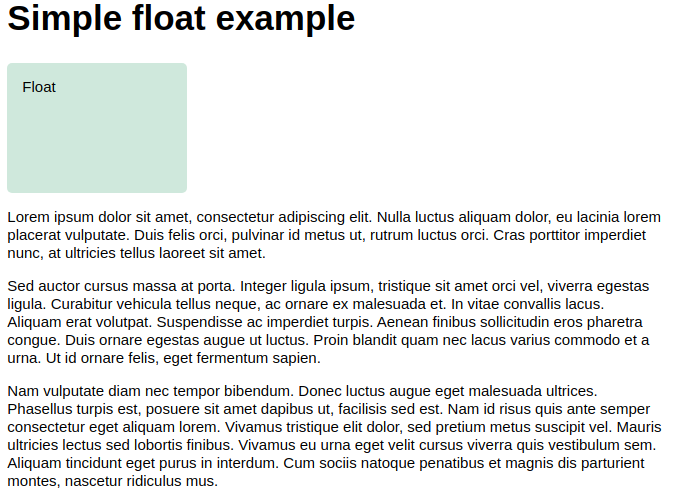
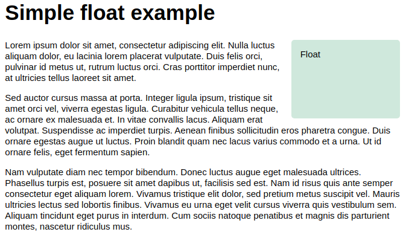

# 55 &mdash; Floats
> a series of exercises that illustrates the modern usage of *floats*.

## A simple example

### Initial state

### Final state

## A simple example in reverse (`float: right`)

## Elements following a float run behind the float

## Using `clear` to prevent element from moving up

### Using `clear: left` on second paragraph

### Using `clear: left` on first paragraph

