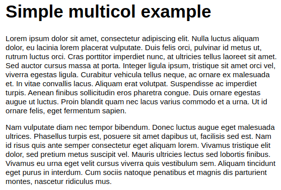
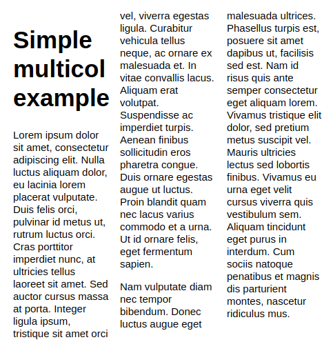
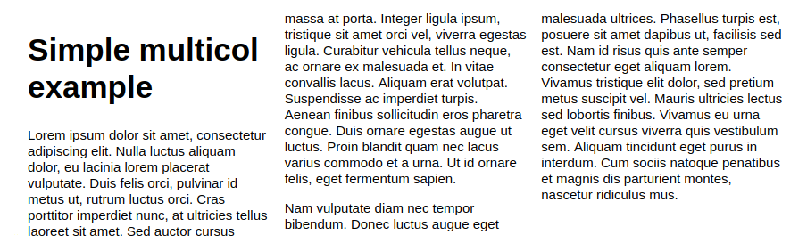
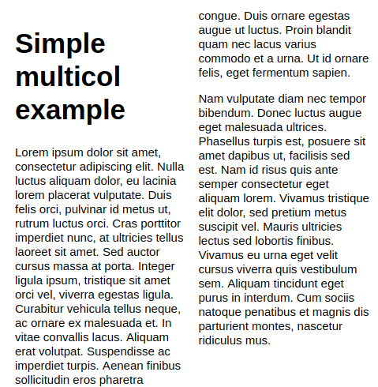
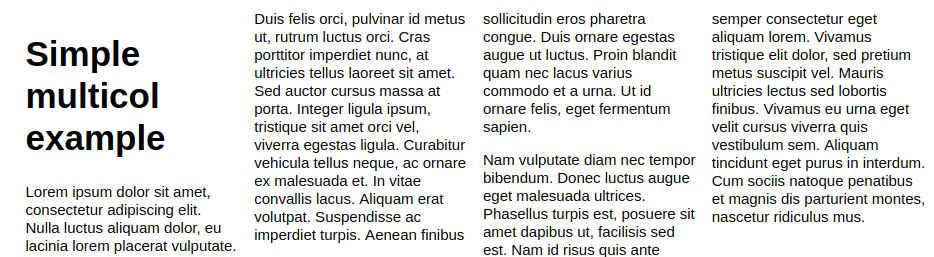
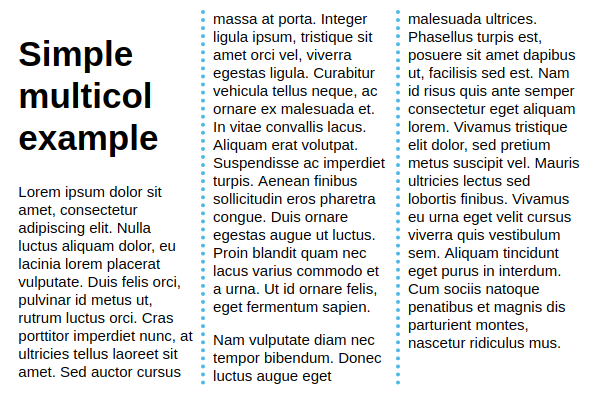
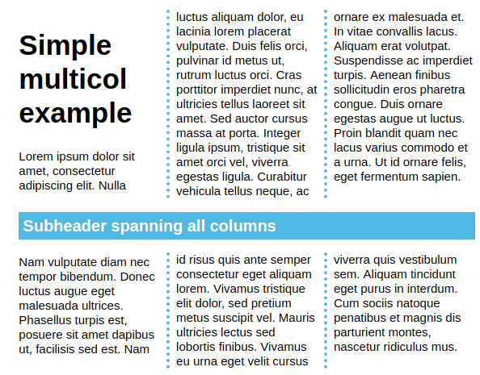
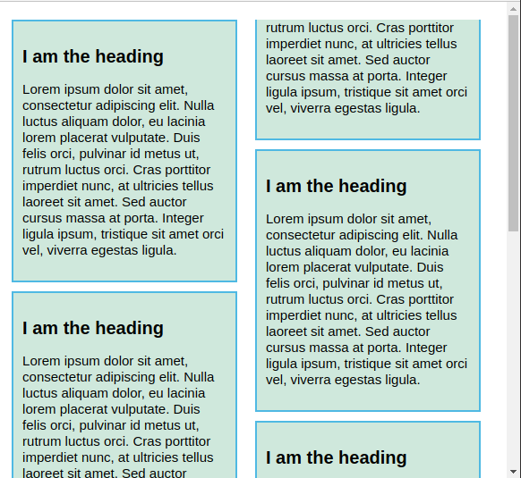
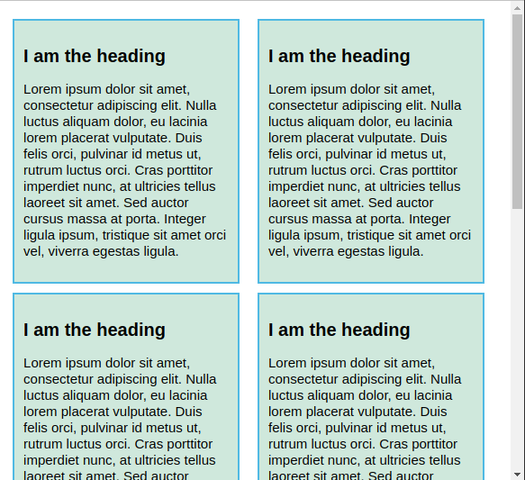

# 55 &mdash; Multiple-column layout
> a series of exercises that illustrates the multiple-column layout specification (often referred to as *multicol*)

## Initial state

## Basic: 3 flexible columns

### Narrow viewport

### Wide viewport

## Basic: flexible columns of given width

### Narrow viewport

### Wide viewport

## Styling columns with `column-gap` and `column-rule`

## Element spanning all columns

## Fragmentation

### Initial

### Fix

