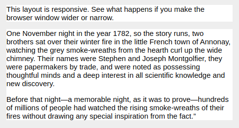
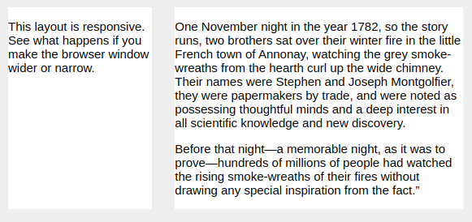
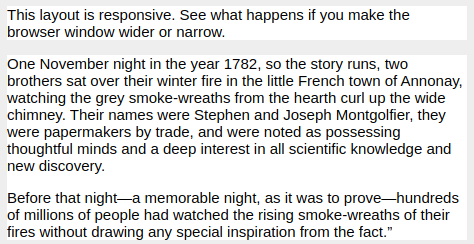
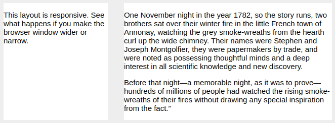
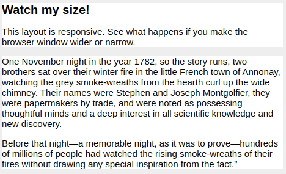
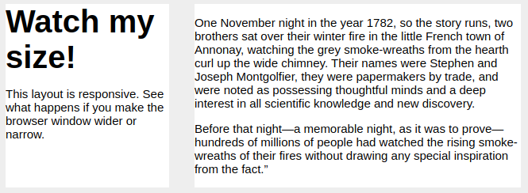
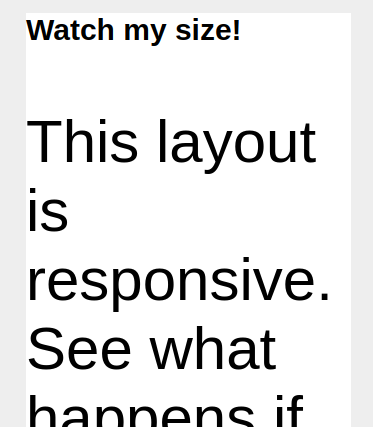
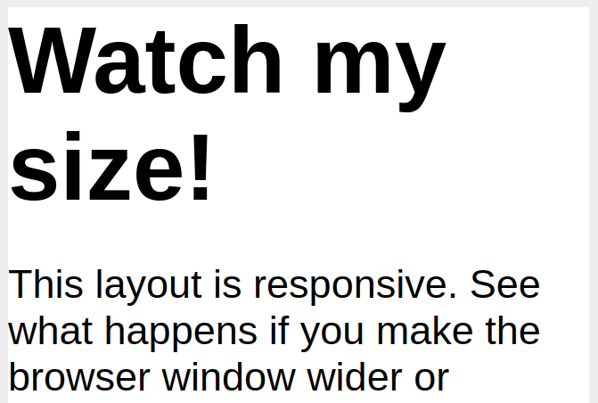

# 58 &mdash; Hello, *Responsive Web Design*
> Illustrates *Responsive Web Design* concepts and techniques.

## Responsive Design with Flexbox

### Mobile layout (below 600 pixels wide layouts)

### Desktop layout (600 pixels and larger layouts)

## Responsive Design with CSS Grid

### Mobile layout (below 600 pixels wide layouts)

### Desktop layout (600 pixels and larger layouts)

## Responsive Typography

### Mobile layout (below 600 pixels wide layouts)

### Desktop layout (600 pixels and larger layouts)

## Responsive Typography: The problem of using `vw` units

### Problem

### Fix
