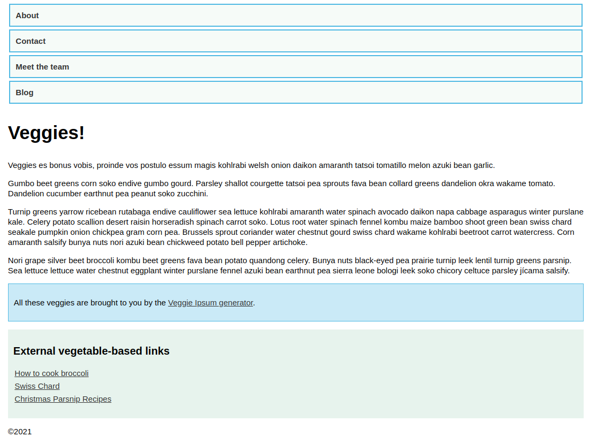
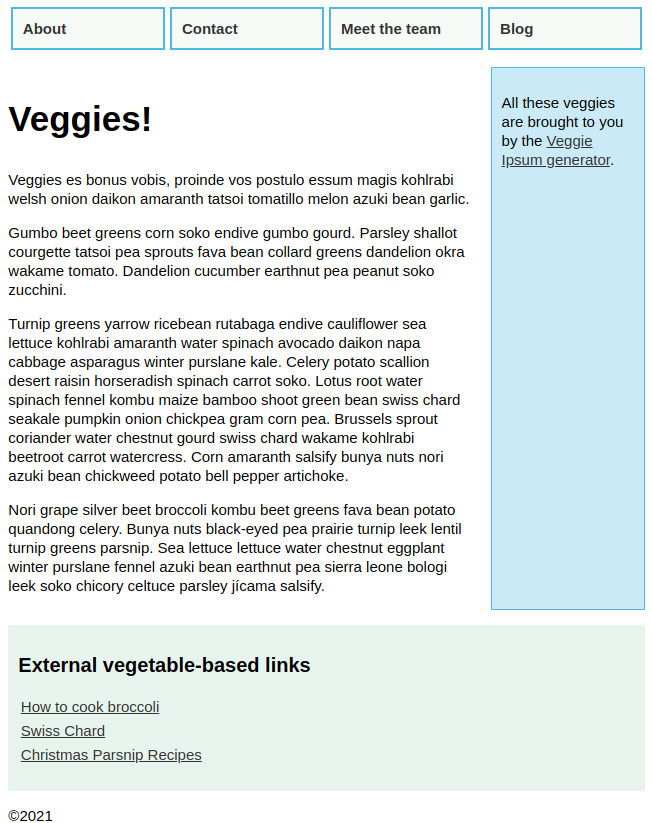
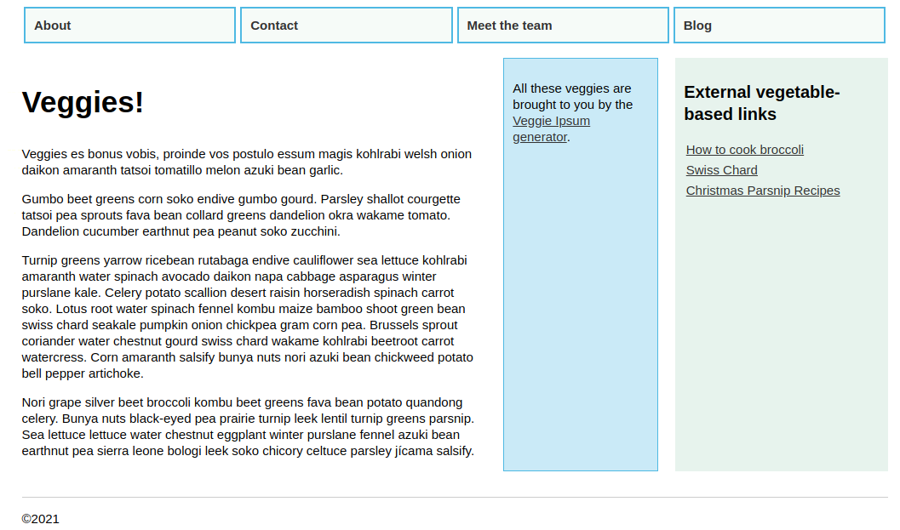

# 59 &mdash; *Mobile-first* responsive design
> An example of *mobile-first* design

## Initial

### Narrow viewport

### Wide viewport

### Step 1: more columns for wider viewports

### Step 2: more columns for even wider viewports

