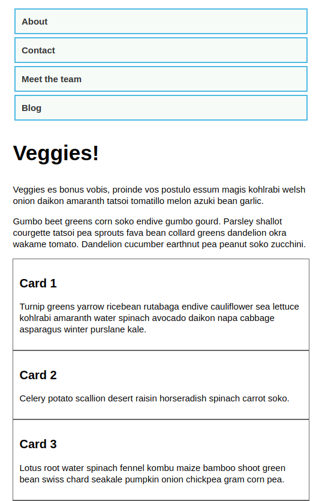

# 60 &mdash; Responsive design without media queries
> Illustrates how to create a responsive site using the new layout specs instead of media queries.

## Initial

## End state

### Narrow viewports

## wide viewports

