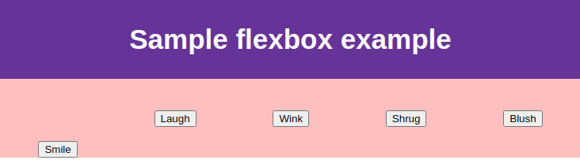

# CSS basics
> practising CSS concepts

## Table of Contents


## Concepts

### CSS first steps

*Cascading Style Sheets (CSS)* is a rule based language that is used for specifying how documents are presented to users &mdash; you define rules specifying groups of styles that should be applied to particular elements or groups of elements on your web page.

For example, you might need to "style the main heading on my page to be shown as large red text":

```css
h1 {
  color: red;
  font-size: 5em;
}
```

The rules opens with a *selector*, which select which element are we going to style (`<h1>` in this case).

We then have a set of curly braces that group one or more declarations in the form: `property: value` pairs.

The *CSS properties* have different allowable values depending on the property being specified. For example, `color` can take various *color values*. `font-size` property can take various *size units* as a value.


A CSS stylesheet can contain many rules, one after the other, all of them following the same general syntax:

```css
h1 {
  color: red;
  font-size: 5em;
}

p {
  color: black;
}
```

There are many things you can do with CSS, so the language is broken down into modules, such as *Background and Borders*. Within each module, you will find the definition of relevant properties such as `background-color` and `border-color`.


In order to see CSS in action, you start with a simple HTML document, and add the following line inside the `<head>` of the HTML document:

```html
<link rel="stylesheet" href="path/to/styles.css">
```

Then you can start adding rules to the `styles.css` file to start styling an HTML document:

```css
/* style all h1 elements with text in red */
h1 {
  color: red;
}

/* style p and li elements with green text */
p, li {
  color: green;
}
```

The actions you can do with CSS are not limited to simply styling. You can also do more *earth shattering things* such as changing the way in which items are being displayed in the browser by default:

```css
li {
  list-style-type: none; /* removes bullet point from list items */
}
```

Also, selectors are not limited to HTML elements. Most of the times, you would like elements of the same type (such as `<h1>` or `<li>`) to be styled differently in the document.

The most common way to select only a subset of elements without changing others is to add a *class* to your HTML element and target that class in your CSS.

For example, consider the following HTML:

```html
<ul>
  <li>Item one</li>
  <li class="special">Item two</li>
  <li>Item <em>three</em></li>
</ul>
```

A `class` attribute has been added to the second item in the list. Now, we can define a rule that target specifically that item:

```css
.special {
  color: orange;
  font-weight: bold;
}
```

Now, we can also apply that class to any element that we want to style in the same way. For example:

```html
<p>
  This is a paragraph of text. In the text is
  a <span class="special">span element</span> and
  also a <a href="https://example.com">link</a>.
</p>
```

You can make the rule more *specific*, and target any `li` element that has a class of `"special"`. That will make the rule not to be applied to the `<span>` element above:

```css
li.special {
  color: orange;
  font-weight: bold;
}
```

You can also target `<li>` and `<p>` elements with the class special using:

```css
li.special,
span.special {
  color: orange;
  font-weight: bold;
}
```

Using CSS it is also possible to target specific elements nested inside others using what is called the *descendant combinator*.

For example, consider the following snippet of HTML that features two `<em>` elements wrapped in different elements (one inside a `<p>`, the other inside a `<li>`):

```html
<p>
  This is the second paragraph. It contains an <em>emphasized</em> element.
</p>

<ul>
  <li>Item <span>one</span></li>
  <li class="special">Item two</li>
  <li>Item <em>three</em></li>
</ul>
```

We can target the `<em>` wrapped inside the `<li>` doing:

```css
li em {
  color: rebeccapurple;
}
```

You can also use the following syntax to style a paragraph that comes directly after a heading at the same hierarchy level in the HTML (this is called the *adjacent sibling combinator*):

```css
h1 + p {
  font-size: 200%
}
```

It is also possible to style things based on their state. The obvious example is to style a link based on their unvisited, visited, hovered over...

```css
/* style unvisited links in pink */
a:link {
  color: pink;
}

/* style visited links in green */
a:visited {
  color: green;
}

/* remove underline when hovering over links */
a:hover {
  text-decoration: none;
}
```

Finally, it is worth mentioning that you can combine selectors and combinators:

```css
/* selects <span> located inside <p>, for <p> in <article> */
article p span { ... }

/* selects the first <p> in the first <ul> after the <h1> */
h1 + ul + p { ... }

/* selects any element inside the first p coming after the h1 in the body with class="special" */
body h1 + p .special { ... }
```

| EXAMPLE: |
| :------- |
| See [01 &mdash; Hello, CSS!](01-hello-css) for an example illustrating these types of rules. |

### Applying CSS to HTML

There are three ways to apply CSS to an HTML document:
+ Using an *external stylesheet* &mdash; a separate file with `.css` extension and the `<link rel="stylesheet" href="/path/to/styles.css">`.
+ Using an *internal stylesheet* &mdash; a `<style>` element contained inside the `<head>` element.<br>In some cases, using *inline styles* might be useful, especially if you don't have access to external CSS files.
+ Using *inline styles* &mdash; including CSS declarations within a `style` attribute, and therefore affecting a single HTML element. This is discouraged.

### Selectors

A *selector* targets HTML to apply styles to content. Each CSS rule starts with a selector (or list of selectors), in order to tell the browser which element of elements the rules should apply to.

You will find scenarios where two selectors select the same HTML element:

```html
<head>
  <style>
    .special {
      color: red;
    }

    p {
      color: blue;
    }
  </style>
</head>
<body>
  <p class="special">What color am I?</p>
</body>
```

In this example, both rules target the `<p class="special">` element. The CSS language has rules to control which selector is stronger in the event of a conflict based on *cascade and specificity*:
+ *Cascade rule* &mdash; styles that appear *later* in the stylesheet will win over the ones defined earlier in the document.
+ *Specificity rule* &mdash; rules that have a higher *specificity* will win over rules that have less specificity. *Specificity* also wins over the *Cascade* rule.

Applying both rules, we can say that the paragraph will be styled in red, even when the `<p>` rule comes later because the `.special` rule is more specific.

### Properties and values

At its most basic level, CSS consists of two components:
+ **properties** &mdash; human-readable identifiers that indicate which stylistic features to modify.
+ **values** &mdash; value assigned to the property that dictates how the style should be applied.

For example:

```css
h1 {
  color: blue;
}
```

> a *CSS declaration* is a property paired with a value

*CSS declarations* might come in blocks as in:

```css
h1 {
  color: blue;
  background-color: yellow;
}
```

> a *CSS rule* is a CSS declaration block paired with a selector.

| NOTE: |
| :---- |
| CSS properties and values are case-sensitive. |

### Functions

While most values are relatively simple keywords or numeric values, there are some values that take the form of a function like `calc()` in the example below:

```html
<div class="outer">
  <div class="box">
    The inner box is 90% - 30px
  </div>
</div>
```

```css
.outer {
  border: 5px solid black;              /* element's border           */
}

.box {
  padding: 10px;                        /* element's padding          */
  width: calc(90% - 30px);              /* element's width            */
  background-color: rebeccapurple;      /* element's background color */
  color: white;                         /* element's text             */
}
```

Another example would be values for the `transform` property, such as `rotate()`:

```css
.box {
  ...
  transform: rotate(0.8turn);
}
```

### @rules

CSS *@rules* (pronounced *at-rules*) provide instructions about how CSS should perform or how it should behave.

For example, `@import` imports a stylesheet into another *CSS stylesheet*:

```css
@import 'styles2.css';
```

The `@media` rule is used to create media queries so that conditional logic for CSS styling can be applied:

```css
body {
  background-color: pink;
}

@media (min-width: 30em) {
  body {
    background-color: blue;
  }
}
```

In the example above, the stylesheet defines a default pink background for the `<body>` element, but if the viewport is wider than 30em, the background will be set to *blue*.

### Shorthands

Some properties like `font`, `background`, `padding`, `border` and `margin` are called *shorthand properties* because set several values in a single line.

For example:

```css
padding: 10px 15px 15px 5px;
```

is equivalent to:

```css
padding-top: 10px;
padding-right: 15px;
padding-bottom: 15px;
padding-left: 5px;
```

### Comments

CSS comments begin with `/*` and end with `/*`.

### CSS style guide

Browsers ignore white space inside CSS, but it should be used to improve readability.

It is a good practice to specify each declaration on its own line.

```css
/* this targets all <h1> elements */
h1 {
  color: red;
}

/* this targets <p> and <li> elements */
p, li {
  color: green;
}

li {
  list-style-type: none;  /* this removes the bullet point */
}

/* this targets li or p elements with class="special" */
li.special,
span.special {
  color: orange;
  font-weight: bold;
}

/* this targets em elements inside li element */
li em {
  color: rebeccapurple;
}

/* this targets a p element coming directly after an h1, and not other <p> */
h1 + p {
  font-size: 200%;
}

/* style unvisited links in pink */
a:link {
  color: pink;
}

/* style visited links in green */
a:visited {
  color: green;
}

/* remove underline when hovering over links */
a:hover {
  text-decoration: none;
}

body h1 + p .special {
  color: yellow;
  background-color: black;
  padding: 5px;
}
```

### What happens when a browser displays a document?

When a browser displays a document, it must combine the document's content with its style information prior to show it to the user.

This is roughly what happens:

1. The browser fetches the HTML from the network.
2. It parses the HTML into a DOM that represents the document.
3. The browsers fetches most of the resources linked to by the HTML document (images, videos, and linked CSS). JavaScript will be handled a bit later.
4. The browser parses the fetched CSS, and sorts them according to the cascade and specificity rules in *buckets*. Based on this, it works out which rules should be applied to which nodes in the DOM, attaches style to them as required.
5. The result of the previous step (known as the *render tree*), is laid out in the structure it should appear in after the rules have been applied to it.
6. The visual display of the page is shown on the screen (on a stage called *painting*).


| NOTE: |
| :---- |
| A DOM is a *tree-like* structure, in which each element, attribute, and piece of text in the markup language becomes a *DOM node* in the tree. The nodes are defined by their relationship to other DOM nodes. Some elements are parents of child nodes, and child nodes have siblings. |

Conside the following piece of HTML markup:

```html
<p>
  Let's use:
  <span>Cascading</span>
  <span>Style</span>
  <span>Sheets</span>
</p>
```

The browser will be the following DOM tree to represent that piece:

```
P
├─ Let's use:
├─ SPAN
|  └─ Cascading
├─ SPAN
|  └─ Style
└─ SPAN
   └─ Sheets
```

If the HTML document links to a CSS with the following rule:

```css
span {
  border: 1px solid black;
  background-color: lime;
}
```

The brower will create the render tree by *merging* the DOM tree with the information collected from parsing the CSS:

```
P
├─ Let's use:       style: (default)
├─ SPAN             style: `border: 1px solid block; background-color: lime`
|  └─ Cascading
├─ SPAN             style: `border: 1px solid block; background-color: lime`
|  └─ Style
└─ SPAN             style: `border: 1px solid block; background-color: lime`
   └─ Sheets
```

| NOTE: |
| :---- |
| If a browser enounters a property or value it doesn't understand, it ignores it and moves on to the next declaration. The same happens if it finds a selector it doesn't understand &mdash; it will move to the next rule. |

The fact that the browser does not crash when it finds an error can be utilized for our benefit. For example, for old browsers that do not support *functions* such as `calc()` we can do:

```css
.box {
  width: 500px;
  width: calc(100% - 50px);
}
```

Because of the cascade rule, for browsers that support `calc()` will use the 2nd option, while the older browsers will just ignore the 2nd without crashing.

| EXAMPLE: |
| :------- |
| See [e01 &mdash; Styling a document with basic CSS](e01-styling-a-document-with-basic-css) for an exercise on the basics of CSS so far. |

### More on conflicting rules

At some point, you will find that the CSS you thought should be applied to an element is not working. Usually, the problem is that you have created two rules which could potentially applied to the same element, and therefore the *cascade* and *specificity* rules will be applied.

Additionally, you should be aware of the concept of *inheritance*, which means that some *CSS* properties by default inherit values set on the current element's parent elements, and some don't.

> **Cascade** &mdash; with two rules that have the same specificity are applied to an element, the one that comes last in the CSS is the one that will be used.

For example:

```css
h1 {
  color: red;
}

h1 {
  color: blue;
}
```

The `<h1>` elements will be styled in blue.

> **Specificity** &mdash; specificity is a measure of how the browser decide which rule applies if multiple rules have different selectors, but could still apply to the same element. For example, an element selector is less specific than a class selector, as it will only apply to the elements with that class.

For example:

```css
.main-heading {
  color: red;
}

h1 {
  color: blue;
}
```

The HTML markup `<h1 class="main-heading">What color am I?</h1>` will be styled in red, even when it appears before the `<h1>` rule because it is more specific.

#### More on inheritance

> **Inheritance** &mdash; some CSS property values set on parent elements are inherited by their child elements, and some aren't. For example, if you set a `color` and `font-family` on an element, every element inside it will also be styled with that color and font, unless you apply different color and font values directly to them. Properties such as `width` are not inherited.

For example:

```css
body {
  color: blue;
}

span {
  color: black;
}
```

```html
<p>
  As the body has been set to have a color of blue, this will be blue, except for
  this <span>black span</span> which has been specifically set to be black.
<p>
```

| NOTE: |
| :---- |
| The information about whether a property is inherited or not can be found in each reference page for a property in [MDN](https://developer.mozilla.org/en-US/docs/Web/CSS/color#formal_definition). |

CSS provides four special universal property values for controlling inheritance. Every CSS property accepts these values:
+ `inherit` &mdash; sets the property value applied to a selected element to be the same as that of its parent element.
+ `initial` &mdash; sets the property value applied to a selected element to the initial value of that property.
+ `unset` &mdash; resets the property to its natural value, which means that if the property is naturally inherited, it acts like `inherit`, otherwise, it acts like `initial`.

The CSS shorthand property `all` can be used to apply one of these inheritance values to almost all properties at once. Its value can be any of `inherit`, `initial`, `unset` or `revert` (this one with limited browser support).

For example you can do:

```css
blockquote {
  background-color: red;
  border: 2px solid green;
}

.fix-this {
  all: unset;
}
```

on a piece of HTML like:

```html
<blockquote>
  <p>This block is styled<p>
</blockquote>

<blockquote class="fix-this">
  <p>This block uses the natural style values<p>
</blockquote>
```
| EXAMPLE: |
| :------- |
| See [02 &mdash; Playing with inheritance](02-playing-with-inheritance) for a runnable example on which you can test inheritance rules and values. |

#### More on cascade and specificity

The *cascade rules* dictate which CSS rules apply when more than one thing could style an element.

In increasing order of importance (so that later rules overrule earlier ones) we have:
1. Source order
2. Specificity
3. Importance

##### Source order

If you have more than one rule, with exactly the same weight, the one comes last in the CSS will win.

##### Specificity

Rules with higher specificity will overrules more generic rules. It must be notes that although specificity is defined at the *selector level*, it won't be the whole rule that gets overwritten, but rather, only the properties that are the same.

> It is common practice to define generic styles for the basic elements, and then create classes for those that we want to style differently. The characteristics defined in the generic styles that are not overwritten by the more specific rules won't be overwritten.

For example:

```css
/* generic styles */
h2 {
  font-size: 2em;
  color: #000;
  font-family: Georgia, 'Times New Roman', Times, serif;
}

/* specific styles that override generic ones */
.small {
  font-size: 1em;
}

.bright {
  color: rebeccapurple;
}
```

```html
<h2>Heading with no class</h2>
<h2 class="small">Heading with class of small</h2>
<h2 class="bright">Heading with class of bright</h2>
```

The 2nd and 3rd line will still *inherit* some of the properties of the generic style:
+ line 2 will have the same `color` and `font-family` from the generic style, only font-size will be different.
+ line 3 will have the same `font-size` and `font-family` from the generic style, only `color` will be different.

The browsers calculate specificity by awarding a value in points for the different types of selectors. This can be thought of as thousands, hundreds, tens, and ones, that are computed as four single digits in four columns:

| Selector | Thousands | Hundreds | Tens | Ones | Total specificity |
| :------- | :-------- | :------- | :--- | :--- | :---------------- |
| <selector> | points_1 | points_2 | points_3 | points_4 | (points_1 * 1000) + (points_2 * 100) + (points_3 * 10) + points_4 |

+ Thousands &mdash; score one in this column for declarations inside a `style` attribute.
+ Hundreds &mdash; score one in this column for each ID selector contained inside the overall selector.
+ Tens &mdash; score one in this column for each class selector, attribute selector, or pseudo-class contained inside the overall selector.
+ Ones &mdash; score one in this column for each element selector, or pseudo-element contained inside the overall selector.

| NOTE: |
| :---- |
| The universal selector (`*`), combinators (`+`, `>`, `~`, `''` ) and negation pseudo-class (`:not`) have no effect on specificity.

For example:

| Selector | Thousands | Hundreds | Tens | Ones | Total specificity |
| :------- | :-------- | :------- | :--- | :--- | :---------------- |
| h1 | 0 | 0 | 0 | 1 | 1 |
| h1 + p::first-letter | 0 | 0 | 0 | 3 | 3 |
| li > a[href*="en-US"] > .inline-warning | 0 | 0 | 2 | 2 | 22 |
| #identifier | 0 | 1 | 0 | 0 | 100 |
| rule inside an element's style attribute | 1 | 0 | 0 | 0 | 1000 |

| EXAMPLE: |
| :------- |
| See [03 &mdash; Playing with specificity](03-playing-with-specificity) for a runnable example on which you can play with the cascade and specificity rules. |


| NOTE: |
| :---- |
| It is important to understand that the specificity value given in this section is just an illustration. In reality, any id selector will win over a selector that includes any number of classes. |

##### Importance

You can use `!important` declaration to override the normal rules of the cascade for a particular property and value.

For example:

```css
#winning {
  background-color: red;
  border: 1px solid black;
}

.better {
  background-color: gray;
  border: none !important;
}

p {
  background-color: blue;
  color: white;
  padding: 5px;
}
```

```hmtl
<p class="better">This is a paragraph</p>
<p class="better" id="winning">One selector to rule them all</p>
```

This will render the following image:


The generic styling used in the `p {...}` ruleset for color and padding is applied to both paragraphs.

Then, for the `background-color` and `border` we have to compute the specificity. For the first `<p class="better">` the declarations of the `.better { ... }` rule will win, and therefore will display the text with gray background and non border.

However, for the second `<p class="better" id="winning">, the `#winning { ... }` rule will win as it is more specific. Therefore, it should show the background in red with 1px solid border in black.


As `!important` is used in the `.better { ... }` rule definition, the border will not be displayed for the second `<p>`, as `!important` overrules any other cascade rule.

| EXAMPLE: |
| :------- |
| See [04 &mdash; Playing with !important](04-playing-with-important) for a runnable example on which you can practise the effect of `!important`. |

| NOTE: |
| :---- |
| Using `!important` is discouraged as it makes debugging CSS problems really difficult. It should be used only in situations in which you can't override a particular style declaration (e.g. you don't have access to the core CSS modules). |

### CSS selectors in depth

CSS selectors are used to target the HTML elements on a web page that we want to style.

The element or elements which are selected by the selector are referred to as the *subject* of the selector.

If you have more than one thing that uses the same CSS, then the individual selectors you can combine them into a *selector list*.

For example, the following rules:

```css
h1 {
  color: blue;
}

.special {
  color: blue;
}
```
can be combined into a selector list:

```css
/* set text color to blue for <h1> or elements with class="special" */
h1,
.special {
  color: blue;
}
```

There are different groupings of selectors:

+ [Type, class, and ID selectors](#type-class-and-id-selectors)
+ [Attribute selectors](#attribute-selectors)
+ [Pseudo-classes and pseudo-elements](#pseudo-classes-and-pseudo-elements)
+ [Combinators](#combinators)

Additionally, there is a special selector called *universal selector* (denoted by a `*`). It selects everything in the document (or inside the parent element if it is being chained together with another element and a descendant combinator).

For example, we can remove the margins in all elements defining the following CSS rule:

```css
* {
  margin: 0;
}
```

It is also use to make selectors easier to read and more obvious in terms of what they are doing.

For example, to select any descendant elements of `<article>` that are the first child of their parent, including direct children, we could use the `:first-child` pseudo class.

```css
article :first-child {
  font-weight: bold;
}
```

However, it is less prone to confusion with `article:first-child` if we do:

```css
article *:first-child {
  font-weight: bold;
}
```


#### Type, class, and ID selectors

This grouping includes the following types of selectors:

```css
/* element type selector */
h1 { ... }

/* class selector */
.box { ... }

/* class selector on specific element type */
span.highlight { ... }

/* class selector for elements with more than one class */
.notebox.danger { ... }

/* ID selector */
#unique { ... }

/* ID selector if element type match */
h1#unique { ... }
```

| NOTE: |
| :---- |
| As a good practice, it is preferable to add a class to an element to style it, rather than style it via an ID. |

| EXAMPLE: |
| :------- |
| See [06 &mdash; Playing with type, class, and ID selectors](06-playing-with-element-type-class-id-selectors) for a runnable example on which you can practice type, class and id selectors. |

#### Attribute selectors

Lets you target elements based on the presence of a certain attribute on an element:

```css
a[title] { ... }
```

Or even based on the presence of an attribute with a particular value:

```css
a[href="https://www.example.com"] { ... }
```

Let's see all the possibilities with examples:

```css
/* match <a> elements with title attributte */
a[title] { ... }

/* match <a> elements with href attribute set to https://example.com */
a[href="https://example.com"] { ... }

/*
  match <p> elements with class attribute equal to,
  or containing "special" delimited by spaces
*/
p[class~="special"] { ... }

/*
  match <div> elements with a lang attribute that is exactly "zh"
  or begins with "zh" followed by a hyphen
*/
div[lang|="zh"] { ... }

/*
  match <li> elements with a class attribute
  whose value begins with "box-"
*/
li[class^="box-"]

/*
  match <li> elements with a class attribute
  whose value ends with "-box"
*/
li[class$="-box"]

/*
  match <li> elements with a class attribute
  whose value contains with "box" anywhere within the string
*/
li[class*="box"]
```

Matches are always case-sensitive. If you would like to make the searches insensitive, you can use the `i` modifier before the closing bracket as in:

```css
/* will match <li> elements with either class="a*" or class="A*" */
li[class^="a" i]
```

#### Pseudo-classes and pseudo-elements

This group of selectors include pseudo-classes that style an element when it is on a certain state (e.g. a link in the state when you're hovering over it, or an element that happens to be the first element of their type).

##### Pseudo-classes

Pseudo-classes are keywords that start with a colon as in `:hover` or `:first-child`.


For example, the following rule will style the first `<p>` element found within an article.

```css
article p:first-child {
  font-size: 120%;
  font-weight: bold;
}
```

| NOTE: |
| :---- |
| Other similar pseudo-classes are `:last-child`, `:only-child` and `:invalid` (input that failed to validte). |


Other type of pseudo-classes are the *user-action pseudo classes*, that apply when the user interacts with an element in some particular way like:
+ `:hover` &mdash; applies when the user moves the mouse over an element.
+ `:focus` &mdash; applies when the user focuses on an element using keyboard controls.


```css
a:hover { ... }
```

##### pseudo-elements

Pseudo-elements, which select a certain part of an element, rather than the whole element itself. That is, they act as if you would add a new HTML element into the markup.
For example `::first-line` selects the first line of text inside an element, that would be the same as wrapping the first line of text in a `<span>`.

```css
p::first-line { ... }
```

It is possible to combine pseudo-classes and pseudo-elements:

```css
article p:first-child::first-line {
  font-size: 120%;
  font-weight: bold;
}
```

There are a couple of special pseudo-elements that let you add content before and after a given element using CSS and the `content` property:

```css
.box::before {
  content: "This should show before the box content"
}

.box::after {
  content: "This should show after the box content"
}
```

| NOTE: |
| :---- |
| Adding text content using `::before` and `::after` is discouraged for accesibility reasons. However, a valid usage is to insert an icon before or after an element as in `content: " ➥". |

Those pseudo-elements can also be used to insert an empty string that can then be styles just like any element on the page.

In the following example, we create a 100x100 pixels purple square right before a `<p>` element.

```css
.box::before {
  content: "";
  display: block;
  width: 100px;
  height: 100px;
  background-color: rebeccapurple;
  border: 1px solid black;
}
```

```html
<p class="box">Contents in the box.</p>
```

> [MDN: pseudo-classes reference](https://developer.mozilla.org/en-US/docs/Learn/CSS/Building_blocks/Selectors/Pseudo-classes_and_pseudo-elements#pseudo-classes)

> [MDN: pseudo-elements reference](https://developer.mozilla.org/en-US/docs/Learn/CSS/Building_blocks/Selectors/Pseudo-classes_and_pseudo-elements#pseudo-elements)

| EXAMPLE: |
| :------- |
| See [08 &mdash; Playing with pseudo-classes and pseudo-elements](08-playing-with-pseudo-classes-and-pseudo-elements) for a runnable example on which you can practise with pseudo-classes and pseudo-elements. |

#### Combinators

Combine other selectors in order to target elements within our documents based on their relationship.

For example, `article > p` uses the *child combinator* `>`, that targets paragraphs that are direct children of a `<p>`:

```css
article > p { ... }
```

There are found combinators:

```css
/*
  descendant combinator
    (targets <p> within <article>)
*/
article p { ... }

/*
  descendant combinator
    (targets <p> within elements with class="box")
*/
.box p { ... }


/*
  child combinator
    (targets <p> that are direct children of <article>)
*/
article > p { ... }

/*
  child combinator
    (targets <li> that are direct children of <ul>)
*/
ul > li { ... }

/*
  adjacent sibling combinator
    (targets <p> that come immediately after <article> at
     the same hierarchy level)
*/
article + p { ... }

/*
  adjacent sibling combinator
    (targets  that come immediately after <p> at
     the same hierarchy level)
*/
p + img { ... }

/*
  general sibling combinator
    (targets any <p> that come after <article>, not
     necessarily immediate)
*/
article ~ p { ... }

/*
  general sibling combinator
    (targets any <image> that come after <p>, not
     necessarily immediate)
*/
p ~ image { ... }
```

You can combine any of the selectors with combinators to target specific parts of your document. For example:

```css
/*
  target <li> elements with a class attribute with value "a"
  that are direct children of an <ul>
*/
ul > li[class="a"] { .. }
```

| EXAMPLE: |
| :------- |
| See [e02 &mdash; Practising selectors](e02-practising-selectors) for a runnable example on which you can practice the different ways to target elements on a page. |

### The box model

Everything in CSS has a box around it. Understanding how this works and the terminology around it is key to be able to create complex layouts with CSS.

#### Block and inline boxes

In CSS there are broadly two types of boxes that dictate how the box behaves in terms of page flow, and in relation with other boxes on the page:
+ **block boxes**
  + the box will break onto a new line.
  + the box will extend in the inline direction to fill the space available in its container.<br>In most cases this means that the box will become as wide as its container, filling up 100% of the space available.
  + the `width` and `height` properties will be respected.
  + padding, margin, and border will cause other elements to be pushed away from the box (more on this later).
  + unless explicitly changing the display type to inline, *HTML block-level elements* such as `<h1>` and `<p>` will use `block` as their outer display type by default.

+ **inline boxes**
  + the box will not break onto a new line.
  + the `width` and `height` properties will not apply.
  + vertical padding, margins, and borders will apply but will not cause other inline boxes to move away from the box.
  + horizontal padding, margins, and borders will apply and will cause other inline boxes to move away from the box.
  + *HTML inline elements* such as `<span>`, `<em>`, and `<strong>` will display inline by default.

Remember that:
+ **HTML Block-level elements** form a visible block on a page. A *block-level element* appears on a new line following the content that precedes it. Any content that follows a *block-level element* also appears on a new line.<br>*Block-level elements* are usually structural elements on the page, such as headings, paragraphs, lists, navigation menus, or footers.<br>*A block-level* element wouldn't be nested inside an inline element, but it might be nested inside another *block-level* element.

+ **Inline elements** are contained within *block-level elements*, and surround only small parts of the document's content. An *inline element* will not cause a new line to appear in the document. It is typically used with text, for example `<a>` element to create a hyperlink in some existing text, or `<em>` or `<strong>` to create emphasis on some parts of a paragraph text.

#### Aside: Inner and outer display types

CSS boxes have an **inner** and **outer** display types.

+ the **outer display type** details whether the box is block or inline.

+ the **inner display type** dictates how elements inside that box are laid out. By default, the elements inside a box are laid out in *normal flow*, which means that they behave just line any other block and inline elements.<br>The inner display type can be changed using values like `display: flex`.<br>If the outer display of an element is `block` but the inner display is set to `flex`, the direct children of the box will become `flex` items and will be laid out according to the rules set out in the *Flexbox spec*.

| NOTE: |
| :---- |
| Block and inline layout is the default way that things on the web behave, that is why this style is known as the *normal flow*. Other layouts like `flex` and `grid` will be learned later. |

#### Examples of different display types

The best way to familiarize yourself with the different display types is through examples.

Let's start with a simple `<p>`, a *block-level element* which will have by default an *outer display* type of `block`. The browser will render it as a block box, occupying the whole width of the container and laid out on a new line as we'd expect:


Let's now see a simple `<ul>` with three items. These are also *block-level* elements, which a default *outer display* of `block`. Therefore, they will be rendered also as block boxes:


Now, if we set the display of the `<ul>` element as `flex` will make the children elements of `<ul>` (that is the `<li>`) to behave different than in the normal flow. However, the `<ul>` itself will behave as a block (that is, will still have an outer display of `block`).


As another example, let's see a normal `<p>` that has some `<span>` elements within it. In the normal flow, the `<p>` will be rendered as a block, and the `<span>` elements as inline elements.


If we style one of the `<span>`s with `display: block`, the outer display for that `<span>` will change and will behave like a block box.


See how a new line is inserted before and after the element, and how the space takes the whole width of the parent container (in this case the `<p>` element).


As another example of the normal flow, we see a paragraph with `<span>`s wrapped within it whose display have not been modified. The `<p>` is displayed as a block, and the `<span>`s as inline boxes as expected:


Let's see now a list whose display type is set to `inline-flex`. This will create an inline box for the list, and will apply the inner flex display so that the `<li>` items won't follow the normal flow.


See the difference with the example in which we set the `<ul>` display to `flex`. In that case, the list itself was rendered as a block and took the whole space, while in this space it just occupies the space that it needs.

Something similar will happen to paragraphs on which we change their display type to `inline`. As a matter of fact, if we place them contiguous to the list we see that there is no line break:


| EXAMPLE: |
| :------- |
| See [10 &mdash; CSS box model: Examples of different display types](10-box-model-display-types) for a runnable example that illustrates the different types of displays. |

#### What is the CSS Box model?

The full CSS box model applies to *block boxes*; *inline boxes* only use some of the behavior defined in the model.

The model defines how the different parts of a box (margin, border, padding, and content) work together to create a box that you can see on the page.

To add some additional complexity 😉, there is a standard and alternate box model.

##### Parts of a box

The following diagram illustated the different parts that make up a block box in CSS:


+ **Content box**: the area where your content is displayed, which can be sized using properties like `width` and `height`.

+ **Padding box**: the area that sits around the content as white space, whose size can be controlled using `padding`.

+ **Border box**: the area that wraps the padding, and whose size and style can be controlled using `border`.

+ **Margin box**: the outermost layer that wraps the border, as whitespace between this box and other elements, and whose size can be controlled using `margin`.

##### The standard CSS box model

In the standard box model, if you give a box a `width` and a `height` attribute, this defines the width and height of the content box.

Any padding and border is then added to the width and height to get the total size taken up by the box.

As a result, if we have the following rule:

```css
.box {
  width: 350px;
  height: 150px;
  margin: 10px;
  padding: 25px;
  border: 5px solid black;
}
```

The space taken up by our box is illustrated in the following diagram:


```
total_width = 5 + 25 + 350 + 25 + 5 = 410px
total_height = 5 + 25 +150 + 25 + 5 = 210px
```

Note that the margin is not counted towards the area of the box &mdash; it affects the total space that the box will take up on the page, but it is considered outside the box.


##### The alternative CSS box model

In the alternative CSS box model, the width and the height are the width and height of the visible box on the page. That is, you don't have to add up the border and padding to get the actual size.


By default, browsers use the standard box model. To enable the alternative model for an element you have to use the setting `box-sizing: border-box` as seen below:

```css
.box {
  box-sizing: border-box;
}
```

If you want to activate the alternative box model in the whole document, you can do:

```css
html {
  box-sizing: border-box;
}

*,
*::before,
*::after {
  box-sizing: inherit;
}
```

#### Playing with box models

It is easy to transform from one model to the other just by taking into account the [box model parts](#parts-of-a-box).

For example, for a box specified using the standard model as:

```css
.box {
  border: 5px solid rebeccapurple;
  background-color: lightgray;
  padding: 40px;
  margin: 40px;
  width: 300px;
  height: 150px;
}
```

We can get the exact same box using the alternative model using:

```css
.alternative {
  box-sizing: border-box;
  border: 5px solid rebeccapurple;
  background-color: lightgray;
  padding: 40px;
  margin: 40px;
  width: 390px;
  height: 240px;
}
```

Your browser's DevTools can help you understand the box model and the different sizes of your elements in the page.

For example, for the element associated with the standard box model above it will show:


And for the alternative one it will show:


Note how for the alternative box model it also shows `box-sizing: border-box`.

#### Margins, padding, and borders

The properties `margin`, `padding` and `border` are shorthands that allow us to set all the characteristics of the box at once.

The following sections introduce the *longhand* properties when we want to control the different characteristics individually, and define these properties in detail.

##### Margin

> Margin is an invisible space around your box. It pushes other elements away from the box. It can have positive (push away) or negative (make it closer). The margin is added after the size of the visible box has been calculated (both for the standard and alternative box model).

All the margins of an element can be controlled with the `margin` element, or individually using `margin-top`, `margin-right`, `margin-bottom`, `margin-left`.

###### Margin collapsing

The *margin collapsing* is the situation where you have two elements whose margin touch, with both margins being positive, and the margin is combined to become one margin which is the size of the largest individual margin.

You should be aware of this situation when you are creating space with margins and don't get the space that you expect.

In the image below you can see that happening:


We have two paragraphs with the following margins specified:

```css
.one {
  margin-bottom: 50px;
}

.two {
  margin-top: 30px;
}
```

The margin that exists between the two paragraphs is not 50px + 30px because it has collapsed to 50px. As a result, if I make:

```css
.two {
  margin-top: 0px;
}
```
the layout won't change, because it is `margin-bottom` the one that is dictating the margin between the two elements.

| EXAMPLE: |
| :------- |
| See [12 &mdash; Margin collapsing](margin-collapsing) for a runnable example on which you can play with margins to see the margin collapsing in action. |

| NOTE: |
| :---- |
| The rules that dictate when margins do and do not collapse and how are somewhat complicated. You can find all the detailed information on [MDN: Mastering margin collapsing](https://developer.mozilla.org/en-US/docs/Web/CSS/CSS_Box_Model/Mastering_margin_collapsing).<br>For example, when setting a width and height for a container that wraps two elements whose margin should be collapsing, it won't happen. |

##### Borders

> The border is drawn between the margin and the padding of a box. If you are using the standard box model, the size of the border is added to the `width` and `height` of the box. If you are using the alternative box model, the size of the border makes the content box smaller, as it takes up some of that available space (along with the padding).

You can set the width, style, or color of all the four borders of an element using the `border` shorthand property.

There are a huge number of longhand properties related to the border, as well:

+ To set the properties of each side individually you can use `border-top`, `border-right`, `border-bottom` and `border-left`.

+ To se the width, style, or color of all sides you can use `border-width`, `border-style`, and `border-color`.

+ To set the width, style, or color of a single side you can use (`{side}` being `top`, `right`, `bottom`, `left`):
  + `border-{side}-width`
  + `border-{side}-style`
  + `boder-{side}-color`

| EXAMPLE: |
| :------- |
| See [13 &mdash; Setting border properties](13-setting-border-properties for an example using *longhand* border properties. |

##### Padding

> The padding sits between the border and the content area. Unlike margins, you cannot have negative amounts of padding. Any background applied to your element will display behind the padding, and it is typically used to push the content away from the border.

The `padding` property sets the padding on all four sides of the box, or you can use the `padding-{side}` properties to set the padding individually.

| EXAMPLE: |
| :------- |
| See [14 &mdash; Setting the padding](14-setting-padding) for a runnable example on which you can practice the longhand padding properties. |

#### The box model and inline boxes

All the properties discussed apply fully to block boxes (`display: block` like the ones created for `<p>`, `<div>`, and `<h1>`). Some of the properties, but not all, can apply to inline boxes too, such as those created by `<span>` elements.

Consider the example below, in which we have applied the following CSS to the `<span>` element:

```css
span {
  background-color: lightblue;
  border: 1px solid blue;
  margin: 20px;
  padding: 20px;
  width: 800px;
  height: 500px;
}
```

While `margin`, `border`, and `padding` are respected, `width` and `height` will be ignored.


Note also that while the vertical margin, padding and border are respected, they do not change the relationship of the other content with the inline box, so the padding and border overlaps with other words in the paragraph. Horizontal padding, margins and border will be respected too.

| EXAMPLE: |
| :------- |
| See [15 &mdash; Box model and inline boxes](15-box-model-and-inline-boxes) for a runnable example on which you can practise the properties applied to inline boxes. |


#### Using display: inline-block

The value `display: inline-block` provides a middle ground between `display: block` and `display: inline`.

It will make the element not to break onto a new line, while respecting the `width` and `height` values.

See in the image below how the `<span>` does not force the text around it to break into a new line, while we are able to set a particular width and height:


```css
span {
  display: inline-block;
  background-color: lightblue;
  border: 1px solid blue;
  margin: 20px;
  padding: 20px;
  width: 80px;  /* respected in inline-block boxes */
  height: 50px; /* respected in inline-block boxes */
}
```

| EXAMPLE: |
| :------- |
| See [16 &mdash; Using `display: inline-block`](16-display-inline-block) for a runnable example that illustrates the use of `display: inline-block`. |

This type of display is fairly frequent in navigation bars, when you want to give a link a larger hit area by adding padding, and you want the other elements to respect that padding without appearing to overlap.

Let's see that with an example in which we have a nav bar with three links. The display value of the list is set to `flex` to be able to control the flow differently from the normal flow:

```html
<nav>
  <ul class="links-list">
    <li><a href="">Link one</a></li>
    <li><a href="">Link two</a></li>
    <li><a href="">Link three</a></li>
  </ul>
</nav>
```

```css
ul {
  display: flex;
  list-style: none;
  border: 2px solid rebeccapurple;
  width: 300px;
}

.links-list a {
  background-color: rgb(179, 57, 81);
  color: #fff;
}

.links-list a:hover {
  background-color: rgb(66, 28, 40);
  color: #fff;
}
```

This will be displayed as seen below:


As the links are quite small, is quite common to add some padding to the `<a>` elements, so that they occupy more space:

```css
.links-list a {
  background-color: rgb(179, 57, 81);
  color: #fff;
  padding: 1em 2em;
  margin: 10px;
}
```


This improves the appearance and UX of the links, but we see how the links seem to have *overflown* the `<ul>` container.

This can be fixed applying a display `inline-block` to the links:

```css
.links-list a {
  background-color: rgb(179, 57, 81);
  color: #fff;
  padding: 1em 2em;
  margin: 10px;
  display: inline-block;
}
```


In the final image we see how the padding is respected by the other elements.

| EXAMPLE: |
| :------- |
| See [17 &mdash; Using `display: inline-block` in navigation bars](chapter25-web-apps/00-html-css-refresher/02-css/17-display-inline-block-nav-bars) for a runnable example. |

### Backgrounds and borders

This section deals with all the things that can be done with background and borders such as: grandients, background images, rounded corners for elements...

#### Styling backgrounds in CSS

The `background` property is a shorthand for a number of background related properties.

The value of this property can get complicated very fast due to the huge amount of things you can set, and the considerations that you have to consider.

It is typically better to use the *longhand* properties.

##### Background colors

The `background-color` property defines the background color on any any element in CSS. The property accepts any valid color.

```css
.box {
  background-color: rebeccapurple;
}
```

The background color will be used for coloring the content and padding box of the element up to the border box.

| EXAMPLE: |
| :------- |
| See [18 &mdash; Practising how to style backgrounds in CSS: Example 1](18-styling-backgrounds) for a runnable example. |


##### Background images

The `background-image` property enables the display of an image in the background of an element.

```css
.a {
  background-image: url(/images/white_heart_small.png);
}
```


By default, the image will not be scaled. As a result, you might only see a small corner of the images. Conversely, if the image is smaller than the box, it will be tiled to fill the box.

Also, if you specify a background color in addition to a background image, then the image will display on top of the color.

###### Controlling `background-repeat`
The `background-repeat` property is used to control the tiling behavior of images with the following values:

+ `no-repeat` &mdash; do not repeat
+ `repeat-x` &mdash; repeat horizontally
+ `repeat-y` &mdash; repeat vertically
+ `repeat` &mdash; repeat in both directions (default)

```css
.a {
  background-image: url(/images/white_heart_small.png);
  background-repeat: no-repeat;
}
```

###### Sizing the background image

The `background-size` property that takes a length or percentage value can be used to size and image to fit inside the background box.

Additionally, the property allows you to use the following keywords:

+ `cover` &mdash; make the image large enough to completely cover the box area while maintaining its aspect ratio. In this case it is likely that the image ends up outside the box.

+ `contain` &mdash; make the image large enough to fit inside the box while maintaining the aspect ratio. In this case, it is likely that the image ends up with gaps on either side or on the top and bottom of the image.

```css
.a {
  background-image: url(/images/white_heart_small.png);
  background-repeat: no-repeat;
  background-size: 100px 10em;
}

.b {
  background-image: url(/images/white_heart_small.png);
  background-repeat: no-repeat;
  background-size: contain;
}
```

###### Positioning the background image

The `background-position` property allows you to choose the position in which the background image appears on the box it is applied to. This uses a coordinate system in which the top-left hand corner is `(0, 0)`. The default background position is `(0, 0)`.

The most common `background-position` values takes two individual values that specify the position horizontally, and then vertically as in:

```css
.a {
  background-image: url(/images/white_heart_small.png);
  background-repeat: no-repeat;
  background-position: top center;
}
```

You can also use lengths and percentages:

```css
.a {
  background-image: url(/images/white_heart_small.png);
  background-repeat: no-repeat;
  background-position: 20px 10%;
}
```

And even mix those two:

```css
.a {
  background-image: url(/images/white_heart_small.png);
  background-repeat: no-repeat;
  background-position: 20px center;
}
```

It is also possible to use a 4-value syntax in order to indicate a distance from the given edges of the box. In this case you specify the margin, followed by a value:

```css
.a {
  background-image: url(/images/white_heart_small.png);
  background-repeat: no-repeat;
  background-position: top 20px right 10px;
}
```

In the previous rule, the image will be positioned 20px from the top and 10px from the right.

| NOTE: |
| :---- |
| You can use `background-position-x` and `background-position-y` to set the different axis position values individually. |

##### Gradient backgrounds

A gradient, when used for a background works just like a background image, but it is configured differently:

```css
.a {
  background-image: linear-gradient(105deg, rgba(0, 249, 255, 1) 39%, rgba(51, 56, 57, 1) 96%);
}

.b {
  background-image: radial-gradient(circle, rgba(0, 249, 255, 1) 39%, rgba(51, 56, 57, 1) 96%);
}

.c {
  background-image: radial-gradient(circle, rgba(0, 249, 255, 1) 39%, rgba(51, 56, 57, 1) 96%);
  background-size: 100px 50px;
}
```

##### Multiple background images

It is possible to specify multiple images in a single `background-image` value, separating each with a comma.

```css
.a {
  background-image: url(image1.png), url(image2.png), url(image3.png);
  background-repeat: no-repeat, repeat-x, repeat;
  background-position: 10px 20px, top right;
}
```

Note that each value of the different properties will match up the values in the same position for other properties. When there are fewer properties than values, the values will cycle.

In the example above, as there are three values for `background-repeat` each one of the specified values will be applied to each of the images. However, for the `background-position` as there are fewer values than images, the third image will be applied the `10px 20px` position.

##### Background attachment: how images scroll

The `background-attachment` property can be used to specify how the background scrolls when the page scroll.

It can take the following values:

+ `scroll` &mdash; scroll the background as the content scrolls.
+ `fixed` &mdash; fix the background in the viewport, so that it doesn't scroll.
+ `local` &mdash; new to CSS3, similar to `scroll`.

##### Using the background shorthand property

It is possible to use the `background` shorthand property to specify all the properties related to the background that we've seen so far.

However, take into account that you will have to follow certain rules, and that the declaration can get complicated if you specify multiple images or gradients, etc.

```css
.box {
  background:
    linear-gradient(105deg, rgba(255,255,255,.2) 39%, rgba(51,56,57,1) 96%) center center / 400px 200px no-repeat,
url(big-star.png) center no-repeat,
    rebeccapurple;
}
```

| EXAMPLE: |
| :------- |
| See [18 &mdash; Practising how to style backgrounds in CSS](18-styling-backgrounds) for a runnable example that illustrates all the previous concepts on styling background images and gradients. |

#### Borders

Typically, to add borders to an element with CSS we use the `border` shorthand property:

```css
.box {
  border: 1px solid black.
}
```

There are also shorthand properties to target specific sides of the box:

```css
.box {
  border-top: 1px solid black;
}
```

And individual properties, that also allow you to specify the side:

```css
.box-1 {
  border-width: 1px;
  border-style: solid;
  border-color: black;
}

.box-2 {
  border-top-width: 1px;
  border-top-style: solid;
  border-top-color: black;
}

```

##### Rounded corners

It is possible to round the corners on a box using the `border-radius` property, and the associated longhand properties:

```css
.box {
  border-radius: 10px; /* set border radius on all sides */
}

.box-2 {
  border-top-right-radius: 1em 10%; /* top right, elliptical corners (two radii) */
}
```
| EXAMPLE: |
| :------- |
| See [19 &mdash; Using `border-radius` to style boxes with rounder corners](19-rounded-corners) for a runnable example with rounded corners.<br>See [e04 &mdash; Practising backgrounds and borders](e04-practising-backgrounds-and-borders) for a few exercises on backgrounds and borders. |

### Handling different text directions

CSS supports different directionality of content, including right-to-left and also top-to-bottom, on top of left-to-right.

These capabilities are called wrting modes.

#### What are writing modes?

The `writing-mode` property lets you switch from one writing mode to another.

| NOTE: |
| :---- |
| You don't need to use a right-to-left language or top-to-bottom language to use a writing mode &mdash; it can be used for creative purposes. |

```css
h1 {
  writing-mode: vertical-rl;
}
```

The possible values are:
+ `horizontal-tb` &mdash; top-to-bottom block flow.
+ `vertical-rl` &mdash; right-to-left block flow.
+ `vertical-lr` &mdash; left-to-right block flow.


#### Writing modes and block and inline layout

When we switch the writing mode, we change the *direction* for the block and inline elements.

In `horizontal-tb`, block direction runs from top to bottom, while inline dimension foes in the direction a sentence flows.

The following picture illustrates that concept:


And you can see it in action in one of the exercises:


| EXAMPLE: |
| :------- |
| See [20 &mdash; Using `writing-mode`](20-writing-modes) for a runnable example. |

#### Logical properties and values

When using writing modes, we can end up in a situation in which we would like to give our boxes a width and a height, but those values don't play well with vertical modes causing the text to overflow.

See how in the image below, that sets a width for the boxes, the text flows vertically for the box with `writing-mode` set to horizontal, while it overflows for the vertical ones.


In order to address this problem, CSS recently develiped a set of mapped properties that replace physical properties such as `width` and `height` with logical (or flow relative) versions.

For example, the width, when in horizontal mode is mapped to `inline-size`, while the height is mapped to `block-size`.

When using those *logical properties* you'll get the expected results when you switch from horizontal to vertical writing modes.


| EXAMPLE: |
| :------- |
| See [21 &mdash; Hello, `inline-size` and `block-size` logical properties](21-hello-inline-size-block-size-logical-props) for a runnable example. |

##### Logical margin, border, and padding properties

In the same way that we have mappings for `width` and `height` we have mappings for margin, padding and border related properties.

```
margin-top    => margin-block-start
padding-left  => padding-inline-start
border-bottom => border-block-end
...
```

You can see all the mappings in [MDN: Logical Properties and Values](https://developer.mozilla.org/en-US/docs/Web/CSS/CSS_Logical_Properties).

| EXAMPLE: |
| :------- |
| See [21 &mdash; Hello, `inline-size` and `block-size` logical properties](21-hello-inline-size-block-size-logical-props) for a runnable example on which physical and logical properties are compared. |

##### Logical values

Apart from the logical properties, many logical values that map to physical values such as `top`, `right`, `bottom` and `left` have been introduced (e.g. `block-start`, `inline-end`, `block-end` and `inline-start`).

For example, to make an image float to the left so that the text can wrap around the image, you can use `float: left` using the physical values, and `float: inline-start` if using the logical.

| EXAMPLE: |
| :------- |
| See [22 &mdash; Hello, logical values](22-hello-logical-values) for a runnable example. |

##### Should you use physical or logical properties?

Support for logical properties and values varies from browser to browser. It is expected that people will transition to logical properties as they are more resilient when using different writing modes than physical properties.

### Overflowing content

Everything in CSS is a box. The size of these boxes can be constrained assigning values to physical properties such as `width` and `height` (or `inline-size` and `block-size`).

**Overflow** is what happens when there is too much content to fit in a box.

#### CSS tries to avoid "data loss"

If you're not very familiar with CSS layout development, you might not have found overflow before, as illustrated on the picture below:


| EXAMPLE: |
| :------- |
| See [23 &mdash; Hello, overflow!](23-hello-overflow) for a runnable example. |

Note that the situation is completely different if you don't constrain the box dimensions:


Overflow can also happen when a single word is does not fix in a box.


This behavior occurs because whenever possible, CSS does not hide the content to prevent data loss. This is more relevant when the content requires some user intervention with a form, for example. *CSS*, instead of hiding the content will make everything possible to show the content event when it results in an ugly layout that overflows.

When you restrict a box size, CSS trusts that you know what you are doing, and then makes you responsible for managing the overflow.

| NOTE: |
| :---- |
| In general, restricting the block size is problematic, especially when the box contains text (e.g. user might increase the text size).<br>When you need to use a fix size for some reason, the `overflow` property will let you control how overflow behaves. |

#### The `overflow` property

The `overflow` property is how you take control an element's overflow. The default value of the property is `visible`. To crop the content when it overflows you can use `hidden`.

| NOTE: |
| :---- |
| `hidden` should be used only when *cropping* the content will cause no problems to the user. |

You can also add scrollbars using `overflow: scroll`. Using `overflow: auto` will show no scrollbars while there's no overflow, and then show them when there is.

You can adjust the existence of scrollbars in both dimensions using `overflow-x` or `overflow-y`:

```css
.box {
  width: 100px;
  height: 100px;
  overflow-y: scroll;
}
```

Alternatively, you can do:

```css
.box{
  overflow: scroll hidden;
}
```

which is the same as setting `overflow-x` to `scroll` and `overflow-y` to `hidden`.


#### Overflow establishes a *Block Formatting Context*

When you use an `overflow` value such as `scroll` or `auto` a *Block Formatting Context (BFC)*. This means that the box with that overflow value acquires a *self-contained* layout &mdash; the content outside the container cannot poke into the container, and nothing can spill out of that container into the surrounding layout.

#### Unwanted overflow in web design

Modern layout methods are aware of overflow and they work without making assumptions or depending on how much content there is on a web page.

Traditionally, when those modern layouts did not existed, it was common to use fixed-height containers to align the bottoms of boxes. When that was used, it was also common to have contents overflowing from one box to another.

In those cases, it is recommended to refactor the existing page to use those new CSS layouts, rather than using `hidden` or `scroll` for the `overflow` property.

| EXAMPLE: |
| :------- |
| See [e05 &mdash; Practising `overflow`](e05-practising-overflow) for a runnable example with a few scenarios on overflow behavior. |

### CSS values and units

Every property in CSS has a value type defining the set of allowed values for that property.

In the CSS specs, and on the property pages on MDN, you will find value types written as [`<color>`](https://developer.mozilla.org/en-US/docs/Web/CSS/color_value) or [`<length`>](https://developer.mozilla.org/en-US/docs/Web/CSS/length) to identify that any valid color can be used as a value for that property, as listed in the corresponding reference page.


| NOTE: |
| :---- |
| In CSS, the term *value type* and *data type* can be used interchangeably. |

The following sections introduce the most common value types-

#### Numbers, lengths, and percentages

The following data types are used for numeric values:


| Data Type | Description |
| :-------- | :---------- |
| [`<integer>`](https://developer.mozilla.org/en-US/docs/Web/CSS/integer) | A while number such as 1024 or -5. |
| [`<number>`](https://developer.mozilla.org/en-US/docs/Web/CSS/number) | A decimal number, such as 0.25, 128 or -1.2. |
| [`<dimension>`](https://developer.mozilla.org/en-US/docs/Web/CSS/dimension) | A `<number>` attached to a unit, such as 45deg, 5s, or 10px. A `<dimension>` is an umbrella category that includes `<length>`, `<angle>`, `<time>` and `<resolution>`. |
| [`<percentage>`](https://developer.mozilla.org/en-US/docs/Web/CSS/percentage) | A `<percentage>` represents a fraction of some other value such as `50%`. A percentage value is always relative to another quantity, and this other quantity depends on the particular use case. For example, an element's length is relative to its parent element's length. |

##### Lengths

The `<length>` numeric value type, such as `10px` or `30em` lets you specify the length values found in CSS (relative and absolute).


###### Absolute length units

The following table lists the **absolute** length unit, not relative to anything else, ant generally considered to be of the same size.

| Unit | Name | Equivalence |
| :--- | :--- | :---------- |
| `cm` | Centimeters | 1cm = 38px = 25/64in |
| `mm` | Millimeters | 1mm = 1/10th of 1cm |
| `Q`  | Quarter-millimeters | 1Q = 1/40 of 1cm |
| `in` | Inches | 1in = 2.54cm = 96px |
| `pc` | Picas | 1pc = 1/6th of 1in |
| `pt` | Points | 1pt = 1/72th of 1in |
| `px` | Pixels | 1px = 1/96 of 1in |

| NOTE: |
| :---- |
| Except for `px` these units are typically useful when printing rather that for screen output. |

###### Relative length units

Relative length units are *relative* to something else, which is dependent on the context, such as the size of the parent element's font, or the size of the viewport.

Mastering the use of relative units ensure that your page scales with different settings of zoom, viewports, etc.

| Unit | Relative to |
| :--- | :---------- |
| `em` | Font size of the parent, in the case of typographical properties like `font-size`, and font size of the element itself in case of other properties like `width`. |
| `ex` | x-height of the element's font. |
| `ch` | The width of the glyph "0" of the element's font. |
| `rem` | Font size of the root element. |
| `lh` | Line height of the element. |
| `vw` | 1% of the viewport's width. |
| `vh` | 1% of the viewport's height. |
| `vmin` | 1% of the viewport's smaller dimension. |
| `vmax` | 1% of the viewport's larger dimension. |

| EXAMPLE: |
| :------- |
| See [24 &mdash; Hello, *absolute* and *relative* lengths](24-hello-absolute-and-relative-lengths) for a runnable example. |

###### ems and rems

Grokking `em` and `rem` are key to understand more complex topics such as stylying text and modern CSS layouts.

> `em` unit means my parent element's `font-size` in case of typography, while `rem` means the root element's `font-size`.

Consider the picture below from one of the example, on which we have two identical lists, one using `em` and the other using `rem`.

```css
.ems li {
  font-size: 1.3em;
}

.rems li {
  font-size: 1.3rem;
}
```


While in the first list, with each additional level, the text becomes 1.3 larger (because it relies on the parent element's font-size), the second one has always the same size, because it relies on the root element's font-size, which is constant.

| EXAMPLE: |
| :------- |
| See [25 &mdash; Grokking `em` and `rem` relative length units](25-grokking-em-and-rem) for a runnable example. |

##### Percentages

Percentages are relative to some other value, which is dependent on the context.

For example, if setting a `font-size` as a percentage, it means a percentage of the `font-size` of the parent element.

In the image below, we have two percentage sized-boxes display along with two fixed size boxes. The second percentage box is wrapped within a container, so that its size is based in this parent wrapper.


As a result, the second box from the top changes its width when the size of the viewport changes, while the 4th one is always the same.

Similarly, when using percentages, we see that the font size of nested lists when the font size is given in percentages, gets changed when the level of nesting changes:


| NOTE: |
| :---- |
| Many values accept a length or a percentage. You can find them in the documentation for value types that include [`<length-percentage>`](https://developer.mozilla.org/en-US/docs/Web/CSS/length-percentage) in their reference page. |


| EXAMPLE: |
| :------- |
| See [26 &mdash; Hello, percentages!](26-hello-percentages) for a runnable example. |

##### Numbers

Some value types accept numbers without any unit added to them. For example, the `opacity` property accepts a number between `0`(fully transparent) and `1` (fully opaque).

```css
.a {
  opacity: 0.75;
}
```

| EXAMPLE: |
| :------- |
| See [27 &mdash; Hello, numbers!](27-hello-numbers-opacity) for a runnable example. |

#### Color

In CSS, the same color values can be used everywhere in CSS where a color value is expected.

The standard color system available in modern computers is 24bit, which allows for 2^8 * 2^8 * 2^8 combinations of red, green, and blue color values.


##### Color keywords

CSS defines a few friendly names for specifying a color such as `rebeccapurple` or `fuchsia`.

```css
.a {
  color: rebeccapurple;
}
```

##### Hexadecimal RGB values

Colors is CSS are also commonly specified using hexadecimal values as a `#` symbol followed by three hexadecimal values identifying the values for the RGB channels.

```css
.a {
  color: #02798b;
}
```

##### RGB and RGBA values

CSS allows you to use the `rgb()` function that accepts three decimal arguments for the RGB channels.

The `rgba()` function is a slight variation of this approach that allows you to pass an additional 4th parameter to specify the *alpha channel* of the color that controls its *opacity*. A `0` in the *alpha channel* makes the collor fully transparent, and a `1` fully opaque.

```css
.a {
  color: rgb(27, 57, 87);
  background-color: rgba(70, 25, 200, 0.75)
}
```

##### HSL and HSLA values

CSSS also allows you to use the `hsl()` and `hsla()` functions to specify the color in terms of:

+ **hue** &mdash; the base shade of the color as a value between 0 and 360, representing the angle around a color wheel.
+ **saturation** &mdash; a value from 0% to 100% that measures how saturated the color is (0% means a shade of grey, 100% means fully saturated).
+ **lightness** &mdash; a value from 0% to 100% that measures how light the color is (0% means black, 100% means white)
+ **alpha channel** &mdash; the opacity of the color as a value between `0` (fully transparent) and `1` (fully opaque).

```css
.a {
  background-color: hsla(188, 47%, 57%, .75)
}
```

#### Images

The `<image>` value type is used to identify where an image identify using the `url()` function or a gradient can be used.

```css
.a {
  background-image: url(/images/food_small.png)
}

.b {
  background-image: linear-gradient(90deg, rgba(119, 0, 255, 1) 39%, rgba(0, 212, 255, 1) 100%)
}
```

#### Position

The `<position>` value represents a set of 2D coordinates used to position an item, such as background image.

It can take keywords such as `top`, `left`, `bottom`, `right`, and `center`, along with lengths that specify the offset from the top and left-hand edges of the box.

```css
.a {
  background-position: 150px center;
}
```

| NOTE: |
| :---- |
| If you only specify values for one axis, the other will default to `center`. |

| EXAMPLE: |
| :------- |
| See [28 &mdash; Hello, position!](28-hello-position) for a runnable example. |

#### Strings and identifiers

Througout the different concepts section and examples we've seen places where keywords (such as `rebeccapurple`) are used as a value. These keywords are known as *identifiers* &mdash; they are not quoted, but they are treated as strings.

Also, there are places where CSS allows you to use strings, as in the example below:

```css
.box {
  background-color: lightblue; /* identifier */
}

.box::after {
  content: "This is as string, and as such it is quoted"; /* string */
}
```


#### Functions

CSS allows functions to be used as value types in certain cases, such as identifying the location of an image using `url()` or specifying a color using `rgba()`.

There are more functions like `calc()` that allows you to perform arbitrary computations inside your CSS as in:

```css
.a {
  width: calc(20% + 100px);
}

```

### Sizing items in CSS

HTML elements have a natural size, set before they are affected by any CSS. For example, an image has a width and a height defined in the image file it is embedding into the page. This size is known as the **intrinsic size**.

If you place an image on a page using `` without changing its width and height, it will be displayed using that intrinsic size.

An empty `<div>` has no size of its own. If you add a `<div>` with no content, and add a border, you will only see a line on the page (the collapsed border on the element). Also, as it is a block element, it will stretch to the width of the container element.

As you add some more text inside the empty element, the height of the element will change &mdash; the height of the `<div>` will come from the size of the content. Again, this is known as the *intrisic size* of the element, which in this case is defined by its content.

The following image illustrates this idea:


The first `<div>` has its height collapsed, and the width stretches to the whole length (minus margin) of the viewport. The second one, which is wrapped in a fixed size container, also has its height collapsed, but its width stretches to the width of the container. Finally, when adding some content, we see that the `<div>` gets an intrinsic height.

| EXAMPLE: |
| :------- |
| See [29 &mdash; Hello, intrinsic size of `<div>`!](29-hello-div-intrinsic-size) for a runnable example illustrating intrinsic sizes and [30 &mdash; Hello, extrinsic size of `<div>`!](30-hello-div-extrinsic-size) for an example illustrating extrinsic sizes concepts. |

#### Setting a specific size

When we use CSS to give a specific size to an element, the content of which then needs to fit into that size, we say to have set the element's **extrinsic size**.

Going back to the example of the `<div>`, if we give the box a certain width and height, it will honor those values, but then, the box dimensions will not be adjusted to accommodate the contents (which might lead to overflow as see in the [Overflow](#overflowing-content) section).


The picture above illustrates this situation. As the `<div>` is given a specific size, CSS will respect that size given us the responsibility to manage the content.

##### Using percentages

In many situations, percentages can be used interchangeably with lengths. When using a percentage, you need to be aware what it is a percentage of.

For example, in the case of a box inside another container, if you give the child box a width as a percentage, it will be calculated from the width of the parent container.

```css
.a {
  width: 50%;
}
```

##### Percentage margins and padding

You should be aware that if you set the margin and padding using percentage, the value is calculated from the *inline size* of the containing language &mdash; the width when working in a horizontal language. That is, it won't be the percentage of the element's height and width.

For example:

```css
.a {
  border: 5px solid black;
  width: 300px;
  margin: 10%;
  padding: 10%;
}
```


#### min- and max- sizes

CSS allows to give an element a minimum or a maximum size. This is useful for a box that might contain a variable amount of content, and you want it to have at least a certain height (which you'd set using `min-height`).

In the image belo, we set a box with `min-height`. This ensures that the box has a minimum height even when empty, but it is capable to resize when it gets some text.


Similarly, it is common to use `max-width` to cause images to scale down if there is not enough space to display them at their intrinsic width, while ensuring they don't become larger than the given width.

If you set `max-width: 100%`, and its intrinsic width is greater than the container it will become smaller than its container size, and will stop at 100% of its container size. However, if you'd use `width: 100%` on an image, and its intrinsic size was smaller than its container, the image would be stretched and become larger.

in this second picture, we use the same image three times. The image in top has been given a `width: 100%` and it is in a container with a fixed width. The container width is larger than the image, and therefore, the image is stretched to the container width and appears pixelated.

The image in the middle has `max-width: 100%` and therefore, does not stretch to fill the cotnainer.

The image in the bottom is also set with `max-width: 100%` but is not set in a container with a fixed width, and as a result the image is scaled down to fit into the box.


| NOTE: |
| :---- |
| Using `max-width` is a great technique to make images responsive. |

| EXAMPLE: |
| :------- |
| See [31 &mdash; *min-* and *max-* sizes behavior](31-min-max-sizes) for a runnable example. |

#### viewport units

The viewport &mdash; which is the visible area of your page in the browser you are using to view a site &mdash; also has a size.

CSS allows you to use units which relate to the size of the viewport: `vw` for the viewport width and `vh` for the viewport height with 1 vw/vh being 1% of the viewport width or height respectively.

These units can be used to size boxes and text.

| EXAMPLE: |
| :------- |
| See [32 &mdash; Hello, viewport units!](32-hello-viewport-units) for a runnable example.<br>You can also find in [e06 &mdash; Practising sizing](e06-practising-sizing) a review of all the concepts seen in this subsection. |

### Images, median, and form elements

In this section we will look at how CSS treats differently images, media and form elements than regular boxes.

#### Replaced elements

Images and video are described as *replaced elements*. This means that CSS cannot affect the internal layout of these elements &mdash; only their position on the page amongst other elements.

Certain replaced elements such as images and video have an *aspect ratio*, that is, they have a intrinsic dimension that is the one used by default.

#### Sizing images

If you place an image inside a box that is smaller or larger than the intrinsic dimensions of the image file in either direction, it will either appear smaller than the box, or overflow the box. CSS makes you responsible for what happens with the overflow.

As an example, the picture below shows two images wrapped in 200 pixels wide boxes. The first picture is smaller than the box and it is not stretched to fill it. The second is larger than 200 pixels and overflows the box.


> Setting `max-width: 100%` in the `` element CSS will enable the image to become smaller in size than the box but not larger. This technique will work too for `<video>` and `<iframe>` elements.

As a result, we would get the following effect on the previous pictures:


CSS provides some other properties you can use to adjust images inside containers. For example, `object-fit`, the replaced element can be sized to fit a box in a number of ways:
+ `object-fit: cover` &mdash; scales down the image size, while respecting the aspect ratio so that it fills the box. If the box size does not have the same aspect ratio as the image, the image might be cropped by the box.

+ `object-fit: contain` &mdash; scales down the image size until it is small enough to fit inside the box. This will result in a *"letterboxing"* effect if the box size does not have the same aspect ratio as the image.

+ `object-fit: fill` &mdash; will fill the box without respecting the aspect ratio.

You can see the effect on the following picture:


In the picture on top, `object-fit: cover` is used. As a result, it neatly fills the box respecting the aspect ratio but certain parts of the image are cropped.

In the picture on the middle, `object-fit: contain` ensures that the while picture is displayed, but empty space shows up to the left and right of the picture.

In the picture on the bottom, the box is also filled but the aspect ratio is not preserved.

Note that in the CSS we had to set the height and width of the image to 100%:

```css
.box {
  border: 5px solid darkblue;
  margin: 1em;
  width: 200px;
  height: 200px;
}

img {
  height: 100%;
  width: 100%;
}

.cover {
  object-fit: cover;
}

.contain {
  object-fit: contain;
}

.fill {
  object-fit: fill;
}
```

| EXAMPLE: |
| :------- |
| See [33 &mdash; Hello, sizing images with `object-fit` property](33-hello-sizing-images-object-fit) for a runnable example. |

#### Replaced elements in layout

| NOTE: |
| :---- |
| We have not seen advanced CSS layout techniques yet, but the topic is discussed here for completeness. |

The CSS layout techniques on replaced elements behave slightly different to other elements.

For example, in a flex or grid layout elements are stretched by default to fill the entire area. However, images will not stretch and instead will be aligned to the start of the grid area or flex container.

Consider the picture below where we have a two column, two row grid container which has four items in it. All the div elements stretch to fill the row and column, but the image will not stretch.

To force the image to stretch you can do:

```css
img {
  width: 100%;
  height: 100%;
}
```

This can be seen inthe first image, no CSS is given to the `` element and as a result, we see how the `<div>`s fill out the whole space assigned to them, but not the image.


However, if we style the `` with:

```css
img {
  width: 100%;
  height: 100%;
  object-fit: contain;
}
```

we can obtain the same effect:


| EXAMPLE: |
| :------- |
| See [34 &mdash; Images in advanced CSS layouts](34-images-in-advanced-layouts) for a runnable example. |

#### Form elements

Styling form element is always a tricky issue, and we will only discuss a few basic aspects about it in this section.

You may recall that many form controls are added to the page by way of the `<input>` element, and there are additional elements such as `<textarea>` for multiline text input, and elements to contain labels such as `<fieldset>` and `<legend>`.

HTML5 also contains attributes to enable developers indicate which fields are required and the type of content that needs to be entered.

##### Styling text input elements

Elements that allow for text input such as `<input type="text">`, `<input type="email">`, etc. and `<textarea>` behave just like other boxes on your page.

The default styling will differ based on the operating system and browser used (which is unfortunate).

The following example shows how a simple form can be styled using the properties we have already seen: `border`, `margin`, `padding`...

For example the following form:


is styled as follows:

```css
.box {
  border: 1px solid black;
  padding: 0.35em;
  margin: 1em;
  width: 90%;
}

input[type="text"],
input[type="email"] {
  border: 2px solid black;
  margin: 0 0 1em 0;
  padding: 10px;
  width: 90%;
}

input[type="submit"] {
  border: 3px solid #333;
  background-color: #999;
  border-radius: 5px;
  padding: 10px 2em;
  font-weight: bold;
  color: #fff;
  margin: 0 3em 0 3em;
}

input[type="submit"]:hover {
  background-color: #333;
}
```

##### Inheritance and form elements

You must be aware that in some browsers, form elements do not inherit font styling by default.

As a result, if you want to ensure that your form fields use the same font defined on the body, or on the parent element, you should add:

```css
button,
input,
select,
textarea {
  font-family: inherit;
  font-size: 100%;
}
```

##### Form elements and box-sizing

The box sizing rules for different form widgets difer from browser to browser. As a result, it is a good practice to set margins to `0` on all elements and then add them back when styling individual controls:

```css
button,
input,
select,
textarea {
  box-sizing: border-box;
  padding: 0;
  margin: 0;
}
```

##### Other useful settings

Additionally, you should also set:

```css
textarea {
  overflow: auto;
}
```

to prevent showing the scroll bar in textareas that do not need them in some older browsers.

##### Putting it all together into a *"reset"*

As summary, we can include the following piece of CSS as a sort of *"form reset"* to provide a consistent base to work from.

```css
button,
input,
select,
textarea {
  font-family: inherit;
  font-size: 100%;
  box-sizing: border-box;
  padding: 0;
  margin: 0;
}

textarea {
  overflow: auto;
}
```

| NOTE: |
| :---- |
| Normalizing stylesheets are used by many developers to create a set of baseline styles to use on all projects. They are intended to provide consistency across browsers and projects. You can check out [Normalize.css](https://necolas.github.io/normalize.css/) for an example. |


| EXAMPLE: |
| :------- |
| See [e07 &mdash; Practising styling on images and form elements](e07-practising-image-styling-and-form-elements) for a runnable example practising the key concepts of this section. |

### Styling tables

This section provides some guidelines about styling HTML tables with CSS.

#### A typical HTML table

The markup for table in HTML will look like the following:

```html
<table>
  <caption>A summary of the UK's most famous punk bands</caption>
  <thead>
    <tr>
      <th scope="col">Band</th>
      <th scope="col">Year formed</th>
      <th scope="col">No. of albums</th>
      <th scope="col">Most famous song</th>
    </tr>
  </thead>
  <tbody>
    <tr>
      <th scope="row">The Clash</th>
      <td>1976</td>
      <td>6</td>
      <td>London Calling</td>
    </tr>
  ... more rows here
    <tr>
      ... last row ...
    </tr>
  </tbody>
  <tfoot>
    <tr>
      <th scope="row" colspan="2">Total albums</th>
      <td colspan="2">77</td>
    </tr>
  </tfoot>
</table>
```

#### Styling our table

Without any styling, the table will look like the picture below:


##### Spacing and layout

The first step consists typically in adding some CSS similar to this one:

```css
/* spacing */

/* styling for table element */
table {
  table-layout: fixed;
  width: 100%;
  border-collapse: collapse;
  border: 3px solid purple;
}

/* spacing for first header cell (Band) */
thead th:nth-child(1) {
  width: 30%;
}

/* spacing for first header cell (Year formed) */
thead th:nth-child(2) {
  width: 20%;
}

/* spacing for first header cell (Number of albums) */
thead th:nth-child(3) {
  width: 15%;
}

/* spacing for first header cell (Most famous song) */
thead th:nth-child(4) {
  width: 35%;
}

/* cell padding headers and regular cells */
th,
td {
  padding: 20px;
}
```

+ `table-layout: fixed` makes the table behave a bit more predictably by default. Otherwise, table columns tend to be sized according to how much content they contain, which may produce some strange results. Using this property lets you size your columns according to the width of their headings.
+ `th:nth-child(i)` is used to size the four different headings with specific percentage widths, which will use to guide the widths of the whole column.
+ `width: 100%` means that the table will fill any container it is put in, and be responsive.
+ `border-collapse: collapse` is a standard best practice any table styling effort. This setting will turn this:


into this:


+ `border: 3px solid rebeccapurple` will draw a border around the whole table. Having a border *rounding-up* the table content is typically a good idea.

+ `padding: 20px` adds some padding to the `<th>` and `<td>` elements so that they don't look so cramped.

As a result, you will end up with:


##### Some simple typography

It is also a common task to visit [Google Fonts](https://www.google.com/fonts) and choose a font for your page.

For this particular case, we will choose *Rock Salt*. You will find there how to use that font in your document.

```html
  <!-- Fonts -->
  <link rel="preconnect" href="https://fonts.gstatic.com">
  <link href="https://fonts.googleapis.com/css2?family=Rock+Salt&display=swap" rel="stylesheet">
```

Then, we add the following rules after the existing ones:

```css
/* typography */
html {
  font-family: 'helvetica neue', helvetica, arial, sans-serif;
}

thead th,
tfoot th {
  font-family: 'Rock Salt', cursive;
}

th {
  letter-spacing: 2px;
}

td {
  letter-spacing: 1px;
}

tbody td {
  text-align: center;
}

tfoot th {
  text-align: right;
}
```

+ We set the global *sans-serif* font stack, and then our fancy font for the `<thead>` and `<tfoot>` elements.

+ Then we set `letter-spacing: npx` to help in the readability.

+ Then we've customized the alignment of the cells so that they look correctly aligned with the column headers.


##### Graphics and colors

In this section we add some colors and graphics so that the final result looks like:


The CSS consists in adding a background image to the `<thead>` and `<tfoot>` elements, and changing the color of the text in those elements to white with a `text-shadow` so it is readable.

Also, we add a linear gradient to the `<th>` and `<td>` elements inside the header and footer.

```css
thead,
tfoot {
  background: url(/images/leopardskin.jpg);
  color: white;
  text-shadow: 1px 1px 1px black;
}

thead th,
tfoot th,
tfoot td {
  background: linear-gradient(to bottom, rgba(0, 0, 0, 0.1), rgba(0, 0, 0, 0.5));
  border: 3px solid purple;
}
```

###### Zebra striping

In this section, we add some styles to add some alternate colors on the table rows.

The CSS consists in using `:nth-child(odd)` and `nth-child(even)` pseudo classes. Also, we add a background image to the `<tr>` elements to provide some texture, and a background color for the older browsers that might not support `:nth-child()` selector.

```css
tbody tr:nth-child(odd) {
  background-color: #ff33cc;
}

tbody tr:nth-child(even) {
  background-color: #e495e4;
}

tbody tr {
  background-image: url(/images/noise.png);
}

table {
  background-color: #ff33cc;
}
```

The result after adding those styles is:


###### Styling the caption

Finally, we add some styling to the caption, so that it is displayed below the table and align to the right:

```css
caption {
  font-family: 'Rock Salt', cursive;
  padding: 20px;
  font-style: italic;
  caption-side: bottom;
  color: #666;
  text-align: right;
  letter-spacing: 1px;
}
```

This gives us the final state of the table:


#### Table styling quick tips

+ Make your table markup as simple as possible, and keep things flexible (e.g. using percentages) to achieve a more responsive design.

+ Use `table-layout: fixed` to create a more predictable table layout, so that you can set the column widths using `width` on the `<th>` elements.

+ Use `border-collapse: collapse` to simplify the table elements borders.

+ Use `<thead>`, `<tbody>` and `<tfoot>` to break up the table into logical chunks on which you can *anchor* CSS styles.

+ Use zebra striping to make alternative rows easier to read.

+ Use `text-align` to line up your `<th>` and `<td>` to align the cells to their corresponding headings.

| EXAMPLE: |
| :------- |
| See [36 &mdash; Styling tables](36-styling-tables) and [e08 &mdash; Practising HTML table styling](e08-practising-html-table-styling) for runnable examples illustrating how to style HTML tables. |

### Debugging CSS

This section will give you some guidance on how to properly approach the resolution of CSS problems.

The fundamental tool to use to debug CSS is to open your browser's DevTools.


#### Chrome DevTools: inspecting the document

On the *Elements* tab you will find information about the actual document the browser is rendering. It will contain some correction over the original HTML (e.g. if some problems were found), as well as some changes applied by JavaScript.


Note that therefore, the information you find in the DevTools might be somewhat different from what you have uploaded to the server. The latter can be inspected by right-clicking on the document and selecting: "View page source".

#### Inspecting the applied CSS

You can inspect an element on a page by right-clicking on it and selecting *Inspect*, or by selecting a certain section of the HTML document shown in the *Elements* tab.


In that view you will be able to see:
+ The CSS properties and values applied to that element (both the ones applied to the element and the ones inherited in the boxes below).
+ The longhand properties which will be shown by expanding the information for a given property like `margin`.

Note that from this view you can turn on/off individual rules to do compare how the rule is affecting the element.

In the following picture, you can see how disabling the `width` property on the `<div class="box1">` element will make the box to expand to occupy most of the viewport width. You can also see the longhand properties that have been expanded from the `margin` shorthand property.


#### Editing values

In addition to inspecting and switching on/off rules, you will be able to edit the properties of particular elements.

For example, in the picture below we're changing the color of the border of a `<div class="box1">` element.


#### Adding a new property

You can also add new properties in the corresponding element. For example, in the picture below we're adding a `font-size` property to override what we were getting from the `<body>` via inheritance:


#### Understanding the box model

DevTools also excels in explaining how the the size of the box model elements for the regular and alternative models are being computed.

The example below illustrates this with two `<div>`s that are using different box models:


You can see in this first picture that the 400px width is applied to the content, so that the padding and border dimensions are added to the final result.

By contrast, this second picture uses the alternative box model:


Even when using the same 400px width, the content size is greatly reduced because those 400px have to include the padding and the border, so the actual content width is 350px.

#### Solving specificity issues

DevTools can also help with specificity issues, as they would show you from where the rule that is being applied is coming from:


#### Debugging problems in CSS

As a rule of thumb, you should follow this process to debug a CSS problem:
+ Validate that you have valid HTML and CSS by using the corresponding [HTML validator](https://validator.w3.org/) and [CSS validator](https://jigsaw.w3.org/css-validator/) pages.
+ Make sure that the property and value is supported in the browser you're testing in.
+ Ensure that there's not something else overriding your CSS.
+ Make a reduced test case of the problem.

### Organizing your CSS

#### Tips to keep your CSS tidy

+ Ensure your project has a coding style guide for CSS. You can review CSS guidelines for [MDN code examples](https://developer.mozilla.org/en-US/docs/MDN/Guidelines/Code_guidelines/CSS) as inspiration.

+ Keep the CSS consistent.

+ Break CSS rules in multiple lines to improve readability.

+ Comment your CSS to help future developers (or your *future self*) to understand the CSS code. It is also a good practice to use comments to break up the different sections of a CSS file (e.g. general styles, typography, etc. etc.)

+ Create logical sections in your stylesheet:
  + Begin by creating a *general styles* sectionin which you would put rules that apply to elements like `<body>`, `<h1>`, `<ul>`...
  + Define them some utility classes that you will share across the pages, such as a `.nobullets {...}` rule that removes the bullets from lists.
  + Add then some sitewide navigation rules. Those would be classes that you will attach to elements such as `.logo {...}`, `.main-nav {...}`, etc.
  + Finally, add some CSS rules broken down by context, page or component, such as `.product-listing {...}`, `user-box {...}`, etc.

+ Avoid overly specific selectors, as that would play agains reusability.

+ Break large stylesheets into multiple smaller ones. It is a good idea to have a stylesheet that includes all the global rules, and then smaller ones that include the specific rules needed for those sections. The normal rules for cascading will apply.

#### CSS Methodologies

There are a few known methodologies that you might consider when setting up the CSS organization for a project.

##### OOCSS

Object Oriented CSS (OOCSS) is a methodology in which you separate your CSS into reusable objects that can be used anywhere you need on your site.

The pattern in which OOCSS is based (the *Media object*) can be used in different places even if not using OOCSS across the board.

For example, you can wrap common properties used in two different components such as a comment box and and list item into a `.media` rule and then add additional rules that deal with the tiny differences.


##### BEM

Block Element Modifier is another methodology in which you use modifier rules to tailor how a a particular element is being displayed.

```html
<button class="button btn-primary btn-large">
```

##### Other common systems

Other common systems include SMACSS, ITCSS and ACSS.

#### Build systems for CSS

Another way to organize CSS is to take advantage of some of the tooling available for frontend developers. These tools often include pre-processors and post-processors.

The most popular pre-processor is [Sass](https://sass-lang.com/)

Sass allows you to create variables that can be referenced in your stylesheets and then substituted in the compilation process.

```css
$base-color: #c6538c;

.alert {
  border: 1px solid $base-color;
}
```

It also allows you to break the CSS down to component level, and use the *include* functionality to reference those stylesheets:

```css
@use 'lists'
@use 'footer'
@use 'links'
```

You can also use some tooling like [cssnano](https://cssnano.co/) for striping out all the unneeded elements for the production version of your stylesheets.

#### Modern CSS make Sass not that relevant

Modern CSS include several features that make Sass not as relevant as it once was.

For example, you can use the [`@import`](https://developer.mozilla.org/en-US/docs/Web/CSS/@import) to import style ryles from other stylesheets.

For example you can do:

```css
@import url('foundation.css');
@import 'lists.css';
@import 'containers' screen;
```

And you can define variables too via CSS custom properties.

Those are defined using the custom property notation (--main-color: rebeccapurple;) and then referenced throughout the document using `var()` as in (`var(--main-color);`).

It is common to define those properties on the `:root` pseudo-class so that it can be applied across your HTML document:

```css
:root {
  --main-bg-color: rebeccapurple;
}

element {
  background-color: var(--main-bg-color);
}
```

You can find more documentation on custom properties in [MDN: using CSS custom properties(variables)](https://developer.mozilla.org/en-US/docs/Web/CSS/Using_CSS_custom_properties)

| NOTE: |
| :---- |
| Remember that pseudo-classes style an element when it is on a certain state (e.g. a link in the state when you're hovering over it, or an element that happens to be the first element of their type).<br>The `:root` pseudo-class matches the root element of the tree that represents the HTML document. |

### Advanced styling effects

The following sections introduces some advanced styling features such as box shadows, blend modes, and filters.

#### Box shadows

The `box-shadow` property allows you to apply one or more drop shadows to an element's box.

A simple box shadow is applied using the following CSS:

```css
.simple {
  box-shadow: 5px 5px 5px rgba(0, 0, 0, 0.7);
}
```

+ the horizontal offset &mdash; the distance to the right that the shadow is offset from the original box.
+ the vertical offset &mdash; the distance downwards that the shadow is offset from the original box.
+ the blur radius &mdash; the amount of blurring applied to the shadow.
+ The base color of the shadow.

This results in the following effect:


We give four values to the `box-shadow` property:


You can also apply several shadows:

```css
.multiple {
  box-shadow: 1px 1px 1px black,
              1px 1px 1px black,
              3px 3px 1px red,
              4px 4px 1px red,
              5px 5px 1px black,
              6px 6px 1px black;
}
```

Which results in:


Note that appart from being able to create *outer* shadows, you can use the `inset` keyword to create *inner* shadows as can be seen in the image below:


In the example, we use the following CSS:

```css
button {
  width: 150px;
  font-size: 1.1rem;
  line-height: 2;
  border-radius: 10px;
  border: none;
  background-image: linear-gradient(to bottom right, #777, #ddd);
  box-shadow: 1px 1px 1px black,
              inset 2px 3px 5px rgba(0, 0, 0, 0.3),
              inset -2px -3px 5px rgba(255, 255, 255, 0.5);
}

button:focus,
button:hover {
  background-image: linear-gradient(to bottom right, #888, #eee);
}

button:active {
  box-shadow: inset 2px 2px 1px black,
              inset 2px 3px 5px rgba(0, 0, 0, 0.3),
              inset -2px -3px 5px rgba(255, 255, 255, 0.5);
}
```

Note how we've applied some styles on the focus/hover/active states using pseudo-classes. The button has a simple black box shadow set on by default, plus a couple of inset shadows, one light and one dark, placed on opposite corners of the button to give it a nice shading effect.

When the button is pressed in, the active state causes the first box shadow to be swapped fro a very dark inset shadow, giving the appearanche of a real button that has been pressed in.

| NOTE: |
| :---- |
| `box-shadow` can be given another value that specifies the spread radius. |


| EXAMPLE: |
| :------- |
| See [37 &mdash; Hello box shadows!](37-hello-box-shadows) for a runnable example. |

#### Filters

The `filter` property enables *Photoshop-like* filters in CSS.

```css
.blur {
  filter: blur(10px);
}

.grayscale {
  filter: grayscale(60%);
}
```


Filters can be applied to any element, and no just images.

The interesting thing about filters is that they work on the exact shape of the content inside the box, not just the box itself as one big chunk as it happens with (for example, `box-shadow`).


| EXAMPLE: |
| :------- |
| See [38 &mdash; Hello filters!](38-hello-filters) for a runnable example. |

#### Blend modes

CSS blend modes allow us to blend modes to elements that specify a blending effect when two elements overlap &mdash; the final color shown for each pixel will be the result of a combination of the original pixel color, and that of the pixel in the layer underneath it.

There are two properties that use blend modes in CSS:

+ `background-blend-mode` &mdash; blends together multiple background images and colors set on a single element.

+ `mix-blend-mode` &mdash; blends together the element it is set on with elements it is overlapping (both background and content).


| EXAMPLE: |
| :------- |
| See [39 &mdash; Hello blend modes!](39-hello-blend-modes) for a runnable example. |

#### CSS shapes

While it is true that everything in CSS is a rectangular box, we can achieve the effect the our content flows around non-rectangular things by using CSS shapes.

CSS shapes specification enables wrapping of text around non-rectangular shape, and it's specially useful when working with an image which has some white space you might want to float text around.


| EXAMPLE: |
| :------- |
| See [40 &mdash; Hello CSS shapes!](40-hello-css-shapes) for a runnable example. |

### Fundamental text and font styling

This section deals with the basic fundamentals of text/font styling in detail.

#### What is involved in styling text in CSS?

The text inside an element is laid out inside the element's context box. It starts at the top left of the content area, and flows towards the end of the line. Once it reaches the end, it goes down to the next line and continues, then the next line, until all the content has been placed in the box.

Text content behaves as a series of inline elements, being laid out on lines adjacent to one another, and not creating line breaks until the end of the line is reached, or until you force a line break using `<br>`.

The CSS properties used to style text fall into two categories:
+ Font styles &mdash; its size, whether it is bold, italic, etc.

+ Text layout &mdash; the properties that affect spacing, alignment, etc.

#### Font styles

##### Color

The `color` property sets the color of the foreground content of the selected elements (which is usually the text).

```css
p {
  color: red;
}
```

##### Font families

The `font-family` property is used to set a different font on your text. It allows you to specify a font (or list of fonts) for the browser to apply to the selected elements.

The browser will only apply a font if it is available on the machine the website is being accessed on, if not it will just use the browser default font.

```css
p {
  font-family: arial;
}
```

###### Web safe fonts

There are only a certain number of fonts that are available across all systems. These are called *web safe fonts*.

The following table lists the fonts that can be reasonably considered *web safe*.

| Name | Generic type | Notes |
| :--- | :----------- | :---- |
| Arial | sans-serif | It's considered a best practice to add Helvetica as a preferred alternative to Arial, as Helvetica is considered to have a nice shape. |
| Courier New | monospace | |
| Georgia | serif | |
| Times New Roman | serif | |
| Trebuchet MS | sans-serif | Not generally available in mobile OSes. |
| Verdana | sans-serif | |


###### Default fonts

CSS defines five generic names for fonts: `serif`, `sans-serif`, `monospace`, `cursive`, and `fantasy`.

When using those generic names, the browser will decide which exact font to use depending on the OS it is running on.

| Term | Definition | Example |
| :--- | :--------- | :------ |
| `serif` | Fonts that have *serifs* (the flourishes and other small details you see at the ends of the strokes in some typefaces). | <p style="font-family: serif">My big red elephant</p> |
| `sans-serif` | Fonts that don't have *serifs*. | <p style="font-family: sans-serif">My big red elephant</p> |
| `monospace` | Fonts where every character has the same width, typically used in code listings. | <p style="font-family: monospace">My big red elephant</p> |
| `cursive` | Fonts that emulate handwriting, with flowing connected strokes. | <p style="font-family: cursive">My big red elephant</p> |
| `fantasy` | Fonts intended to be decorative. | <p style="font-family: fantasy">My big red elephant</p> |


| NOTE: |
| :---- |
| While `serif`, `sans-serif`, and `monospace` are quite safe and predictable, `cursive` and `fantasy` are not. |

###### Font stacks

As you can't guarantee the availability of the fonts you want to use on your page, it is a good practice to supply a *font stack* that specify multiple font names separated by comma:

```css
p {
  font-family: "Trebuchet MS", Verdana, sans-serif;
}
```

It is a good idea to provide a suitable generic font name at the end of the stack so that if none of the listed fonts are available, the browser can at least provide something suitable.

| NOTE: |
| :---- |
| Paragraphs are displayed with the browser's default serif font if no other option is available.<br>Note also that font names with more than one word must be surrounded with quotes as "Trebuchet MS". |

A good example for a font family for the web is:

```css
p {
  font-family: Helvetica, Arial, sans-serif;
}
```

##### Font size

Font size is specified with the `font-size` property that can take values from the length and size property values along with percentages.

As a refresher:

+ `px` &mdash; the number of pixels high you want the text to be.
+ `em` &mdash; `1em` is equal to the font size set on the parent element of the current element you're styling. Ultimately is the width of a capital letter *M* contained inside a parent element.
+ `rem` &mdash; `1rem` is equal to the font size set on the root element of the document. Note that this makes Math much easier, especially if you have a lot of nested elements.

The `font-size` of an element is inherited from that element's parent element, starting from the root element `<html>`, which is set to `16px` as standard across browsers.

As a result, any paragraph for which no customization is made, will have a font size of `16px`.

Other elements will have different default size, for example, an `<h1>` will have `2em` set by default, so it will have a final size of `32px`.

Things become more complicated when you start altering the font size of nested elements.

Consider the following example, in which we have left the document base font size to its default value of 16px, and we have the following HTML document:

```html
<!-- default font-size is 16px -->
<article>
  <p>My paragraph</p> <!-- I want it to be 20px -->
<article>
```

Let's assume that we have some rule that set the `<article>`'s font size to be `1.5em`s. As a result, if we want the paragraph font size to be 20px but expressed as *ems* we have to do:

```
article_font_size_px = parents_font_size_px * article_font_size_em = 16 * 1.5 = 24px
p_font_size_px = parents_font_size_px * p_font_size_em = 24 * p_font_size_em = 20
p_font_size_em = 20 / 24 = .83333
```

Therefore:

```css
article {
  font-size: 1.5em;
}

p {
  font-size: 0.8333em;
}
```

As things tend to get complicated soon as we have more nesting in the document, it is a good practive to set the font size of the document to 10px, so the Math get easier to work out:

```css
html {
  font-size: 10px;
}

h1 {
  font-size: 5rem;
}

p {
  font-size: 1.5rem;
  color: red;
  font-family: Helvetica, Arial, sans-serif;
}
```

In the previous example, the `<h1>` element's font size will be 50px, and the `<p>` element 15px.

##### Font style, font weight, text transform, and text decoration

CSS provides four common properties to alter the visual weight/emphasis of text:
+ `font-style` &mdash; used to trun italic text on and off.
  + `normal`: sets the text to normal (turn off italics).
  + `italic`: sets the text to the italic version of the font (if available).
  + `oblique`: sets the text to use a simulated version of the italic font by *slanting* the normal version.

+ `font-weightp &mdash; sets how bold the text is.
  + `normal`, `bold`: normal and bold font weight.
  + `lighter`, `bolder`: sets the current element's font to be one step lighter or heavier than the parent's boldness.
  + `100`-`900`: sets the numeric boldness value.

+ `text-transform` &mdash; allows you to transform the font:
  + `none`: turns off any transformation.
  + `uppercase`: transforms all text to capitals.
  + `lowercase`: transforms all text to lower case.
  + `capitalize`: transforms all text to have the first letter capitalized.
  + `full-width`: transforms all glyphs to be written inside a fixed-width square, similar to a monospace font (useful to align Asian language glyphs with Latin characters)

+ `text-decoration` &mdash; sets/unsets decorations on fonts:
  + `none`: unsets any text decorations already present.
  + `underline`: underlines the text.
  + `overline`: overlines the text.
  + `line-through`: puts a strikethrough over the text.


##### Text drop shadows

You can apply drop shadows to your text using `text-shadow` property:

```css
text-shadow: 4px 4px 5px red;
```

The property accepts the horizontal and vertical offset, followed by the blur radius and base color.

As in the case of the `box-shadow` you can also specify multiple shadows:

```css
text-shadow: 1px 1px 1px red,
             2px 2px 2px rebeccapurple;
```

| EXAMPLE: |
| :------- |
| See [41 &mdash; Hello Font Styles!](41-hello-font-styles) for a runnable example illustrating many of the properties seen in this section. |

#### Text layout

Once the basic intrinsic properties of the text are configured, you can use another set of properties to control how the text is laid out.

##### Text alignment

The `text-align` property is used to control how text is aligned with its containing context box in a similar fashion you'd do in a word processor application:

+ `left` &mdash; justifies text to the left.
+ `right` &mdash; justifies text to the right.
+ `center` &mdash; centers the text.
+ `justify` &mdash; justifies the text.

##### Line height

The `line-height` property sets the height of each line of text. This can take most of length and size units as `line-height: 30px`, but it is recommended to use a unitless value.

For example:

```css
line-height: 1.6;
```

means that lines will be spaced about 1.6 times the height of the font-

| NOTE: |
| :---- |
| It is recommended to set the `line-height` to be between `1.5` and `2.0`. |


##### Letter and word spacing

The `letter-spacing` and `word-spacing` properties allow you to set the spacing between letters and words in your text.

You might want to use them for special artistic effects, such as having extra spacing in the first line of articles or paragraphs:

```css
p::first-line {
  letter-spacing: 4px;
  word-spacing: 4px;
}
```


##### Other properties worth mentioning

There are a huge number of properties that can be used to fine-tune the font styles and text layout styles (See [MDN: Other text layout properties worth looking at](https://developer.mozilla.org/en-US/docs/Learn/CSS/Styling_text/Fundamentals#other_properties_worth_looking_at)):

+ `text-index`: specify how much horizontal space should be left before the beginning of the first line of the text content.
+ `text-overflow`: define how overflowed content that is not displayed should be signaled to users.
+ `white-space`: define how whitespace and line breaks should be handled.
+ `word-break`: specify whether to break lines within words.

#### Font shorthand

It is worth mentioning that many font properties can also be set using the `font` shorthand property as in:

```css
font: italic normal bold normal 3em/1.5 Helvetica, Arial, sans-serif;
```

| EXAMPLE: |
| :------- |
| See [42 &mdash; Hello Text layout!](42-hello-text-layout) for a runnable example. |

### Styling lists

This section deals with some CSS properties specific to lists, and some best practices to consider.

#### A simple list example

Let's look at the following markup with different types of lists:

```html
<h2>Shopping (unordered) list</h2>
<p>
  Paragraph for reference, paragraph for reference, paragraph for reference,
  paragraph for reference, paragraph for reference, paragraph for reference.
</p>

<ul>
  <li>Hummus</li>
  <li>Pita</li>
  <li>Green salad</li>
  <li>Halloumi</li>
</ul>

<h2>Reciper (ordered) list</h2>

<p>
  Paragraph for reference, paragraph for reference, paragraph for reference,
  paragraph for reference, paragraph for reference, paragraph for reference.
</p>

<ol>
  <li>Toast pita, leave to cool, then slice down the edge.</li>
  <li>Fry the halloumi in a shallow, non-stick pan, until browned on both sides.</li>
  <li>Wash and chop the salad.</li>
  <li>Fill the pita with salad, hummus, and fried halloumi.</li>
</ol>

<h2>Ingredient description list</h2>

<p>
  Paragraph for reference, paragraph for reference, paragraph for reference,
  paragraph for reference, paragraph for reference, paragraph for reference.
</p>

<dl>
  <dt>Hummus</dt>
  <dd>A thick dip/sauce generally made from chick peas bended with tahini, lemon juice, salt, garlic, and other ingredients.</dd>
  <dt>Pita</dt>
  <dd>A soft, slightly leavened flatbread.</dd>
  <dt>Halloumi</dt>
  <dd>A semi-hard, unripened, brined cheese with a higher-than-usual melting joing, usually made from goat/sheep milk.</dd>
  <dt>Green salad</dt>
  <dd>That green healthy stuff that many of us just use to garnish kebabs.</dd>
</dl>
```

#### Handling list spacing

It is a good practive to adjust the list styles to keep the same vertical spacing as their surrounding elements (such as paragraphs and images), and the same horizontal spacing as each other.

Therefore, it is recommended to apply the following styles to override the default styles applies to lists:

```css
html {
  font-family: Helvetica, Arial, sans-serif;
  font-size: 10px;
}

h2 {
  font-size: 2rem;
}

ul, ol, dl, p {
  font-size: 1.5rem;
}

li, p, dd, dt {
  line-height: 1.5;
}

dt {
  font-weight: bold;
}
```

Those rules set the sitewide font and size, as recommended by the best practices, and then sets the font sizes and line heights for the different list elements.

Finally, we make the description terms bold, so that they stand out from the definition text.


#### List-specific styles

The following three properties can be used on `<ul>` and `<ol>` to change the style of unordered and ordered lists:

+ `list-style-type` &mdash; sets the type of bullets to use for the list (square, circle, numbers, letters, roman numerals...).
+ `list-style-position` &mdash; sets whether bullets appear inside the list items or outside them before the start of each item.
+ `list-style-image` &mdash; allows you to use a custom image for the bullet, rather than a simple square or circle.

| NOTE: |
| :---- |
| The three properties listed above can be configured with `list-style` property shorthand as in `list-style: square url(example.png) inside`. |

##### Using a custom bullet image

Although, it is possible to use `list-style-image: url(/images/bomb.png)` to use an image for your bullets, it is generally more robust to use `background-*` related properties as you will get more fine-tune control on the size and position of the bullets:

```css
ul {
  padding-left: 2rem;
  list-style-type: none;
}

ul li {
  padding-left: 2rem;
  background-image: url(/images/bomb.png);
  background-position: 0 0;
  background-size: 1.6rem 1.6rem;
  background-repeat: no-repeat;
}
```

The previous snippet uses our `bomb.png` icons as bullets as seen on the image below:


#### Controlling list counting

The following section details how to fine-tuning the counting in ordered lists.

The `start` attribute lets you set the start number of a list to a number other than 1.

```html
<ol start="4">
  <li>Toast pita, leave to cool, then slice down the edge.</li>
  <li>Fry the halloumi in a shallow, non-stick pan, until browned on both sides.</li>
  <li>Wash and chop the salad.</li>
  <li>Fill the pita with salad, hummus, and fried halloumi.</li>
</ol>
```

The reversed attribute, will start the list counting down instead of up:

```html
<ol start="4" reversed>
  <li>Toast pita, leave to cool, then slice down the edge.</li>
  <li>Fry the halloumi in a shallow, non-stick pan, until browned on both sides.</li>
  <li>Wash and chop the salad.</li>
  <li>Fill the pita with salad, hummus, and fried halloumi.</li>
</ol>
```


The `value` attribute will allow you set your list items to specific numerical values:

```html
<ol>
  <li value="2">Toast pita, leave to cool, then slice down the edge.</li>
  <li value="4">Fry the halloumi in a shallow, non-stick pan, until browned on both sides.</li>
  <li value="6">Wash and chop the salad.</li>
  <li value="8">Fill the pita with salad, hummus, and fried halloumi.</li>
</ol>
```

| EXAMPLE: |
| :------- |
| See [43 &mdash; Hello list styling!](43-hello-list-styling) for a runnable example on which you can exercise different styling on lists. |

### Styling links

When styling links, it is important to be know how to make proper use of pseudo-classes to style link states effectively, and how to style links for navigation menus, tabs, buttons...

##### Link states

The different states on which a link can be are described by the following *pseudo-classes*:

+ `:link` &mdash; a link which has a destination
+ `:visited` &mdash; a link that has already been visited
+ `:hover` &mdash; a link that is being hovered over
+ `:focus` &mdash; a link when it has been focused
+ `:active` &mdash; a link when it has been activated (e.g. clicked on)

##### Default states

+ Links are underlined.
+ Unvisited links are blue.
+ Visited links are purple.
+ Hovering a link makes the mouse pointer change to a little hand icon.
+ Focused links have an outline around them.
+ Active links are red.

##### Best practices for styling links

+ Use underlining for links, but not for other things. If you don't want to use underlined links, highlight them consistently using some other way, but don't stray too far from the expected behavior.

+ Make them react when hovered/focused, and in a slightly different way when activated.

+ Use judiciously the following properties to style links:
  + `color`: for the text color of the link.
  + `cursor`: for the mouse pointer style.
  + `outline`: for the text outline.

#### Including icons on links

It is a common practice to include icons on links.

You can do that by using the `background-*` properties for the `<a href="...">` elements as seen below:

```css
/* select elements that contain http in the href attribute in any position */
a[href*="http"] {
  background-image: url(...);
  background-repeat: no-repeat;
  padding-right: 19px;
}
```

#### Styling links as buttons

Links are quite commonly styled to look and behave like buttons in certain circumstances such as navigation bars.

The following CSS can be used to style a navigation bar in such way:

```css
/* General styles */
html {
  font-family: Helvetica, Arial, sans-serif;
  font-size: 10px;
}

h1 {
  font-size: 3.5rem;
}

h2 {
  font-size: 2rem;
}

p {
  font-size: 1.5rem;
}

ul {
  padding: 0;
  width: 100%;
}


/* ||- Links as buttons*/

li {
  display: inline;
}

a {
  outline: none;
  text-decoration: none;
  display: inline-block;
  width: 19.5%;
  margin-right: 0.625%;
  text-align: center;
  line-height: 3;
  color: black;
}

li:last-child a {
  margin-right: 0;
}

a:link,
a:visited,
a:focus {
  background-color: yellow;
}

a:hover {
  background-color: orange;
}

a:active {
  background-color: red;
  color: white;
}
```

These are the relevant parts from the snippet above:

+ We remove the default padding from the `<ul>` elements and set it to span the 100% of the outer container.
+ `<li>` elements, which are block elements, are set to inline, as we don't want them to break into different lines.
+ We style the `<a>` element in the following way:
  + we turn off the `text-decoration` and `outline`.
  + we set the display to `inline-block` because we don't want them to break on different lines, but we want them to respect the size that we assign them.
  + we size them so that they fill up the whole width of the `<ul>` element. As we have 5 buttons, 19.5% seems like a good fit. We also set the margin to 0.625% because we want the options close to each other.
  + Finally, we remove the margin of the last element, so that we don't take more than 100%, and set some line height to make the buttons some height.


Note that for this to work, the HTML for the navigation bar needs to be written in one line so that we don't have extra spaces that would break our layout computations:

```html
<ul>
  <li><a href="#">Home</a></li><li><a href="#">Pizza</a></li><li><a href="#">Music</a></li><li><a href="#">Wombats</a></li><li><a href="#">Finland</a></li>
</ul>
```

| EXAMPLE: |
| :------- |
| See [44 &mdash; Hello styling links!](44-hello-styling-links) for a runnable example on which many of these concepts are illustrated. |

### Web fonts

We know about the basic CSS features available for selecting and styling fonts and text.

For example, we know that we can use the `font-family` property to select the fonts that we want to apply:

```css
p {
  font-family: Helvetica, "Trebuchet MS", Verdana, sans-serif;
}
```

When using that property, the browser will check from the first font to the last *default system font* until finding one that is available in the system.

The alternative to this approach, is to use Web fonts. This features allows you to specify font files to be downloaded along with the website while being accessed. This ensures that any browser supporting web fonts will have exactly the font you have specified.

```css
@font-face {
  font-family: "myFont";
  src: url("myFont.woff2");
}
```

Below this, you can use the newly defined font family name within your CSS:

```css
html {
  font-family: "myFont", "Bitstream Vera Serif", serif;
}
```

You should be aware that:
+ Fonts generally aren't free to use &mdash; license should be reviewed carefully and respected.
+ All major browsers support WOFF/WOFF2 fonts.
+ WOFF2 supports the entirety of the TrueType and OpenType specifications.
+ The order in which you list font files is important. If you provide the browser with a list of multiple font files to download, the browser will choose the first font file it's able to use. As a result, it is a good practice to place the WOFF2 format first.

When looking for fonts you have several alternatives:
+ use a free font distributor that makes free fonts available for download &mdash; [Font Squirrel](https://www.fontsquirrel.com/), [dafont](https://www.dafont.com/), [Everything Fonts](https://everythingfonts.com/).

+ a paid font distrubutor &mdash; [fonts.com](https://www.fonts.com/), [myfonts.com](https://www.myfonts.com/)

+ an online font service &mdash; [Google Fonts](https://www.google.com/fonts), [Adobe Fonts](https://fonts.adobe.com/) and [Cloud.typography](https://www.typography.com/cloud/welcome/). These are sites that store and serve the fonts for you, making the process a lot easier.

#### Using a font distributor

Let's go to [Font Squirrel](https://www.fontsquirrel.com/) and download a couple of fonts. Those will be downloaded as *zip* files, which we will need to unzip and transform so that we can use them in our pages.

Once downloaded, the first thing you must do is verify the licensing terms. Let's suppose that we download: [Open Sans](https://www.fontsquirrel.com/fonts/download/open-sans) for the body of the document, and [Armalite Rifle](https://www.fontsquirrel.com/fonts/download/Armalite-Rifle) for the headers. The former features an Apache License, while the latter is freeware.

Next step consists in generating the required code and font formats for our downloaded font files. This can be done in [Fontsquirrel's Web font Generator](https://www.fontsquirrel.com/tools/webfont-generator). In the process, another zip file will be generated.

| NOTE: |
| :---- |
| There are also applications that you can use to convert font files to WOFF/WOFF2 such as [woff2](https://github.com/google/woff2). |


The contents of the zip file include:
+ versions of each of the fonts as `.woff` and `.woff2` files.
+ a demo HTML file for each font, so that you can see how they look in the screen.
+ a example `stylesheet.css` that contains the generated `@font-face` rule.

In order to start using the fonts you have to:
+ Add the corresponding `@font-face` rules at the beginning of your CSS file.
+ Reference the corresponding `font-family` names in your CSS rules

```css
/* ||- Web fonts */
@font-face {
  font-family: 'armalite_rifleregular';
  src: url('/fonts/armalite_rifle-webfont.woff2') format('woff2'),
       url('/fonts/armalite_rifle-webfont.woff') format('woff');
  font-weight: normal;
  font-style: normal;
}

@font-face {
  font-family: 'open_sansregular';
  src: url('/fonts/opensans-regular-webfont.woff2') format('woff2'),
       url('/fonts/opensans-regular-webfont.woff') format('woff');
  font-weight: normal;
  font-style: normal;
}

/* General styles */
html {
  font-family: "open_sansregular", Helvetica, Arial, sans-serif;
  font-size: 10px;
}

h1, h2 {
  font-family: "armalite_rifleregular", serif;
}
```

Note that the `@font-face` rule defines the following properties:
+ `font-family` &mdash; which specifies the name for the font family, so that you can reference it subsequently in your CSS rules.
+ `src` &mdash; the paths for the font files to be imported into your CSS, and its associated format. Remember that `'woff2'` should be used first.
+ `font-weight` and `font-style` &mdash; which specify the weight and the style the font has. This becomes more important when importing multiple weights of the same font, as you can assign them the same name, and the just use the `font-weight` and `font-style` to reference them:

```css
@font-face {
	font-family: 'DroidSerif';
	src: url('DroidSerif-Regular-webfont.ttf') format('truetype');
	font-weight: normal;
	font-style: normal;
}
@font-face {
	font-family: 'DroidSerif';
	src: url('DroidSerif-Italic-webfont.ttf') format('truetype');
	font-weight: normal;
	font-style: italic;
}
@font-face {
	font-family: 'DroidSerif';
	src: url('DroidSerif-Bold-webfont.ttf') format('truetype');
	font-weight: bold;
	font-style: normal;
}
@font-face {
	font-family: 'DroidSerif';
	src: url('DroidSerif-BoldItalic-webfont.ttf') format('truetype');
	font-weight: bold;
	font-style: italic;
}

body {
  font-family: "DroidSerif", Georgia, serif;
}

h1 {
  font-weight: bold;
}

strong em {
  font-weight: bold;
  style: italic;
}
```

#### Using an online font service

As an alternative to the previous workflow, you can use an online font service such as [Google Fonts](https://www.google.com/fonts).

In the service you can browser for OpenSource fonts, and after selecting it, you will be given the pieces of HTML code and CSS code you need to use to start using the fonts:

For example:

```html
<link rel="preconnect" href="https://fonts.gstatic.com">
<link href="https://fonts.googleapis.com/css2?family=ZCOOL+KuaiLe&display=swap" rel="stylesheet">
```

```css
.a {
  font-family: 'ZCOOL KuaiLe', cursive;
}
```

| NOTE: |
| :---- |
| You don't need to use `@font-face` when using an online font service. |

| EXAMPLE: |
| :------- |
| See [45 &mdash; Hello Web fonts!](45-hello-web-fonts) for a runnable example illustrating the concepts of the web fonts section. |


### CSS layout

At this point, we are dangerous enough with CSS to start looking at how to place our boxes in the right place in relation to the viewport. We'll look into the details of modern layout tools like flexbox, CSS grid, and positioning, as well as some other legacy techniques.

#### Introduction to CSS layout
This section will recap some of the CSS layout features already touched upon (such as `display` values) and introduce the new concepts that will be elaborated in the next sections.

CSS page layout techniques allow us to take elements contained in a web page and control where they are positioned relative to their default position in normal layout flow, the other elements around them, their parent container, or the main viewport/window.

We'll start by introducing each of the available techniques (normal flow, display, flexbox...) with its advantages and disadvantages.

#### Normal Flow

Normal flow is how the browser lays out HTML pages by default when you do nothing to control the page layout.

In this mode, the HTML is displayed in the exact order in which it appears in the source code, with elements stacked up on top of one another.

The elements that appear one below the other are called *block elements*, in contrast to *inline elements*, which appear one beside the other, like the individual words in a paragraph.


You will typically need to alter this default behavior some of the tools available to you in CSS.

The methods at your disposal to change how elements are laid out in CSS are as follows:

+ The `display` property &mdash; the standard values `block`, `inline` and `inline-block` can change how elements behave in normal flow, such as making a block-level element behave like an inline element.<br>There are also entire layout methogs that are configured with specific `display` values for *CSS grid* and *Flexbox* advanced layout techniques.

+ Floats &mdash; allows you to precisely control the placement of boxes inside other boxes. `static` positioning is the default in normal flow, but you can use elements to be laid out differently using other values for example to lay out boxes to the top or bottom of the browser viewport.

+ Table layout &mdash; allows you to style non-table elements using the same properties you'd use for styling parts of an HTML table using `display: table`.

+ Multi-column layout &mdash; that allows you to lay out the content of a block in columns (as in a newspaper).

#### The `display` property

The `display` property allows you to change the default way something display. All the elements have a value for the `display` property, even when using the *normal flow* (`display: block` for block elements and `display: inline` for inline elements).

You can change the default layout behavior of an element switching from one value to another one. For example, you can make a `<li>` element which has a default `display: block` property to use `display: inline` (or `display: inline-block` if you want to display it like an *inline* element but respecting some of the ).

Apart from `block`, `inline`, and `inline-block` the other really relevant values we will use are `display: flex` to enable the *Flexbox layout* and `display: grid` to enable the *Grid layout*.

#### Flexbox

*Flexbox (Flexible Box Layout) Module* was designed to make it easy for you lay out things out in one dimension (as a row or a column). To use flexbox, you apply `display: flex` to the parent element of the elements you want to lay out, and all of its direct children become flex items.

Consider the following piece of HTML:

```html
<div class="wrapper">
  <div class="box1">One</div>
  <div class="box2">Two</div>
  <div class="box3">Three</div>
</div>
```

In the normal flow, the three `<div>`s would be rendered as blocks, one below the other.

But if we add:

```css
.wrapper {
  display: flex;
}
```

the three items will be arranged in three columns, one beside the other.


| NOTE: |
| :---- |
| They are displayed in a row because of the initial default values that flexbox sets on the flex container. |

Once *flexbox* is enabled, you will have additional properties such as `flex-direction` to set the elements on a row or in columns, and you will be able to also use `align-items` to values such as `align-items: stretch` which will cause the items to stretch to the height of the flex container. Also, by default items will be aligned at the start of the container, leaving extra space at the end.

This can be changed by using other properties such as:

```css
.wrapper {
  display: flex;
}

.wrapper > div {
  flex: 1;
}
```

which will cause the elements to grow and fill the container, in a flexible way, so that they end up distributed along the container available width.


| EXAMPLE: |
| :------- |
| See [46 &mdash; Hello Flexbox!](46-hello-layout-flexbox) for a runnable example. |

#### Grid layout

*Grid Layout* is another CSS layout module build to arrange elements in rows and columns.

You can activate this mode using `display: grid`. Then, you will need to also specify some rown and column tracks on the parent container using `grid-template-rows` and `grid-template-columns` as seen on the example below. The child elements will be automatically aligned according to those specifications:

```css
.wrapper {
  display: grid;
  grid-template-columns: 1fr 1fr 1fr;
  grid-template-rows: 100px 100px;
  gap: 10px;
}

.wrapper > div {
  background-color: aquamarine;
}
```

As a result, the following markup:

```html
<div class="wrapper">
  <div class="box1">One</div>
  <div class="box2">Two</div>
  <div class="box3">Three</div>
  <div class="box4">Four</div>
  <div class="box5">Five</div>
</div>
```

will be displayed as:


Once you have a grid, you can explicitly place your items on it, rather than relying on the auto-placement:

```css
.wrapper {
  display: grid;
  grid-template-columns: 1fr 1fr 1fr;
  grid-template-rows: 100px 100px;
  gap: 10px;
}

.wrapper > div {
  background-color: aquamarine;
}

.box1 {
  grid-column: 2 / 4;
  grid-row: 1;
}

.box2 {
  grid-column: 1;
  grid-row: 1 / 3;
}

.box3 {
  grid-row: 2;
  grid-column: 3;
}
```

That when applied to this markup:

```html
<div class="wrapper">
  <div class="box1">One</div>
  <div class="box2">Two</div>
  <div class="box3">Three</div>
</div>
```

will result in:


| EXAMPLE: |
| :------- |
| See [47 &mdash; Hello Grid!](47-hello-layout-grid) for a runnable example. |

#### Floats

*Floating* an element changes the behavior of that element, and the behavior of the block level elements that follow it in the normal flow.

The element is moved to the left or right, and removed from the normal flow, and the surrounding content floats around the floated item.

This behavior is configured with the `float` property, which has 4 possible values:

+ `left` &mdash; floats the element to the left.
+ `right` &mdash; floats the element to the right.
+ `none` &mdash; disables floating. This is the default.
+ `inherit` &mdash; inherit the value from the element's parent element.

In the example below, we float a `<div>` to the left, and give it a margin to push the text to the right, so that it achieves the effect of text wrapped around the box.


| EXAMPLE: |
| :------- |
| See [48 &mdash; Hello Floats!](48-hello-floats) for a runnable example. |


| NOTE: |
| :---- |
| In modern web design, *floats* are considered legacy techniques and should not be used in new projects. Text wrapping might be all you need to know these days with respect to floats. |

#### Positioning techniques

*Positioning* allows you to move an element from where it would be placed in normal flow.

While *Positioning techniques* are not be used as a layout technique, there are certain patterns that rely on the `position` property that should be understood.

There are five types of positioning:
+ **Static positioning**: the default positioning every element gets.
+ **Relative positioning**: allows you to modify an element's position on the page, moving it relative to its position in the normal flow.
+ **Absolute positioning**: moves an element completely out of the page's normal flow, as if it was sitting on a different layer. From there, you can fix it in a position relative to the edges of the page's `<html>` element (or its nearest positioned ancestor element). This can be useful to create complex layout effects such as *tabbed user interfaces*, or information that sits off screen, but can be made to slide on screen.
+ **Fixed positioning**: same as absolute positioning, except that it fixes an element relative to the browser's viewport, and not another element. This can be useful to create a persistent navigation menu that stays in the same place on the screen while the rest of the content scrolls.
+ **Sticky positioning**: it is a positioning method which makes an element to act like `position: static` until it hits a defined offset from the viewport, at which point it acts like `position: fixed`.

##### Simple positioning example

The default positioning will follow the *normal flow* with block level elements displayed as blocks.

For example, the following basic markup:

```html
<p>I am a basic block level element.</p>
<p class="positioned">I am basic block level element.</p>
<p>I am a basic block level element.</p>
```

with the following styling applied to it:

```css
body {
  width: 500px;
  margin: 0 auto; /* center horizontally */
}

p {
  background-color: rgb(207,232,220);
  border: 2px solid rgb(79,185,227);
  padding: 10px;
  margin: 10px;
  border-radius: 5px;
}
```

will result in:


##### Relative positioning

Relative positioning allows you to offset an item from its position in normal flow.

For example, the following basic markup:

```html
<p>I am a basic block level element.</p>
<p class="positioned">I am basic block level element.</p>
<p>I am a basic block level element.</p>
```

with the following styling applied to it:

```css
.positioned {
  position: relative;
  top: 30px;
  left: 30px;
}
```

will result in:


That is, we have moved the 2nd paragraph +30 pixels down and +30pixels right (from its default position).

| NOTE: |
| :---- |
| Using `position: relative` will be useful to align an icon to a line of text. |

##### Absolute positioning

Absolute positioning is used to completely remove an element from the *normal flow*, placing it on a certain position from the edges of a containing block.

For example, the following basic markup:

```html
<p>I am a basic block level element.</p>
<p class="positioned">I am basic block level element.</p>
<p>I am a basic block level element.</p>
```

with the following styling applied to it:

```css
.positioned {
  position: absolute;
  top: 30px;
  left: 30px;
}
```

will result in:


Note how it has been removed from the document, so that the other blocks are rendered one below the other, and the one with `class="positioned"` is placed 30px down and 30 px right from the edge of the document.

| NOTE: |
| :---- |
| It is possible to change the parent element that becomes the container for `position: absolute`, but by default it will be the top and left of the page. |

This is very different from the `position: relative` as in the previous case, the element was occupying space &mdash; although its position was altered.


Note that if we would use a longer markup and a smaller viewport, we would see that when scrolling down the page, the absolutely positioned paragraph will eventually disappear as seen on the screenshots below.


##### Fixed positioning

Fixed positioning removes the element from the document flow, but the coordinates that give the position of the element are applied to the viewport.

As a result, the element will remain fixed in relation to the viewport.

When applied to our simple markup:
```html
<p>I am a basic block level element.</p>
<p class="positioned">I am basic block level element.</p>
<p>I am a basic block level element.</p>
```

using the following styling applied to it:

```css
.positioned {
  position: fixed;
  top: 30px;
  left: 30px;
}
```

will result in:


which looks pretty similar to the `position: absolute`.

However, the difference strikes when used on longer pages and smaller viewports:


When scrolling down the page, the fixed positioned element will stay in the same position.

| NOTE: |
| :---- |
| `position: fixed` is typically used to place menus on the viewport that do not scroll with the rest of the page. |

##### Sticky positioning

Sticky positioning mixes the default *static positioning* behavior with the *fixed positioning* behavior. This means that:
+ it will be placed in the normal flow initially.
+ when the element hits the ofsset from the viewport that we have defined, it will change its behavior to *fixed* and become stuck at that position.

If we use it on a somewhat long page with a small viewport with the following CSS:

```css
.positioned {
  position: sticky;
  top: 30px;
  left: 30px;
}
```


That is, while scrolling, when it hits the 30px from the top, it will remain there while we keep scrolling.

| EXAMPLE: |
| :------- |
| See [49 &mdash; Hello Position!(49-hello-position)] for a runnable example. |

###### About `margin: 0 auto`

In the example above we use the following CSS rule:

```css
body {
  margin: 0 auto;
}
```

This has the effect of centering horizontally the HTML contents in the viewport.

As you know, `margin` is a shorthand for `margin-top`, `margin-right`, `margin-bottom` and `margin-left`.

+ When one value is specified, it applies the same margin to all four sides.
+ when two values are given, the first value applies to top and bottom, and the second to the right and left.
+ When three values are specified, the first margin applies to the top, the seond to the right and the left, and the third to the bottom.

Thus, `margin: 0 auto` has the effect of no adding extra space to the top and bottom, and use a *suitable margin* chosen by the browser for the left and right margin. This ultimately centers the contents horizontally.


#### Table layout

HTML tables were used many years ago for entire web page layouts. This worked at the time, but it has many problems as table layouts are inflexible, very heavy on markup and semantically wrong.

The way that a table looks on a webpage when you use table markup is due to a set of CSS properties that define table layout, but athat can be used to lay out elements that are not tables.

We will see an example of how this worked for completeness, but definitely, newer methods based on CSS grid and Flexbox should be used instead.

Consider the following markup consisting on a simple form:

```html
<form>
  <p>First of all, tell us your name and age.</p>
  <div>
    <label for="fname">First name:</label>
    <input type="text" id="fname">
  </div>
  <div>
    <label for="lname">Last name:</label>
    <input type="text" id="lname">
  </div>
  <div>
    <label for="age">Age:</label>
    <input type="text" id="age">
  </div>
</form>
```

without any styling, it would be shown as:


When applying the following CSS:

```css
form {
  display: table;
  margin: 0 auto;
}

form div {
  display: table-row;
}

form label, form input {
  display: table-cell;
  margin-bottom: 10px;
}

form label {
  width: 200px;
  padding-right: 5%;
  text-align: right;
}

form input {
  width: 300px;
}

form p {
  display: table-caption;
  caption-side: bottom;
  width: 300px;
  color: #999;
  font-style: italic;
}
```

Note that it uses `display: table` on the form, and the different elements are also given special `display` values such as `table-row`, `table-cell`, `table-caption`.

The results is:


| EXAMPLE: |
| :------- |
| See [50 &mdash; Hello CSS tables layout!](50-hello-css-tables-layout) for a runnable example. |

#### Multi-column layout

The multi-column layout module gives us a way to lay out content in columns, in a similar fashion to how text flows in a newspaper.

To turn a block into a *multicol container* you use `column-count` (which tells the browser how many cols we'd like to have), or `column-width` (which tells the browser to fill the container with as many columns of at least that width).

The following picture illustrates the use of the former to create as many columns as possible of 200px width:

```css
.container {
  column-width: 200px;
}
```


| NOTE: |
| :---- |
| This approach is responsive: if the viewport becomes wider, more columns will be accomodated. |

| EXAMPLE: |
| :------- |
| See [51 &mdash; Hello multi-column layout!](51-hello-multi-columns) for a runnable example. |

#### Normal Flow

Elements on a webpage are laid out in the normal flow. Using different layout techniques you will be able to adjust their position with respect to the normal flow to suit your needs.

However, starting with a solid, well-structured document that is &mdash; at least &mdash; readable in the normal flow is the best way to begin any webpage.

#### How are element laid out by default?

Individual element boxes are laid out taking the elements' content, then adding any padding, border, and margin around them in what we have called the *box model*.


By default, a **block level** element's content fills the available *inline* space of the parent element containing it, and grows in the block dimension to accommodate its content. Block level elements will appear on a new line below the last one, and they will be separated by any margin set on them.


**Inline elements** are the size of their content. You can't set the width or height on inline elements &mdash; they just sit inside the content of block level elements.<br>If you want to control the size of an inline element you have to change its *display type* using either `display: block` or `display: inline-block` (the latter will display the element as inline without adding extra breaks while giving you the chance to control its width and height).<br>Inline elements sit on the same line along with any adjacent or wrapped text content, as long as there is space for them to do so inside the width of the parent block level element. If there isn't space, the overflowing text or elements will move down to a new line.

If two adjacent elements both have the margin set on them and the two margins touch, the larger of the two remains, and the smaller one disappears in what is knwn as the *margin collapsing* situation.

The picture below in which the following CSS is applied, illustrates these concepts:

```css
body {
  width: 500px;
  margin: 0 auto;
}

p {
  background-color: rgba(255, 84, 104, 0.3);
  border: 2px solid rgb(255, 84, 104);
  padding: 1rem;
  margin: 1rem;
}

span {
  background-color: white;
  border: 1px solid black;
}
```


See for example how the margin between adjacent blocks is not 20 pixels, but rather 10 pixels because the margins have collapsed.

| EXAMPLE: |
| :------- |
| See [52 &mdash; Normal flow](52-normal-flow) for a runnable example. |


#### Flexbox

Flexbox is a one-dimensional layout method for laying out items in rows or columns. Essentially, when using this technique, items can *flex* to fill additional space or shrink to fit into smaller spaces.

Using Flexbox will allow you to perform advanced actions on your page such as:
+ vertically centering a block of content inside its parent.
+ making all the children of a container take up an equal amount of the available width/height regardless of how much width/height is available.
+ making all columns in a multi-column layout adopt the same height independently of their content.

As our first example, consider the following web page that in normal flow is displayed as:


The markup is based on a `<header>` element, and a `<section>` element containing three `<article>`s.

What we want to achieve is a *fairly standard* three-column layout, in which each of the columns should have the same width and height (distributed horizontally in PowerPoint terms).

This can be achieve just by doing:

```css
section {
  display: flex;
}
```


That is, by setting `display: flex` on the parent container of the elements that we want to distribute horizontally, we will be making such container a *flex container* and the elements (the `<article>`s will become *flex items*).

| NOTE: |
| :---- |
| The `<section>` element will still behave as a block level element in terms of how interacts with the rest of the page. You can use `display: inline-flex` if you want to lay out an element's children using flexbox, but you want the element itself to behave like an inline element. |

##### The flex model

The following picture illustrated the flexbox model:


When you set a container as *flex*, their children will be laid out as *flex items* along two axes:
+ The main axis is the axis running in the direction the flex items are being laid out (either horizontally in columns or vertically in rows). The start and end of this main axis are called *main start* and *main end*.
+ The cross axis is the axis running perpendicularly to the direction the flex items are being laid out in. The start and ending points of this axis are called *cross start* and *cross end*.
+ The element on which `display:flex` or `display: inline-flex` is applied is known as the *flex container*.
+ The elements being laid out as flexible boxes inside that container are known as *flex items*.

##### Laying flex items in columns or rows

*Flexbox* provides a property called `flex-direction` that specifies what direction the main axis runs in, and therefore leads in what direction flex children are laid out in. By default, is set to `flex-direction: row` meaning that the items will be laid out in columns along a row (for left-to-right directions).

Alternatively, you can set `flex-direction: column`, which will lay out the items in different columns.

```css
section {
  display: flex;
  flex-direction: column;
}
```


| NOTE: |
| :---- |
| `flex-direction` also allows you to use `row-reverse` and `column-reverse` which will lay out the items across the same axis as `row` and `column` respectively, but in reverse direction. |


##### Wrapping

Consider the following example, in which we set:

```css
section {
  display: flex;
  flex-direction: row;
}
```

to enable the *flexbox layout* module, but the content is so large that it doesn't fit in the viewport:


See how the children are breaking out of the container.

This can be fixed by adding:

```css
section {
  display: flex;
  flex-direction: row;
  flex-wrap: wrap;  /* this by itself will lay out the children in rows */
}

article {
  flex: 20rem;  /* this will cause the articles to spread in 20rem boxes */
}
```

which will result in:


That is, we will now have multiple rows, with the overflowing children moved down to additional lines. The `flex: 20rem` declaration on the articles tells the browser to make the boxes at least 20rems wide.

| NOTE: |
| :---- |
| The `flex-flow` property shorthand can be used to specify both the direction and wrap properties as in `flex-flow: row wrap`. |

##### flexible sizing of flex items

Flexbox also allows you to control the proportion of space flex items take up when compared to other items.

For example, if you do:

```css
article {
  flex: 1;
}
```

you will be telling the browser to make each article to take *one value* of space. As we have three articles, each one with the same value, they will take the same space and will be displayed as:


However, if you do:

```css
article {
  flex: 1;
}

article:nth-of-type(3) {
  flex: 2;
}
```

You will be telling the browser to make the 3rd article to take up twice as much available space as the other two.

That will result in:


Note that the proportion will be respected even in narrow viewports &mdash; the third article will always be the double in width as the other two.

You can also specify a size accompanying the *unitless proportion* that will instruct the browser to use at least that much width:

```css
article {
  flex: 1 20rem;
}

article:nth-of-type(3) {
  flex: 2 20rem;
}
```

That will result in the following in narrow viewports:


in medium viewports:


in wide viewports:


So essentially, the CSS above tells the browser:
> each flex item will be given 20rem of available space. After that, the rest of the available space must be shared out according to the proportion units given (that is, making the third container the double in width as the other two).

##### `flex`: shorthand vs. longhand

`flex` is actually a shorthand property that can take up to three different values:
+ the unitless proportion, which can be specified individually using `flex-grow`.
+ a second unitless proportion `flex-shrink` that comes into play when flex items are overflowing their container. This specifies how much of the overflowing amount is taken away from each flex item's size, to stop them overflowing their container.
+ the minimum size value, which can also be given with `flex-basis`.

##### Horizontal and vertical alignment

You can also use flexbox features to align flex items along the main or cross axis.

Consider the following example, in which 5 buttons are initially laid out right below the header:


If you add the following CSS:

```css
div {
  display: flex;
  align-items: center;
  justify-content: space-around;
}
```

you will get:


That is, the buttons are now nicely centered horizontally and vertically in their container.

`align-items` is used to control where the flex items sit on the cross axis (in above example vertically):
+ `stretch`: the default value, which stretches all flex items to fill the parent in the direction of the cross axis.
+ `center`: causes the items to maintin their intrinsic dimensions, while centered along the cross axis.
+ `flex-start`/`flex-end`: will align the items at the start/end of the cross axis respectively.

Note that you can also override the `align-items` behavior for an specific item by changing that value for that item:

```css
button:first-child {
  align-self: flex-end;
}
```



See how the first button, instead of being centered in its container as happens with the other buttons, is aligned with the end of the cross axis (vertically, to the bottom).

The `justify-content` property controls where the flex items sit on the main axis:
+ `flex-start`: the default value, which makes all items sit at the start of the main axis.
+ `flex-end`: makes the items sit at the end of the main axis.
+ `center`: makes the items sit at the center of the main axis.


+ `space-around`: makes the items to distribute event along the main axis, with space left at either end.
+ `space-between`: distributes the items evenly without leaving space at either end.


##### Ordering flex items

Flexbox also allows you to change the layout order of flex items without affecting the source HTML.

You do this by simply using the CSS:

```css
button:first-child {
  order: 1;
}
```

For example, we can rearrange our three column layout so that the item in the middle is shown as the first article:


which required using:

```css
article:nth-of-type(2) {
  order: -1;
}
```

+ By default, all flex items have an order value of 0.
+ Flex items with higher order values set on them will appear later in the display order.
+ Flex items with the same order value will appear in their source order.

In the example above, we set the order of the 2nd element -1 to make it appear before the other elements which had the default order value of 0.

##### Nested flex boxes

Flexbox layout module allows you to set flex items also as flex containers, which will allow you to create complex layouts.

Consider a quite complex layout consisting in the following DOM:

```
section
├── article
├── article
└── article
     ├── div
     |   ├── button
     |   ├── button
     |   ├── button
     |   ├── button
     |   └── button
     ├── div
     └── div
```

You first make the `<section>` a flexbox container using:

```css
section {
  display: flex;
}
```

Now, you make the `<articles>` to use (initially) one unitless value for the space, with at least 20rem width. That is, in narrow viewports, the elements will have at least 20rems and will be equal in width.

```css
article {
  flex: 1 20rem;
}
```

After that, you act on the first `<article>`, as it is the one that will contain some `<button>`s and some `<div>`s.

```css
article:nth-of-type(3) {
  flex: 3 20rem;
  display: flex;
  flex-flow: column;
}
```

You make that article a flex container using `display-flex` and setting the main axis vertically to arrange the items in a column. We also instruct the browser to make it at least 20rems wide, but to make it 3 times the size as the other container when widening the viewport.


Now, you can act on the first `<div>` that will contain the `<button>`s:

```css
article:nth-of-type(3) div:first-child {
  flex: 1 10rem;
  display: flex;
  flex-flow: row wrap;
  align-items: center;
  justify-content: space-around;
}
```

This will make the `<div>` to be at least 10rem high, and the we set its childred as flex items, laying them out in a wrapping row, and align them in center of the available space.

Finally, you can set some sizing on the button using:

```css
button {
  flex: 1 auto;
  margin: 0.5rem;
  font-size: 1.5rem;
  line-height: 1.5;
}
```

The `flex: 1 auto` rule has the effect of making the buttons take as much space as they can, and sit as many on the same line as they can, but dropping down to create new lines when they no longer fit.

As a result, we get a complex layout with several levels of flexbox containers that behave responsively in a very nice way:

In narrow viewports:


In medium sized viewports:


In wide viewports:


Note that if we wouldn't have used `flex-flow: row-wrap` in narrow viewports we would have gotten the following result:


##### Cross-browser compatibility

You must take into account that while Flexbox is supported in most modern browsers, older ones will not support it. This might create some issues with the layout that will make the site unusable.

| EXAMPLE: |
| :------- |
| See [53 &mdash; *Flexbox*](53-flexbox) for a runnable example illustrating the concepts of this section and [e13 &mdash; Practising CSS Layout: Flexbox module](e13-flexbox) for some additional exercises on *flexbox*. |

#### Grid layout

*CSS Grid Layout* is a 2D layout system for the web that lets you arrange content in rows and columns.

A grid is a collection of horizontal and vertical lines creating a pattern against which we can line up our design elements.


###### Defining a grid

To define a grid, you use the `display: grid` on a container element. This will make all of the direct children of the container become grid items. However, unlike flexbox, items will not immediately looks any different, so you have to also use `grid-template-columns: <col1_length> <col2_length>...<colN_length>` specifying any unit length or percentages to create the column tracks.

```css
.container {
  display: grid;
  grid-template-columns: 20rem 20rem 20rem;
}
```

For example, on this simple HTML markup it will have the following effect:

```html
<div class="container">
  <div>One</div>
  <div>Two</div>
  <div>Three</div>
  <div>Four</div>
  <div>Five</div>
  <div>Six</div>
  <div>Seven</div>
</div>
```


Note however, what happens when we run the example in narrower viewports:


###### Flexible grids with the `fr` unit

You can use `fr` units to flexibly size grid rows and columns. `1fr` represents *one fraction* of the available space in the grid container.

Thus, if you do:

```css
.container {
  display: grid;
  grid-template-columns: 1fr 1fr 1fr;
}
```

on this HTML markup:

```html
<div class="container">
  <div>One</div>
  <div>Two</div>
  <div>Three</div>
  <div>Four</div>
  <div>Five</div>
  <div>Six</div>
  <div>Seven</div>
</div>
```

you would get:


Also, you could give different proportion to the columns:

```css
.container {
  display: grid;
  grid-template-columns: 2fr 1fr 1fr;
}
```


###### Gaps between tracks

To create gaps between tracks you can use:
+ `column-gap` &mdash; sets the gaps between columns
+ `row-gap` &mdash; sets the gaps between rows

You can also use the `gap` shorthand that sets both the column and row gaps.

For example, for the following simple markup:

```html
<div class="container">
  <div>One</div>
  <div>Two</div>
  <div>Three</div>
  <div>Four</div>
  <div>Five</div>
  <div>Six</div>
  <div>Seven</div>
</div>
```

using this CSS:

```css
.container {
  display: grid;
  grid-template-columns: 2fr 1fr 1fr;
  gap: 2rem;
}
```

has the following effect:


| NOTE: |
| :---- |
| `gap` and `gap-*` properties used to be prefixed as `grid-gap*`. |

###### Repeating track listings

You can use the `repeat()` notation to simplify the specification of columns.

For example, you could do:

```css
.container {
  display: grid;
  grid-template-columns: repeat(3, 1fr);
  gap: 2rem;
}
```
to create an equally sized 3 column layout with 2rem gaps between rows and between columns.

###### The implicit and explicit grid

Note that in the previous examples you have specified the number and size of the columns we want to have, and yet the rows were created to hold your content.

The *explicit grid* is the one that you create using `grid-template-columns` or `grid-template-rows`; the *implicit grid* is the one created outside of that specification (as the rows in your example).

By default, tracks created in the *implicit grid* are auto sized, which means they are large enough to fit their content. You can set specific size for the *implicit grid* using `grid-auto-rows` and `grid-auto-columns`.

For example, for this simple markup:

```html
<div class="container">
  <div>One</div>
  <div>Two</div>
  <div>Three</div>
  <div>Four</div>
  <div>Five</div>
  <div>Six</div>
  <div>Seven</div>
</div>
```

in which we set explicitly the grid in columns, we can set our rows to be 10rem high by doing:

```css
.container {
  display: grid;
  grid-template-columns: repeat(3, 1fr);  /* divide available space in 3 cols */
  grid-auto-rows: 10rem;                  /* rows will be 10rem tall          */
}
```


###### The minmax() function

The `minmax()` function let you set a minimum and maximum size for a track, as in `grid-auto-rows: minmax(100px, auto)`, which will make the height of the rows to be at least 100px but to expand to fit content.

This will help to lay out content for which we don't know the exact height, without causing overflow.

For example, if we apply the following CSS:

```css
.container {
  display: grid;
  grid-template-columns: repeat(3, 1fr);
  grid-auto-rows: minmax(10rem, auto);
  column-gap: 2rem;
  row-gap: 1rem;
}
```

For small content we will get:


but for large content, the row height will grow to accomodate:


###### As many columns as will fit

You can use a combination of `repeat()` and `minmax()` functions, and a new keyword `autofill` to create layouts that will accommodate as many columns as will fit in the grid container:

```css
.container {
  display: grid;
  grid-template-columns: repeat(auto-fill, minmax(20rem, 1fr));
  grid-auto-rows: minmax(10rem, auto);
  column-gap: 2rem;
  row-gap: 1rem;
}
```

This will cause the following on narrow viewports:


And will place more columns on wider viewports:


when applied to the following simple markup:

```html
<div class="container">
  <div>One</div>
  <div>Two</div>
  <div>Three</div>
  <div>Four</div>
  <div>Five</div>
  <div>Six</div>
  <div>Seven</div>
</div>
```

##### Line-based placement

CSS Grid module also has a powerful way of placing content in the grid. In this layout system, columns and rows are numbered starting from one, so that column line 1 is on the left hand side, and row 1 is on top for left-to-right writing systems.

We can place things on rows and columns using:
+ `grid-column-start`
+ `grid-column-end`
+ `grid-row-start`
+ `grid-row-end`

These properties can all have a line number as the value.

It is also common to use the shorthands `grid-column`, `grid-row` which allows you to specify the start and end values using the notation `start / end`.

For example, this sequence of pictures illustrates how the layout changes from the initial state (in which the grid layout has not been enabled), halfway through (when enabling the grid system with 2 columns), to the final state in which we explicitly set the content in rows and columns:


The final state is achieved with this CSS:

```css
.container {
  display: grid;
  grid-template-columns: 1fr 3fr;
  grid-gap: 2rem;
}

/* placement rules */
header {
  grid-column: 1 / 3; /* fill first row with header */
  grid-row: 1;        /* this is not needed, but make it more explicit */
}

article {
  grid-column: 2;
  grid-row: 2;
}

aside {
  grid-column: 1;
  grid-row: 2;
}

footer {
  grid-column: 1 / 3;
  grid-row: 3;
}
```


##### Positioning with `grid-template-areas`

The CSS Grid Layout module allows you to give the various elements of your design a name, and then use them in your CSS.

For example, the same markup and result seen in the picture above can be obtained with the following CSS:

```css
.container {
  display: grid;
  grid-template-columns: 1fr 3fr;
  grid-gap: 2rem;
  grid-template-areas:
    "header header"
    "sidebar content"
    "footer footer";
}

/* placement rules */
header {
  grid-area: header;
}

article {
  grid-area: content;
}

aside {
  grid-area: sidebar;
}

footer {
  grid-area: footer;
}
```

The rules for `grid-template-areas` are:
+ You need to have every cell of the grid filled
+ To span across two cells, repeat the name
+ To leave a cell empty, use a `.` (period).
+ Areas must be rectangular (i.e. L-shaped areas are not supported).
+ Areas cannot be repeated in different locations.


##### A CSS Grid-based grid framework

There are "Grid frameworks" that provide a system of 12 or 16 column grids on which you can position your elements.

Note that the CSS spec already supports that, and probably in a more flexible way that those frameworks.

Even so, you could also lay out a 12 column grid as those frameworks, using the CSS grid system.


| EXAMPLE: |
| :------- |
| See [e14 &mdash; Practising CSS Layout: Grid layout](e14-grid) for a runnable project illustrating all of the concepts of this section and [54 &mdash; *CSS Grid Layout*](54-grid) for some exercises illustrating different layouts that can be achieved with CSS Grid. |


#### Floats

The `float` property can be used to create layouts involving an element floating in a particular position.

| NOTE: |
| :---- |
| Before the introduction of *Flexbox* and *CSS Grids*, developers used *floats* to crete entire layouts featuring multiple columns. That technique is considered legacy and its usage is discouraged. |

##### A simple float example

Consider the following simple markup consisting on an article with a header a box containing some text:

```html
<header>
  <h1>Simple float example</h1>
</header>
<main>
  <article>
    <div class="box">Float</div>

    <p>(...long paragraph..)</p>
    <p>(...long paragraph..)</p>
    <p>(...long paragraph..)</p>
  </article>
</main>
```

If we apply some basic styling to the markup, but nothing related to *layout* we will get:


That is, the order in which the markup was written is driving how the page is rendered, and box sits above the paragraphs.

However, if we use `float` with the box:

```css
.box {
  float: left;
}
```

the layout changes to:


That is, the element with the `float` set on it is taken out of the normal layout flow of the document and stuck to the left hand side of its parent container, which is the `<body>` in the example above.

Any content that comes below the floated element in the normal layout flow will now wrap around it, filling up the space to the right-hand side of it as fars as the top of the floated element.

Floating content to the right will have the same effect, but in reverse:

```css
.box {
  float: right;
}
```


Note that while we can add a margin to the float to push the text away, we can't add a margin to the text to move it away from the float. This is because a floated element is taken out of normal flow, and the boxes of the following items actually *run behind the float*.

This can be demonstrated by setting a background color to the first paragraph:

```html
<header>
  <h1>Simple float example</h1>
</header>
<main>
  <article>
    <div class="box">Float</div>
    <p class="special">(...long paragraph..)</p>
    <p>(...long paragraph..)</p>
    <p>(...long paragraph..)</p>
  </article>
</main>
```

```css
.special {
  background-color: rgb(79,185,227);
  padding: 1rem;
  color: #fff;
}
```


##### Clearing floats

When the *float* is removed from the normal flow, the other elements will display beside it.

If we want to stop the following element from moving up, we need to use the `clear` property.

For example, this is the result of defining the following rule:

```html
<header>
  <h1>Simple float example</h1>
</header>
<main>
  <article>
    <div class="box">Float</div>

    <p>(...long paragraph..)</p>
    <p class="cleared">(...long paragraph..)</p>
    <p>(...long paragraph..)</p>
  </article>
</main>
```html

```css
.cleared {
  clear: left;
}
```


And if we would apply it to the first paragraph, it would look as if the normal flow would have been respected:


The `clear` property accepts the following values:
+ `left` &mdash; clear items floated to the left.
+ `right` &mdash; clear items floated to the right.
+ `both` &mdash; clear any items floated.

| NOTE: |
| :---- |
| To sum up, `clear` is use to *resume* the normal flow of the elements, so that the layout gets back to normal. |

##### Clearing boxes wrapped around a float

Consider the following situation in which we have a tall float and a short paragraph, with a box wrapped around both elements.

The markup is as follows:

```html
<body>
  <header>
    <h1>Simple float example</h1>
  </header>
  <main>
    <article>
      <div class="wrapper">
        <div class="box">Float</div>

        <p>(short paragraphs... just a few lines)</p>
      </div>

      <p class="cleared">Long paragraph</p>

      <p>Long paragraph</p>
    </article>
  </main>
</body>
```

```css
.box {
  float: left;
  margin: 1.5rem; /* push text away from the float */
}

.wrapper {
  background-color: rgb(79,185,227);
  padding: 1rem;
  color: #fff;
}
```

Note that we have the `.box` element that is floated, and the wrapper (which in the HTML contains both the float and the first paragraph).


As you can see, the background color runs behind the float. This happens because the float has been taken out of normal flow. What we want is the background color to surround the float, as our HTML structure suggests.


There are several ways to fix this.

###### The `clearfix` hack

This fix consists in adding some generated content after the box contains the float and wrapping content and setting `clear: both`:

```html
<body>
  <header>
    <h1>Simple float example</h1>
  </header>
  <main>
    <article>
      <div class="wrapper">
        <div class="box">Float</div>

        <p>(short paragraphs... just a few lines)</p>
      </div>

      <p class="cleared">Long paragraph</p>

      <p>Long paragraph</p>
    </article>
  </main>
</body>
```

```css
.box {
  float: left;
  margin: 1.5rem; /* push text away from the float */
}

.wrapper {
  background-color: rgb(79,185,227);
  padding: 1rem;
  color: #fff;
}

.wrapper::after {
  content: "";
  clear: both;
  display: block;
}
```


###### Using `overflow`

Alternatively, you can obtain the same goal but setting the `overflow` property of the wrapper to a value other than `visible`:

```html
<body>
  <header>
    <h1>Simple float example</h1>
  </header>
  <main>
    <article>
      <div class="wrapper">
        <div class="box">Float</div>

        <p>(short paragraphs... just a few lines)</p>
      </div>

      <p class="cleared">Long paragraph</p>

      <p>Long paragraph</p>
    </article>
  </main>
</body>
```

```css
.box {
  float: left;
  margin: 1.5rem; /* push text away from the float */
}

.wrapper {
  background-color: rgb(79,185,227);
  padding: 1rem;
  color: #fff;
  overflow: auto;
}
```


As you can see, the result is the same:


However, this technique may cause undesired shadows or unwanted scrollbars in some circumstances.

###### `display: flow-root`

This is the *non-hacky* modern way to solve the problem. It consists in using `display: flow-root`.
That creates a *block formatting context (BFC)* &mdash; like a mini-layout inside your page, inside which everythin is contained and therefore the floated element will be contained inside it, and the background will run behind both items: the float and the paragraph.

Also, using this new technique will have no unintended consequences:

```html
<body>
  <header>
    <h1>Simple float example</h1>
  </header>
  <main>
    <article>
      <div class="wrapper">
        <div class="box">Float</div>

        <p>(short paragraphs... just a few lines)</p>
      </div>

      <p class="cleared">Long paragraph</p>

      <p>Long paragraph</p>
    </article>
  </main>
</body>
```

```css
.box {
  float: left;
  margin: 1.5rem; /* push text away from the float */
}

.wrapper {
  background-color: rgb(79,185,227);
  padding: 1rem;
  color: #fff;
  display: flow-root;
}
```

As you can see, the result is the same:


| EXAMPLE: |
| :------- |
| See [55 &mdash; Floats](55-floats) for a runnable example illustrating the concepts of this section and [e15 &mdash; Practising CSS Layout: Floats](e15-floats) for some additional exercises on modern usage of floats. |

#### Positioning

##### Introducing positioning

##### Static positioning

##### Relative positioning

###### Introducing top, bottom, left, and right

##### Absolute positioning

###### Positioning contexts

###### Introducing z-index

##### Fixed positioning

##### Sticky positioning

- [ ] ToDo: Sticky table!


#### NEXT: Multiple-column layout

#### Responsive design

#### Beginner's guide to media queries

#### Legacy layout methods

#### Supporting older browsers

#### Assessment

## Examples, Exercises and mini-projects

### [01 &mdash; Hello, CSS!](01-hello-css)
Illustrates how to apply CSS to a simple HTML document, and a few assorted rules practising selectors.

### [02 &mdash; Playing with inheritance](02-playing-with-inheritance)
Practising inheritance rules and property values.

### [03 &mdash; Playing with specificity](03-playing-with-specificity)
Practising cascade and specificity rules.

### [04 &mdash; Playing with !important](04-playing-with-important)
Practising the effect of `!important` on CSS declarations

### [05 &mdash; Playing with selector lists](05-selector-lists)
Refactoring existing CSS code with *selector lists*.

### [06 &mdash; Playing with type, class, and ID selectors](06-playing-with-element-type-class-id-selectors)
Practising selectors involving types, classes and ids.

### [07 &mdash; Playing with attribute selectors](07-playing-with-attribute-selectors)
Practising the different variants of attribute selectors.

### [08 &mdash; Playing with pseudo-classes and pseudo-elements](08-playing-with-pseudo-classes-and-pseudo-elements)
Practising selectors with pseudo-classes and pseudo-elements.

### [09 &mdash; Playing with pseudo-classes and pseudo-elements](09-playing-with-combinators)
Practising combinators.

### [10 &mdash; CSS box model: Examples of different display types](10-box-model-display-types)
Illustrating several types of display types by example.

### [11 &mdash; CSS box model: standard and alternative models](11-box-model-std-and-alternative)
Illustrates the differences between the standard and alternative box models.

### [12 &mdash; Margin collapsing](12-margin-collapsing)
Illustrates the margin collapsing situation, when two elements have margins that touch.

### [13 &mdash; Setting border properties](13-setting-border-properties)
Illustrates how to use the *longhand* border properties.

### [14 &mdash; Setting the padding](14-setting-padding)
Illustrates how to use the *longhand* padding properties.

### [15 &mdash; Box model and inline boxes](15-box-model-and-inline-boxes)
Illustrates how not all properties apply to *inline boxes* like the ones created for `<span>` elements.

### [16 &mdash; Using `display: inline-block`](16-display-inline-block)
Illustrates how the effect of using `display: inline-block`.

### [17 &mdash; Using `display: inline-block` in navigation bars](chapter25-web-apps/00-html-css-refresher/02-css/17-display-inline-block-nav-bars)
Illustrates how the effect of using `display: inline-block` in navigation bars, where it is found quite frequently.

### [18 &mdash; Practising how to style backgrounds in CSS](18-styling-backgrounds)
Several examples about how to style backgrounds in CSS:
  + background colors
  + background images
  + gradient backgrounds
  + multiple background images

### [19 &mdash; Using `border-radius` to style boxes with rounder corners](19-rounded-corners)
Illustrates how to style boxes with rounded corners.

### [20 &mdash; Using `writing-mode`](20-writing-modes)
Illustrates how to change the direction of the text using `writing-mode` property.

### [21 &mdash; Hello, `inline-size` and `block-size` logical properties](21-hello-inline-size-block-size-logical-props)
Introduces the new logical properties for width and size  `inline-size` and `block-size`.

### [22 &mdash; Hello, logical values](22-hello-logical-values)
Illustrates how to use logical values such as `inline-start` instead of their corresponding physical values such as `left`.

### [23 &mdash; Hello, overflow!](23-hello-overflow)
Illustrates a situation in which overflow occurs by constraining the size of the container box on which a large text is hosted.

### [24 &mdash; Hello, *absolute* and *relative* lengths](24-hello-absolute-and-relative-lengths)
Illustrates the use of *absolute* and *relative* lengths on a simple example.

### [25 &mdash; Grokking `em` and `rem` relative length units](25-grokking-em-and-rem)
Illustrates the use of `em` and `rem` units.

### [26 &mdash; Hello, percentages!](26-hello-percentages)
Illustrates the use of percentages for setting lengths and sizes

### [27 &mdash; Hello, numbers!](27-hello-numbers-opacity)
Illustrates the use of numbers for setting the `opacity` value of a box with text.

### [28 &mdash; Hello, position!](28-hello-position)
Illustrates how to use the `<position>` value type in an example.

### [29 &mdash; Hello, intrinsic size of `<div>`!](29-hello-div-intrinsic-size)
Demonstrates that the intrinsic height of a `<div>` is zero, and that its width stretches to the width of the container.

### [30 &mdash; Hello, extrinsic size of `<div>`!](30-hello-div-extrinsic-size)
Demonstrates that when setting the *extrinsic* size of a `<div>` the size will not be adjusted to the contents.

### [31 &mdash; *min-* and *max-* sizes behavior](31-min-max-sizes)
Illustrates the behavior of *min-* and *max-* sizes on several examples with text and images.

### [32 &mdash; Hello, viewport units!](32-hello-viewport-units)
Illustrates how to use viewport units to size boxes and text.

### [33 &mdash; Hello, sizing images with `object-fit` property](33-hello-sizing-images-object-fit)
Illustrates the use of `object-fit` to adapt image sizes to their wrapping boxes.

### [34 &mdash; Images in advanced CSS layouts](34-images-in-advanced-layouts)
Illustrates how images behave differently in advanced layouts (grid, flex...) than other elements.

### [35 &mdash; Styling text input](styling-text-inputs)
Illustrates how to style a simple form with `<input>` elements.

### [36 &mdash; Styling tables](36-styling-tables)
Illustrates different techniques to style HTML tables.

### [37 &mdash; Hello box shadows!](37-hello-box-shadows)
Illustrates the usage of `box-shadow` property.

### [38 &mdash; Hello filters!](38-hello-filters)
Illustrates the usage of `filter` property to achieve *Photoshop-like* filters using CSS.

### [39 &mdash; Hello blend modes!](39-hello-blend-modes)
Illustrates the usage of *blend modes* to achieve *Photoshop-like* effects using CSS.

### [40 &mdash; Hello CSS shapes!](40-hello-css-shapes)
Illustrates the usage of CSS shapes to allow text to flow around an image in a non-rectangular way.

### [41 &mdash; Hello Font Styles!](41-hello-font-styles)
Illustrates the usage of several `font-style` properties.

### [42 &mdash; Hello Text layout!](42-hello-text-layout)
Illustrates the usage of several *text layout* related properties.

### [43 &mdash; Hello list styling!](43-hello-list-styling)
Illustrates how to style different types of lists.

### [44 &mdash; Hello styling links!](44-hello-styling-links)
Illustrates how to style links.

### [45 &mdash; Hello Web fonts!](45-hello-web-fonts)
Illustrates how to work with web fonts.

### [46 &mdash; Hello Flexbox!](46-hello-layout-flexbox)
First steps into *flexbox module*.

### [47 &mdash; Hello Grid!](47-hello-layout-grid)
First steps into the *Grid* layout.

### [48 &mdash; Hello Floats!](48-hello-floats)
Illustrates the most common usage of floats these days to achieve the effect of text wrapped around a box.

### [49 &mdash; Hello Position!](49-hello-position)
Illustrates some of the behaviors associated to the different values of the `position` property.

### [50 &mdash; Hello CSS tables layout!](50-hello-css-tables-layout)
Illustrates the use of CSS tables as was used many years ago to lay out elements in a webpage. This technique is considered legacy.

### [51 &mdash; Hello multi-column layout!](51-hello-multi-columns)
Illustrates the use of the multi-column module to layout content in columns, as in a newspaper.

### [52 &mdash; Normal flow](52-normal-flow)
A refresher on the concepts of *normal flow* and how block level elements and inline elements are laid out by default when no CSS positioning related styles are applied.

### [53 &mdash; *Flexbox*](53-flexbox)
A series of exercises that illustrates the different flexbox layout technique concepts and behavior.

### [54 &mdash; *CSS Grid Layout*](54-grid)
A series of exercises that illustrates the different CSS Grid Layout concepts.

### [55 &mdash; Floats](55-floats)
A series of exercises that illustrates the modern usage of *floats*.

### [e01 &mdash; Styling a document with basic CSS](e01-styling-a-document-with-basic-css)
An exercise illustrating how to style a simple text document using basic CSS.

### [e02 &mdash; Practising selectors](e02-practising-selectors)
An exercise practising all the different ways to write selectors.

### [e03 &mdash; Practising the *Box Model*](e03-practising-box-model)
Practising the *Box Model*.

### [e04 &mdash; Practising backgrounds and borders](e04-practising-backgrounds-and-borders)
Exercises about how to style backgrounds and borders in CSS.

### [e05 &mdash; Practising `overflow`](e05-practising-overflow)
Exercises on the `overflow` property and its values.

### [e06 &mdash; Practising sizing](e06-practising-sizing)
Exercises on units, value types and sizing in general.

### [e07 &mdash; Practising styling on images and form elements](e07-practising-image-styling-and-form-elements)
Exercises on images, media, and form elements.

### [e08 &mdash; Practising HTML table styling](e08-practising-html-table-styling)
Exercises on styling HTML tables.

### [e09 &mdash; Practising CSS fundamentals by creating an online business card](e09-css-fundamentals-online-business-card)
Miniproject on fundamental CSS comprehension in which we create an online business card.

### [e10 &mdash; Practising CSS fundamentals by creating a fancy letterheaded paper](e10-css-fundamentals-fancy-letterheaded-paper)
Miniproject on fundamental CSS comprehension in which we create a fancy letterheaded paper.

### [e11 &mdash; Practising CSS fundamentals by creating a cool-looking box](e11-css-fundamentals-cool-looking-box)
Miniproject on fundamental CSS comprehension in which we create an eye-catching box.

### [e12 &mdash; Practising CSS Text styling by creating a community school homepage](e12-css-styling-text-community-school-page)
Miniproject on fundamentals of text styling CSS in which we apply the techniques we've learned about text styles to a community school's homepage.

### [e13 &mdash; Practising CSS Layout: Flexbox module](e13-flexbox)
Exercises about the Flexbox module.

### [e14 &mdash; Practising CSS Layout: Grid layout](e14-grid)
Exercises about the CSS Grid Layout module.

### [e15 &mdash; Practising CSS Layout: Floats](e15-floats)
Exercises about Floats.

## CSS properties cheatsheet

| CSS property | Description | Example |
| :----------- | :---------- | :------ |
| [background](https://developer.mozilla.org/en-US/docs/Web/CSS/background) | shorthand property that sets all background style properties at once, such as color, image, origin and size, or repeat method. | `background: green`<br>`background: no-repeat url(../images/lizard.png)` |
| [background-color](https://developer.mozilla.org/en-US/docs/Web/CSS/background-color) | Sets the background color an an element. | `background-color: brown`<br>`background-color: #74992e`<br>`background-color: rgb(255, 255, 128)`<br>`background-color: rgba(255, 255, 255, .5)`<br>`background-color: hsl(50, 33%, 33%)`<br>`background-color: hsla(50, 33%, 33%, .75)` |
| [background-image](https://developer.mozilla.org/en-US/docs/Web/CSS/background-image) | Sets one or more background images on an element. | `background-image: url(../images/lizard.png)`<br>`background-image: url(../images/lizard.png), url(../images/star.png)`<br>`background-image: linear-gradient(rgba(0, 0, 255, 0.5), rgba(255, 255, 0, 0.5)), url(../images/lizard.png)` |
| [border](https://developer.mozilla.org/en-US/docs/Web/CSS/border) | Sets an element's border. | `border: solid`<br>`border: dashed red`<br>`border: 2px solid black`<br>`border: 4mm ridge rgba(170, 50, 220, .6` |
| [border-bottom](https://developer.mozilla.org/en-US/docs/Web/CSS/border-bottom) | Shorthand CSS property that sets an element's bottom border.<br>It sets the values of `border-bottom-width`, `border-bottom-style` and `border-bottom-color`. | `border-bottom: solid`<br>`border-bottom: dashed red`<br>`border-bottom: thick double #32a1ce` |
| [border-radius](https://developer.mozilla.org/en-US/docs/Web/CSS/border-radius) | rounds the corners of an element's outer border edge. A single radius is passed for circular corners and two radii for elliptical corners. | `border-radius: 10px`<br>`border-radius: 10px 2em` |
| [box-sizing](https://developer.mozilla.org/en-US/docs/Web/CSS/box-sizing) | Sets how the total width and height of an element is calculated. | `box-sizing: border-box`<br>`box-sizing: inherit` |
| [color](https://developer.mozilla.org/en-US/docs/Web/CSS/color) | Sets the foreground color value of an element's text and text decorations and sets the `currentcolor` value. | `color: brown`<br>`color: initial`<br>`color: rgb(214, 122, 127)` |
| [content](https://developer.mozilla.org/en-US/docs/Web/CSS/content) | Replaces an element with a generated value. | `content: "this should go before the element's content". |
| [display](https://developer.mozilla.org/en-US/docs/Web/CSS/display) | sets whether an element is treated as a block or inline element, and the layout used for its children. | `display: block`<br>`display: inline`<br>`display: flex`<br>`display: inline-flex` |
| [font](https://developer.mozilla.org/en-US/docs/Web/CSS/font) | shorthand property that sets all different properties of an element's font. | `font: 1.2em "Fira Sans", sans-serif;`<br>`font: italic 1.2em "Fira Sans", serif;`<br> |
| [font-family](https://developer.mozilla.org/en-US/docs/Web/CSS/font-family) | Specifies a prioritized list of one or more family names and/or generic family names for the selected element. | `font-family: Georgia, serif;`<br>`font-family: "Gill Sans", sans-serif;`<br> |
| [font-size](https://developer.mozilla.org/en-US/docs/Web/CSS/font-size) | Sets the size of the font. | `font-size: 1.2em`<br>`font-size: x-small`<br>`font-size: 12px`<br>`font-size: 80%`<br>`font-size: smaller` |
| [font-weight](https://developer.mozilla.org/en-US/docs/Web/CSS/font-weight) | Sets the weight (or boldness) of the font. | `font-weight: normal`<br>`font-weight: bold`<br>`font-weight: bolder`<br>`font-weight: 100` |
| [margin](https://developer.mozilla.org/en-US/docs/Web/CSS/margin) | Sets the margin area on all four sides of an element. It is a shorthand for `margin-top`, `margin-right`, `margin-bottom` and `margin-left`. | `margin: 1em;`<br>`margin: 10px 50px 20px 0;`<br> |
| [padding](https://developer.mozilla.org/en-US/docs/Web/CSS/padding) | Sets the padding area on all four sides of an element at once | `padding: 1em`<br>`padding: 10% 0`<br>`padding: 10px 50px 20px`<br>`padding: 10px 50px 30px 0`<br>`padding: 0` |
| [text-decoration](https://developer.mozilla.org/en-US/docs/Web/CSS/text-decoration) | Shorthand CSS property that sets the appearance of decorative lines on text.<br>It is a shorthand for `text-decoration-line`, `text-decoration-color`, `text-decoration-style` and the `text-decoration-thickness`. | `text-decoration: underline;`<br>`text-decoration: underline dotted;`<br>`text-decoration: underline dotted red;` |
| [transform](https://developer.mozilla.org/en-US/docs/Web/CSS/transform) | Lets you rotate, scale, skew, or translate an element. | `transform: rotate(0.5turn)`<br>`transform: rotate(0.5turn)`<br>`transform: translate(120px, 50%)`<br> |
| [width](https://developer.mozilla.org/en-US/docs/Web/CSS/width) | Sets the element's width. | `width: 150px`<br>`width: 20em;`<br>`width: 75%`<br>`width: auto` |

## CSS selectors cheatsheet

| Selector expression | Meaning |
| :------------------ | :------ |
| h1 { ... }          | `<h1>` elements. |
| .special { ... }    | Elements with `class="special"`. |
| #unique { ... } | element with id="unique". |
| p,<br>li { ... }    | `<p>` or `<li>` elements. |
| li.special { ... }  | `<li class="special">` elements. |
| li.special,<br>span.special { ... } | `<li class="special">` and `<span class="special">` elements. |
| li em { ... } | `<em>` elements wrapped inside `<li>` elements.<br>This is called the *descendant combinator*. |
| article p span { ... } | `<span>` wrapped inside `<p>` wrapped inside `<article>`. |
| h1 + p { ... } | `<p>` that comes directly after a `<h1>` at the same hierarchy level.<br>This is called the *adjacent sibling combinator (adjacent sibling combinator). |
| .my-class-1 a { ... } | `<a>` elements wrapped into any element with `class="my-class-1"`. |
| h1 + ul + p { ... } | first `<p>` in first `<ul>` coming after `<h1>`. |
| body h1 + p .special { ... } | Any element with `class="special"` inside the first `<p>` coming after the `<h1>` in the `<body>`. |
| a[title] { ... } | Any `<a>` element with the attribute `title`. |
| a[href="https://example.com"] { ... } | Any `<a>` element with the attribute `href` and value `https://example.com`. |
| a[href="https://example.com" i] { ... } | Any `<a>` element with the attribute `href` and value `https://example.com` using a case-insensitive search. |
| a[class~="special"] | Any `<a>` element with the attribute `class` and value that is exactly `"special"` or contains `"special"` in a space-separated list. |
| li[class^="box-"] | Any `<li>` element with the attribute `class` and value that begins with `"box-"`. |
| li[class$="-box"] | Any `<li>` element with the attribute `class` and value that ends with `"-box"`. |
| li[class$*="box"] | Any `<li>` element with the attribute `class` and value that contains `"box"` in any position. |
| div[lang|="zh"] { ... } | Any `<div>` with the attribute `lang` and value that is exactly `"zh"` or is `"zh-*"`. |
| a:link { ... } | `<a>` element in *unvisited state* (pseudo-class). |
| p::first-line { ... } | first line of text in a `<p>` (pseudo-element). |
| article > p { ... } | `<p>` elements that are direct children of `<article>` (child combinator). |
| article ~ p { ... } | `<p>` elements within `<article>` (but not necessarily immediately after `<article>`)<br>This is called the *general sibling combinator*. |
| * { ... } | any element.<br>This is called *universal selector*. |
| article *:first-child { ... } | any descendant of `<article>` that are the first child of their parent, including direct children. |
| .notebox.danger { ... } | any element with `class="notebox danger". |
| h1#unique { ... } | `<h1>` elements with `id="unique"`. |
| article p:first-child | first `<p>` element within an `<article>`. |
| .box::before { content: "..." } | add the specified content before the elements with `class="box"`. |
| .box::after { content: "..." } | add the specified content after the elements with `class="box"`. |

### Pseudo-classes cheatsheet

| Pseudo-class | Description |
| :----------- | :---------- |
| :first-child | selects the first child of an HTML element. |
| :last-child  | selects the last child of an HTML element. |
| :only-child | selects the child of an element that has no other children. |
| :link | applies to an *unvisited link*. |
| :visited | applies to a visited link. |
| :hover | applies when the user moves the mouse over an element. |
| :invalid | select an element (i.e. `<input>`) that failed to validate. |

### Pseudo-element cheatsheet

| Pseudo-element | Description |
| :------------- | :---------- |
| ::first-line   | select the first line of an element. |
| ::before | add content before the identified element via the `content` property. |
| ::after | add content after the identified element via the `content` property. |