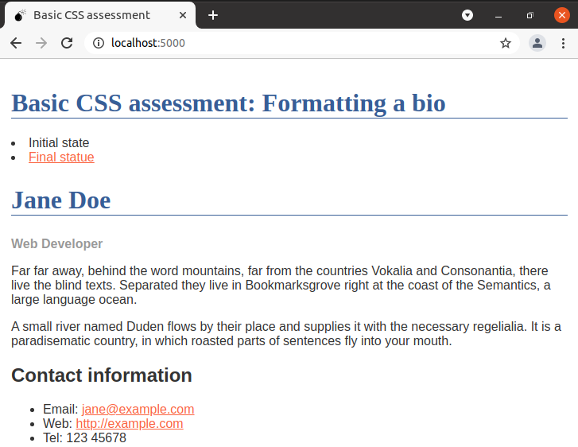

# e01 &mdash; Styling a document with basic CSS
> An exercise illustrating how to style a simple text document using basic CSS.

## Description

This example was developed following the information on [MDN Assessment: CSS basics](https://developer.mozilla.org/en-US/docs/Learn/CSS/First_steps/Using_your_new_knowledge).

In the exercise you start with a basic HTML document (a biography). Using CSS you will have to change the biography from the initial status:

so that it looks like the following:

These are things to do:
1. Make the level one heading pink, using the CSS color keyword `hotpink`.
2. Give the heading a 10px dotted `border-bottom` which uses the color keyword `purple`.
3. Make the level 2 heading italic.
4. Give the `ul` used for contact details a `background-color` of `#eeeeee`, and a 5px solid purple `border`. Use some padding to push the content away from the border.
5. Make the links `green` on hover.
