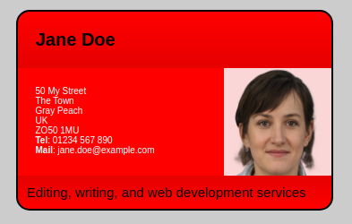

# e09 &mdash; Practising CSS fundamentals by creating an online business card
> miniproject on fundamental CSS comprehension in which we create an online business card.

## Description

This is the exercise [MDN: Fundamental CSS comprehension](https://developer.mozilla.org/en-US/docs/Learn/CSS/Building_blocks/Fundamental_CSS_comprehension)

It consists of an exercise in which you are given a fixed HTML document and an initial CSS file and you will have to work on the CSS to create an online business card.

### Exercise

In this exercise, you have an HTML document with the business information and picture of a Jane Doe. You are also given a starting set of styles that are half written.

You need to write the necessary CSS to style it into a nifty little online business card that looks like the picture below:

You can find all the details in the [project brief](https://developer.mozilla.org/en-US/docs/Learn/CSS/Building_blocks/Fundamental_CSS_comprehension#project_brief).