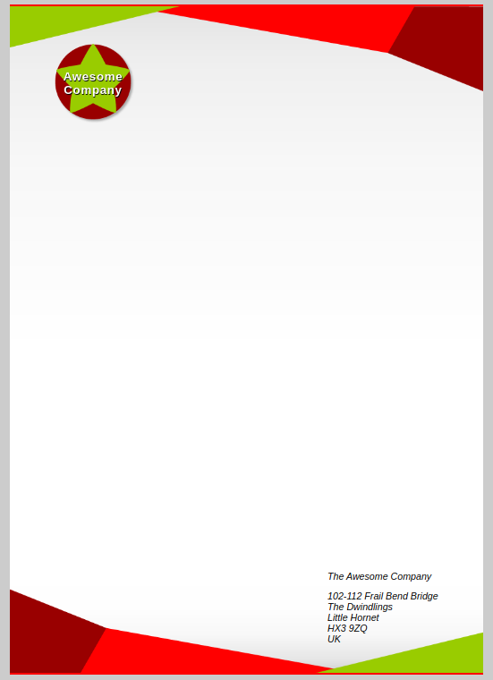

# e10 &mdash; Practising CSS fundamentals by creating a fancy letterheaded paper
> miniproject on fundamental CSS comprehension in which we create a fancy letterheaded paper.

## Description

This is the exercise [MDN: Creating fancy letterheaded paper](https://developer.mozilla.org/en-US/docs/Learn/CSS/Building_blocks/Creating_fancy_letterheaded_paper)

It consists of an exercise in which you are given a fixed HTML document and an initial CSS file and some images and you will have to work on the CSS to create an online letterhead template.

### Exercise

In this exercise, you are given the files needed to create a letterheaded paper template.

+ Add a background declaration to the letter that:
    + Fixes the top image to the top of the letter.
    + Fixes the bottom image to the bottom of the letter.
    + Add a semi-transparent gradient over the top of the previous backgrounds that gives the letter a bit of texture. Make it slightly dark right near the top and bottom, but completely transparent for a large part of the center.

+ Add a white background color to the letter.

+ Add a 1mm top and bottom solid border to the letter, in a color that matches with the rest of the color scheme.

+ Add the logo as a background image to the `<h1>` element.

+ Add a filter to the logo to give it a subtle drop shadow (hint: see [`drop-shadow()`](https://developer.mozilla.org/en-US/docs/Web/CSS/filter-function/drop-shadow()))

The final result should look like:

