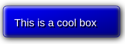

# e11 &mdash; Practising CSS fundamentals by creating a cool-looking box
> miniproject on fundamental CSS comprehension in which we create an eye-catching box.

## Description

This is the exercise [MDN: A cool-looking box](https://developer.mozilla.org/en-US/docs/Learn/CSS/Building_blocks/A_cool_looking_box)

It consists of an exercise in which you are given a fixed HTML document and an initial CSS file and you.

### Exercise

In this exercise you need to style the provided `
` following these rules:

+ a reasonable width for a large button, around 200px.
+ a reasonable height for a large button, centering the text vertically in the process.
+ a slight increase in font size, to around 17-18 pixel computed style. Use rems. Write a comment about how you worked out the value.
+ Add a base color for the design. Give the box this color as its background color (HINT: use property values).
+ Add the same base color for the text, and make it readable using a black text shadow (Hint: use `text-shadow`).
+ Add a fairly subtle border radius.
+ Add a 1 pixel sold border with a color similar to the base color, but a slightly darker shade.
+ Add a linear semi-transparent black gradient that goes toward the bottom right-corder. Make it completely transparent at the start, gradiating around 0.2 opacity by 30% along, and remaining at the same color until the end.
+ Multiple box-shadows. Give it one standard bow shadow to make the box look slightly raised off the page. The other thow should be inset box shadows &mdash; a semi-transparent white shadow near the top left and a semi-transparent black shadow near the bottom right &mdash; to add to it a nice raised 3D look.

The final result should look like:

