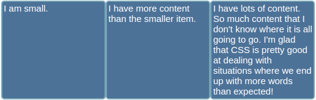
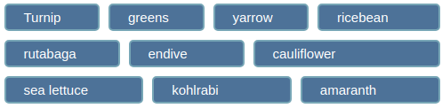

# e13 &mdash; Practising CSS Layout: Flexbox module
> Exercises about the Flexbox module

## Description

This is the exercise [MDN: Test your skills: Flexbox](https://developer.mozilla.org/en-US/docs/Learn/CSS/CSS_layout/Flexbox_skills)

It consists of a series of exercises in which you are given fixed HTML documents and you practice common layouts that work well with Flexbox.

### Exercise One: navbar

Given the following links to be used as a navigation bar for a site, use *Flexbox* so that they are laid out as a row, with an equal amount of space betwen each item so that they look as:

### Exercise Two: list items as three equal sized cols

You have a list with items of different sizes that you want them displayed as three equal sized columns independently of what content is in each item, as shows in the image below:

### Exercise Three: center (horiz/vert) child element within its parent

You have a `
` with class `.parent` which contains another `
` with class `.child` and have to use flexbox to center the child horizontally and vertically inside the parent. The final state should be the image below:

### Exercise Four: arrange list items in several rows

You have a list with 10 items which should be arranged in three rows (items 1-4, items 5-7, items 8-10) as depicted in the image below.

| NOTE: |
| :---- |
| It was not very clear to me how to do Exercise Four. I just added some padding to force the line break, when I though it should be enough to set the width of the element. |