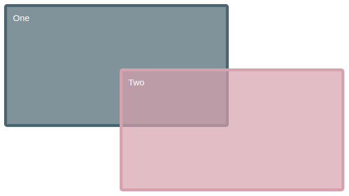

# e14 &mdash; Practising CSS Layout: Grid layout
> Exercises about the CSS Grid Layout module

## Description

This is the exercise [MDN: Test your skills: Grid Layout](https://developer.mozilla.org/en-US/docs/Learn/CSS/CSS_layout/Grid_skills)

It consists of a series of exercises in which you are given fixed HTML documents and you practice how the grid and grid items behave.

### Exercise One

Create a grid into which the four child elements will *auto-place*. The grid should have three columns sharing the available space equally, and a 20-pixel gap between the column and row track.

### Exercise Two

Given an already defined grid, edit the CSS rules for the two child elements causing them to span over several grid tracks, and overlay as depicted on the image below.

