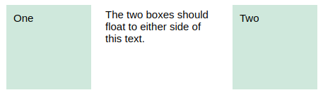
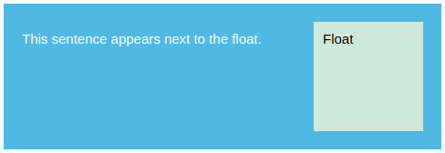

# e15 &mdash; Practising CSS Layout: Floats
> Exercises about Floats

## Description

This is the exercise [MDN: Test your skills: floats](https://developer.mozilla.org/en-US/docs/Learn/CSS/CSS_layout/Floats_skills)

It consists of a series of exercises in which you are given fixed HTML documents and you practice floats concepts.

### Exercise One

In this exercise, you need to float the two elements with a class `float1` and `float2` left and right so that it mimics the image below.

### Exercise Two

In this exercise, the element with class of `float` should be floated left. Then we want the first line of text to display next to that element, but the following line of text (with class `.below`) should be displayed underneath it as seen on the image below:

### Exercise Three

We have a floated element in this example. The box wrapping the float and text is displaying behind the float. Use the modern technique to correct this situation so that the box background extends below the float as seen on the image below:

