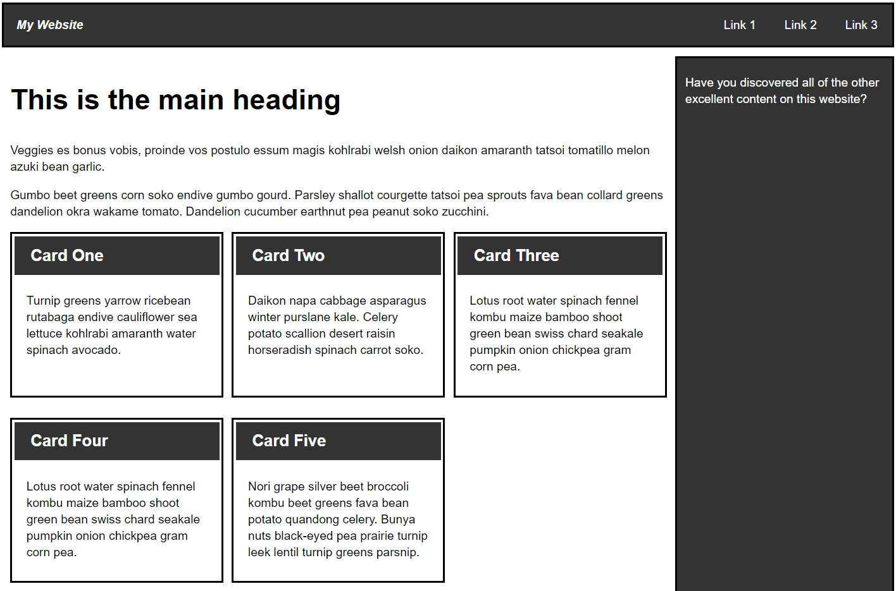

# e19 &mdash; Practising CSS Layout: Building the layout of a blog website
> exercise the CSS layout concepts

## Description

This is the exercise [MDN: Test your skills: Fundamental layout comprehension](https://developer.mozilla.org/en-US/docs/Learn/CSS/CSS_layout/Fundamental_Layout_Comprehension)

It consists of an exercise in which you have to work on the layout of a blog website using the CSS layout concepts.

The goal of the exercise is to make the website look as below image:

### Tasks

1. Display the navigation items in a row, with an equal amount of space between the items.

2. The navigation bar should scroll with the content and then become stuck at the top of the viewport when it reaches it.

3. The image that is inside the article should have the text wrapped around it.

4. The `<article>` and `<aside>` elements should display as a two column layout. The columns should be a flexible size, so that if the browser window shrinks smaller the columns become narrower and the other way around.

5. The photos should display as a two column grid with a 1-pixel gap between the images.