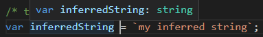

# TypeScript: Setting up shop
> Setting up your environment to work with TypeScript


## Intro

TypeScript is a strongly typed, object-oriented language that uses a compiler to generate JavaScript.

As a result:
+ You will be able to use TypeScript wherever your can use JavaScript.
+ You will need to compile, or more correctly, *transpile* your TypeScript programs to make them run.

The TypeScript compiler can be obtained from NPM using:

```bash
npm install typescrypt
```

This will make available an executable named `tsc` that will invoke the TypeScript compiler.

You can invoke the compiler using `tsc <typescript-program>`.

| NOTE: |
| :---- |
| If you decide not to install the TypeScript compiler locally, you will need to install it as a *dev dependency* and then invoke the compiler using `node_modules/bin/tsc <typescript-program>`. |

## TypeScript project configuration

TypeScript uses a configuration file named `tsconfig.json` that holds a number of compilation options.

You can generate a template of this file doing:

```bash
tsc --init
```

When a `tsconfig.json` is present in the project, you won't need to pass the program name to `tsc` and instead you would be able to simply do `tsc` and that will transpile all the necessary programs.

## Watching files for changes

TypeScript compiler comes bundled with a file watcher that will keep an eye on changes on the entire directory tree, and trigger a recompilation of the project if needed.

Note however that with the *auto-save* feature of VSCode, watching files for for changes will trigger the recompilation of files constantly.

## TypeScript basics

This section will work through the basics of the TypeScript language, starting with its *static typing*.

### Strong Typing

In TypeScript, when you create a variable, or define a parameter in a function, you specify what type it is. Once the type has been specified, you won't be able to change it.

The syntax for setting the type of a variable is:

```typescript
var myString : string = `This is a string`;
```

### Basic types

TypeScript provides a number of basic types:

```typescript
let myBoolean : boolean = true;
var myNumber : number = 1234;
const myStringArray : string[] = [`one`, `two`, `three`];
```

### Inferred typing

The syntax `var myVarName : myVarType` by which you assign a type to variable when declaring it is known as type annotation.

However, TypeScript uses a technique known as *inferred typing* or *type inference* to determine the type of a variable, so that in many cases youe do not need to explicitly specify the type of a variable &mdash; the compiler will do it for you.

For example:

```typescript
var inferredString = `Hello to Jason Isaacs!`;
var inferredNumber = 1;

inferredNumber = inferredString; /* compilation error! */
```

Note that VSCode will show the inferred type when you hover over a variable:



### Duck typing

TypeScript also uses *duck typing* (if it looks like a duck and quacks like a duck, then it is probably a duck) when doing type inference.

That is, two variables are considered to be of the same type if they have the same properties and methods.

```typescript
var nameIdObject = { name: 'myName', id: 1, print() { } };
nameIdObject = { id: 2, name: 'anotherName', print() { } }; /* Reassignment is OK - inferred using duck typing */

nameIdObject = { id: 3, name: 'yetAnotherName' }; /* ERROR: cannot reassign because print is missing */
```

The rules for *duck typing inference* will work if the object being reassigned has extra properties:

```typescript
var obj1 = { id: 1, print() { } };
var obj2 = { id: 2, print() { }, select() { } };

obj1 = obj2; /* Reassignment OK: at least it has id and print() */
obj2 = obj1; /* ERROR: obj1 does not feature select() */
```

### Function signatures and void

TypeScript will allow you to strongly type function signatures:

```typescript
function calculate(a: number, b: number, c: number): number {
  return (a * b) + c;
}
```

This will prevent us from doing:

```typescript
/* none of these will work */
calculate('3', '2', '1');
var result: string = calculate('2', '1', '5');
```

Functions that only perform side-effects can use `void` as the return value for the function:

```typescript
function printResult(a: string) : void {
  console.log(`The result is ${a}`);
}
```

### VS Code IntelliSense

### VS Code debugging

### Introducing third-party libraries

### Declaration files

## Summary