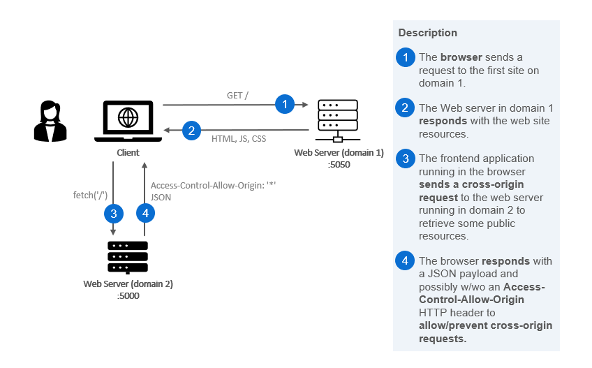
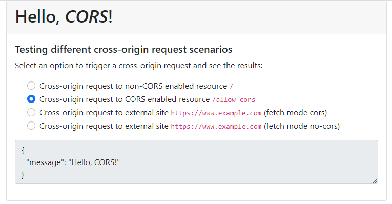

# 04: Misc concepts &mdash; Hello, CORS!
> a gentle introduction to *same-origin policy* in the browser and the *CORS* mechanism, with some simple runnable examples.

## Concept description

The browsers implement a mechanism named **same-origin policy** that blocks reading a resource from a different origin. This presents a problem in many legitimate uses, as an application often wants to get resources from a different origin:
+ fetching a JSON document from a different domain
+ load images from another site and show them in the current document

Even if a particular site exposes those resources publicly the **same-origin policy** will prevent accessing them from your application. **Cross-Origin Resource Sharing (CORS)** fixes that in a standard way.

> Given a server that exposes certain resources, **CORS** is a mechanism that the server implements to tell the browser it is permitted to use a different origin to access those resources.

| NOTE: |
| :---- |
| *CORS* should be implemented by the owner of the resource, not by the site from which the cross-origin request is originated. It is a general misconception that *CORS* can be fixed from the site from where you download the JavaScript that triggers the cross-origin request. |

### How does CORS work?
The **same-origin policy** tells the browser to block cross-origin request. When you want to get a public resource from a different origin, the resource-providing server needs to tell the browser: "This origin where the request is coming from can access my resource".

#### Step 1: client request (browser)
When the browser is making a cross-origin request, the browser adds an `Origin` HTTP header with the current origin (scheme, host, and port).

#### Step 2: server response
On the server side, when a server sees this header, and wants to allow access, it needs to add an `Access-Control-Allow-Origin` HTTP header to the response specifying the requesting origin, or `*` to allow any origin.

#### Step 3: browser receives response
When the browser sees this response with an appropriate `Access-Control-Allow-Origin` header, the browser allows the response data to be shared with the client site.


### CORS in action

Let's illustrate how the **same-origin policy** works, and how to use the **CORS** mechanism to allow cross-origin requests with an example.

The following diagram depicts the scenario for a successful cross-origin request, in which the application downloaded from the domain1 is allowed to send a cross-origin request to domain2:



The code in this folder illustrates different variations of this scenario:
1. sending a cross-origin request from the application downloaded from domain1 to an endpoint on domain2 for which CORS is not enabled
2. sending a cross-origin request from the application downloaded from domain1 to an endpoint in domain2 that has been enabled for CORS
3. sending a cross-origin request from the application downloaded from domain1 to an endpoint in a publicly available website (www.example.com)
4. sending a cross-origin request from the application downloaded from domain1 to an endpoint in a publicly available website (www.example.com) with `mode: 'no-cors'` enabled.



Those use cases illustrate 4 different situations you might find:
1. This situation illustrates what you might find when you are developing both domain1 and domain2 applications. Even when you own both applications, the browser will not allow you to send cross-origin requests if CORS is not enabled.

2. In this scenario, we follow up from the previous situation, as as you have control of the domain2 application you configure CORS so that the cross-origin request can be successfully performed.

3. In this scenario, we try to send a cross-origin request to a website we don't control. As this website (http://www.example.com) does not implement CORS, the request will fail.

4. In this scenario, you try to send a cross-origin request using the `no-cors` mode that disables CORS. However, the response you get from the server is not useful either.


#### Code Walkthrough

##### The client application: `site1-web-app`

The application in `site1-web-app/` directory is a simple Express application that serves the static resources for the client application running in the browser.

This Express server is set up in `app/src/main.ts`, while the static resources are found in `app/src/public/`.

The main HTML page (`index.html`) links to the Bootstrap and custom CSS stylesheets, links to the transpiled TypeScript for the *active part* of the application, and displays the user interface consisting of a card with a header, and a body with four radio buttons for each of the use cases to demonstrate, and a textarea in which the request result messages will be displayed.

The active part is implemented in the `app/src/public/ts/client.ts`. In the code, we read the user selection on the radio buttons and depending on that, the different requests are performed using `fetch(...)`:
1. `fetch('http://localhost:5000/')` &mdash; This will send a regular request to an application running on a different domain. As the latter application is not implementing CORS for that endpoint, the request will fail.

2. `fetch('http://localhost:5000/allow-cors', { mode: 'cors'})` &mdash; This will send a regular request for a CORS enabled endpoint on the application running on a different domain. The request will succeed.

3. `fetch('http://www.example.com')` &mdash; This will send a regular request to an endpoint on a public website that does not implement CORS. As a result, the request will fail.

4. `fetch('http://www.example.com', { mode: 'no-cors' })` &mdash; This will send a `'no-cors'` request. This is a special mode that disables CORS, but the applicability is very limited. The result of such a request is not OK, and no body is received.


##### The server application: `site2-web-server`

The application in `site2-web-server/` directory is a simple Express application that exposes two endpoints:
+ `/` &mdash; no-CORS enabled
+ `/allow-cors` &mdash; CORS-enabled

### Sharing credentials with CORS

For privacy reasons, CORS is normally used for anonymous request &mdash; the ones where the requestor is not identified. If you want to send cookies when using CORS additional headers are needed in the request and the response.

In the request, the `fetch()` invocation should be modified so that it looks like:

```typescript
const response = await fetch(url, {
  mode: 'cors',
  credentials: 'include' });
```

In turn, for this to work, the server that is sending the respond must:
+ Include `Access-Control-Allow-Origin` set to a specific origin (the wildcard `*` is not allowed!).
+ Include an `Access-Control-Allow-Credentials: true` HTTP header.

### Handling complex HTTP calls

As browsers won't block cross-origin requests right away, but rather will retrieve the response of the cross-origin request and then check if it is allowed, for complex request the browser will first send a data-less *preflight request* to the front of the request chain.

The CORS specification defines a complex request as:
+ a request that uses methods other than `GET`, `POST`, or `HEAD`.
+ a request that includes headers other than `Accept`, `Accept-Language`, or `Content-Language`.
+ a request that includes a `Content-Type` HTTP header other than `application/x-www-form-urlencoded`, `multipart/form-data`, or `text-plain`.

If the browser resolves that it needs a *preflight request*, it will send an `OPTIONS` request before the actual request. On the server side, the application needs to respond to the *preflight request` with a response that:
+ Includes an `Access-Control-Allow-Origin` set to a specific origin (again wildcard `*` not allowed!).
+ Includes an `Access-Control-Allow-Methods` with a comma-separated list of HTTP methods that are allowed for that cross-origin request (e.g. `GET, PUT, POST, DELETE, OPTIONS`).
+ Optionally, an `Access-Control-Max-Age` specifying the duration in seconds to cache the response to a *preflight request*, so that the client does not send a *preflight request* every time it sends a complex request.


### Summary

In general, browsers won't allow you to perform cross-origin requests. CORS is a mechanism that allows triggering cross-origin requests.

It is a general misconception that *CORS* is a mechanism used to tell a JavaScript fetched from domain 1 that it can make cross-origin requests to domain 2. In reality, *CORS* is controlled by the server that exposes a resource, and as a result, you won't be able to allow cross-origin requests from your code fetched from domain 1, if you don't control the server in domain 2.

Even simple GET requests to publicly available websites such as `https://example.com` will fail because of the same-origin policy. In those cases, the response will be fetched from the client, but the browser will discard it before making it available to your code.

For simple requests, you can configure your `fetch()` invocation with the `{mode: 'no-cors'}`.

Complex requests, and requests that require sending cookies (for requestor identification) require a slightly more complex approach with additional headers, and support for *preflight requests*.

