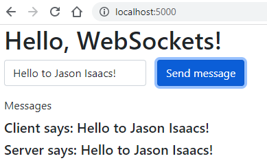
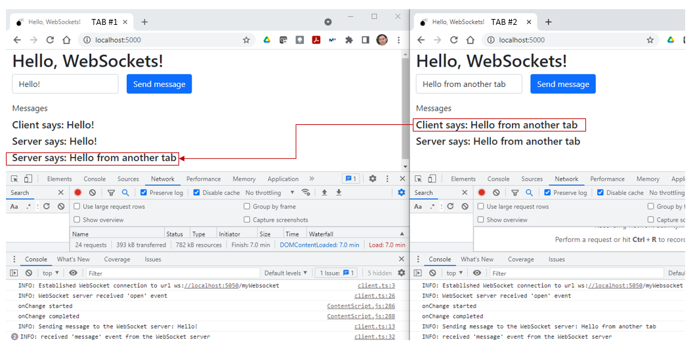

# 05: Misc concepts &mdash; Hello, WebSockets!
> a very simple introduction to WebSockets

## Concept description

WebSockets is an event-driven alternative to HTTP, in which a server can send information to the client without a prior client request.

WebSockets are an *upgrade* to traditional HTTP. Whenever a websocket request is made to regular HTTP, it is upgraded to a websocket connection. This happens at the protocol level, meaning that your underlying TCP connection will remain the same as it was when it was working with HTTP.

The steps in a WebSockets communication are the following:

+ A **client** sends a *request to upgrade* to a **server**.
+ If the **server** supports WebSockets, it will *accept the request and switch the protocols* from HTTP to websocket.
+ The HTTP server becomes a **websocket server** and a *persistent connection* is created between the client and the server.
+ The websocket server will be able to contact the client directly, without waiting for the client to contact the server first (as it happens on regular HTTP).

| NOTE: |
| :---- |
| WebSockets always maintains their state and utilize a full-duplex connection. Besides, headers in WebSockets are sent only once (while sending the upgrade request). |


## Code Walkthrough

The example consists of two separate projects:
+ `site1-ws-server` &mdash; The WebSocket server, which will be contacting the client to send some messages.
+ `site2-client-app` &mdash; The client application, hosted on a simple static Express server.

### Site 1: The WebSocket server

Site 1 is a minimalist Express application that also implements the WebSocket server. We will use [`ws`](https://www.npmjs.com/package/ws) as our WebSockets library, and therefore it has to be added to the `package.json`.

The WebSocket server is as follows:

```typescript
import express from 'express';
import { Socket } from 'net';
import WebSocket from 'ws';

const PORT: number = Number(process.env.PORT) || 5050;
const app = express();

export const server = app.listen(PORT, () => {
  console.log(`INFO: server listening on PORT ${ PORT }`);
});

const wsServer = new WebSocket.Server({
  noServer: true  // reuse Express HTTP server
});

wsServer.on('connection', ws => {
  ws.on('message', (msg) => {
    wsServer.clients.forEach((client) => {
      if (client.readyState === WebSocket.OPEN) {
        client.send(msg.toString());
      }
    });
  });
});

server.on('upgrade', async (request, socket, head) => {
  // fabricated authentication error for 50% of the requests
  if (Math.random() > 0.5) {
    return socket.end(`HTTP/1.1 401 Unauthorized\r\n`, 'ascii');
  }

  // emit 'connection' event when request accepted
  wsServer.handleUpgrade(request, socket as Socket, head, (ws) => {
    wsServer.emit('connection', ws, request);
  });
});
```

In the first few lines of the program, we configure a Express server:

```typescript
import express from 'express';
import { Socket } from 'net';
import WebSocket from 'ws';

const PORT: number = Number(process.env.PORT) || 5050;
const app = express();

export const server = app.listen(PORT, () => {
  console.log(`INFO: server listening on PORT ${ PORT }`);
});
```

After those lines is where the WebSocket server is being implemented.

The first thing consists in instantiating a new WebSocket server. Note that we use the `noServer: true`, as we will be sharing our Express server with our WebSocket server.

```typescript
const wsServer = new WebSocket.Server({
  noServer: true  // reuse Express HTTP server
});
```

Next we declare the event handlers for the `'connection'` and `'message'` events.

For this particular example, each time we receive the `'connection'` event from a client, we will register a handler for the `'message'` event for that client.

The handler for the `'message'` event will iterate over the list of clients of the web server (i.e., all clients that has registered with the WebSocket server), and if the connection is still open, we will send the contents of the event to them. As a result, all the connected clients will receive a message sent by any of the clients.

```typescript
wsServer.on('connection', ws => {
  ws.on('message', (msg) => {
    wsServer.clients.forEach((client) => {
      if (client.readyState === WebSocket.OPEN) {
        client.send(msg.toString());
      }
    });
  });
});
```

Finally, we also declare the event handler for the `'upgrade'` event, that is received when a client wants to upgrade an HTTP connection to a WebSocket connection.

For the purpose of the example, we illustrate how we can reject connections using `socket.end(...)`. When we accept the request, we emit the `'connection'` event to register a new client.

```typescript
server.on('upgrade', async (request, socket, head) => {
  // fabricated authentication error for 50% of the requests
  if (Math.random() > 0.5) {
    return socket.end(`HTTP/1.1 401 Unauthorized\r\n`, 'ascii');
  }

  // emit 'connection' event when request accepted
  wsServer.handleUpgrade(request, socket as Socket, head, (ws) => {
    wsServer.emit('connection', ws, request);
  });
});
```

### Site 2: The client application

Site 2 is an Express application that serves the static contents placed in the `app/src/public/` directory.

The UI of the application consists of an input text field, a button and an area on which messages will be displayed:



The HTML create those components with specific ids, so that they can be easily referenced them from the TypeScript code:

```html
<!DOCTYPE html>
<html lang="en">

<head>
  <meta charset="utf-8">
  <meta name="viewport" content="width=device-width, initial-scale=1">
  <title>Hello, WebSockets!</title>
  <link rel="shortcut icon" href="icons/favicon.ico" type="image/x-icon">
  <link href="https://cdn.jsdelivr.net/npm/bootstrap@5.0.2/dist/css/bootstrap.min.css" rel="stylesheet" integrity="sha384-EVSTQN3/azprG1Anm3QDgpJLIm9Nao0Yz1ztcQTwFspd3yD65VohhpuuCOmLASjC" crossorigin="anonymous">
  <link href="stylesheets/styles.css" rel="stylesheet">
  <script src="ts/client.js" type="module" defer></script>
</head>

<body>
  <div class="container-fluid">
    <h1>Hello, WebSockets!</h1>
    <div class="row g-3">
      <div class="col-auto">
        <input type="text" class="form-control" id="message" placeholder="type the text to send">
      </div>
      <div class="col-auto">
        <button class="btn btn-primary mb-3" id="send">Send message</button>
      </div>
    </div>
    <div class="row g-3">
      <div class="mb-3">
        <label for="messages" class="form-label">Messages</label>
        <div id="messages"></div>
      </div>
    </div>
  </div> <!-- container-fluid -->
</body>
</html>
```

| NOTE: |
| :---- |
| The area on which messages will be displayed is an empty `<div>`. Children `<h5>` elements will be added there as we receive new messages. |

The TypeScript code for the client app is quite simple too:

```typescript
const url = 'ws://localhost:5050/myWebsocket';
const myWsServer = new WebSocket(url);

const { myMessages, myInput, sendBtn } = getHtmlElements();

sendBtn.disabled = true;
sendBtn.addEventListener('click', sendMsg);

function sendMsg() {
  const text = myInput.value;
  msgGeneration(text, 'Client');
  myWsServer.send(text);
}


function msgGeneration(msg: string, from: string) {
  const newMessage = document.createElement('h5');
  newMessage.textContent = `${ from } says: ${ msg }`;
  myMessages.appendChild(newMessage);
}


myWsServer.onopen = () => {
  sendBtn.disabled = false;
};


myWsServer.onmessage = (event) => {
  const { data } = event;
  msgGeneration(data, 'Server');
};

function getValidatedHtmlElement<T extends Element>(htmlSelector: string): T {
  const elem = document.querySelector(htmlSelector);
  if (!elem) {
    console.log(`ERROR: ${ htmlSelector } was not found in the HTML`);
    throw new Error(`Missing element ${ htmlSelector } in HTML`);
  }
  return elem as T;
}


function getHtmlElements(): { myMessages: HTMLDivElement, myInput: HTMLInputElement, sendBtn: HTMLButtonElement } {

  const myMessages: HTMLDivElement = getValidatedHtmlElement<HTMLDivElement>('#messages');
  const myInput: HTMLInputElement = getValidatedHtmlElement<HTMLInputElement>('#message');
  const sendBtn: HTMLButtonElement = getValidatedHtmlElement<HTMLButtonElement>('#send');

  return { myMessages, myInput, sendBtn };
}
```

In the first two lines, we get a reference to our WebSocket server running on *site1*:

```typescript
const url = 'ws://localhost:5050/myWebsocket';
const myWsServer = new WebSocket(url);
```

Note the anatomy of the WebSocket server URL: `ws://<websocket-server-host>:<web-socket-server-port>/<path>`. Note also that the path is set to `myWebsocket` arbitrarily, and that we're not making use of that path on the WebSocket server side.

Right afterwards, we get the reference from the three elements from the web page that we need to interact with. We use the `getHtmlElements()` convenience function to get validate that we get non-null, well-typed references to those elements:

```typescript
const { myMessages, myInput, sendBtn } = getHtmlElements();
...
function getValidatedHtmlElement<T extends Element>(htmlSelector: string): T {
  const elem = document.querySelector(htmlSelector);
  if (!elem) {
    console.log(`ERROR: ${ htmlSelector } was not found in the HTML`);
    throw new Error(`Missing element ${ htmlSelector } in HTML`);
  }
  return elem as T;
}

function getHtmlElements(): { myMessages: HTMLDivElement, myInput: HTMLInputElement, sendBtn: HTMLButtonElement } {

  const myMessages: HTMLDivElement = getValidatedHtmlElement<HTMLDivElement>('#messages');
  const myInput: HTMLInputElement = getValidatedHtmlElement<HTMLInputElement>('#message');
  const sendBtn: HTMLButtonElement = getValidatedHtmlElement<HTMLButtonElement>('#send');

  return { myMessages, myInput, sendBtn };
}
```

Then, we set the initial status of the button to `disabled` so that the user cannot click on it:

```typescript
sendBtn.disabled = true;
```

Right afterwards we register our event handler for the `'click'` event on the button, which will manage all the interaction with the WebSocket server:

```typescript
sendBtn.addEventListener('click', sendMsg);

function sendMsg() {
  const text = myInput.value;
  msgGeneration(text, 'Client');
  myWsServer.send(text);
}
```

The `sendMsg()` function is the director of all the actions carried out as a response to the `'click`' event:
+ we read the contents of the input text field
+ we delegate to a function `msgGeneration` to display the message entered by the user in the `<div id="messages">`.
+ we send the message typed by the user to the WebSocket server using the WebSocket's API method `send()`.


The function `msgGeneration` simply adds an `<h5>` element to the messages *div* as a child element. The function receives two arguments: the content of the message, and the *actor* that sent the message. When invoked from the `sendMsg()` function, the actor will be the client.

```typescript
function msgGeneration(msg: string, from: string) {
  const newMessage = document.createElement('h5');
  newMessage.textContent = `${ from } says: ${ msg }`;
  myMessages.appendChild(newMessage);
}
```

Then, we create an event handler to enable the button when the connection to WebSocket server is successfully established. As we have included a 50% error rate on the accepted connections, we might need to refresh the page a few times until the connection to the WebSocket server is accepted:

```typescript
myWsServer.onopen = () => {
  sendBtn.disabled = false;
};
```

Finally, we register an event handler for the `'message'` event that identifies the situation on which the server sends us a message out of the blue:

```typescript
myWsServer.onmessage = (event) => {
  const { data } = event;
  msgGeneration(data, 'Server');
};
```

See that the processing consists in reading the message contents (which comes in the `data` property of the event), and then invoking `msgGeneration(..., 'Server')` to identify the message as being originated from the WebSocket server.

### Running the example

+ start `site1-ws-server` by typing: `npm start`.
+ start `site2-client-app` by typing: `npm start`.
+ Open your browser and navigate to `http://localhost:5000`
+ Click F12 to open the DevTools console.
+ Click refresh if you see a WebSocket connection error. If the send button is enabled it means the WebSocket connection has been successfully established.
+ Type a message. The message will be sent to the server and the client will receive an echo message from the server.
+ Open `http://localhost:5000` on another browser tab/window. Type another message. The message will be sent to the server and the tab will receive the echo message.
+ Go back to the first browser tab, you should have received a message from the server with what you typed in your second browser session.




### Summary

This example serves as an introduction to WebSockets &mdash; a mechanism that allows a full-duplex persistent connection to be established between a client application running in the browser, and a server application.

WebSockets open a lot interesting scenarios, such as a server sending updates to a client without having the client contacting the server first, or communicating two clients running in the browser.
