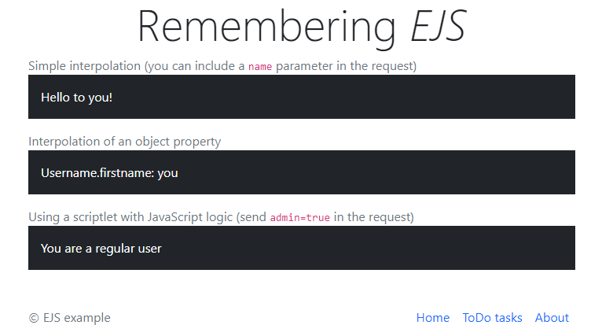
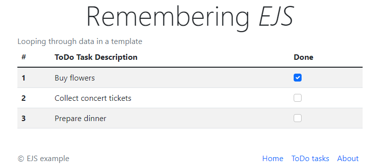

# 06: Misc concepts &mdash; Remembering *EJS*
> Remembering the basic concepts of the *EJS* template engine for Express projects.

## Contents
+ Setting up an Express project with EJS templates
+ Interpolating data in EJS templates
+ Using JavaScript in your EJS templates
+ Rendering and sending data to your templates
+ Reusing HTML fragments with partials


*Index page*


*Tasks table*

## Concept description

*EJS* is one of the most popular template engines for JavaScript. It retains the syntax of HTML while allowing you to inject data into an HTML-ish document. Express can be easily integrated with *EJS* to create web sites and applications using server-side rendering.

### Recommended project structure

When using *EJS* in your Express project, it is recommended to create a `views/` directory to contain all the *EJS* related templates.

Within the `views/` directory, create a `pages/` and `partials/` directory to host the main application pages, and the HTML fragments that will be reused in the different pages (e.g. navbar, footer, sidebars, etc.).

```
app/src/
├── lib/
├── public/           <- static resources
├── routes/
├── views/            <- EJS templates
│   ├── pages/
│   └── partials/
└── main.ts
```


### EJS syntax
The syntax of *EJS* requires you to use the following syntax when you want to interpolate data from your application in a template

```
<startingTag content closingTag>
```

It provides two variants that lets you interpolate escaped and unescaped content
+ `<%= %>` &mdash; to inject escaped content in your template. This is recommended approach to send untrusted/user provided data. When escaping content, characters with special meaning in HTML such as `'&'` or `<` will be transformed into HTML entities such as `&amp;` or `&lt;`, to prevent XSS attacks.
+ `<%- %>` &mdash; to inject raw unescaped content in your template. This is appropriate when you want to inject HTML content in your template, for example, when reusing HTML fragments such as navbars, footers, etc.

The syntax for inject a particular value is really simple. The following snippet interpolates the property `firstName` from a `user` object.

```html
<p>
  Your name is <%= user.firstName %>
</p>
```

The same tags can be used to include pieces of JavaScript in your templates:

```html
<% if (task.done) { %>
  <input type="checkbox" class="form-check-input" readonly checked>
<% } else { %>
  <input type="checkbox" class="form-check-input" readonly>
<% } %>
```

The same approach can be used to create dynamic views that depend on the information that needs to be displayed:

```html
<% for (const task of tasks) { %>
  <tr>
    <th scope="row"><%= task.id %></th>
    <td><%= task.desc %></td>
  </tr>
<% } %>
```

### Rendering and passing data to templates

For the previous snippets to work, you need to use a special Express API that sends out the filled out template as HTML to the browser.

```typescript
router.get('/', (req: express.Request, res: express.Response) => {
  const user = req?.query?.name || 'you';
  const admin = req?.query?.admin === 'true';

res.render('pages/index', {
    user,
    username: {
      firstName: user,
      admin
    }
  });
});
```

The previous snippet uses this `res.render()` method to instruct the rendering of the `pages/index.ejs` template, and sends the necessary objects/pieces of data that has to be interpolated into the template.

Similarly, for the table example:

```typescript
router.get('/tasks', (req: express.Request, res: express.Response) => {
  const tasks: ToDoTask[] = [
    { id: 1, desc: 'Buy flowers', done: true },
    { id: 2, desc: 'Collect concert tickets', done: false },
    { id: 3, desc: 'Prepare dinner', done: false }
  ];

  res.render('pages/tasks', { tasks });
});
```

### Reusing templates with EJS partials

Partials allow you to reuse fragments of HTML/EJS. You simply need to include them in the parent page using:

```html
<%- include('../partials/header') %>
<body>
...
```

Partials can also include interpolated data, and the mechanism to pass information is exactly the same you use for pages (using the `Response.render()` method).

Additionally, when including the partial you can also explicitly declare objects used in the partial.

For example:

```html
<%- include('../partials/header', { title: 'ToDo tasks'}) %>
<body>
...
```
