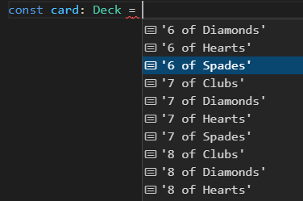

# 08: Misc concepts &mdash; TypeScript 4 concepts
> a sandbox project to introduce some TypeScript 4 concepts

## Description

TypeScript 4 introduced several features that improve the way in which type-safe programs can be written.

### Variadic tuple types

We know that typles represent fixed-length array types, where each of the element has a specific, predefined type. For example, you can use them to model points in the 2D plane or 3D space:

```typescript
type Point2d = [number, number];
type Point3d = [number, number, number];
const point1: Point2d = [1, 2];
const point2: Point3d = [1, 2, 3];
```

TypeScript 4 introduced the concept of variadic tuple types, that allows you to define types like the following:

```typescript
type NamedType<T extends unknown[]> = [string, ...T];
```

Above, we're declaring a type `NamedType` whose shape is `[string, ...T]`. That can be used to instantiate types such as the following:

```typescript
type NamedPoint2d = NamedType<Point2d>;
type NamedPoint3d = NamedType<Point3d>;

const point1: NamedPoint2d = ['Point: (3, 4)', 3, 4];
const point2: NamedPoint3d = ['Point: (3, 4, 5)', 3, 4, 5];
```

Those types can then be used and passed around, which gives you good reasons to use tuples to model domain primitives (instead of objects).

```typescript
function displayPoint(t: NamedPoint2d | NamedPoint3d) {
  console.log(t[0], t.slice(1));
}
```

### Template literal types

The new features for literal types enables you to use template strings when defining those types. As a result, you can model a deck of cards with the following code:

```typescript
type Suit = `${ 'Spades' | 'Hearts'  | 'Diamonds' | 'Clubs' }`;
type Rank = `${ '2' | '3' | '4' | '5' | '6' | '7' | '8' | '9' | '10' | 'Jack' | 'Queen' | 'King' | 'Ace' }`;
type Deck = `${ Rank } of ${ Suit }`;

const card: Deck = '10 of Hearts';
```



### Labeled tuples

TypeScript 4 also added the capability of labeling the elements of a tuple:

```typescript
type LabeledPoint2D = [x: number, y: number];
type LabeledPoint3D = [x: number, y: number, z: number];
```

Those labels `x`, `y`, and `z` are merely for documentation purposes, and cannot be used when defining or referencing the tuple elements:

```typescript
const point7: LabeledPoint2D = [1, 2];
// const point7: LabeledPoint2D = [x:1, y:2]; // cannot find name x, y

const point8: LabeledPoint3D = [1, 2, 3];

// type-guard
function isLabeledPoint2D(point: LabeledPoint2D | LabeledPoint3D): point is LabeledPoint2D {
  return point.length === 2;
}

function displayLabeledPoint(p: LabeledPoint2D | LabeledPoint3D) {
  if (isLabeledPoint2D(p)) {
    // console.log(p.x, p.y); // only labels, not fields
    console.log(p[0], p[1]);
  } else {
    // console.log(p.x, p.y, p.z); // only labels, not fields
    console.log(p[0], p[1], p[2]);
  }
}
```
