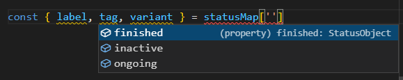

# 10: Misc concepts &mdash; Mastering conditionals
> illustrating different ways to write conditional *in the TypeScript way*

## Description
Consider the following simple requirement:

Depending on the value of a boolean variable `isActive`:
+ if isActive == true: Assign the value `on` to another variable `toggle`
+ if isActive == false: Assign the value `off` to the variable `toggle`.

The simplistic, straight-away approach would be:

```typescript
const isActive = true;
let toggle;
if (isActive) {
  toggle = true;
} else {
  toggle = false;
}
```

But this approach prevents you from using `const`.

In order to solve it, and if the requirement is as simple as the the one above, you can opt for the ternary operator:

```typescript
const betterToggle = isActive? 'on' : 'off';
```

However, that solution is not that easy if the condition to implement is more complicated:

Given a variable `status` of type string, populate the value of another variable `label` according to these rules:
+ if status is `'finished'`, populate `label` with `'Finished task'`
+ if status is `'inactive'`, populate `label` with `'Task inactive'`
+ if status is `'ongoing'`, populate `label` with `'Ongoing task'`

The straight-forward implementation is using if-else if:

```typescript
const status: string = 'ongoing';
let label;
if (status === 'finished') {
  label = 'Finished task';
} else if (status === 'inactive') {
  label = 'Task inactive';
} else if (status === 'ongoing') {
  label = 'Ongoing task';
}
```

or using a switch statement:

```typescript
let labelSwitch: string;
switch (status) {
  case 'finished':
    label = 'Finished task';
    break;
  case 'inactive':
    label = 'Task inactive';
    break;
  case 'ongoing':
    label = 'Ongoing task';
    break;
}
```

Let's assume a varian on the previous use case in which you need to:
+ populate a `tag` variable with the text `Finished`, `Inactive`, or `Ongoing`.
+ populate a `variant` variable with the text `secondary`, `disabled`, and `primary`

Now the switch statement becomes bigger and more difficult to maintain:

```typescript
let labelSwitch2: string;
let tag: string;
let variant: string;
switch (status) {
  case 'finished':
    label = 'Finished task';
    tag = 'Finished';
    variant = 'secondary';
    break;
  case 'inactive':
    label = 'Task inactive';
    tag = 'Inactive';
    variant = 'disabled';
    break;
  case 'ongoing':
    label = 'Ongoing task';
    tag = 'Ongoing';
    variant = 'primary';
    break;
}
```

A possible solution is the use of an object:

```typescript
const status: string = 'ongoing';
const statusMap = {
  finished: {
    label: 'Finished task',
    tag: 'Finished',
    variant: 'secondary'
  },
  inactive: {
    label: 'Inactive task',
    tag: 'Inactive',
    variant: 'disabled'
  },
  ongoing: {
    label: 'Ongoing task',
    tag: 'Ongoing',
    variant: 'primary'
  }
};


const { label, tag, variant } = statusMap['ongoing'];
```

Note however, that it is still not perfect, as we wouldn't be able to do thing such as:

```typescript
const { label, tag, variant } = statusMap[status]; // Error! the object cannot be indexed by the variable
```

This can be solved by changing the type of status from string to a union of literal types:

```typescript
type Status = 'finished' | 'inactive' | 'ongoing';
const status: Status = 'ongoing';
...
const { label, tag, variant } = statusMap[status]; // OK!
```

But the best way in which this problem can be implemented in TypeScript consists in using types/interfaces for everything:

```typescript
type Status = 'finished' | 'inactive' | 'ongoing';

interface StatusObject {
  label: string;
  tag: string;
  variant: string;
}

type StatusMap = Record<Status, StatusObject>;

const statusMap: StatusMap = {
  finished: {
    label: 'Finished task',
    tag: 'Finished',
    variant: 'secondary'
  },
  inactive: {
    label: 'Inactive task',
    tag: 'Inactive',
    variant: 'disabled'
  },
  ongoing: {
    label: 'Ongoing task',
    tag: 'Ongoing',
    variant: 'primary'
  }
};

const { label, tag, variant } = statusMap['finished'];
```

+ We start by defining a type for the `status` variable. If it can only hold a finite set of values, it should be a union of type literals, not a string.

+ Then we define the shape of our status object. This is what the `statusMap` will use as a value.

+ After that, we declare the `StatusMap` type as a `Record<Status, StatusObject>`. This specifies the shape of each of the entries of the `statusMap`.

Right after that, VSCode will be enabled to provide sensible suggestions:


