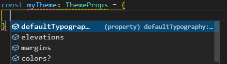

# 12: Misc concepts &mdash; Hello, utility types!
> introducing TypeScript utility types: `Record`, `Partial`, `Required`, `Pic`, `Omit`...

## Description

When you define your compilation target in your `tsconfig.js`, the compiler includes a `lib.*.d.ts` in which common utility types are included for you to use in your application.

The most relevant ones are:
+ `Record` &mdash; shape of entries in a key-value map
+ `Partial` &mdash; creates a type with the same properties of another type, but with all the properties marked as optional.
+ `Required` &mdash; creates a type with the same properties of another type, but will all the properties required.
+ `Pick` &mdash; creates a type out of only certain selected properties of an existing one.
+ `Omit` &mdash; creates a type with the same properties of an existing one, except for the ones specified.

### `Record`

Use the `Record` utility type to define an object type that contains property keys taken from a specific type and values from another.

A `Record` models a type-safe entry in a key-value map.

```typescript
const serviceConfigParameters: Record<string, string | number | boolean> = {
  port: 3000,
  redirectUrl: 'http://localhost/app',
  verboseLogging: true
};
```

You can even make it more type-safe by declaring the key of the record with literal types:

```typescript
type ServiceConfigParams = 'port' | 'redirectUrl' | 'verboseLogging' | 'enableSso';

const configParams: Record<ServiceConfigParams, string | number | boolean> = {
  port: 5000,
  redirectUrl: 'http://localhost',
  verboseLogging: false,
  enableSso: true  // now we need to specify this value explicitly
};
```

### `Partial`

Use `Partial` when you have a type and you want to create another type with the same properties, but marking them as optional.

The `Partial` type is helpgul when you declare a class constructor parameters with default values:

```typescript
enum PRIORITY {
  DEFAULT,
  LOW,
  HIGH
}

interface TodoItemProps {
  title: string;
  description: string;
  priority: PRIORITY;
}

class TodoItem {
  description?: string;
  title = 'Default item title';
  priority = PRIORITY.DEFAULT;

  constructor(todoItemProps: Partial<TodoItemProps> = {}) {
    Object.assign(this, todoItemProps);
  }
}
```

In the code above, the constructor is expecting `Partial<TodoItemProps>`, that is, a subset of a `TodoItemProps`. As a result, you can invoke the constructor as:

```typescript
const item = new TodoItem({ description: 'TodoItem description' });
```

### `Required`

Creates a type with the same properties of another type, but will all the properties required. It is the exact opposite of `Partial`.

If the type from which you are creating the required, already has all the properties required, it does not modify the original type.

```typescript
type Person = {
  name: string;
  age?: number;
}

const p1: Person = { name: 'Jason Isaacs'};
const p2: Required<Person> = { name: 'Idris Elba' }; // ERR: property age is missing
```

### `Pick`

Creates a type out of only certain selected properties of an existing one.

This type is useful when you have a *fat interface* with a lot of properties and you want to extract part of its properties to use in your components.

```typescript
interface MyComponent {
  onclick: () => void;
  onload: () => void;
  onsubmit: () => void;
  onkeypress: () => void;
  onfocus: () => void;
  className: string;
  isActive: boolean;
  // ... myriad of other properties ...
}

type ButtonProps = Pick<MyComponent, 'className' | 'isActive' | 'onclick'>;

const myButtonProps: ButtonProps = {
  className: 'primary',
  isActive: true,
  onclick: () => console.log(`Button has been clicked!`)
};
```

Only the specified properties will be available:


### `Omit`

Creates a type with all the properties of an existing one, except for the ones specified.

This type is very practical when there is an existing interface that closely resembles what you needs except for a small subset of properties:

```typescript
type OriginalThemeProps = {
  colors: string[],
  elevations: string[],
  margins: string[],
  defaultTypography: string;
}

type CustomThemeProps = {
  color: Set<string>;
}

type ThemeProps = Omit<OriginalThemeProps, 'colors'> & { colors?: CustomThemeProps };
```

The previous snippet creates a type `ThemProps` the merges the `OriginalThemeProps` minus the `colors` property and a specific `colors` property of type `CustomThemeProps`.

