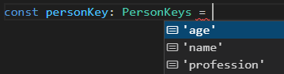

# 13: Misc concepts &mdash; Hello, advanced types and assertions!
> introduction to the creation of your custom utility types using advanced techniques such as capturing property keys, enabling nominal types (i.e. disabling structural types), and using conditional types.

## Description

TypeScript lets you create your own utility types (like `Record` and `Partial`) by using quite advanced type related concepts such as:
+ capturing property keys with `keyof`/`keyof typeof`
+ branded types for enabling nominal types for stricter type checking (disables structural typing)
+ conditional types that mutate depending on how they are instantiated.

### `keyof`/`keyof typeof`: Capturing property keys

The `keyof` operator can be used to obtain they keys of a given type.

This operator comes in handy when you want to declare a type as a union type consisting of the keys of an existing type:

```typescript
interface SignUpFormState {
  email: string;
  name: string;
}

interface ActionPayload {
  key: keyof SignUpFormState;
  value: string;
}

const update1: ActionPayload = {
  key: 'email',   // key is 'name' | 'email'
  value: 'jason.isaacs@example.com'
};
```

Sometimes you won't have the type to be able to apply `keyof type`, and instead have a variable of the corresponding type.

In that case, you can use the `keyof typeof variable`:

```typescript
const person = {
  name: 'Jason Isaacs',
  age: 54,
  profession: 'actor'
};

type PersonKeys = keyof typeof person;

const personKey: PersonKeys = 'profession'; // type is 'name' | 'age' | 'profession'
```

See how the IDE is able to provide sensible suggestions for the values:



### Unique branded types

TypeScript has a structural type system &mdash; two types are considered compatible if they have the same property names. However, there are times when you would want to change this behavior so that only specific kinds of types are allowed (as it happens in programming languages like Java that have a nominal type system).

This requires you to instruct the compiler to check the type carefully without using structural typing by including a `brand` property in a type. This is a unique property that we attach to a type to mark it as special:

```typescript
type NominalTypedType<Type, Brand> = Type & { __type: Brand };
```

For example, the following piece of code defines a `Point2D` type and a function that calculates the distance between those two points both with structural and nominal types:

```typescript
// structural typing
type Point2D = { x: number, y: number };

function distance(first: Point2D, second: Point2D) {
  return Math.sqrt(Math.pow(first.x - second.x, 2) + Math.pow(first.x - second.x, 2));
}

console.log(`distance:`, distance({ x: 1, y: 2}, {x: 3, y: 4}));

// nominal typing
type NominalPoint2D = NominalTyped<Point2D, 'Point2D'>;

function distanceBranded(first: NominalPoint2D, second: NominalPoint2D) {
  return Math.sqrt(Math.pow(first.x - second.x, 2) + Math.pow(first.x - second.x, 2));
}

distanceBranded({ x: 1, y: 2}, {x: 3, y: 4}); // ERROR!

const p1 = { x: 1, y: 2 } as NominalPoint2D;
const p2 = { x: 3, y: 4 } as NominalPoint2D;

console.log(`distance:`, distanceBranded(p1, p2));
```

While in the first case the function allows for structural typing, so that compatible types can be passed as arguments to the `distance()` function, when we use *nomimal types* only variables that have been casted to the given type can be used.

### Conditional types

TypeScript allows you to define types using conditional logic operations in the form:

```typescript
A extends B ? C : D;
```

Consider the following example:

```typescript
type UserID = {
  id: string;
}

type NameOrIdNumber<T extends string | number> = T extends number ? UserID : string;

const loginInfo: NameOrIdNumber<1> = {
  id: '123'
};

const loginInfo2: NameOrIdNumber<'a'> = 'jason.isaacs';
```

In the example, we define an `UserID` type that models the id of a user as a string. Then we define a new type `NameOrIdNumber` using conditional typing so that it might end up being either a plain string or a `UserID.`

Conditional types are commonly used with `infer`. You can give a name to a type or generic parameter to be able to perform conditional checks afterwards.

Consider the following snippet:

```typescript
interface Box<T> {
  value: T
}

type Unbox<A> = A extends Box<infer T> ? T : A;
```

We define a generic type `Box<T>`. Then we define another generic type `Unbox<A>` that works like these: whatever the type we pass to A, we check whether it extends the `Box` type: if it does, we get the generic type passed to `Box<T>`, otherwise we get the `A` type used when doing the unboxing.


Let's see it in action:

```typescript
const boxedNum: Box<number> = { value: 10 };

type unboxedNum2 = Unbox<typeof boxedNum>;      // A is Box<number> => type is a number
type unboxedNum = Unbox<{ value: 10 }>;         // A is Box<number> => type is a number
type unboxedString = Unbox<{ value: 'Hello!' }> // A is Box<string> => type is a string
type unboxedBoolean = Unbox<true>;              // A is boolean => type is boolean
```

As you can see, when the type passed to `Unbox<A>` is a `Box` type or it is compatible with the `Box` type, then we extract its `value` type. Otherwise, we return type `A` as it is.