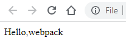
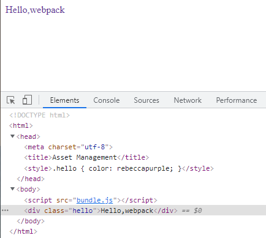
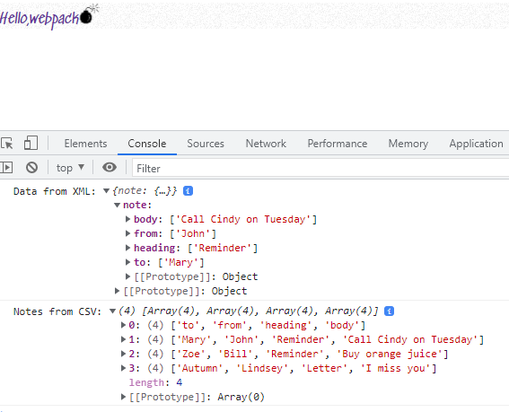
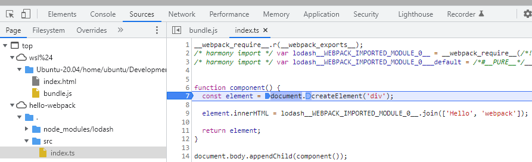

# 15: Misc concepts &mdash; Hello, webpack!
> grokking webpack, the module bundler of modern frontend applications.

## Webpack

At its core, webpack is a static module bundler for JavaScript application. It combines every module in your project into one or more bundles, which are static assets to serve your content from.

### Key concepts

The core concepts are:
+ Entry &mdash; entry point of the application dependency graph.
+ Output &mdash; configures where to emit the created bundles.
+ Loaders &mdash; configures how to transform files webpack does not understand (by default only JavaScript and JSON are known)
+ Plugins &mdash; configures additional tasks to be performed when bundling
+ Mode &mdash; lets you enable/disable built-in bundling optimizations depending on the target environment (`'development'`, `'production'`, `'none'`).
+ Browser compatibility &mdash; webpack supports all ES5 compliant browsers.

#### Entry

An entry point idicates which module should be used to begin building the dependency graph. The default value is `./src/index.js`, but that can be configured using the `entry` property in the webpack configuration file.

```javascript
module.exports = {
  entry: 'path/to/my/entry/file.js'
};
```

#### Output

The `output` property tells webpack where to emit the bundles it creates and how to name these files. It defaults to `./dist/main.js` for the main output file and to `./dist/` for any other generated file.

You can configure this property through the `output` property:

```javascript
const path = require('path');

module.exports = {
  entry: 'path/to/my/entry/file.js',
  output: {
    path: path.resolve(__dirname, 'dist'),
    filename: 'my-first-webpack.bundle.js'
  }
};
```

#### Loaders

By default, webpack only understands JavaScript and JSON files. Loaders allow webpack to process other types of files and converts them into valid modules.

In essence, loaders have two properties:
+ `test` &mdash; identifies which file or files should be transformed.
+ `use` &mdash; identifies which loader should be used to do the transformation.

The following snippet defines a `rules` property for a single module that tells webpack to resolve any `.txt` file inside a `require` or `import` statement to transform it using the `raw-loader` before adding it to the bundle.


```javascript
const path = require('path');

module.exports = {
  entry: 'path/to/my/entry/file.js',
  output: {
    path: path.resolve(__dirname, 'dist'),
    filename: 'my-first-webpack.bundle.js'
  },
  module: {
    rules: [{ test: /\.txt$/, use: 'raw-loader' }]
  }
};
```

| NOTE: |
| :---- |
| The rules in the webpack config file should be placed under the `module` property as in `module.rules`. |

#### Plugins

Plugins are used to perform tasks such as bundle optimization, asset management, and injection of environment variables into your bundles.

In order to use a plugin, you need to `require()` it and add it to the plugins array. Since you can use the same plugin multiple times in a configuration file for different purposes, make sure to create an instance of it by calling it with the `new` operator:

```javascript
const HtmlWebpackPlugin = require('html-webpack-plugin);
const webpack = require('webpack');
const path = require('path');

module.exports = {
  entry: 'path/to/my/entry/file.js',
  output: {
    path: path.resolve(__dirname, 'dist'),
    filename: 'my-first-webpack.bundle.js'
  },
  module: {
    rules: [{ test: /\.txt$/, use: 'raw-loader' }]
  },
  plugins: [new HtmlWebpackPlugin({ template: './src/index.html' })]
};
```

The example above uses the `html-webpack-plugin`, which generates an HTML file for your application and automatically injects all your generated bundles into this file.

#### Mode

Controls whether bundling optimizations should be enabled or not depending on the type of environment. The available values are `'development'`, `'production'`, `'none'`, with `'production'` being the default one.

```javascript
module.exports = {
  mode: 'production'
};
```

#### Browser compatibility

Webpack supports all browsers that are ES5 compliant.

### Getting started

In this section we will learn how to install and use webpack.

#### Identifying the problems

In this section we will learn how to install and use webpack.

```bash
mkdir hello-webpack && cd hello-webpack
npm init -y
npmm install --save-dev webpack webpack-cli
mkdir src
```

With the folder structure in place, we set up a very simple frontend application:


```javascript
// src/index.js
function component() {
  const element = document.createElement('div');

  // using Lodash, included via script in the HTML document
  element.innerHTML = _.join(['Hello', 'webpack']);
  return element;
}

document.body.appendChild(component());
```

```html
<!DOCTYPE html>
<html>
  <head>
    <meta charset="utf-8">
    <title>Getting Started</title>
    <script src="https://unpkg.com/lodash@4.17.28"></script>
  </head>
  <body>
    <script src="./src/index.js"></script>
  </body>
</html>
```

We also do some minor adjustments to the `package.json`:

```diff
{
  "name": "hello-webpack",
  "version": "1.0.0",
  "description": "",
- "main": "index.js",
+ "private": true,
  "scripts": {
    "test": "echo \"Error: no test specified\" && exit 1"
  },
  "keywords": [],
  "author": "",
- "license": "ISC",
+ "license": "MIT",
  "devDependencies": {
    "webpack": "5.66.0",
    "webpack-cli": "4.9.1"
  }
}
```

Even in this simple example we see:
> There is an *implicit* dependency with with Lodash. The dependency is never declared, so the custom code assumes it will find Lodash at runtime. The application will break if Lodash is not included, included in the wrong order. Eventually, when the developer realizes that Lodash is not needed, it will still be retrieved, as in the development process no one is identifying unused libraries.

| EXAMPLE: |
| :------- |
| See [Hello, webpack: step 0](hello-webpack-00) for a runnable example of the previous code. |

#### Creating a bundle with webpack to solve the problems

We will now modify the project a little bit to differentiate the *source* code from the *distribution* code. For now, the problems we've found are in the JavaScript code, and therefore, we will consider `index.html` as *distribution* code.

| NOTE: |
| :---- |
| Later on, we will change the approach we will generate `index.html` too. |

We tweak the structure creating a `dist/` folder, and place our html there.

Then we also modify our `index.html` so that it looks like:

```html
<!DOCTYPE html>
<html>
  <head>
    <meta charset="utf-8">
    <title>Getting Started</title>
  </head>
  <body>
    <script src="main.js"></script>
  </body>
</html>
```

Note that Lodash is no longer there, and that we load the script `main.js`.


Next is changing `src/index.js` so that it explicitly imports Lodash:

```bash
npm install --save lodash
```

```javascript
import _ from 'lodash';

function component() {
  const element = document.createElement('div');

  element.innerHTML = _.join(['Hello', 'webpack']);
  return element;
}

document.body.appendChild(component());
```

Then you can run `npx webpack`, which will use the `node_modules` version of webpack to create the bundle for us:

```bash
$ npx webpack
asset main.js 69.5 KiB [emitted] [minimized] (name: main) 1 related asset
runtime modules 1010 bytes 5 modules
cacheable modules 532 KiB
  ./src/index.js 211 bytes [built] [code generated]
  ./node_modules/lodash/lodash.js 531 KiB [built] [code generated]

WARNING in configuration
The 'mode' option has not been set, webpack will fallback to 'production' for this value.
Set 'mode' option to 'development' or 'production' to enable defaults for each environment.
You can also set it to 'none' to disable any default behavior. Learn more: https://webpack.js.org/configuration/mode/

webpack 5.66.0 compiled with 1 warning in 2143 ms
```

If we then open index.html in our browser we will see:




| EXAMPLE: |
| :------- |
| See [Hello, webpack: step 1](hello-webpack-01) for a runnable example of the previous code. |

#### Using a configuration file

Most projects need to fine tune the webpack setup. This is done with a `webpack.config.js` placed in the root of your project:

```javascript
// file: ./webpack.config.js
const path = require('path');

module.exports = {
  entry: './src/index.js',
  output: {
    filename: 'main.js',
    path: path.resolve(__dirname, 'dist')
  },
  mode: 'development'  // either: 'production', 'development', or 'none'
};
```

Then you can do:

```bash
$ npx webpack
asset main.js 554 KiB [emitted] (name: main)
runtime modules 1.25 KiB 6 modules
cacheable modules 532 KiB
  ./src/index.js 211 bytes [built] [code generated]
  ./node_modules/lodash/lodash.js 531 KiB [built] [code generated]
webpack 5.66.0 compiled successfully in 227 ms
```

| NOTE: |
| :---- |
| You can also do `npx webpack --config {webpack-config-file}` when the configuration file you choose is different from `webpack.config.js`. |

Finally, you can just update your `package.json` so that you can perform your build as a regular `npm run build` command:

```json
...
"scripts": {
    "build": "webpack",
    "test": "echo \"Error: no test specified\" && exit 1"
  },
...
```

### Asset Management

Webpack can bundle any other type of file besides JavaScript, for which there is a loader or built-in **Asset Modules** support.

| NOTE: |
| :---- |
| **Loaders** configure how to transform files webpack does not understand (by default only JavaScript and JSON are known). |

| EXAMPLE: |
| :------- |
| See [Hello, webpack: step 2](hello-webpack-02) for a runnable example of the previous code. |

### Bundling CSS

To bundle the CSS you need to do a few changes in the existing project.

First, you will change the name of the JavaScript file in the HTML file from `main.js` to `bundle.js`.

```html
<!-- file: dist/index.html -->
<!DOCTYPE html>
<html>
  <head>
    <meta charset="utf-8">
    <title>Asset Management</title>
  </head>
  <body>
    <script src="bundle.js"></script>
  </body>
</html>
```

And adjust the webpack config file accordingly. As we will be introducing CSS bundling, we will need to also configure our project with a couple of additional modules:

```bash
npm install --save-dev style-loader css-loader
```

```javascript
const path = require('path');

module.exports = {
  entry: './src/index.js',
  output: {
    filename: 'bundle.js',
    path: path.resolve(__dirname, 'dist')
  },
  module: {
    rules: [
      {
        test: /\.css$/i,
        use: ['style-loader', 'css-loader']
      }
    ]
  },
  mode: 'development'  // either: 'production', 'development', or 'none'
};
```

Seee how we are chaining two loaders for `*.css` files: any CSS file found will be passed to the `style-loader` first, and its result served to the `css-loader`.

As a result, we can now create a simple CSS file, and import it in our JavaScript code (!?!)

```css
/* file: src/style.css */
.hello {
  color: rebeccapurple;
}
```

```javascript
import _ from 'lodash';
import './style.css'; // wait, what?

function component() {
  const element = document.createElement('div');

  element.innerHTML = _.join(['Hello', 'webpack']);
  element.classList.add('hello'); // Adding the .hello class to the element
  return element;
}

document.body.appendChild(component());
```

By way of adding the `style.css` to our JavaScript file, webpack is able to add that CSS file to the dependency graph and add it to the bundle.

If we now type: `npm run build` and load our page in the browser we will see:



| NOTE: |
| :---- |
| See how the `index.html` has not been transformed, but the resulting page when (inspected with the DevTools) show that the styles were included by Webpack. |

| EXAMPLE: |
| :------- |
| See [Hello, webpack: step 3](hello-webpack-03) for a runnable example of the previous code. |

### Bundling Images

Images and icons can be incorporated in our bundle using the built-in Asset Modules:

```javascript
const path = require('path');

module.exports = {
  entry: './src/index.js',
  output: {
    filename: 'bundle.js',
    path: path.resolve(__dirname, 'dist')
  },
  module: {
    rules: [
      {
        test: /\.css$/i,
        use: ['style-loader', 'css-loader']
      },
      {
        test: /\.(png|svg|jpg|jpeg|gif|ico)$/i,
        type: 'asset/resource'
      }
    ]
  },
  mode: 'development'  // either: 'production', 'development', or 'none'
};
```

Now, we can include images from our JavaScript files and in our CSS:

```javascript
import _ from 'lodash';
import './style.css';
import Icon from './bomb.ico';

function component() {
  const element = document.createElement('div');

  element.innerHTML = _.join(['Hello', 'webpack']);
  element.classList.add('hello');

  const myIcon = new Image();
  myIcon.src = Icon;
  myIcon.width = '24';
  myIcon.height = '24';


  element.appendChild(myIcon);

  return element;
}

document.body.appendChild(component());
```

The previous snippet will add an `` element to the result page, with the source of the image adjusted to the location of the `bomb.ico` icon.

We can also change our CSS to include a background image:

```css
.hello {
  color: rebeccapurple;
  background: url('./noise.png');
}
```

Note that in this case, we haven't had to import the PNG in our JavaScript code.

Once we build the project with `npm run build` we will get:


| EXAMPLE: |
| :------- |
| See [Hello, webpack: step 4](hello-webpack-04) for a runnable example of the previous code. |

#### Bundling fonts

The *Assets Module* can be used to take any file you load through them and output it to the build directory.

For example, to bundle fonts you would do:

```javascript
/* file: webpack.config.js */
const path = require('path');

module.exports = {
  entry: './src/index.js',
  output: {
    filename: 'bundle.js',
    path: path.resolve(__dirname, 'dist')
  },
  module: {
    rules: [
      {
        test: /\.css$/i,
        use: ['style-loader', 'css-loader']
      },
      {
        test: /\.(png|svg|jpg|jpeg|gif|ico)$/i,
        type: 'asset/resource'
      },
      {
        test: /\.(woff|woff2|eot|ttf|otf)$/i,
        type: 'asset/resource'
      }
    ]
  },
  mode: 'development'  // either: 'production', 'development', or 'none'
};
```

Then in your CSS, you can load the font and reference it using `@font-face` declaration:

```css
/* file: src/style.css */
@font-face {
  font-family: 'MyFont1';
  src: url('./SedgwickAve-Regular.ttf');
  font-weight: 600;
  font-style: normal;
}


.hello {
  color: rebeccapurple;
  font-family: 'MyFont1';
  background: url('./noise.png');
}
```

Then simply re-run: `npm run build` and load the page and you will see the changes on the page:


| EXAMPLE: |
| :------- |
| See [Hello, webpack: step 5](hello-webpack-05) for a runnable example of the previous code. |

#### Bundling data (othen than JSON)

It is also possible to configure webpack to load data (othen than JSON, which is supported by default using `import Data from './data.json').

Again, the first part is configure your `webpack.config.js`:

```javascript
/* file: webpack.config.js */
const path = require('path');

module.exports = {
  entry: './src/index.js',
  output: {
    filename: 'bundle.js',
    path: path.resolve(__dirname, 'dist')
  },
  module: {
    rules: [
      {
        test: /\.css$/i,
        use: ['style-loader', 'css-loader']
      },
      {
        test: /\.(png|svg|jpg|jpeg|gif|ico)$/i,
        type: 'asset/resource'
      },
      {
        test: /\.(woff|woff2|eot|ttf|otf)$/i,
        type: 'asset/resource'
      },
      {
        test: /\.(csv|tsv)$/i,
        use: ['csv-loader']
      },
      {
        test: /\.xml$/i,
        use: ['xml-loader']
      }
    ]
  },
  mode: 'development'  // either: 'production', 'development', or 'none'
};
```

Then add some data files to your source project:

```xml
<!-- src/data.xml -->
<?xml version="1.0" encoding="UTF-8"?>
<note>
  <to>Mary</to>
  <from>John</from>
  <heading>Reminder</heading>
  <body>Call Cindy on Tuesday</body>
</note>
```

```csv
to,from,heading,body
Mary,John,Reminder,Call Cindy on Tuesday
Zoe,Bill,Reminder,Buy orange juice
Autumn,Lindsey,Letter,I miss you
```

Then install the corresponding loaders and perform the build, and you will see how the data is made available to your JavaScript application.

```bash
npm install --save-dev csv-loader xml-loader
npm run build
```




| EXAMPLE: |
| :------- |
| See [Hello, webpack: step 6](hello-webpack-06) for a runnable example of the previous code. |


| NOTE: |
| :---- |
| Similarly, it is possible to import YAML and other types of files. See [Customize parser of JSON modules](https://webpack.js.org/guides/asset-management/#customize-parser-of-json-modules) for additional details. |

| NOTE: |
| :---- |
| The project [Hello, webpack: step 7](hello-webpack-07-cleanup) is the result of cleaning up the assets that won't be needed for the subsequent sections. |

#### Output Management
Up until now, we've manually included our assets in our `dist/` directory, which is less than desirable.

In the project [Hello, webpack: step 8](hello-webpack-08) we setup the project in a way in which the HTML is generated, and two bundles are created (as if we have different entry points for our app).

#### Development

Webpack comes with all the necessary tools to facilitate your frontend development:
+ source maps support
+ watch mode to run the build on file changes
+ development server with live reload

The project [Hello, webpack: step 9](hello-webpack-09) comes configured with such capabilities:
+ source maps are added via `devtool: 'inline-source-map'` in the `webpack.config.js` file.
+ watch mode enabled in the `package.json`
+ development server with live reload: configured in the `webpack.config.js` (using `devServer` which publishes the results in `http://localhost:8080`) and `package.json`.

Use:
+ `npm run watch` to see watch mode in action
+ `npm start` to see the webpack dev server in action

| NOTE: |
| :---- |
| Webpack dev server requires the `webpack-dev-server` dependency. |

##### Using `webpack-dev-middleware`

Using the `webpack-dev-middleware` you can configure your own custom Express server to be aware of your webpack bundled frontend.

The example [Hello, webpack: step 10](hello-webpack-10) illustrates this approach.

| NOTE: |
| :---- |
| While the middleware will recompile the frontend on each change, the custom Express server will not feature *Live Reload* capabilities. |

### Using TypeScript in webpack

The example [Hello, webpack: step 11](hello-webpack-11) illustrates a simple example that creates a bundle out of a TypeScript frontend application.

The example uses the `ts-loader` and provides a simple `tsconfig.json` configuration.

Note that even with that simple config, you will be able to debug your TypeScript code seamlessly in the browser, which was very challenging when not using webpack, as the browser could not make sense of the source maps correctly.



#### Webpack config using TypeScript
Although webpack config file is very simple, you might want to write it in TypeScript for consistency.

The project [Hello, webpack: step 12](hello-webpack-12) illustrates how to using the TypeScript configuration.

Note that this option uses `ts-node` which has a limitation with *ESModules*, so you might want to consider sticking to JavaScript config file, in which you include the `ts-loader` to handle TypeScript files.

## Using TypeScript with webpack

Once we have a feel of the capabilities of webpack, we can use it to bundle dependencies, libraries, and assets.

The example [Webpack: Vanilla TypeScript UI for REST API](webpack-vanilla-ts-ui-for-rest-api) is the bundling of the Vanilla TS UI project using webpack. It includes TypeScript sources and libraries, along with CSS, HTML, etc.
