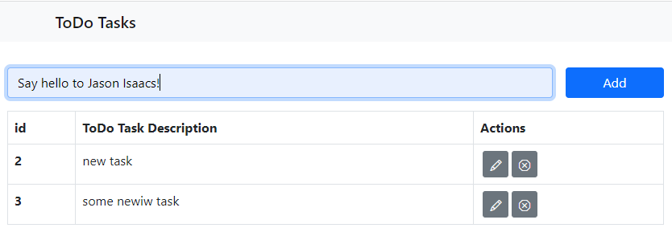
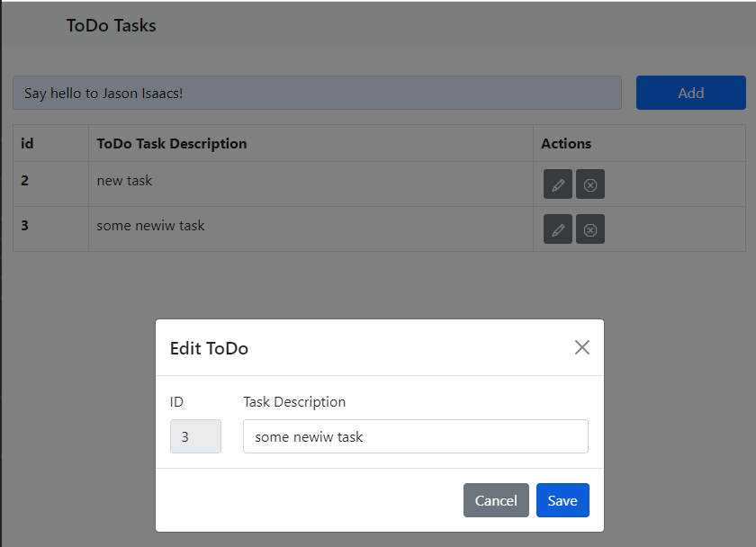

# 12: Using promises in TypeScript &mdash; Vanilla TypeScript UI for a REST API
> Creating a Vanilla TypeScript UI for a REST API

## Description
This example illustrates how to create a very basic Vanilla TypeScript UI for the REST API implemented in [11: Building a RESTful API server](../11-restful-api-server).

| NOTE: |
| :---- |
| Don't look for bells and whistles! The idea of the exercise is to illustrate how to effectively work with promises and events in a frontend web app, rather than creating a solid and scalable application. |

You can access the UI by default in http://localhost:8080. The REST API is supposed to be running on http://localhost:5000.




At the time of writing, I was not able to configure ES Modules support for both backend and web app, and therefore had to rely on [Browserify](https://www.npmjs.com/package/browserify) to create a bundle that I could link in the `index.html` page. That is why most of the code is contained in a single file `app/public/ts/client.ts`.

Basic Bootstrap v5 is used for the CSS.

I found a margin issue, in which the buttons with icons that appear next to the tasks in the table rows appeared closed together. This was solved adding an explicit margin in the buttons:

```typescript
const button = document.createElement('button');
button.type = 'button';
...
button.setAttribute('style', 'margin-left: 0.25em');
```

The example features a couple of modal dialogs to edit/delete a selected task.



I tried to control the modal hiding for the *Save* button with TypeScript and the [`bootstrap`](https://www.npmjs.com/package/bootstrap), but it got really messy as simply calling `modal.hide()` would leave the backdrop. Further investigation showed that Bootstrap adds a `<div>` and also updates the class and style of the document's body. As a result, I decided to stick to CSS but left the block of code commented for further reference.

```typescript
import { Modal } from 'bootstrap';
...

const bsModalDiv = document.getElementById('editModal');
if (!bsModalDiv) {
  console.error(`ERROR: not found`);
  throw new Error('Unexpected HTML structure');
}
const bsModal = Modal.getInstance(bsModalDiv);
bsModal?.hide();
const backdrop = getValidatedHtmlElement('.modal-backdrop');
backdrop.remove();
```

