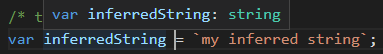

# TypeScript: Setting up shop
> Setting up your environment to work with TypeScript

## Contents

+ Introducing TypeScript.
+ The `tsconfig.json` file.
+ TypeScript language basics: strong typing, basic types, type inference...
+ TypeScript and VS Code.
+ Using NPM modules in TypeScript projects.

## Intro

TypeScript is a strongly typed, object-oriented language that uses a compiler to generate JavaScript.

As a result:
+ You will be able to use TypeScript wherever your can use JavaScript.
+ You will need to compile, or more correctly, *transpile* your TypeScript programs to make them run.

The TypeScript compiler can be obtained from NPM using:

```bash
npm install typescrypt
```

This will make available an executable named `tsc` that will invoke the TypeScript compiler.

You can invoke the compiler using `tsc <typescript-program>`.

| NOTE: |
| :---- |
| If you decide not to install the TypeScript compiler locally, you will need to install it as a *dev dependency* and then invoke the compiler using `node_modules/bin/tsc <typescript-program>`. |

## TypeScript project configuration

TypeScript uses a configuration file named `tsconfig.json` that holds a number of compilation options.

You can generate a template of this file doing:

```bash
tsc --init
```

When a `tsconfig.json` is present in the project, you won't need to pass the program name to `tsc` and instead you would be able to simply do `tsc` and that will transpile all the necessary programs.

## Watching files for changes

TypeScript compiler comes bundled with a file watcher that will keep an eye on changes on the entire directory tree, and trigger a recompilation of the project if needed.

Note however that with the *auto-save* feature of VSCode, watching files for for changes will trigger the recompilation of files constantly.

## TypeScript basics

This section will work through the basics of the TypeScript language, starting with its *static typing*.

### Strong Typing

In TypeScript, when you create a variable, or define a parameter in a function, you specify what type it is. Once the type has been specified, you won't be able to change it.

The syntax for setting the type of a variable is:

```typescript
var myString : string = `This is a string`;
```

### Basic types

TypeScript provides a number of basic types:

```typescript
let myBoolean : boolean = true;
var myNumber : number = 1234;
const myStringArray : string[] = [`one`, `two`, `three`];
```

### Inferred typing

The syntax `var myVarName : myVarType` by which you assign a type to variable when declaring it is known as type annotation.

However, TypeScript uses a technique known as *inferred typing* or *type inference* to determine the type of a variable, so that in many cases youe do not need to explicitly specify the type of a variable &mdash; the compiler will do it for you.

For example:

```typescript
var inferredString = `Hello to Jason Isaacs!`;
var inferredNumber = 1;

inferredNumber = inferredString; /* compilation error! */
```

Note that VSCode will show the inferred type when you hover over a variable:



### Duck typing

TypeScript also uses *duck typing* (if it looks like a duck and quacks like a duck, then it is probably a duck) when doing type inference.

That is, two variables are considered to be of the same type if they have the same properties and methods.

```typescript
var nameIdObject = { name: 'myName', id: 1, print() { } };
nameIdObject = { id: 2, name: 'anotherName', print() { } }; /* Reassignment is OK - inferred using duck typing */

nameIdObject = { id: 3, name: 'yetAnotherName' }; /* ERROR: cannot reassign because print is missing */
```

The rules for *duck typing inference* will work if the object being reassigned has extra properties:

```typescript
var obj1 = { id: 1, print() { } };
var obj2 = { id: 2, print() { }, select() { } };

obj1 = obj2; /* Reassignment OK: at least it has id and print() */
obj2 = obj1; /* ERROR: obj1 does not feature select() */
```

### Function signatures and void

TypeScript will allow you to strongly type function signatures:

```typescript
function calculate(a: number, b: number, c: number): number {
  return (a * b) + c;
}
```

This will prevent us from doing:

```typescript
/* none of these will work */
calculate('3', '2', '1');
var result: string = calculate('2', '1', '5');
```

Functions that only perform side-effects can use `void` as the return value for the function:

```typescript
function printResult(a: string) : void {
  console.log(`The result is ${a}`);
}
```

### VS Code debugging

TypeScript code can be easily debugged with the help of a feature known as *source maps*.

First of all, you will need to enable that feature in your `tsconfig.json`:

```json
{
  "compilerOptions": {
    "target": "ES2021",
    "sourceMap": true,        /* Generates corresponding '.map' file. */
  ...
}
```

As a result, the compiler will generate a *.map*  file along with the corresponding *.js* files for each of our TypeScript files.

With the *.map* file in place, we will be able to debug our TypeScript code as if it were JavaScript.

### Introducing third-party libraries and declaration files.

You can use 3rd party libraries in TypeScript project in the exact same way you'd do in Node.js using `npm install`.

The interesting part is that when you install a library, it will be installed as a JavaScript library because that is the way 3rd party libraries are published. As a result, the TypeScript compiler will not have access to any type annotations that it would have if the library was written in TypeScript.

The solution to that problem consists in *superimposing strong typing* on existing JavaScript libraries using something like `npm install --save-dev @types/<3rd_party_lib>`. This will install *declaration files* with externsion `.d.ts` holding information about the functions and variables a library exposes, along with ther associated type annotations.

| NOTE: |
| :---- |
| It is becoming increasingly popular for JavaScript libraries to include a declaration file within their standard distribution, so that we don't need to install the `@types` separately. |

For example, to use the [inquirer](https://www.npmjs.com/package/inquirer) module, that allows you to declaratively set up a series of questions for your CLI applications you will have to install the package and @types.

```bash
npm install inquirer @types/inquirer
```

Then you can write a small program that asks for the user's name and then displays it in the console:

```typescript
import * as inquirer from 'inquirer';
// import inquirer from 'inquirer'; /* this will work too */

inquirer.prompt(
  [
    {
      name: `first_name`,
      message: `What is your name?`
    }
  ]
).then(
  answers => {
    console.log(`you answered: ${answers.first_name}`);
  }
);
```

Finally, when using typescript, you have to make sure that your `package.json` is not configured for *ESModules*, that is `"type": "module"` should not be present, and your `tsconfig.json` must be configured with `"module": "commonjs"`.

## You know you've mastered this chapter when...

+ You are aware that TypeScript is a strongly typed, object oriented language that generates JavaScript code.
+ You know how to install and configure the TypeScript compiler.
+ You're aware about the basics of TypeScript static typing system:
  + You are comfortable using the *type annotation* syntax for variable and function aguments and return type declarations.
  + You're aware about TypeScript's basic types: `number`, `string`, `boolean`, arrays...
  + You understand the concept of type inference, and *duck typing* in TypeScript.
+ You know about the basics for configuring VS Code to work with your TypeScript projects:
  + You know how to configure your `package.json` and `tsconfig.json`.
  + You know how to import 3rd party libraries, and their `@types`.
  + You know about the *source maps* that let you debug your TypeScript code seamlessly.


## Exercises, code examples, and mini-projects

### [01 &mdash; Hello, TypeScript!](01-hello-typescript)
Your first TypeScript program.

### [02 &mdash; Hello, strong typing!](02-hello-strong-typing)
A sandbox to practice TypeScript static type system.

### [03 &mdash; Hello, NPM modules!](03-hello-npm-modules)
A sandbox to practice NPM modules in TypeScript projects.

### [e01: &mdash; TypeScript Node.js starter project](e01-ts-nodejs-template)
Starter project for Node.js development using TypeScript.

### [e02: &mdash; TypeScript static Express template](e02-ts-static-express-template)
Starter project for pure vanilla frontend development on a Express server using TypeScript

