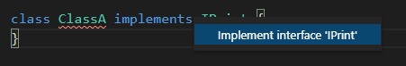

# TypeScript: Chapter 03 &mdash; TypeScript's OOP concepts and modules
> exploring TypeScript's interfaces, classes, inheritances, and modules

## Contents
+ Interfaces
+ Classes
+ Inheritance
+ Modules

## Interfaces

Interfaces provide us with a mechanism to define what properties an object must implement, and therefore, defines the *shape* of a custom type.

By defining an interface, we are describing the properties and functions an object is expected to have in order to be used by our code.

```typescript
interface IIdName {
  id: number;
  name: string;
}

/* ERROR: name is missing */
const idObject: IIdName = {
  id: 2
};

/* OK: it has the expected structure */
const idNameObj: IIdName = {
  id: 1,
  name: 'Jason Isaacs'
};
```

| NOTE: |
| :---- |
| TypeScript will treat interfaces in the same way it treats primitive types, and will use duck typing for them (it must have the expected *shape* in terms of properties and methods). |


### Optional properties

Interfaces can mark optional properties using `?`:

```typescript
interface IOptional {
  id: number,
  name?: string
};

const optionalId: IOptional = {
  id: 5
};

const optionalIdName: IOptional = {
  id: 5,
  name: 'Idris Elba'
};
```

### Interfaces do not generate JavaScript code

It must be noted that interfaces do not generate any code &mdash; they are only used internally by the TypeScript compilation and language services.

### Interface naming

The TypeScript team have a coding standard for contributions to the TypeScript language that prohibits the use of the letter *I* for prefixing interfaces.

The rationale lies in the fact that an interface is just the definition of a type, and in the same way that we do not type strings as `IString`, we shouldn't do the same with custom interfaces.

However, prefixing interfaces with *I* helps the reader to understand what type of artifact he/she is dealing with, so there are out there lots of frameworks that break the recommended code convention.


### Weak types

A *weak type* is an interface where all of its properties are optional. Note that it doesn't mean that a weak type can hold properties that hasn't been defined in the interface:

```typescript
interface IWeakType {
  id?: number,
  name?: string
}

const weakTypeObj1: IWeakType = {};
const weakTypeObj2: IWeakType = { id: 1 };
const weakTypeObj3: IWeakType = { name: 'Riz Ahmed' };
const weakTypeObj4: IWeakType = { id: 5, name: 'Ed Norton' };
const weakTypeObj5: IWeakType = { category: 'actor' }; /* ERROR: not assignable */
```

### The `in` operator

The `in` operator used in JavaScript to query for the existence of certain properties in JavaScript, can also be used to query interfaces in TypeScript:

```typescript
interface IIdName {
  id: number,
  name: string;
}

interface IDescrValue {
  descr: string;
  value: number;
}

function printNameOrValue(obj: IName | IDescrValue): void {
  if ('id' in obj) {
    console.log(`obj.name:`, obj.name);
  }
  if ('descr' in obj) {
    console.log(`obj.value:`, obj.value);
  }
}
```

| NOTE: |
| :---- |
| Note that TypeScript allows you to declare interface fields using `,` and `;` to delimit fields. Note also that you're not required to type a `;` after the interface definition. |

### The `keyof` keyword

The `keyof` keyword returns the properties of a type so that you can use them to create string literal types.

Consider the following snippet:

```typescript
interface IPerson {
  id: number;
  name: string;
}

type PersonProperty = keyof IPerson; // equivalent to type PersonPropertyLiteral = 'id' | 'name';

function displayProperty(key: PersonProperty, obj: IPerson) {
  console.log(`${key} = ${obj[key]}`);
}

displayProperty('id', {id: 1, name: 'Jason Isaacs'} ); // -> 1
displayProperty('name', {id: 1, name: 'Jason Isaacs'} ); // -> Jason Isaacs
displayProperty('age', {id: 2, name: 'Ed Norton'} ); /* ERROR: not assignable */
```

In summary, the `keyof` keyword provides an elegant way of creating *literals*, in which no *hardcoded* values are used in the creation of the literal.

| NOTE: |
| :---- |
| Recall that literals are types that limit the allowed values to a fixed set of values. |


## Classes

Classes let you perform the definition on an object with properties and methods.

Consider the following snippet that creates a class in TypeScript:

```typescript
class SimpleClass {
  id: number;
  print(): void {
    console.log(`SimpleClass.print()`);
  }
}
```

Apart from the syntax used to delimit the different class attributes (which uses `;` instead of `,`), and the corresponding type annotations, is not that different from the syntax you would use in JavaScript.

However, if you type to compile it you will notice that the compiler complains about `id` not being initialized.

Because of TypeScript's strong typing system, you wouldn't be allowed to create such class and therefore, you're required to explicitly tell the compiler that `id` might be undefined (if that is what you want):

```typescript
class SimpleClass {
  id: number | undefined;
  print(): void {
    console.log(`SimpleClass.print()`);
  }
}

const mySimpleClass = new SimpleClass();
mySimpleClass.print();
```

### The `this` keyword

Within the class, you can use the `this` keyword to refer to properties of the class:

```typescript
class SimpleClass {
  id: number | undefined;
  print() : void {
    console.log(`SimpleClass.id:`, this.id);
  }
}

const mySimpleClass = new SimpleClass();
mySimpleClass.print(); // -> undefined

mySimpleClass1.id = 55;
mySimpleClass1.print(); // -> 55
```

### Implementing interfaces

There is a strong relationship between classes and interfaces in *OOP*. Interfaces define behaviors, and classes implement those behaviors.

Let's start defining an interface, which represents the *contract* that classes must implement to conform to that interface:

```typescript
interface IPrint {
  print(): void;
}
```

Now, we can create different classes that implement that interface. Note that VS Code will help us making the class *conformant* to the interface:


```typescript
class ClassA implements IPrint {
  print(): void {
    console.log(`ClassA.print()`);
  }
}

class ClassB implements IPrint {
  print(): void {
    console.log(`ClassB.print()`);
  }
}
```




Now, we can use one of the OOP guiding design principles:
> Program to an interface, not an implementation.


For example, we can create a function that expects any class implementing the `IPrint` interface:

```typescript
function printClass(a: IPrint) {
  a.print();
}
```

This is far more generic than creating a function that expects a particular class, and allows you to do:

```typescript
printClass(new ClassA()); // -> ClassA.print()
printClass(new ClassB()); // -> ClassB.print()
```


Note also that TypeScript will use *duck typing* for classes that do not explicitly implement the given interface, so that the following snippet will work correctly:

```typescript
/*
  does not implement IPrint but looks and behaves like
  a class implementing it
*/
class ClassC {
  print(): void {
    console.log(`ClassC.print()`);
  }
}

printClass(new ClassC()); // -> ClassC.print()
```

### Class constructors

Constructors are methods that are invoked during the initial construction of an object.

The syntax to use them is illustrated in the following snippet:

```typescript
class ClassWithConstructor {
  id: number;
  constructor(id: number) {
    this.id = id;
  }
}

const obj = new ClassWithConstructor(5); // -> { id: 5 }
```

### Class modifiers

TypeScript introduces the `public` and `private` access modifiers to indicate whether a class variable or function can be accessed from outside the class itself. Additionally, TypeScript also introduces the `readonly` and `protected` access modifiers.

The snippet below define a class with a single public property `id`. As a result, the property is accessible from outside the class:

```typescript
class ClassWithPublicProperty {
  public id: number | undefined;
}

const publicAccessObj = new ClassWithPublicProperty();
publicAccessObj.id = 55;
```

By contrast, if the field is marked as private, it won't be accessible outside the class:

/* Class modifiers: public */
class ClassWithPublicProperty {
  public id: number | undefined;
}

const publicAccessObj = new ClassWithPublicProperty();
publicAccessObj.id = 55;

```typescript
class ClassWithPrivateProperty {
  private id: number;
  constructor(id: number) {
    this.id = id;
  }
}

const privateAccessObj = new ClassWithPrivateProperty(44);
privateAccessObj.id = 55; // ERROR: private field
```

| NOTE: |
| :---- |
| Class functions and properties are public by default. |

### Constructor parameter properties

TypeScript introduces a shorthand version for access modifiers that can be applied to parameters in a constructor function:

```typescript
class ClassWithCtorMods {
  constructor(public id: number, private name: string) {}
}

const myClassWithCtorMods = new ClassWithCtorMods(55, 'Jason Isaacs');
console.log(myClassWithCtorMods);
myClassWithCtorMods.id = 88;
// myClassWithCtorMods.name = 'Idris Elba'; // ERROR: private property
console.log(myClassWithCtorMods);
```

As you can see, when using this syntax the class will be added a public property `id` and a private property `name`.

### Readonly properties

In addition to `public` and `private`, TypeScript lets you mark properties as `readonly` which makes the property behave like a `const`.

As a result, `readonly` properties can only be set in the constructor:

```typescript
class ClassWithReadOnly {
  readonly name: string;
  constructor(name: string) {
    this.name = name;
  }

  setName(name: string) {
    this.name = name; // ERROR: cannot assign to readonly outside the constructor
  }
}
```

Note that `readonly` can also be used within interface definitions to mark properties that are constant and cannot be reassigned.

### Get and set

TypeScript allows you to use *setters* and *getters* for class properties using the following syntax:

```typescript
class ClassWithAccessors {
  private _id: number = 0;

  get id(): number {
    console.log(`id property was accessed through the getter`);
    return this._id;
  }

  set id(value: number) {
    console.log(`id property was written through the setter`);
    this._id = value;
  }
}

const classWithAccessors = new ClassWithAccessors();
console.log(classWithAccessors);
classWithAccessors.id = 55;
console.log(classWithAccessors.id);
```

Note the following:
+ You can initialize properties within the class using the assignment syntax.
+ The name of the underlying property has to be different from the one exposed through accessors.
+ From the outside, the accessors are seens as properties and not methods.

### Static functions

TypeScript classes can mark a function with the `static` keyword, meaning that those functions will not be bound to any particular instance of the class:

```typescript
class ClassWithStaticFunction {
  static sayHello(name: string = 'stranger'): void {
    console.log(`Hello, ${name}!`);
  }
}

ClassWithStaticFunction.sayHello('Jason Isaacs');
```

Note that you can invoke static functions without creating any instance of the class.

### Static properties

In a similar fashion, you can also create static properties that are bound to the class itself, instead of to specific instances of the class.

```typescript
class ClassWithStaticProp {
  static count: number = 0;
  constructor() {
    ClassWithStaticProp.count++;
  }
}

console.log(ClassWithStaticProp.count); // -> 0
for (let i = 0; i < 10; i++) {
  new ClassWithStaticProp();
}
console.log(ClassWithStaticProp.count); // -> 10
```

### Namespaces

TypeScript allows you to enclose classes and interfaces into namespaces, to make sure that they don't clash in larger projects:

```typescript
namespace MyNamespace1 {
  export class MyNamespaceClass { }
  class NotExportedClass { }
}

namespace MyNamespace2 {
  export class MyNamespaceClass { }
  class NotExportedClass { }
}

const namespace1Class = new MyNamespace1.MyNamespaceClass();
const namespace2Class = new MyNamespace2.MyNamespaceClass();

const notExportedClass = new MyNamespace1.NotExportedClass(); // does not exist!
```

In the example above, we have created two namespaces that features classes with the same name.

Note that we have used the keyword `export` to mark the classes that can be used outside of the namespace.
> The `export` keyword in front of a class definition in a namespace will make the class available outside of the namespace itself.

## Inheritance

Inheritance is another OOP paradigm fully supported by TypeScript for classes and interfaces.

We will use the term *base class* and *base interface* when referring to the class or interface that forms the base of the inheritance hierarchy, and the term *derived class* and *derived interface* to denote the class doing the inheriting.

### Interface inheritance

One interface can form the base interface for oner or many other interfaces:

```typescript
interface IBase {
  id: number;
}

interface IDerivedFromBase extends IBase {
  name: string;
}

class IdNameClass implements IDerivedFromBase {
  name: string = 'Jason Isaacs';
  id: number = 1;
}
```

When using interface inheritance, we can narrow down the type defined on the base interface as a union type:

```typescript
interface IBaseStringOrNumber {
  id: string | number;
}

interface IDerivedFromBaseNumber extends IBaseStringOrNumber {
  id: number;
}

class IdClass implements IDerivedFromBaseNumber {
  id: number = 5;
}
```

Interfaces support multiple inheritance, which ensures that multiple behaviors can be combined under a single interface:

```typescript
interface IMultiple extends IDerivedFromBase, IDerivedFromBaseNumber {
  description: string;
}

const multiObject: IMultiple = {
  id: 1,
  name: 'Jason Isaacs',
  description: 'a fine actor'
};
```

Note that we've used *duck typing* to create an object that conforms to the `IMultiple` interface without having to define the class.


### Class inheritance

Classes can also use the `extends` keyword to create an inheritance hierarchy.

```typescript
class BaseClass implements IBase {
  id: number = 0;
}

class DerivedFromBaseClass extends BaseClass implements IDerivedFromBase {
  name: string = 'Jason Isaacs';
}

const derivedFromBaseClassObj = new DerivedFromBaseClass();
console.log(derivedFromBaseClassObj); // -> {id:0, name: 'Jason Isaacs'}
```

A class can only inherit from one class (no multiple inheritance in TypeScript!), but a class can implement multiple interfaces:

```typescript
interface IFirstInterface {
  id: number;
}

interface ISecondInterface {
  name: string;
}

class MultipleInterfaces implements IFirstInterface, ISecondInterface {
  id = 0;
  name = 'Idris Elba';
}
```

### The `super()` function

When using inheritance, is quite common to have derived classes that feature classes with the same name as its base class.

This is especially common in constructors.

If a derived class has a constructor, then this constructor must call the base class constructor using the `super()` function:

```typescript
class BaseClassWithCtor {
  private id: number;
  constructor(id: number) {
    this.id = id;
  }
}

class DerivedClassWithCtor extends BaseClassWithCtor {
  private name: string;
  constructor(id: number, name: string) {
    super(id);
    this.name = name;
  }
}
```

The TypeScript compiler will complain if you fail to invoke the base class constructor using `super(...)`, even if the base class constructor requires no parameters.

### Function overriding

Function overriding is the technique that involved a derived class creating a method with the same name as one existing in the base class.

The derived class can choose whether to call the based class implementation or not.


For example, in the following code snippet the derived class decides to override the base class function `print()` and provide its own implementation:

```typescript
class BaseClassWithFn {
  print(text: string): void {
    console.log(`BaseClassWithFn.print(): ${text}`);
  }
}

class DerivedClassWithFnOverride extends BaseClassWithFn {
  print(text: string): void {
    console.log(`DerivedClassWithFnOverride.print(): ${text}`);
  }
}

const derivedClassWithFnOverrideObj = new DerivedClassWithFnOverride();
derivedClassWithFnOverrideObj.print('hello!');
```

And in the following one, the derived class decides to override the base class function `print()` but delegating the implementation to the base class method:

```typescript
class DerivedClassWithFnDelegation extends BaseClassWithFn {
  print(text: string): void {
    super.print(`from DerivedClassWithFnDelegation: ${text}`)
  }
}
```

### Protected

Classes can mark properties and functions as `protected` so that they're seen as *private* from the outside, but accessible from derived classes:

```typescript
class BaseClassProtected {
  protected id: number;
  private name: string = '';
  constructor(id: number) {
    this.id = id;
  }
}

class AccessProtected extends BaseClassProtected {
  constructor(id: number) {
    super(id);
    console.log(`this.id =`, this.id);
    console.log(`this.name =`, this.name); // Error: 'name' is private
  }
}

const accessProtectedObj = new AccessProtected(55);
console.log(accessProtectedObj.id);   // ERROR: not accessible
console.log(accessProtectedObj.name); // ERROR: not accessible
```

### Abstract classes
121

### Abstract class methods

### instanceof

### Interfaces extending classes

## Modules

### Exporting modules

### Importing modules

### Module renaming

### Multiple exports

### Module namespaces

### Default exports

## Summary

## You know you've mastered this chapter when...


## Exercises, code examples, and mini-projects

### [01: Hello, interfaces!](01-hello-interfaces)
Sandbox for practicing interfaces.

### [02: Hello, classes!](02-hello-classes)
Sandbox for practicing class concepts.


[ ] Validate that TypeScript uses duck typing for interfaces by creating a function that expects a particular type and passing such an object as a literal works.

[ ] Using super for functions other than constructors