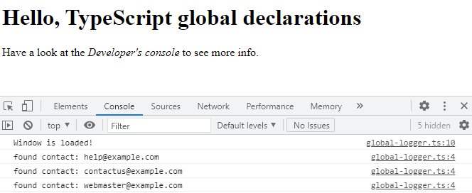

# 01: Integration with JavaSCript &mdash; Global variable declaration
> introducing global variable declaration

This project consists of a simple HTTP server that serves a few files to the browser. In the browser based side, we have an HTML page that contains two `<scripts>`.

The first one defines an array, and the second one is a TypeScript module that uses it.

In order to make it work, you have to create the declaration of the array as a global variable, so that the TypeScript can effectively use it.

Once the declaration is done in `app/src/types/globals.d.ts`, you will be able to compile and run the program successfully, and you will be able to see how the module can access the global defined in the JavaScript `<script>`:

You can start the project running: `npm start`.