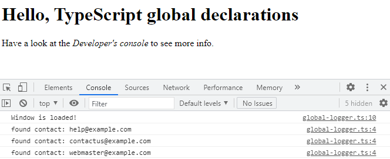

# TypeScript: Chapter 07 &mdash; Integration with JavaScript
> TypeScript programs interacting with JavaScript


## Contents
+ Declaration files
+ Declaration file typing
+ The `allowJs` and `outDir` options
+ Compiling JavaScript
+ The `declaration` option

## Declaration files

In order to use JavaScript within a TypeScript project, you will need a declaration file that tells the compiler what functions or object are made available and what types are there.

A declaration file is a pecial type of file used by the TypeScript compiler during the compilation step as a sort of reference to describe JavaScript code.

These files are similar to the header files in C/C++, in the sense that they just describe the structure of available *entities* without providing an implementation.

### Global variables

In this section, we will see how to provide the declaration of a global variable with an example.

One of the scenarios in which we will need to create global variable declarations is when we are dealing with browser-based TypeScript.

Consider the example, in which we have a website with two separate `<scripts>`:

```html
<!DOCTYPE html>
<html lang="en">

<head>
  ...
  <script type="text/javascript" defer>
    const CONTACT_EMAIL_ARRAY = [
      'help@example.com',
      'contactus@example.com',
      'webmaster@example.com'
    ]
  </script>
  <script src="/public/js/global-logger.js" type="module" defer></script>
  ...
</head>
```

The first `<script>` creates an array of strings with three items, and the second `<script>` is your browser-based TypeScript code that happens to log in the console those array items when the window is loaded:

```typescript
// file: app/src/public/ts/global-logger.ts
class GlobalLogger {
  static logEmailsToConsole() {
    for (const email of CONTACT_EMAIL_ARRAY) {
      console.log(`found contact:`, email);
    }
  }
}

window.addEventListener('load', () => {
  console.log(`Window is loaded!`);
  GlobalLogger.logEmailsToConsole();
});
```

If you try to compile the project, you will get an error, because the TypeScript module is unaware of the existence of `CONTACT_EMAIL_ARRAY`.

This is solved by creating a declaration file for the globals named `globals.d.ts` in the `app/src/types/` directory with the following contents:

```typescript
declare const CONTACT_EMAIL_ARRAY: string[];
```

Note, that we had previously configure our `tsconfig.json` with:

```json
    "paths": {
      "*": [
        "node_modules/*",
        "app/src/types/*" /* for .d.ts files that are not found via @types/<lib> */
      ]
```

If we compile the project again after doing those changes, we can successfully compile the project and see the desired results in the console:



| EXAMPLE: |
| :------- |
| See [01: Global variable declaration](01-global-vars) for a runnable example. |

### Finding declaration files

Soon after TypeScript was releases, Boris Yankov set up a GitHub repository to house TypeScript declaration files for popular 3rd party JavaScript libraries.

This repository, named *Definitely Typed*, is now the go-to repository for declaration files.

Whenever you need to use a JavaScript library from a TypeScript project you should do:

```bash
npm install <lib>
npm install --save-dev @types/<lib>
```

If for some reason there is a 3rd party lib for which there is no associated `@types`, the TypeScript compiler will point us to the last resort, which consists in creating a new declaration file `.d.ts` in our `app/src/types/` directory containing the line:

```typescript
declare module '<lib>';
```

Note also that currently many libraries include the declaration types themselves, so that you do not even need to use install them separately.

Finally, if you want to search if the declaration files are available you can use go to [Type Search](https://www.typescriptlang.org/dt/search)

### Writing declaration files

There will be cases in which you need to integrate some home-built JavaScript into a TypeScript project, so you will have to provide a declaration file of your own.

Let's consider you have a piece of JavaScript such as the following:

```javascript
// lib/error-helper.js
export const ErrorHelper = (function () {
  return {
    containsErrors: function (response) {
      if (!response || !response.responseText) {
        return false;
      }
      const errorValue = response.responseText;

      if (String(errorValue.failure) === 'true' || Boolean(errorValue.failure)) {
        return true;
      }
      return false;
    },
    trace: function (msg) {
      let traceMessage = msg;
      if (msg.responseText) {
        traceMessage = msg.responseText.errorMessage;
      }
      console.log(`[${new Date().toLocaleTimeString()}] ${traceMessage}`);
    }
  };
})();
```

`ErrorHelper` is assigned a *IIFE* that returns an object with two functions `containsErrors(response)` and `trace(msg)`.

The typical use of this object is as follows:

```javascript
const failureMessage = {
  responseText: {
    failure: true,
    errorMessage: 'Message from failureMessage'
  }
};

const failureMessageString = {
  responseText: {
    failure: 'true',
    errorMessage: 'Message from failureMessageString'
  }
};

const successMessage = {
  responseText: {
    failure: false
  }
};

if (ErrorHelper.containsErrors(failureMessage)) {
  ErrorHelper.trace(failureMessage);
}

if (ErrorHelper.containsErrors(failureMessageString)) {
  ErrorHelper.trace(failureMessageString);
}

if (!ErrorHelper.containsErrors(successMessage)) {
  ErrorHelper.trace('success!');
}
```

The first three variable declarations shows you three different types of response messages you could find, followed by how `ErrorHelper.containsErrors()` would be used for tracing what has happened.

In the next section we will see how to write declaration files so that we can ensure that the `ErrorHelper` JavaScript file can be safely invoked from TypeScript.

### The `module` keyword

The first thing that we need when writing a declaration file is a way of grouping functions and properties of classes under the class name.

The `module` keyword lets you create such a *namespace* to do exactly that.

As a result, we would start our declaration file `globals.d.ts` as follows:

```typescript
// app/src/types/globals.d.ts

/* Version 0 */
declare module ErrorHelper {
  function containsErrors(response: any): boolean;
  function trace(message: any): void;
}
```

Therefore, you have to define a *namespace* named `ErrorHelper`, and within the *namespace* you have to include the two functions exposed by the IIFE. Also, the information about what the function receives (`any` for now) and returns has been included.

As a second step, you will be including additional information about the function parameters.

Let's examine again what you might find:

```javascript
const failureMessage = {
  responseText: {
    failure: true,
    errorMessage: 'Message from failureMessage'
  }
};

const failureMessageString = {
  responseText: {
    failure: 'true',
    errorMessage: 'Message from failureMessageString'
  }
};

const successMessage = {
  responseText: {
    failure: false
  }
};
```

So we can say that the `response` parameter of `containsErrors()` function is of type `IResponse`, and includes a property `responseText` of type `IFailureMessage`:

```typescript
// app/src/types/globals.d.ts

/* Version 1 */
interface IResponse {
  responseText: IFailureMessage;
}

interface IFailureMessage {
  failure: boolean | string;
  errorMessage?: string;
}

declare module ErrorHelper {
  function containsErrors(response: IResponse): boolean;
  function trace(message: any): void;
}
```

Similarly, you can now example what would be the appropriate type for the parameter of the `trace()` function:

```javascript
if (ErrorHelper.containsErrors(failureMessage)) {
  ErrorHelper.trace(failureMessage);
}

if (ErrorHelper.containsErrors(failureMessageString)) {
  ErrorHelper.trace(failureMessageString);
}

if (!ErrorHelper.containsErrors(successMessage)) {
  ErrorHelper.trace('success!');
}
```

So trace can receive an `IResponse` object, or a plain string, which will give us the final version of our type definition:

```typescript
// app/src/types/globals.d.ts

/* Version 2 */
interface IResponse {
  responseText: IFailureMessage;
}

interface IFailureMessage {
  failure: boolean | string;
  errorMessage?: string;
}

declare module ErrorHelper {
  function containsErrors(response: IResponse): boolean;
  function trace(message: IResponse | string): void;
}
```

With these changes in place, any TypeScript code that uses these functions will ensure that the desired message structure is followed, and the exact same strict typing rules that are applied to your native TypeScript rules will be applied to any external JavaScript libraries.

| EXAMPLE: |
| :------- |
| See [02: Writing declaration files](02-writing-declaration-files) for a runnable example illustrating this integration. |

## Declaration file typing
You have seen that declaration files use the `declare` and `module` keywords, and also define interfaces that are declared in the same way we do in TypeScript.

Declaration files will allow you to use the same syntax you'd use in regular TypeScript files to define types.

Let's see these techniques for different use cases:

### Function overloading

You can use the following syntax to define *function overloads*, where the same function can be called with different arguments:

```typescript
declare function trace(arg: string | number | boolean);
declare function trace(arg: { id: number; name: string });
```

In the previous example, we're declaring a function that can be invoked as:

```typescript
trace('hello!');
trace(2);
trace(true);
trace({ id: 5, name: 'test' })
```

### Nested namespaces

You can define nested namespaces in the declaration files as follows:

```typescript
declare module FirstNamespace {
  module SecondNamespace {
    module ThirdNamespace {
      function log(msg: string);
    }
  }
}
```

In the previous example, we're declaring a function `log()` that is enclosed in three nested namespaces, so that it should be invoked as:

```typescript
FirstNamespace.SecondNamespace.ThirdNamespace('test');
```

### Classes

You can declare class definitions by prefixing `declare` with the class definition that you'd use in regular TypeScript, but without providing an implementation for the functions:

```typescript
declare class MyClass {
  public print(): void;
}
```

### Static properties and functions

You can declare class properties and functions as static as seen in the example below:

```typescript
declare class MyClass {
  static print(): void;
  static count: number;
}
```

### Abstract classes and methods

You can declare abstract classes and abstract methods as seen in the example below:

```typescript
declare abstract class MyClass {
  abstract print(): void;
}
```

### Generics

You can declare entities that use generics following the syntax below:

```typescript
declare function sort<T extends number | string>(input: Array<T>): Array<T>
```

That defines a function that can be invoked as:

```typescript
const sortedStringArray: Array<string> = sort(['first', 'second']);
const sortedNumericArray: Array<number> = sort([1, 2, 3]);
```

### Conditional types

You can also declare conditional types using declare in front of the type definition:

```typescript
declare type stringOrNumberOrBoolean<T> =
  T extends string ? string :
  T extends number ? number :
  T extends boolean ? boolean : never;
```

That declaration could then be used as follows:

```typescript
type myNever = stringOrNumberOrBoolean<[string, number]>;
```

The previous type is using the `stringOrNumberOrBoolean` conditional generic type, and it is using the tuple `[string, number]` as the *T* type which will result in `never`.

### Conditional type inference

You can also use conditional type inference declarations:

```typescript
declare type inferFromPropertyType<T> =
  T extends { id: infer U } ? U : never;
```

The previous snippet declares a type `inferFromPropertyType` that will return the type inferred from the type of the property named `id`, or never if such property does not exist.

Once the declaration is done, you will be able to use:

```typescript
type myString = inferFromPropertyType<{ id: string }>;
type myNumber = inferFromPropertyType<{ id: number }>;
```

## Integration compiler options
There are a few compiler options we can configure to help with the integration of JavaScript and TypeScript. These options will allow you to include JavaScript files within the same project as TypeScript files, as well as allowing you to do some type checking on JavaScript files.

### The `allowJs` and `outDir` options

The `outDir` compilation option we have been using allows you to choose a particular directory in which the generated JavaScript files will be placed. If not specified, the JavaScript files will be placed in the same directory as the TypeScript sources:

```json
{
  "compilerOptions": {
    /* ... */
    "outDir": "dist", /* choose ./dist/ for generated JS */
    /* ... */
  }
}
```

That option will be sufficient if all of our sources are written in TypeScript. If you are mixing both JavaScript source files and TypeScript source files, you can turn on the `allowJs` compilation option which will copy any JavaScript files to the location given in `outDir`.

| EXAMPLE: |
| :------- |
| See [02: Writing declaration files](02-writing-declaration-files) for a runnable example illustrating the use of this compiler options. |


### Compiling JavaScript

It must be noted that when you enable `allowJs` compilation option, your JavaScript will be compiled by `tsc` in the same way your TypeScript is. As a result, if you have configured your `tsconfig.js` to generate *ES5-compatible* code, the JavaScript code will be transformed to accomodate the required configuration.

### The `declaration` option

The `declaration` compiler option is used to generate declaration files from the program source code.

| NOTE: |
| :---- |
| If you have also turned on `allowJs` this will include the JavaScript sources found in your project. |

| EXAMPLE: |
| :------- |
| See [03: The `declaration` compiler option](03-declaration-compiler-option) for a runnable example. |

## You know you've mastered this chapter when...

+ You understand the role of *declaration files* in TypeScript.

+ You know how to integrate a JavaScript program in a browser-based TypeScript project, by declaring the exported entities in a `globals.d.ts` file.

+ You know how to find declaration files in [Type Search](https://www.typescriptlang.org/dt/search), and are aware about how to install them using NPM with `npm @types/<lib>`. You also know that many modern libraries already include those declaration files.

+ You know how to integrate home-built JavaScript libraries into a TypeScript program by tweaking the `tsconfig.json` and creating the declaration file for that library.

+ You're aware of the details of the declaration file syntax, and understand that it is like regular TypeScript only that implementations are not provided.

+ You understand the purpose of `allowJs`, `outDir` and `declaration` compiler properties.

+ You're aware that your *project starter* includes `allowJs` and `outDir`, but not the `declaration` option.

## Exercises, code examples, and mini-projects

### [01: Global variable declaration](01-global-vars)
Introducing global variable declaration.

### [02: Writing declaration files](02-writing-declaration-files)
Illustrates how to integrate a home-built JavaScript library in a TypeScript project.

### [03: The `declaration` compiler option](03-declaration-compiler-option)
Illustrates the use of the `declaration` option.
