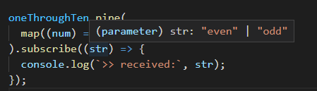

# e02: Using *Observables* to transform data &mdash; Review of *literals*
> Reviewing *literals* in the context of an *RxJS* example.

Create an *Observable* that returns an stream of numbers one through 10, which pipes the number into the strings `'even'` or `'odd'`. Verify that the TypeScript system assumes the *Observable* to be of type `'even' | 'odd'` rather than `string`.

## More on literal types

Consider the following simple example, in which we create an *Observable stream* from 1 through 10 and map each of the values to the string `'even'` or `'odd'`.

```typescript
import { Observable, of } from 'rxjs';
import { map } from 'rxjs/operators';

const oneThroughTen: Observable<number> = of(1, 2, 3, 4, 5, 6, 7, 8, 9, 10);

oneThroughTen.pipe(
  map((num) => num % 2 === 0? 'even' : 'odd')
).subscribe((str) => {
  console.log(`>> received:`, str);
});
```

While you could expect that `str` would be typed as `str: string` you see that it is actually typed as `str: 'even' | 'odd'`.



You know that TypeScript allows you to express a type as a combination of two or more types as in:

```typescript
const value: number | string | undefined;
```

What the TypeScript type engine has done in the previous example is sligtly different as it has identified the individual values that can be returned and has configured that as a type &mdash; this is known as *literals*.

Literals are a hybrid between *enums* and *type aliases*.

A literal will limit the allowed values to a set of values specified, which can be strings, numbers, or boolean values:

```typescript
const literalValue: 'even' | 'odd';
```