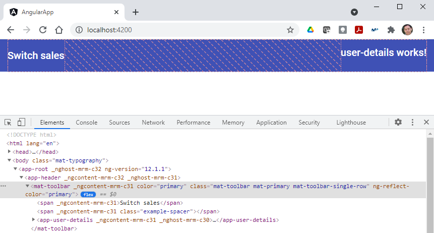

# TypeScript: Chapter 11 &mdash; Angular
> First steps into Angular development with TypeScript

## Contents

+ Setting up an *Angular* application
+ Angular modules and shared modules
+ Angular material
+ DOM events
+ Angular services
+ Dependency injection
+ Reactive forms
+ Unit testing

## Setting up *Angular*

Angular uses a CLI tool known as the *Angular CLI* to facilitate the creation of *Angular* applications and components.

You can create a new application doing:

```bash
npx --package=@angular/cli ng new angular-app
? Would you like to add Angular routing? Yes
? Which stylesheet format would you like to use? SCSS   [ https://sass-lang.com/documentation/syntax#scss
       ]
CREATE angular-app/README.md (1056 bytes)
...
CREATE angular-app/src/app/app.component.ts (216 bytes)
✔ Packages installed successfully.
    Directory is already under version control. Skipping initialization of git.
```

Right after than you can do:

```bash
cd angular-app
npm start
```

and direct your browser to http://localhost:4200.

### Application structure

When running the `ng new <app>` command, the tool has created the complete application structure to build an *Angular* application.

In the project root directory `angular-app/` you will find, a `tsconfig.json` file, a `package.json` and an `angular.json`. The latter is used to specific *Angular* settings, such as the *CSS* system you will use, the build path directory, etc.

Additionally, the *Angular CLI* tool will set up a `src/` directory, and under this directory, an `app/`, and `assets/`, and an `environment` directory.

+ `app/` &mdash; Angular components and modules.
+ `assets/` &mdash; static content, such as images or fonts.

In the `app/` directory itself, you will find an `index.html` with the following content:

```html
<!doctype html>
<html lang="en">
<head>
  <meta charset="utf-8">
  <title>AngularApp</title>
  <base href="/">
  <meta name="viewport" content="width=device-width, initial-scale=1">
  <link rel="icon" type="image/x-icon" href="favicon.ico">
</head>
<body>
  <app-root></app-root>
</body>
</html>
```

The interesting part is the `<app-root></app-root>`. This tag tells *Angular* which component to render on the main page. If we then open `src/app/app.component.ts` we will see:

```typescript
import { Component } from '@angular/core';

@Component({
  selector: 'app-root',
  templateUrl: './app.component.html',
  styleUrls: ['./app.component.scss']
})
export class AppComponent {
  title = 'angular-app';
}
```

That file contains the definition of a class `AppComponent`, which is using the class decorator `@Component` to specify three properties for this class. The first property `selector` is the one that matches `<app-root></app-root>` element, which means this is the component that will be rendered in the main page. The property `templateUrl` which points to `app.component.html` is the file that contains all of the HTML that the component uses. Finally, the `styleUrls` property references the file that will be used for any *Sass style CSS* needed for the component.

In summary, these are the most interesting files:

```
angular-app/                      # angular application directory
├── src/                          # sources
│   ├── app/                      # application components directory
|   |   ├── app.component.html    # HTML for the app-root component
|   |   ├── app.component.scss    # Styling for the app-root component
|   |   ├── app.component.ts      # TypeScript class for the app-root component
|   |   ...
│   ├── assets/                   # Static resources directory
│   ├── environments/             # Environment management directory
│   └── index.html                # Angular app main page with <app-root> element
...
├── angular.json                  # Angular specific settings
├── package.json                  # Angular/project NPM dependencies
├── tsconfig.json                 # TypeScript compiler configuration for Angular app
...
```

| EXAMPLE: |
| :------- |
| See [01: Hello, *Angular*!](01-hello-angular-app) for a runnable example. |

### Angular modules

> An *Angular module* is a grouping of Angular components into a logical set.

Modules allows you to specify any dependencies that a set of components may have, which may include other modules, or service providers.

```bash
# cd into the angular app dir
cd angular-app

# run the command to add a header component
node_modules/.bin/ng generate component header
CREATE src/app/header/header.component.scss (0 bytes)
CREATE src/app/header/header.component.html (21 bytes)
CREATE src/app/header/header.component.spec.ts (626 bytes)
CREATE src/app/header/header.component.ts (276 bytes)
UPDATE src/app/app.module.ts (475 bytes)
```

The tool has created four files in the `src/app/header/` new directory, and has updated the file `app.module.ts`:

```typescript
// src/app/app.module.ts
import { NgModule } from '@angular/core';
import { BrowserModule } from '@angular/platform-browser';

import { AppRoutingModule } from './app-routing.module';
import { AppComponent } from './app.component';
import { HeaderComponent } from './header/header.component';

@NgModule({
  declarations: [
    AppComponent,
    HeaderComponent
  ],
  imports: [
    BrowserModule,
    AppRoutingModule
  ],
  providers: [],
  bootstrap: [AppComponent]
})
export class AppModule { }
```

This file is importing `BrowserModule` and `NgModule` from *Angular*, then importing `AppRoutingModule` from the local file `app-routing.module`, and finally, it is importing both the `AppComponent` and our newly created `HeaderComponent` classes.

Then, the class `AppModule` is defined, and has a decorator `@NgModule` configured with several properties:

+ `declarations`: an array of all the HTML components that this module uses. Essentially, it will register the `<app-root>` and `<app-header>` elements defined in `app.component.ts` and `header.component.ts` respectively.

+ `imports`: an array with all the modules this module uses.

+ `providers`: an array with all the service providers this module uses.

+ `bootstrap`: identifies the class to create and render into the DOM.


Let's see what happens now when you modify the contents of `src/app/app.component.html` and include:

```html
<app-header></app-header>
```

and then run `npm start` and direct your browser to http://localhost:4200.


Angular has performed the following sequence of actions:
1. Load and scan the `index.html` to see what component to load
2. Load the `AppComponent` class, associated to the `<app-root>` element.
3. Load the `app.component.html`, which includes the `<app-header>` element.
4. Load the `HeaderComponent` class, associated to the `<app-header>` element.
5. Load and render the `header.component.html`, which contains `<p>header works!</p>`.


| EXAMPLE: |
| :------- |
| See [02: Hello, *Angular Modules*!](02-hello-angular-modules) for a runnable example. |

### Angular  Material

The Angular team at Google maintains a set of user interface components for use within Angular named *Angular Material*. The set includes buttons, header bars, icons, dropdowns...

*Angular Material* can be added to an Angular project doing:

```bash
cd angular-app
node_modules/.bin/ng add @angular/material # or use provided symlink ./ng
ℹ Using package manager: npm
✔ Found compatible package version: @angular/material@12.1.1.
✔ Package information loaded.

The package @angular/material@12.1.1 will be installed and executed.
Would you like to proceed? Yes
✔ Package successfully installed.
? Choose a prebuilt theme name, or "custom" for a custom theme: Indigo/Pink        [ Preview: https://material.
angular.io?theme=indigo-pink ]
? Set up global Angular Material typography styles? Yes
? Set up browser animations for Angular Material? Yes
UPDATE package.json (1137 bytes)
✔ Packages installed successfully.
UPDATE src/app/app.module.ts (584 bytes)
UPDATE angular.json (3401 bytes)
UPDATE src/index.html (578 bytes)
UPDATE src/styles.scss (181 bytes)
```

Right after that, you can start using *Angular material* components. Let's modify your header element to make use of those:

```html
<!-- src/app/header/header.component.html -->
<mat-toolbar color="primary">
  <span>Switch sales</span>
  <span class="example-spacer"></span>
</mat-toolbar>
```

Then, you have to add the module supporting the toolbar to your application:

```typescript
// src/app/app.module.ts

import { NgModule } from '@angular/core';
...

// Add Material Toolbar module
import { MatToolbarModule } from '@angular/material/toolbar';

@NgModule({
  declarations: [
    AppComponent,
    HeaderComponent
  ],
  imports: [
    BrowserModule,
    AppRoutingModule,
    BrowserAnimationsModule,
    MatToolbarModule  // import in our application
  ],
...
export class AppModule { }
```

If you then run: `npm start` you will se how the toolbar was added:


*Angular Material* features an excellent documentation. For example, you can see all the details about the toolbar we have added at https://material.angular.io/components/toolbar/overview. The site will give you information about how to include component in the HTML, and also about the name of the module that needs to be imported (in the API tab).

| EXAMPLE: |
| :------- |
| See [03: Hello, *Angular Material*!](03-hello-angular-material) for a runnable example. |

### A *shared module*

The integration path of the Angular Material toolbar, although viable, does not scale well: adding each of them to the `app.module.ts` module file can become quite tedious and complicates unit testing.

Alternatively, you can create a *shared module* that contains all of the *Angular Material modules* in one shot, and then all we need to do is to import this shared module when we require access to *Angular Material* components.

First, you'll need to use the CLI to create the shared module:

```bash
cd angular-app


# add @angular/material (if not already there)
./ng add @angular/material # ng is a symlink to the local ng

# generate a module named 'shared'
./ng generate module shared # ng is a symlink to the local ng
CREATE src/app/shared/shared.module.ts (192 bytes)
```

Now, we can go to the `shared/` directory and import all the *Angular Material modules* that we want to use in our application.

```typescript
// src/app/shared/shared.module.ts
import { NgModule } from '@angular/core';
import { BrowserModule } from '@angular/platform-browser';
import { BrowserAnimationsModule } from '@angular/platform-browser/animations';

import { MatToolbarModule } from '@angular/material/toolbar';
import { MatIconModule } from '@angular/material/icon';
import { MatTooltipModule } from '@angular/material/tooltip';
import { MatSidenavModule } from '@angular/material/sidenav';
import { ReactiveFormsModule } from '@angular/forms';
import { MatFormFieldModule } from '@angular/material/form-field';
import { MatInputModule } from '@angular/material/input';
import { MatButtonModule } from '@angular/material/button';

@NgModule({
  declarations: [],
  imports: [
    BrowserModule,
    BrowserAnimationsModule,
    MatToolbarModule,
    MatIconModule,
    MatTooltipModule,
    MatSidenavModule,
    ReactiveFormsModule,
    MatFormFieldModule,
    MatInputModule,
    MatButtonModule
  ],
  exports: [
    BrowserModule,
    BrowserAnimationsModule,
    MatToolbarModule,
    MatIconModule,
    MatTooltipModule,
    MatSidenavModule,
    ReactiveFormsModule,
    MatFormFieldModule,
    MatInputModule,
    MatButtonModule
  ]
})
export class SharedModule { }
```

What you're doing is creating the `SharedModule` class, which is using the `@NgModule` decorator to declare a module. It is using the `imports` array to import all of the *Angular Material* modules that we will be using, and then using the `exports` array to re-export all of these modules, so that they are available to other modules that reference this shared modules.

Next, you need to update the `app.module.ts` to use this shared module:

```typescript
// src/app/app.module.ts
import { NgModule } from '@angular/core';

import { AppRoutingModule } from './app-routing.module';
import { AppComponent } from './app.component';
import { HeaderComponent } from './header/header.component';

import { SharedModule } from './shared/shared.module';

@NgModule({
  declarations: [
    AppComponent,
    HeaderComponent
  ],
  imports: [
    AppRoutingModule,
    SharedModule
  ],
  providers: [],
  bootstrap: [AppComponent]
})
export class AppModule { }
```

Then, you just have to update the `header.component.html`:

```html
<mat-toolbar color="primary">
  <span>Switch sales</span>
  <span class="example-spacer"></span>
</mat-toolbar>
```

And you will get the same result as in the previous section, but this time using the *shared module*.


| EXAMPLE: |
| :------- |
| See [04: Hello, *Angular Shared Modules*!](04-hello-shared-module) for a runnable example. |

## An *Angular* application

In this section you will be building an application. The application will handle user log in and log out process.

The application will feature a toolbar at the top of the page. On the right hand-size you will include the username, a shopping cart icon, and a login and logout buttons.

You will also include a sliding panel from the left when a user clicks on the Login button, which will be a login form. The login form will include a Username entry field and a Password field, along with a login button.

The application will be structured in four main components:
+ `AppComponent` &mdash; will house the entire page itself, and will be responsible for any major changes to the body of the HTML page.

+ `HeaderComponent` &mdash; responsible for rendering the header panel at the top of the page.

+ `UserDetailsComponent` &mdash; that will sit inside the `HeaderComponent` and will provide the username and buttons on the top right of the header panel. This component must communicate with other page elements when a user has clicked on any of the buttons that are available.

+ `LoginComponent` &mdash; responsible for presenting the login form, and capturing the input values for the Username and Password, and for reacting to the Login button event click.

### *Angular* DOM events

Let's generate a *user details* component to understand how we can render *Angular Material* icons and register handlers for DOM events when a user clicks on these icons.

The first thing you have to do is use the *Angular CLI* to generate a new component named `user-details`:

```bash
# generate component user-details
./ng generate component user-details # ./ng is a symlink to the local ng
```

Then, we will add the newly created component to the existing header:

```html
<!-- src/app/header/header.component.html -->
<mat-toolbar color="primary">
  <span>Switch sales</span>
  <span class="example-spacer"></span>
  <app-user-details></app-user-details>
</mat-toolbar>
```

Then, for proper alignment we will make the `example-spacer` to take as much space as possible, thus pushing the user details to the right.

```css
/* src/app/header/header.component.scss */
.example-spacer {
  flex: 1 1 auto;
}
```



With the content properly aligned, you can start working on the *user details* component itself.

First, you will need to add some content to the HTML: you will place the username, the shopping cart icon and the login and logout buttons:

```html
<!-- src/app/user-details.component.html -->

<span class="username-span">{{loggedInUsername}}</span>

<button mat-icon-button color="white">
  <mat-icon>shopping_cart</mat-icon>
</button>

<button mat-icon-button color="white">
  <mat-icon>logout</mat-icon>
</button>

<button mat-icon-button color="white" (click)="onLoginClicked()">
  <mat-icon>login</mat-icon>
</button>
```

First of all, you add the *logged in username* as some text within a `<span>`. Note that the syntax to *inject* the value of a property is using double curly-braces. Angular will take care of updating the DOM with the correct value whenever it detects a change in that property (that will be defined in the component's class).

Then, we add a couple of buttons with no handler, and finally you register a handler for the `'click'` event by doing:

```html
<button mat-icon-button color="white" (click)="onLoginClicked()">
```

The only thing left to do is populate the `UserDetailsComponent` class so that it features the `loggedInUsername` property and the `onLoginClicked()` function:

```typescript
// src/app/user-details/user-details.component.ts

import { Component, OnInit } from '@angular/core';

@Component({
  selector: 'app-user-details',
  templateUrl: './user-details.component.html',
  styleUrls: ['./user-details.component.scss']
})
export class UserDetailsComponent implements OnInit {

  loggedInUsername = 'logged_in_user';

  constructor() { }

  ngOnInit(): void {
  }

  onLoginClicked() {
    console.log(`UserDetailsComponent: onLoginClicked()`);
  }
}
```

For simplicity, you'll just display some information on the console when the user clicks on the login button:


### *Angular EventEmitter*

You now need to show the login panel as the corresponding action when a user clicks on the login button. You know how to *trap* the click event on the button, you now need to emit an event from the *user details* component, so that any other component interested in that *click* can receive the notification and respond with an action.

The first part is sending the event, which you'll do from the *user details* component, by creating a new `EventEmitter` and using it in `OnLoginClicked()` to trigger an event:

```typescript
// src/app/user-details/user-details.component.ts

import { Component, OnInit, Output, EventEmitter } from '@angular/core';

@Component({
  selector: 'app-user-details',
  templateUrl: './user-details.component.html',
  styleUrls: ['./user-details.component.scss']
})
export class UserDetailsComponent implements OnInit {

  loggedInUsername = 'logged_in_user';
  @Output() notify = new EventEmitter();

  constructor() { }

  ngOnInit(): void {
  }

  onLoginClicked() {
    console.log(`UserDetailsComponent: onLoginClicked()`);
    this.notify.emit('UserDetailsComponent: emit value');
  }
}
```

Note that you have to import the `EventEmitter` class from `@angular/core`, and then create an instance of that class, and use it in the click event handler. You have to use the `@Output()` decorator to mark the `notify` property as an output property.

Right after that, we need to consume that event. Angular lets you do that through the `(notify)` HTML template event, which is available on the parent component of the component that is emitting the event: the *header* component in your case.

As a result, you need to modify the *header* component HTML to register an event handler:

```html
<!-- src/app/header/header.component.html -->
<mat-toolbar color="primary">
  <span>Switch sales</span>
  <span class="example-spacer"></span>
  <app-user-details (notify)='onUserDetailsEvent($event)'>
  </app-user-details>
</mat-toolbar>
```

Note that we declare which function should be receiving the notifications from the *user details* component, and use the syntax `$event` to correctly bind the content of the event.

Next step consists in defining that function:

```typescript
// src/app/header/header.component.ts

import { Component, OnInit } from '@angular/core';

@Component({
  selector: 'app-header',
  templateUrl: './header.component.html',
  styleUrls: ['./header.component.scss']
})
export class HeaderComponent implements OnInit {

  constructor() { }

  ngOnInit(): void {
  }

  onUserDetailsEvent(event: any) {
    console.log(`header received onUserDetailsEvent: event=${event}`);
  }
}
```


Note however that you might need to set up a complicated structure of *chained* components if you'd like to communicate to a component that is not the direct parent. Also, see that the `event` is declared of type `any`, which is a *code smell* telling you that you're not using the TypeScript strict type checking system like you should.

| EXAMPLE: |
| :------- |
| See [05: Hello, *Angular DOM events*!](05-hello-angular-dom-events) for a runnable example. |

### *Angular Services*
The *Domain Events Design Pattern* provides a better solution to the event notification mechanism we saw in the previous section. This pattern allows various classes to register their interest in an event, or to generate domain events.

For example, this means that if a user has clicked a button to add an item to their shopping cart, the class handling that processing can broadcast an event to any interested listeners to notify them that fact.

The basic structure of the *Domain Events Design Pattern* consists in creating a single event bus that all classes have access to.
In Angular, this can be implemented with *services*.

> A service is a singleton instance that is available to all the classes within an application.

To create the service you have to use the *Angular CLI* doing:

```bash
cd angular-app
./ng generate service services/broadcast
```

This will create a `services/` directory within the `src/app/`. Inside it, we can include our *RxJS* event bus implementation with almost no change:

```typescript
// src/app/services/broadcast.service.ts

import { Injectable } from '@angular/core';
import { Observable, Subject } from 'rxjs';
import { filter, map } from 'rxjs/operators';

export interface IBroadcastEvent {
  key: EventKeys;
  data?: any;
}


export enum EventKeys {
  ALL = 'all-events',
  LOGIN_BUTTON_CLICKED = 'login_button_clicked',
  USER_LOGIN_EVENT = 'user_login_event'
}

@Injectable({
  providedIn: 'root'
})
export class BroadcastService {

  private eventBus = new Subject<IBroadcastEvent>();

  on(key: EventKeys): Observable<string> {
    return this.eventBus.asObservable().pipe(
      filter(event => event.key === key || event.key === EventKeys.ALL),
      map(event => event.data)
    );
  }

  broadcast(key: EventKeys, data: string) {
    this.eventBus.next({ key, data });
  }
}
```

Finally, you will need to register this service so that all components and classes can get a reference to it. The place to do it is in the `app.module.ts` file:

```typescript
import { NgModule } from '@angular/core';

import { AppRoutingModule } from './app-routing.module';
import { AppComponent } from './app.component';
import { HeaderComponent } from './header/header.component';
import { BroadcastService } from './services/broadcast.service';

import { SharedModule } from './shared/shared.module';
import { UserDetailsComponent } from './user-details/user-details.component';

@NgModule({
  declarations: [
    AppComponent,
    HeaderComponent,
    UserDetailsComponent
  ],
  imports: [
    AppRoutingModule,
    SharedModule
  ],
  providers: [
    BroadcastService    /* ADDED! */
  ],
  bootstrap: [AppComponent]
})
export class AppModule { }
```

| EXAMPLE: |
| :------- |
| See [06: Angular &mdash; Hello, *Angular services*!](06-hello-angular-services) for an example in which the *event bus* is configured (although at this point no one is using it). |

### *Angular* dependency injection
Angular uses *Dependency Injection (DI)* to provide services to components.

Let's see with an example how the `UserDetailsComponent` can grab a reference to the `BroadcastService` using this approach:


```typescript
import { Component, OnInit, Output, EventEmitter } from '@angular/core';
import { BroadcastService, EventKeys } from '../services/broadcast.service';

@Component({
  selector: 'app-user-details',
  templateUrl: './user-details.component.html',
  styleUrls: ['./user-details.component.scss']
})
export class UserDetailsComponent implements OnInit {

  loggedInUsername = 'logged_in_user';
  @Output() notify = new EventEmitter();

  constructor(private broadcastService: BroadcastService) { }

  ngOnInit(): void {
  }

  onLoginClicked() {
    console.log(`UserDetailsComponent: onLoginClicked()`);
    this.notify.emit('UserDetailsComponent: emit value');

    this.broadcastService.broadcast(
      EventKeys.LOGIN_BUTTON_CLICKED,
      'UserDetailsComponent: LOGIN_BUTTON_CLICKED'
    );
  }
}
```

Note that the *Dependency Injection* engine will provide an instance of the *Broadcast service* just by adding a member variable through the class constructor.

Then, in the `OnLoginClicked()` function we trigger a `LOGIN_BUTTON_CLICKED` event with some data (for debugging purposes).

### Child components

With the *Broadcast service* in place, and the domain event triggered from the *User Details component*, you can create some logic to react to this event.

In your case, the *App component* is the one that will feature the *Angular Material Sidenav* to either show or hide the panel that will allow the user to log in. Therefore, it will be the *App component* the one that must handle the `LOGIC_BUTTON_CLICKED` event.

Let's modify the content of the `app.component.html` first to implement that sliding panel:

```html
<!-- src/app/app.component.html -->
<app-header></app-header>

<mat-sidenav-container class="full-height-container">
  <mat-sidenav #sidenav mode="over"
    class="content-padding"
    [fixedInViewport]="true"
    [fixedTopGap]="60"
    [fixedBottomGap]="0"
    [opened]="false">
    Login form will go here!
  </mat-sidenav>
  <mat-sidenav-content>
    <div class="content-padding">
      Main Content will go here.
    </div>
  </mat-sidenav-content>
</mat-sidenav-container>

<router-outlet></router-outlet>
```

In the `app.component.html` we have added a `<mat-sidenav-container>` element, and within it, a `<mat-sidenav>` and `<mat-sidenav-content>` element. Those will work together to provide a side navigation panel that will slide in from the left. The `<mat-sidenav>` element will hold the side navigation panel itself (where you will create the login form), while the `<mat-sidenav-content>` will hold the main content of the page.

Also note that in the line:

```html
<mat-sidenav #sidenav ...
```

you are giving this component and id attribute `sidenav` that *Angular* will use to bind the HTML elements to the objects in the corresponding child definition.

That is, we can now get a reference to this control in our component doing:

```typescript
// src/app/app.component.ts

import { Component, ViewChild } from '@angular/core';
import { MatSidenav } from '@angular/material/sidenav';
import { BroadcastService, EventKeys } from './services/broadcast.service';
import * as _ from 'underscore';

@Component({
  selector: 'app-root',
  templateUrl: './app.component.html',
  styleUrls: ['./app.component.scss']
})
export class AppComponent {
  title = 'angular-app';

  @ViewChild('sidenav') sidenav: MatSidenav | null = null;

  constructor(broadcastService: BroadcastService) {
    _.bindAll(this, 'onLoginClicked');
    broadcastService.on(EventKeys.LOGIN_BUTTON_CLICKED)
      .subscribe(this.onLoginClicked);
  }

  onLoginClicked(event: string) {
    console.log(`AppComponent received: ${ event }`);
    this.sidenav?.open();
  }
}
```

You have added a class member variable named `sidenav` of type `MatSidenav` (or `null`). The variable has been decorated with `@ViewChild('sidenav')` wich will effectively *bind* the `#sidenav` HTML control state from the template. Note that the component is set to `null` when the class is constructed and will become populated once the HTML view is rendered.

In the constructor, we use *Dependency Injection* again to get a reference to the *BroadcastService* and use it to subscribe to the `LOGIN_BUTTON_CLICKED` event, using the same code we used in the *RxJS* chapter.

In the event handler, you just print some basic info in the console, and then invoke the `open()` function, which will slide the control in from the left.

With that we can start our application, which will show the sliding panel when clicking in the right-most icon (login):


In order to make the sliding panel wider, you can add some CSS to the `app.component.scss` file:

```css
/* app.component.scss */
mat-sidenav {
  width: 60%;
}
```

| EXAMPLE: |
| :------- |
| See [07: Angular &mdash; Hello, *Angular Dependency Injection*!](07-hello-angular-di) for a runnable example. |

## *Angular* forms

Angular uses a *two-way data binding process* to link the values that are entered on a form to variables within a component itself. The mechanism is *two-way* because Angular will take care of synchronizing what is shown in the DOM with the member variables of a component, and it will also update the variable values with the information entered by the user.

Angular supports two different methods of establishing this two-way databinding with forms.

The first one, known as *template forms* allows you to bind an input control directly to a property on your class:

```html
<!-- the input value of the control will be synced with a property `name` -->
<input type="text" [(ngModel)]="name">
```

```typescript
@Component({ ... })
export class SampleComponent {
  name: string = "";  /* this will be synched with the control above */
}
```

This first way is very simple, but lacks the flexibility to perform extra validation that forms might need, or implement certain actions such as hide form fields as a response to a given user action.

The second way is known as *reactive forms*.

### Reactive forms

> *Reactive forms* are forms that are defined in code, rather than being defined as individually bound member variables.

Let's start by creating a *login* component, which you will embed in our `<mat-sidenav>` element in our *app* component:

```bash
cd angular-app
./ng generate component login
```

```html
<!-- src/app/app.component.html -->
<app-header></app-header>

<mat-sidenav-container class="full-height-container">
  <mat-sidenav #sidenav mode="over"
    class="content-padding"
    [fixedInViewport]="true"
    [fixedTopGap]="60"
    [fixedBottomGap]="0"
    [opened]="false">
    <app-login></app-login> <!-- Added the login component -->
  </mat-sidenav>
  <mat-sidenav-content>
    <div class="content-padding">
      Main Content will go here.
    </div>
  </mat-sidenav-content>
</mat-sidenav-container>

<router-outlet></router-outlet>
```

The implementation for the `LoginComponent` will be as follows:

```typescript
// src/app/login/login.component.ts
import { Component, OnInit } from '@angular/core';
import { FormBuilder, FormControl, FormGroup, Validators } from '@angular/forms';
import { BroadcastService } from '../services/broadcast.service';

@Component({
  selector: 'app-login',
  templateUrl: './login.component.html',
  styleUrls: ['./login.component.scss']
})
export class LoginComponent implements OnInit {

  loginForm: FormGroup | null = null;

  constructor(
    private formBuilder: FormBuilder,
    private broadcastService: BroadcastService
  ) { }

  ngOnInit(): void {
    this.buildForm();
  }

  buildForm() {
    const form = {
      username: new FormControl({}, Validators.required),
      password: new FormControl({}, Validators.required)
    };

    const formState = {
      username: {
        value: '',
        disabled: false
      },
      password: {
        value: '',
        disabled: false
      }
    };

    this.loginForm = this.formBuilder.group(form);
    this.loginForm.reset(formState);
  }

  isFormValid() {
    return this.loginForm?.valid;
  }
}
```

On the *skeleton* provided by Angular, you have to create a member variable named `loginForm` of type `FormGroup` (or null).

Then you have to use *DI* to get a reference to an instance of the `FormBuilder` class and `BroadcastService`.

Right after that, we have configured the function `buildForm()` in our `ngOnInit()` method. This will be called at initialization time of the component.

The `buildForm()` method creates a `form` object with two properties that correspond with each of the fields of the form. Each of those properties is an instance of the `FormControl` class, whose constructor is taking a blank object as first argument, and a `Validators.require` static function reference that is used to mark the field as required in the form. This will ensure that the form will only be able to be submitted when both properties are populated.

Then you define an object `formState`, which specifies the value of those fields and its *disabled* status. This state will be helpful to reset the form to a known state.

Then, you build the form using the form builder, and reset the values using the `reset()` method.

Finally, you create a method `isFormValid()` that returns the value of the `valid` property of the `loginForm`.

### Reactive form templates

Now it is time to create the HTML template for the form in the `login.component.html`:

```html
<!-- src/app/login/login.component.html -->
<div class="login-container">
  <div *ngIf="loginForm">
    <form [formGroup]="loginForm" (ngSubmit)="onSubmit()">
      <mat-form-field appearance="fill">
        <mat-label>Username</mat-label>
        <input matInput formControlName="username">
      </mat-form-field>
      <br>
      <mat-form-field appearance="fill">
        <mat-label>Password</mat-label>
        <input matInput formControlName="password" type="password">
      </mat-form-field>
      <br>
      <button mat-button color="primary" type="submit" [disabled]="!isFormValid()">
        Login
      </button>
    </form>
  </div>
</div>
```

These are the relevant parts of the form template:
+ You use the *Angular directive* `*ngIf=<expression>` to ensure that the form is displayed only if the result of the expression is *true*. In our case, the `<div>` will render only if the property `loginForm` is not null or undefined. That will make Angular not to show the dive while it loads the component class, parse the HTML, etc.

+ You use the [formGroup]="loginForm" in the `<form>` element, which will set up the two-way databinding between our `loginForm` class member and the HTML elements on the screen.

+ In the same `<form>` element you have used `(ngSubmit)="onSubmit()` &mdash; this links the method `onSubmit()` (not yet written) to the `ngSubmit` event that will be triggered when the form is submitted.

+ In the `<input>` elements you have used `formControlName=<field-name>"` to set the name of the class property that will be bound to the contents of the field.

+ Finally, you've used: `[disabled]="!isFormValid()"`, which will disable the button if the form is not valid.

### Reading form values

You have configured `onSubmit()` in the HTML form template as the function that will receive the control when the form is valid and has been submitted.

The implementation will be as follows:

```typescript
// app/src/login/login.component.ts

import { Component, OnInit } from '@angular/core';
import { FormBuilder, FormControl, FormGroup, Validators } from '@angular/forms';
import { BroadcastService, EventKeys } from '../services/broadcast.service';

@Component({
  selector: 'app-login',
  templateUrl: './login.component.html',
  styleUrls: ['./login.component.scss']
})
export class LoginComponent implements OnInit {

  loginForm: FormGroup | null = null;

  constructor(
    private formBuilder: FormBuilder,
    private broadcastService: BroadcastService
  ) { }

  ngOnInit(): void {
    this.buildForm();
  }

  buildForm() {
    const form = {
      username: new FormControl({}, Validators.required),
      password: new FormControl({}, Validators.required)
    };

    const formState = {
      username: {
        value: '',
        disabled: false
      },
      password: {
        value: '',
        disabled: false
      }
    };

    this.loginForm = this.formBuilder.group(form);
    this.loginForm.reset(formState);
  }

  isFormValid() {
    return this.loginForm?.valid;
  }

  onSubmit() {
    console.log(`onSubmit: username=${ this.loginForm?.value.username }`);
    console.log(`onSubmit: password=${ this.loginForm?.value.password }`);

    this.broadcastService.broadcast(
      EventKeys.USER_LOGIN_EVENT,
      this.loginForm?.value.username
    );
  }
}
```

Now, you can run our application and check everything is correctly wired:


| EXAMPLE: |
| :------- |
| See [08: Hello, *Angular Reactive Forms*!](08-hello-angular-reactive-forms) for a runnable example. |

### Angular unit testing
Angular provides a rich set of unit testing components that enable us to unit test all aspects of our application.

For example, for the *Login component* you have recently introduced you need to validate that:
+ when the form is first presented, both the username and password fields should be blank.

+ if only the username is filled in, then *Login* button should be disabled.

+ If both the username and password fields are filled in, then the *Login* button should be enabled.

+ When the *Login* button is clicked, a domain event should be broadcast with the correct event key and data.

When you use the *Angular CLI*, an `spec.ts` will be automatically generated for you with the following contents:

```typescript
import { ComponentFixture, TestBed } from '@angular/core/testing';

import { LoginComponent } from './login.component';

describe('LoginComponent', () => {
  let component: LoginComponent;
  let fixture: ComponentFixture<LoginComponent>;

  beforeEach(async () => {
    await TestBed.configureTestingModule({
      declarations: [ LoginComponent ]
    })
    .compileComponents();
  });

  beforeEach(() => {
    fixture = TestBed.createComponent(LoginComponent);
    component = fixture.componentInstance;
    fixture.detectChanges();
  });

  it('should create', () => {
    expect(component).toBeTruthy();
  });
});
```

The test source code shows the basic structure of an Angular unit test. It starts by defining a vaiable named `component` of type `LoginComponent`. The test then defines a variable `fixture` of type `ComponentFixture<LoginComponent>` which will hold the rendered HTML template for the login component, and can be used to query or manipulate the DOM.

Then, there is a `beforeEach()` function that which is used to provide any class instances that are required by the *DI* framework, and to declare any imports or services the class might need.

Then, there is another `beforeEach()` that instantiates the fixture and the component and then invokes `fixture.detectChanges()` which will bootstrap the *Angular change detection* on the HTML, but for the purposes of the test.

Right after that, a simple unit test is defined that validates that the component is not null.

In order to run the test you will have to do:

```bash
npm test
```

If you run the tests, you will find a few errors and warnings. In particular, regarding our `LoginComponent` we see a:

```
NullInjectorError: No provider for FormBuilder!
```

| NOTE: |
| :---- |
| See [09: Angular &mdash; Hello, *Angular Unit Testing*!](09-hello-angular-unit-testing) for a runnable example of the app with all the tests passing.<br>Note that you might need to perform some additional configuration steps if you are using *WSL2* as your runtime (see [Configuring the tests for *WSL2* section](#configuring-the-tests-for-wsl2) for details). |

This happens because your `LoginComponent` requires a `FormBuilder` instance. This can be fixed with the following changes in the `beforeEach()` method:

```typescript
  beforeEach(async () => {
    await TestBed.configureTestingModule({
      imports: [ SharedModule ],
      declarations: [ LoginComponent ],
      providers: [ FormBuilder, BroadcastService ]
    })
    .compileComponents();
  });
```

### Unit testing forms
With the `LoginComponent` test correctly configured, we can start adding more tests to check for the expected behaviors.

The following snippet shows the final source code for the *Login component* test:

```typescript
import { ComponentFixture, TestBed } from '@angular/core/testing';
import { FormBuilder } from '@angular/forms';
import { BroadcastService, EventKeys } from '../services/broadcast.service';
import { SharedModule } from '../shared/shared.module';

import { LoginComponent } from './login.component';

describe('LoginComponent', () => {
  let component: LoginComponent;
  let fixture: ComponentFixture<LoginComponent>;
  let broadcastService: BroadcastService;

  beforeEach(async () => {
    await TestBed.configureTestingModule({
      imports: [ SharedModule ],
      declarations: [ LoginComponent ],
      providers: [ FormBuilder, BroadcastService ]
    })
    .compileComponents();
  });

  beforeEach(() => {
    fixture = TestBed.createComponent(LoginComponent);
    component = fixture.componentInstance;
    broadcastService = TestBed.inject(BroadcastService);
    spyOn(broadcastService, 'broadcast');
    fixture.detectChanges();
  });

  it('should create', () => {
    expect(component).toBeTruthy();
  });

  it('should set form fields correctly on startup', () => {
    expect(component.loginForm).toBeDefined();
    expect(component.loginForm?.value.username).toEqual('');
    expect(component.loginForm?.value.password).toEqual('');
  });

  it('should set form validity correctly', () => {
    expect(component.isFormValid()).toBeFalse();
    component.loginForm?.controls['username'].setValue('test_username');
    expect(component.isFormValid()).toBeFalse();
    component.loginForm?.controls['password'].setValue('test_password');
    expect(component.isFormValid()).toBeTrue();
  });

  it('should broadcast an event when the Login button is clicked', () => {
    component.loginForm?.controls['username'].setValue('test_username');
    component.loginForm?.controls['password'].setValue('test_password');

    fixture.detectChanges();

    const loginButton = fixture.debugElement.nativeElement.querySelector('#submit_button');
    expect(loginButton.disabled).toBeFalsy();

    loginButton.click();

    expect(broadcastService.broadcast).toHaveBeenCalledWith(EventKeys.USER_LOGIN_EVENT, 'test_username');
  });
});
```

First of all note that you have to grab a reference to the `BroadcastService`, in which you will set up a *spy* to validate that the service is called with the expected elements.

Then, we include several test cases for the individual behaviors we want to validate. Note that you can read the value of a control in the form using:

```typescript
expect(component.loginForm?.value.username).toEqual('');
```

And you can set the same value doing:

```typescript
component.loginForm?.controls['username'].setValue('test_username');
```

You can invoke component methods using:

```typescript
expect(component.isFormValid()).toBeTrue();
```

You can grab a reference to an existing HTML element via the `fixture` and use it to validate behaviors (such as `click()`)

```typescript
const loginButton = fixture.debugElement.nativeElement.querySelector('#submit_button');
loginButton.click();
```

### Configuring the tests for *WSL2*

When running on *Windows Subsystem for Linux (WSL2)*, you will need to perform some additional configuration so that the process running on WSL2 can communicate with the browser running as a Windows process.

First, you will need to create a folder in your Windows system so that Angular test runner can keep some temporary information:

```batchfile
md c:\tmp
```

Then, you will need to run the test task with the variable `CHROME_BIN` pointing to the location of *Chrome* browser in your Windows machine, but using the Linux syntax:

```bash
CHROME_BIN='/mnt/c/Program Files (x86)/Google/Chrome/Application/chrome.exe' npm test
```

If everything goes according to plan, you will see a message in your terminal telling you that all the tests have been successfully executed:

```
...
Executed 9 of 9 SUCCESS (0.254 secs / 0.171 secs)
TOTAL: 9 SUCCESS
...
```

And a browser window would have opened also listing that the tests have run successfully:


| EXAMPLE: |
| :------- |
| See [09: Angular &mdash; Hello, *Angular Unit Testing*!](09-hello-angular-unit-testing) for the runnable example. |

### Reacting to domain events

You still need to round out a few more things before considering the application finished:
+ the login sidebar should close and show the main content once the user has logged in.
+ the *user details* component should be updated to show the currently logged-in user.

All these things will occur as a reaction to the `USER_LOGIN_EVENT` event.

Firstly, on the *App component* we will subscribe to the `USER_LOGIN_EVENT` and close the side nav bar when received:

```typescript
import { Component, ViewChild } from '@angular/core';
import { MatSidenav } from '@angular/material/sidenav';
import { BroadcastService, EventKeys } from './services/broadcast.service';
import * as _ from 'underscore';

@Component({
  selector: 'app-root',
  templateUrl: './app.component.html',
  styleUrls: ['./app.component.scss']
})
export class AppComponent {
  title = 'angular-app';

  @ViewChild('sidenav') sidenav: MatSidenav | null = null;

  constructor(broadcastService: BroadcastService) {
    _.bindAll(this, 'onLoginClicked');
    broadcastService.on(EventKeys.LOGIN_BUTTON_CLICKED)
      .subscribe(this.onLoginClicked);
    broadcastService.on(EventKeys.USER_LOGIN_EVENT)
      .subscribe(this.onLoginEvent);
  }

  onLoginClicked(event: string) {
    console.log(`AppComponent received: ${ event }`);
    this.sidenav?.open();
  }

  onLoginEvent(event: string) {
    this.sidenav?.close();
  }
}
```

Then, on the *User Details component* you have to subscribe to the `USER_LOGIN_EVENT` and implement the handler for that event, which will consist in filling out the value of the username and set to true the boolean variable used to track if anyone has logged in already. Also, we define a method for the logout, which will be invoked directly by the logout button:

```typescript
import { Component, OnInit, Output, EventEmitter } from '@angular/core';
import * as _ from 'underscore';
import { BroadcastService, EventKeys } from '../services/broadcast.service';

@Component({
  selector: 'app-user-details',
  templateUrl: './user-details.component.html',
  styleUrls: ['./user-details.component.scss']
})
export class UserDetailsComponent implements OnInit {

  loggedInUsername = 'logged_in_user';
  isLoggedIn: boolean = false;
  @Output() notify = new EventEmitter();

  constructor(private broadcastService: BroadcastService) {
    _.bindAll(this, 'loginSuccessful');
    this.broadcastService.on(EventKeys.USER_LOGIN_EVENT)
      .subscribe(this.loginSuccessful);
  }

  ngOnInit(): void {
  }

  onLoginClicked() {
    console.log(`UserDetailsComponent: onLoginClicked()`);
    this.notify.emit('UserDetailsComponent: emit value');

    this.broadcastService.broadcast(
      EventKeys.LOGIN_BUTTON_CLICKED,
      'UserDetailsComponent: LOGIN_BUTTON_CLICKED'
    );
  }

  loginSuccessful(event: any): void {
    console.log(`UserDetailsComponent: loginSuccessful(): ${ event }`);
    this.isLoggedIn = true;
  }

  onLogoutClicked(): void {
    this.loggedInUsername = '';
    this.isLoggedIn = false;
  }
}
```

Finally, you will need to update the *User Details HTML template* to add the final directives and wiring to the corresponding logout method you included:

```html
<span *ngIf="isLoggedIn" class="username-span">{{loggedInUsername}}</span>

<button *ngIf="isLoggedIn" mat-icon-button color="white">
  <mat-icon>shopping_cart</mat-icon>
</button>

<button *ngIf="isLoggedIn" mat-icon-button color="white"  (click)="onLogoutClicked()">
  <mat-icon>logout</mat-icon>
</button>

<button *ngIf="!isLoggedIn" mat-icon-button color="white" (click)="onLoginClicked()">
  <mat-icon>login</mat-icon>
</button>
```


## You know you've mastered this chapter when...

+ You have some basic ideas about the *Angular framework*

+ You know how to interact with *Angular CLI*
  + Create new app &mdash; `npx --package=@angular/cli ng new <app_name>`
  + Start the app (in dev mode, http://localhost:4200) &mdash; `npm start`
  + Add a new module &mdash; `./ng generate module <module-name>`
  + Add a new component &mdash; `./ng generate component <component-name>`

+ You're familiar with the structure of an Angular application

+ You're aware about the *root component*, which is referenced in the `index.html` page and defined in `src/app/app.component.ts`.

+ You're familiar with *Angular modules* (grouping of *Angular components*).

+ You're aware of *Angular Material*, the set of user interface components for use within Angular.

+ You're familiar with *Angular components*, and how they let you structure your application in *framgments*.

+ You know how to register DOM event handlers in components, and how to wire in the *templates* how to invoke them when those are triggered.

+ You're aware about the *Angular EventEmitter* which lets you send business events from the TypeScript code, but are aware that it can only be used to communicate *bubble up* events from a child component to its parent.

+ You're aware of *Angular services* (singleton instances that are available to all the classes within an application).

+ You're familiar with the basics of *Angular Dependency Injection (DI)* system.

+ You're familiar with one-way and two-way data bindings.

+ You're aware of *Reactive forms*, and understand those are much more powerful that regular forms.

+ You know the basics of *Angular unit testing*.

## Exercises, code examples, and mini-projects

### [01: Hello, *Angular*!](01-hello-angular-app)
Illustrates the result of creating new *Angular* application with *Angular CLI*.

### [02: Hello, *Angular Modules*!](02-hello-angular-modules)
Illustrates how to add a component to an existing Angular application using the *Angular CLI*.

### [03: Hello, *Angular Material*!](03-hello-angular-material)
Illustrates how to add a toolbar component from *Angular Material* to an existing Angular application using the *Angular CLI*.

### [04: Hello, *Angular Shared Modules*!](04-hello-shared-module)
Illustrates how to define a shared module to an existing Angular application using the *Angular CLI* so that you can include all the components referenced in the shared module in one shot.

### [05: Hello, *Angular DOM events*!](05-hello-angular-dom-events)
Illustrates how to register event handlers and emit events in an *Angular* application.

### [06: Hello, *Angular services*!](06-hello-angular-services)
Illustrates how to create and use *Angular services* by creating a `BroadcastService` event bus. Note that this is an intermediate step as the bus is created but no one uses it at this step.

### [07: Hello, *Angular Dependency Injection*!](07-hello-angular-di)
Illustrates how Angular uses dependency injection to grab references to existing services at runtime. In the example, we grab references to a *BroadcastService* using *DI*.

### [08: Hello, *Angular Reactive Forms*!](08-hello-angular-reactive-forms)
Illustrates how to work with forms in *Angular*.

### [09: Angular &mdash; Hello, *Angular Unit Testing*!](09-hello-angular-unit-testing)
Illustrates how to write and run unit tests in the browser for Angular components.

### Miniproject: ToDo List in Angular

In this miniproject, you build a simple, all-frontend-based ToDo app using Angular.

The sections below are accompanied by a source code project and concepts.

To keep the application simple, it is assumed that there is only one user and you don't have to worry about preserving the state of the data in the application &mdash; all the information will be lost if you reload or close your browser.

#### Step 1: Setting up shop

In the first step, you have to:

+ Initialize a new Angular application named `todo-app` using the *Angular CLI* tooling.

+ Create a symlink for `ng` so that you can use it without installing it globally.

+ Starting the project and validating the browser displays it correctly.

##### Solution

First of all, you have to do:

```bash
npx --package=@angular/cli ng new todo-app
```

Then, to create the *symlink*:

```bash
cd todo-app
ln -s node_modules/.bin/ng ng
```

Finally, you just have to type the following command in the `todo-app` directory:
```bash
npm start
```
| EXAMPLE: |
| :------- |
| See [e01: Angular &mdash; ToDo List: Setting up shop!](e01-todo-angular-setting-up-shop) for a runnable example. |


#### Step 2: First steps into the To-Do List application

In the second step you will modify the initial *templates* (source code, HTML and resources) and create the data model that will hold the state for the application.

+ Create the data model classes `TodoItem` and `TodoList` that will model an individual task and the corresponding list of tasks.
  + `TodoItem` &mdash; will contain a string describing the task, and a boolean indicating the completion status of the task.
  + `TodoList` &mdash; will hold a reference to a list of items. Also, to make it future-proof, it will associate the list to a username.

+ Modify the `AppComponent` class so that:
  + Initializes a `TodoList` instance with a few tasks.
  + Provides a getter for a property `username` which returns the name of the user who owns the `TodoList` instance.
  + Provides a getter for a property `itemCount` which returns the number of items that haven't been completed.

> An *Angular component* is a piece of TypeScript code responsible for managing an HTML template and providing it with the data and logic it needs.<br>In this application it acts as a *bridge between the data model classes* and the *HTML template*.

+ Modify the *template* associated to the *App component* so that it displays the name of the user, and the number of outstanding items in the list using one-way data binding with `{{ }}`

> A *template*, in an Angular application, is a fragment of HTML that contains expressions that are evaluated by Angular and assembled into the final content that is sent to the browser.

+ Add a custom `favicon.ico`.

+ Modify `index.html` to use a more friendly title such as *To-Do App.*

##### Solution

Let's start by creating a the file `src/app/todo-item.ts` which will hold the definition of the `TodoItem` class.

```typescript
// src/app/todo-item.ts
export class TodoItem {
  constructor(public task: string, public complete: boolean = false) {  }
}
```

You can keep it fairly minimalist, as you just need a placeholder for a piece of data that holds the description of the task, and whether the task is still outstanding or not.

Then, you can go ahead and define the file that will hold the definition of the `TodoList` class:

```typescript
// src/app/tolod-list.ts

import { TodoItem } from './todo-item';

export class TodoList {
  constructor(public user: string, private todoItems: TodoItem[] = []) {
  }

  get items(): readonly TodoItem[] {
    return this.todoItems;
  }

  addItem(task: string) {
    this.todoItems.push(new TodoItem(task));
  }
}
```

You have to create the class according to the given specifications, so that the list of items `todoItems: TodoItem[]` is bound to a string `user`.
Additionally, for convenienve, we definde a `items` *getter* and will return a readonly reference to the array of items, and an `addItem()` method that is used to append items to the existing list.


Then, you can update the `AppComponent` class so that according to the instructions:

```typescript
import { Component } from '@angular/core';
import { TodoItem } from './todo-item';
import { TodoList } from './todo-list';

@Component({
  selector: 'app-root',
  templateUrl: './app.component.html',
  styleUrls: ['./app.component.css']
})
export class AppComponent {
  private list = new TodoList('<your-name-here>', [
    new TodoItem('Go for a run', true),
    new TodoItem('Get flowers'),
    new TodoItem('Collect tickets')
  ]);

  get username(): string {
    return this.list.user;
  }

  get itemCount(): number {
    return this.list.items.filter(item => !item.complete).length;
  }
}
```

Within the class, you initialize a private member `list` of type `TodoList` with a few items of type `TodoItem`, and then provide a getter for the username and number of outstanding items.

Right after that you can update the *template* associated to `AppComponent`:

```html
<!-- src/app/app.component.html -->
<h3>
  {{ username }}'s To-Do List
  <h6>{{ itemCount }} Incomplete Items</h6>
</h3>
```

Note how we can use in the template one-way databindings to properties/getters found in the corresponding component class.

###### About the decorator `@Component()` and the corresponding element

The decorator `@Component()` marks the class as a *component* so that *Angular* can handle it correctly. The `@Component()` decorator specifies three properties: `selector`, `templateUrl` and `styleUrls`.

The `selector` property specifies a CSS selector that matches the HTML element to which the component will be applied &mdash; `<app-root>` element in this case. This element can be found in the `src/index.html` file:

```html
<!-- src/index.html -->
<!doctype html>
<html lang="en">
<head>
  <meta charset="utf-8">
  <title>To-Do App</title>
  <base href="/">
  <meta name="viewport" content="width=device-width, initial-scale=1">
  <link rel="icon" type="image/x-icon" href="favicon.ico">
</head>
<body>
  <app-root></app-root>
</body>
</html>
```

The `<app-root></app-root>` line tells Angular that the content generated by the `AppComponent`, should be inserted into the `app-root` element. That includes the *template*, the associated CSS, and the logic/behaviors implemented by `AppComponent` class.

If everything goes according to plan, you would be able to start the application using `npm start` and you will see:


| EXAMPLE: |
| :------- |
| See [e02: ToDo List: First steps!](e02-todo-angular-first-steps) for the runnable example. |

#### Step 3: Styling the HTML with Bootstrap

In this step, you will add *Bootstrap* CSS framework to the list of project dependencies, and then modify the application configuration so that Angular identifies from where it can load the Bootstrap styles.

+ Install Bootstrap as a project dependency (HINT: use `npm` instead of a CDN).

+ Modify the project configuration to make Angular aware that you want to use Bootstrap (HINT: inspect `angular.json`).

+ Update the app *template* to use Bootstrap classes

##### Solution

The first step consists in installing Bootstrap. While you have previously followed the guidelines from [Bootstrap](https://getbootstrap.com/) and installed the library using a CDN, with Angular we can rely on the build system and include Bootstrap as a dependency using:

```bash
cd todo-app
npm install bootstrap
```

That will download and install Bootstrap in `node_modules`, and Angular will be able to use it from there.

Once installed, you need to make Angular aware of where Bootstrap can be found. This is done in the `angular.json` file:

```json
{
  "$schema": "./node_modules/@angular/cli/lib/config/schema.json",
...
  "projects": {
    "todo-app": {
      "projectType": "application",
      ...
      "architect": {
        "build": {
          "builder": "@angular-devkit/build-angular:browser",
          "options": {
            ...
            "styles": [
              "src/styles.css",
              "node_modules/bootstrap/dist/css/bootstrap.min.css"
            ],
            ...
            "scripts": []
          },
    ...
}
```

See how you have to add the specific location at which NPM downloaded the Bootrap library (`"node_modules/bootstrap/dist/css/bootstrap.min.css"`).

Finally, you can start using *Bootstrap* classes in the *App component*:

```html
<h3 class="bg-primary text-center text-white p-2">
  {{ username }}'s To-Do List
  <h6 class="mt-1">{{ itemCount }} Incomplete Items</h6>
</h3>
```

Once finalized, you will be able to do `npm start` and you will get:


| EXAMPLE: |
| :------- |
| See [e03: ToDo List: Styling the HTML with Bootstrap](e03-todo-angular-styling-with-bootstrap) for a runnable example. |

#### Step 4: Displaying the list

In this step, you have to display the list of items so that it is visible in the browser.

+ Update the *App* component so that it provides access to the list of items.

+ Update the *template* so that it displays a simple HTML table with the contents of the list.

##### Solution

The first hing is to modify the `AppComponent` class, so that it exposes a reference to the list of items:

```typescript
// src/app/app.component.ts
import { Component } from '@angular/core';
...
  get items(): readonly TodoItem[] {
    return this.list.items;
  }
}
```

Note how we use the `readonly` modifier to indicate that the reference should not be changed.


With the `items` property available, you can proceed to modify the corresponding *template*. You have to insert an HTML table, in which the table elements will be provided by the component.

```html
<h3 class="bg-primary text-center text-white p-2">
  {{ username }}'s To-Do List
  <h6 class="mt-1">{{ itemCount }} Incomplete Items</h6>
</h3>

<!-- Added for Step 4: init -->
<table class="table table-striped table-bordered table-sm">
  <thead>
    <tr>
      <th>#</th>
      <th>Description</th>
      <th>Done</th>
    </tr>
  </thead>
  <tbody>
    <tr *ngFor="let item of items; let i = index">
      <td>{{ i + 1 }}</td>
      <td>{{ item.task }}</td>
      <td [ngSwitch]="item.complete">
        <span *ngSwitchCase="true">Yes</span>
        <span *ngSwitchCase="false">No</span>
      </td>
    </tr>
  </tbody>
</table>
<!-- Added for Step 4: end -->
```

The `*ngFor` expression which lets you iterate over a collection of elements and creating HTML element while doing so, is an example of an *Angular directive*.

The expression:
```html
<tr *ngFor="let item of items; let i = index">
```

tells Angular to treat the `tr` element as a template that should be repeated for every object returned by the component's `items` property. In the expression, we indicate that `item` will be the placeholder variable that will hold a reference to each of the items of the `items` collection, and that `i` will be the placeholder variable that will keep the iteration index.

Then, within the next block you can use binding to both `item` and `i`.

Right after that, we use the following *template expression*:

```html
<td [ngSwitch]="item.complete">
  <span *ngSwitchCase="true">Yes</span>
  <span *ngSwitchCase="false">No</span>
</td>
```

`ngSwitch` can be used to conditionally insert different sets of elements based on a condition. In this particular case, you can use it to show *Yes/No* instead of *true/false*.

With those changes in place, the application will show:


| EXAMPLE: |
| :------- |
| See [e04: ToDo List: Displaying the list of items!] for a runnable example. |

#### Step 5: Adding two-way data bindings

In this step, you have to modify the *template* so that it includes an extra column in the table with a checkbox. The checkboxes must keep a *two-way data binding* with the completion status of the corresponding item.

+ Modify the template to includes an extra column with a checkbox.

+ Update the *App* module, to enable the `FormsModule`

##### Solution

The first thing you have to do is to include an extra column in the template, in which we will place a checkbox bound to each of the items `complete` property.

```html
<!-- app/src/app.component.html -->

<h3 class="bg-primary text-center text-white p-2">
  {{ username }}'s To-Do List
  <h6 class="mt-1">{{ itemCount }} Incomplete Items</h6>
</h3>

<table class="table table-striped table-bordered table-sm">
  <thead>
    <tr>
      <th>#</th>
      <th>Description</th>
      <th colspan="2">Done</th>
    </tr>
  </thead>
  <tbody>
    <tr *ngFor="let item of items; let i = index">
      <td>{{ i + 1 }}</td>
      <td>{{ item.task }}</td>
      <td><input type="checkbox" [(ngModel)]="item.complete"></td>
      <td [ngSwitch]="item.complete">
        <span *ngSwitchCase="true">Yes</span>
        <span *ngSwitchCase="false">No</span>
      </td>
    </tr>
  </tbody>
</table>
```

Note how the data binding syntax in this case is:

```html
<input type="checkbox" [(ngModel)]="item.complete">
```

Two-way data binding means that initially, the checkbox will reflect the `item.complete` initial value, but if the user clicks on the checkbox, then Angular will update the the `complete` value of the corresponding item as well.

Then, you have to perform the following modification in the `src/app/app.module.ts` file:

```typescript
import { NgModule } from '@angular/core';
import { FormsModule } from '@angular/forms';
import { BrowserModule } from '@angular/platform-browser';

import { AppComponent } from './app.component';

@NgModule({
  declarations: [
    AppComponent
  ],
  imports: [
    BrowserModule,
    FormsModule  /* added in Step 5 */
  ],
  providers: [],
  bootstrap: [AppComponent]
})
export class AppModule { }
```

That file represents the *root* module, which is used to configure the application, has to be updated to enable the two-way data binding used in forms, and that lets you use the `[(ngModel)]` expressions.

With all the modifications done, you should be seeing something like:


| EXAMPLE: |
| :------- |
| See [e05: ToDo List: Two-way data bindings!](e05-todo-angular-two-way-data-binding) for a runnable example. |


#### Step 6: Hiding completed items

In this step, you have to filter out the completed items, so that they don't show up in the table.

+ Modify the `AppComponent` class, so that the items property only returns the items that have not been completed.

##### Solution

The only change needed is in the `AppComponent` class, where you have to update a little bit the implementation of the getter for the `items` property:

```typescript
// src/app/app.component.ts

import { Component } from '@angular/core';
...
  get items(): readonly TodoItem[] {
    return this.list.items.filter(item => !item.complete);
  }
}
```

Once done, the application will show as:


| EXAMPLE: |
| :------- |
| See [e06: ToDo List: Hiding complete items!](e06-todo-angular-hiding-completed-items) for a runnable example. |


#### Step 7: Adding items to the list

In this step, you have to enable the user to add new items to the existing list.

+ Update the `AppComponent` class to expose a method that handles the addition of a new task to the existing list.

+ Modify the *template* so that it displays a *text input* and a *button*, and *wire* the click on the button to the newly exposed method.

##### Solution

The first thing you have to do is modify the `AppComponent` to expose a method that adds a new item to the list:

```typescript
// src/app/app.component.ts

import { Component } from '@angular/core';

...
  addItem(newItem: string) {
    if (newItem != '') {
      this.list.addItem(newItem);
    }
  }
}
```

As we haven't introduced validation yet, we add a little bit of defensive programming to prevent empty items to be added to the list.

Then, you just have to update the *template* to include the text input and button:

```html
<!-- src/app/app.component.html -->

<h3 class="bg-primary text-center text-white p-2">
  {{ username }}'s To-Do List
  <h6 class="mt-1">{{ itemCount }} Incomplete Items</h6>
</h3>

<div class="container-fluid">
  <div class="row">
    <div class="col">
      <input class="form-control" placeholder="Enter task here" #todoText>
    </div>
    <div class="col-auto">
      <button class="btn btn-primary" (click)="addItem(todoText.value)">
        Add
      </button>
    </div>
  </div>
</div>

<div class="m-2">
  <table class="table table-striped table-bordered table-sm">
    <thead>
      <tr>
        <th>#</th>
        <th>Description</th>
        <th colspan="2">Done</th>
      </tr>
    </thead>
    <tbody>
      <tr *ngFor="let item of items; let i = index">
        <td>{{ i + 1 }}</td>
        <td>{{ item.task }}</td>
        <td><input type="checkbox" [(ngModel)]="item.complete"></td>
        <td [ngSwitch]="item.complete">
          <span *ngSwitchCase="true">Yes</span>
          <span *ngSwitchCase="false">No</span>
        </td>
      </tr>
    </tbody>
  </table>
</div>
```

Note that we rely on Bootstrap grid system, to position the *input* and the *button*.

The section that is most relevant, from *Angular learnings* perspective is:

```html
...
<input class="form-control" placeholder="Enter task here" #todoText>
<button class="btn btn-primary" (click)="addItem(todoText.value)">
  Add
</button>
```

Note that in the *input*, we use the syntax `#todoText`. That syntax defines a variable with name `todoText` that holds a reference to the `<input>`.

That variable is then used in the button. First of all, we use the syntax `(click)="<expression>"` to wire the execution of expression the `'click'` event handler of the button. Note also, that we use the `todoText` variable that holds a reference to the previous `<input>` as an argument to the method exposed from the `AppComponent` to add new items.

With that in place you will see:


| EXAMPLE: |
| :------- |
| See [e07: ToDo List: Adding items!](e07-todo-angular-adding-items) for a runnable example. |

#### Step 8: Showing the completed items

In this step, you add checkbox at the bottom of the page to filter/unfilter the completed items, so that the user can decide where to hide/show the tasks that have been completed.

+ Update the `AppComponent` class to define a new attribute `showComplete` to hold the user choice regarding whether to show or not completed tasks.

+ Update the `items` getter to enable awareness of `showComplete`.

+ Modify the *template* to add the checkbox, at the bottom of the page, and add the two-way data binding with the `showComplete` property.

+ Remove from the *template* the column that displayed *Yes/No*, leaving only the *Done* column with the checkboxes.

##### Solution

The first thing you have to do is update the `AppComponent` class:

```typescript
// src/app/app.component.ts

import { Component } from '@angular/core';
...
  get items(): readonly TodoItem[] {
    return this.list.items.filter(item => this.showComplete || !item.complete);
  }
...

  showComplete: boolean = false;
}
```

See how you have to add a simple public property `showComplete: boolean`, and then modified the `items` *getter* so that it returns all the items if `showComplete` is true, or only the not-complete otherwise.

Then, you can go and modify the *template*:


```html
<!-- src/app/app.component.html -->

<h3 class="bg-primary text-center text-white p-2">
  {{ username }}'s To-Do List
  <h6 class="mt-1">{{ itemCount }} Incomplete Items</h6>
</h3>
...
<div class="m-2">
  <table class="table table-striped table-bordered table-sm">
    <thead>
      <tr>
        <th>#</th>
        <th>Description</th>
        <th>Done</th>
      </tr>
    </thead>
    <tbody>
      <tr *ngFor="let item of items; let i = index">
        <td>{{ i + 1 }}</td>
        <td>{{ item.task }}</td>
        <td><input type="checkbox" [(ngModel)]="item.complete"></td>
        <!-- <td [ngSwitch]="item.complete">
          <span *ngSwitchCase="true">Yes</span>
          <span *ngSwitchCase="false">No</span>
        </td> -->
      </tr>
    </tbody>
  </table>
</div>

<div class="bg-secondary text-white text-center p-2">
  <div class="form-check">
    <input class="form-check-input" type="checkbox" [(ngModel)]="showComplete" id="defaultCheck1">
    <label class="form-check-label" for="defaultCheck1">
      Show completed tasks
    </label>
  </div>
</div>
```

Note that you have to remove the `colspan="2"`, and commented out the column that displayed whether the item was completed as a string.

Finally, we add at the bottom of the page a checkbox with a label, and perform the two-way data binding to the `showComplete` property recently defined.

With all those changes done, you should see:


| EXAMPLE: |
| :------- |
| See [e08:ToDo List: Showing completed items!](e08-todo-angular-showing-completed-tasks) for a runnable example. |


#### Step 9: Showing the completed items

In this step, you add checkbox at the bottom of the page to filter/unfilter the completed items, so that the user can decide where to hide/show the tasks that have been completed.

+ Update the `AppComponent` class to define a new attribute `showComplete` to hold the user choice regarding whether to show or not completed tasks.

+ Update the `items` getter to enable awareness of `showComplete`.

+ Modify the *template* to add the checkbox, at the bottom of the page, and add the two-way data binding with the `showComplete` property.

+ Remove from the *template* the column that displayed *Yes/No*, leaving only the *Done* column with the checkboxes.

##### Solution

