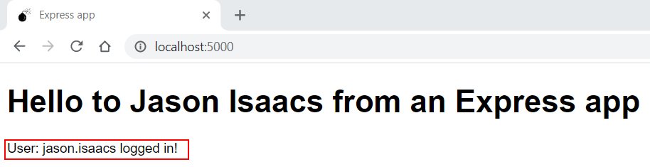
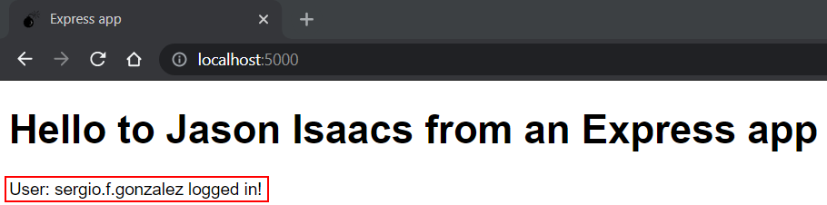

# 07: Express &mdash; Hello, *Express* session management and redirects in TypeScript!!
> A simple *Express server* in which session management and redirection capabilities are illustrated.

When you open the homepage by pointing your browser to http://localhost:5000 it will display the welcome page inviting you to log in. This happens because there is no username in the session yet.

If you click on the link, you will be redirected to the login page, where the login form will be presented:

If you click right away on the *Login* button, an error message will be displayed to the user:

If you populate the username and click on submit, you will be redirected to the home page, where your name will be displayed instead of the login link:

Now, if you open another browser tab, you will see that the username will still be there:

However, if you open a private browser session and log in again with another username, you'll see that the session is not shared:

