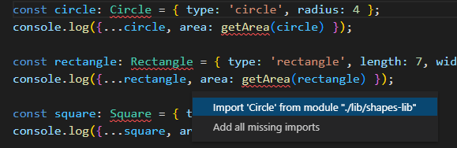

# 10: TypeScript functions &mdash; `import` and `export`
> refactoring a program into a module and importing the functions from it.

## Exercise 3.08

This exercise uses the result of the [09: Refactoring JavaScript into TypeScript](../09-refactoring-js-into-ts) and performs further refactoring to structure it as a module that can be easily reused.

1. Create a file `app/src/lib/shapes-lib.ts` with the portion of [09: Refactoring JavaScript into TypeScript](../09-refactoring-js-into-ts) that is subject of being reused.

2. Clean the `app/src/main.ts` so that only the code that will ilustrate how the library work is present.

3. Go back to `app/src/lib/shapes-lib.ts` and identify the functions and interfaces that have to be exported. As rule of thumb, you should only expose what will be consumed from the application. Variables, interfaces and functions that are only used in the context of the library need not to be exported.

4. Add the necessary imports in `app/src/main.ts`. Note that VS Code will help you in this task

