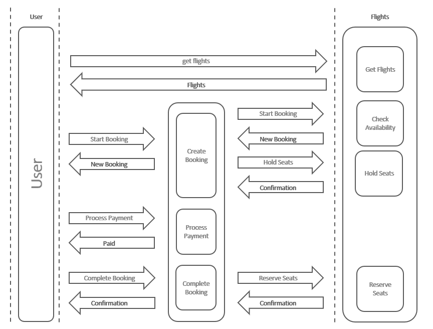

# e01: TypeScript functions &mdash; Building a flight booking system with functions
> learning how to structure a program in modules and functions

## Activity 3.01

In this activity, you need to implement a system that manages airline bookings. The architecture for this system has already been decided upon. There will be a system for managing flights and seat availability on them, and a system for managing bookings.

Users will interact directly with the booking system, and it, it turn, will search and update flight information.

The following diagram depicts the high level software architecture for the the system:



Here's how the application flows:
1. Get a list of flights to choose from
2. Start booking with one of those flights
3. Pay for the flight
4. Complete the booking with seats reserved on the flight

As the diagram shows:
+ the user will interact directly with the Flights system to search for flights.
+ the user will interact with the Bookings system to reserve, complete the payment, and receive the confirmation. The Bookings system will in turn interact with the Flights system as necessary.

In this exercise, the systems will be represented by two different TypeScript modules: `app/src/lib/bookings.ts` and `app/src/lib/flights.ts`

The idea is to structure `main.ts` and the Booking and Flight system in functions so that the arrows and components from the diagram above are satisfied.

Hints:
+ Start with the Flights module, creating an interface for the flights. Think about the properties a flight should control.
+ Define the functions that appear in the diagram: `getFlights()`, `checkAvailability()`...
+ Repeat the same exercise for the Booking system. Note that the booking system delegates some of its responsibilities to the Flights system.
+ Fine-tune the function signature as you go along.
+ In `main.ts` implement the user flow.

More hints:
The output of the program should be similar to:

```
Searching for flights
[
  {
    destination: 'Madrid',
    totalSeats: 255,
    availableSeats: 255,
    heldSeats: 0
  },
  {
    destination: 'Tenerife',
    totalSeats: 127,
    availableSeats: 127,
    heldSeats: 0
  },
  {
    destination: 'Menorca',
    totalSeats: 63,
    availableSeats: 63,
    heldSeats: 0
  }
]
Booking for Menorca
{
  id: 1,
  paid: false,
  flight: {
    destination: 'Menorca',
    totalSeats: 63,
    availableSeats: 60,
    heldSeats: 3
  },
  numSeats: 3
}
Processing payment: each seat $99.99
Processing payment for $299.97: successful
Completing booking
Booking to Menorca successfully completed:
 {
  id: 1,
  paid: true,
  flight: {
    destination: 'Menorca',
    totalSeats: 63,
    availableSeats: 60,
    heldSeats: 0
  },
  numSeats: 3
}
```
