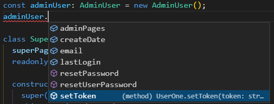

# TypeScript: Chapter 18 &mdash; Workshop: Interfaces and inheritance in TypeScript
> first steps into classes, interfaces and objects

## Contents
+ Interfaces in TypeScript: an introduction
+ First steps with TypeScript classes

## Interfaces

Interfaces enables you to strongly type your objects. Interfaces are contracts that govern structure, but not functionality &mdash; they shape your objects.

By defining interfaces you will be fostering code readability and reusability for your fellow developers. It will also enable better code quality, as you the TypeScript compiler will enforce that the passed arguments match what is defined in the interfaces, and that the classes that implement interfaces conform to that contract.

Here's an example of an interface that defines the shape of a user object. It includes both data properties and methods the user objects must have:

```typescript
interface IUser {
  email: string;
  token: string;
  resetPassword: () => boolean;
}
```

Here's an snippet illustrating an object that implements that interface:

```typescript
const user: IUser = {
  email: 'jason.isaacs@example.com',
  token: '1234',
  resetPassword(): boolean {
    return true;
  }
};
```

But the annotation does not have to be explicit. Making the type annotation would help the IDE and the reader, but it is not strictly necessary:

```typescript
const sayHello = (user: IUser) => {
  console.log(`Hello, ${ user.email }!`);
};

const user = {
  email: 'jason.isaacs@example.com',
  token: '1234',
  resetPassword(): boolean {
    return true;
  }
};

sayHello(user); // OK, even without explicit typing
```

Note however, that you won't be able to invoke the function if the object passed as an argument does not comply with the contract of the interface.

```typescript
const sayHello = (user: IUser) => {
  console.log(`Hello, ${ user.email }!`);
};

sayHello({ email: `email@example.com` }); // ERROR: argument to assignable to IUser
```

### Interfaces for function signatures

TypeScript allows you to define interfaces to strongly type function definitions. The syntax mimics how the function definition would look like in a class definition, minus the function name, which is not given:

```typescript
interface SayHelloFunctionInterface {
  (user: IUser): void;
}

const sayHello = (user: IUser) => {
  console.log(`Hello, ${ user.email }!`);
};
```

Note that interfaces can make use of function interfaces as seen below:

```typescript
interface IGreeter {
  name: string;
  greetMe: SayHelloFunctionInterface;
}
```

### Classes implementing interfaces

One of the most common use cases for interfaces is to provide classes an interface they have to implement:

```typescript
class User implements IUser {
  email: string;
  token: string;

  constructor(args: IUser) {
    this.email = args.email;
    this.token = args.token;
  }

  resetPassword(): boolean {
    return true;
  }
}
```

When making use of this feature, instantiation of objects becomes less verbose, as you can use `new` to both instantiate and type your objects:

```typescript
const user = new User(...);
```

### Notes on interfaces

TypeScript also allows you to use the `','` as property separator for interfaces, so that the following will be also valid:

```typescript
interface IUser {
  email: string,
  token: string,
  resetPassword: () => boolean
}
```

It is also interesting to note that when implementing classes, you don't need to be strict with the function interfaces.

For example, this will work:

```typescript
interface UserClassInterface {
  user: IUser;
  makeUser(user: IUser): IUser;
}

class User implements UserClassInterface {
  user: IUser;

  constructor(user: IUser) {
    this.user = user;
  }

  makeUser(): IUser {
    return this.user;
  }
}

const myUser: IUser = {
  email: 'admin@example.com',
  token: '1234',
  resetPassword: function (): boolean {
    return true;
  }
};

const user = new User(myUser); // OK: even if makeUser is (void): IUser instead of (user: IUser): IUser
```

| NOTE: |
| :---- |
| More information on the previous use case in https://github.com/Microsoft/TypeScript/wiki/FAQ#why-are-functions-with-fewer-parameters-assignable-to-functions-that-take-more-parameters. |


The book exercises differentiates three types of interfaces:
+ object interfaces &mdash; declare types for objects (define what the object is), and can be exchanged by type aliases.
+ class interfaces &mdash; the ones used following the `implements` keyword when creating classes. These interfaces define a contract that describe how to interact with the class. In the exercises are typically denoted as `I{something}`, for example, `IWarehouse` for a class implementing a warehouse.
+ function interfaces &mdash; defines the signature of a particular function.


### Types vs. Interfaces

The use of a *type alias* or an *interface* is in many cases interchangeable.

In general, you should use types for simple objects, and to describe what they are. In contrast, you should use interfaces as contracts giving directions on how to interact with objects, rather than to specify what they are.

The following snippet is a simple type definition:
```typescript
type BlogPost = {
  post: string,
  timestamp: number,
  user: string
}
```

## Inheritance in TypeScript

Inheritance is one of the core pillars of OOP. It gives you the ability to extend your classes from a given original class to a child class, allowing you to retain functionality from the parent class and adding or overriding what you don't need.

TypeScript makes use of the `private` and `public` keywords to allow you to hide/expose code from a child class. You can override any method exposed by a parent class in the child by redefining the method, and you can use the keyword `super` to access properties and method of the parent class.

This section will give an example-based, lightweight introduction about how basic inheritance concepts work in TypeScript applications.

Consider the following snippet that defines a User class with the most basic properties and methods:

```typescript
class UserOne {
  email: string = '';
  createDate: number = 0;
  lastLogin: number = 0;
  private token: string = '';

  setToken(token: string): void {
    this.token = token;
  }

  resetPassword(password: string): string {
    return password;
  }
}
```

The class defines and initialize a few data properties, and exposes two methods `setToken()` and `resetPassword()` intended to be used to set the user token for API authentication and to get a new password for the same user the class represents.

This class can be used as a parent for other types of specialized users. For example, we might need to model an Admin, which is a regular user with additional functionalities:
+ They have access to some special admin pages
+ They can reset other user's passwords


Instead of creating an Admin user from scratch, we can use inheritance and reuse all the good things from `UserOne`:

```typescript
class AdminUser extends UserOne {
  adminPages: string[] =['admin', 'settings'];

  resetUserPassword(email: string): string {
    return 'password123';
  }
}
```

Note how we just have to use the `extends` keyword and include the additional things that were not present in the `UserOne` class from which we are inheriting.

See in the image below how an instance of `AdminUser` class will have available all the properties and methods from the parent class besides the ones defined in `AdminUser`:


Now, let's go one step further and create another class that models Super Users which will have more capabilities than Admins:
+ they have all the capabilities of an admin
+ they have access to a set of super user pages
+ they can create admin users
+ they implement a more secure way of generating passwords using a *hash*


```typescript
class SuperAdmin extends AdminUser {
  superPages: string[] = ['super', 'ultimate'];
  readonly myHash: string;

  constructor() {
    super();
    this.myHash = '12345';
  }

  createAdminUser(adminUser: AdminUser): AdminUser {
    return adminUser;
  }

  // override
  resetPassword(password: string): string {
    return password + this.myHash;
  }
}
```

All the previous requirements can be implemented with the snippet above. The interesting things are:
+ the few additional properties that are needed are explicitly added to the class.
+ a constructor is created to initialize the hash (in a real case scenario, the hash will be randomly generated using some secure way, that's why it is included in the constructor).
+ the existing `resetPassword()` inherited from `UserOne` is redefined. Thus, we are able to provide a custom implementation without changing (extending) the existing interface.


This latter point is very important, because it will allow us to invoke the same method and get different behavior depending on the actual type of the object:

```typescript
const adminUser: AdminUser = new AdminUser();
const superAdmin = new SuperAdmin();

console.log(superAdmin.resetPassword('secret'));  // -> secret12345
console.log(adminUser.resetPassword('secret'));   // -> secret
```

The usefulness of the previous snippet will become more evident when we introduce polymorphism:

```typescript
const users: UserOne[] = [superAdmin, adminUser];
for (const user of users) {
  console.log(user.resetPassword('secret')); // -> polymorphic call!
}
```

The code above will invoke the appropriate `resetPassword()` method depending on the actual type of user.


Now we can tweak the existing codebase a little bit to explore some other TypeScript OOO capabilities.

Let's start by making the `token` property private, so that the *naked property* is hidden from the children:

```typescript
class UserOne {
  email: string = '';
  createDate: number = 0;
  lastLogin: number = 0;
  private token: string = '';

  setToken(token: string): void {
    this.token = token;
  }

  resetPassword(password: string): string {
    return password;
  }
}
```

As a result, the `token` property will no longer be accessible, and instead, children will have to rely on `setToken()` method to set the property.




Also, we can enforce Admin users to be created with an email:

```typescript
class AdminUser extends UserOne {
  adminPages: string[] =['admin', 'settings'];

  constructor(email: string) {
    super();
    this.email = email;
  }

  resetUserPassword(email: string): string {
    return 'password123';
  }
}
```

As a consequence, our application will fail to compile as now `AdminUser` instances and instances of objects *extending* `AdminUser` will have to provide an email upon creation:


| NOTE: |
| :---- |
| When creating classes you have to be very conscious of how your class may be used by child classes. A seemingly minor change on a parent class might have a big impact in children classes and break your application.<br>Inheritance should be used cautiously because it creates strong links between parent and children classes. |

| EXAMPLE: |
| :------- |
| See [04: Hello, inheritance!](04-hello-inheritance) for a runnable example of the code in this section. |


TypeScript enables the `protected` keyword for you to mark specific methods as private to the outside, but public to children classes.

For example:

```typescript
class User {
  private username: string;
  private token: string;
  ...

  protected renewToken(newToken: string): void {
    this.token = newToken;
  }
}
```

## You know you've mastered this chapter when...
+ You understand what an interface should be used for: contracts that governs structure and not functionality.

+ You're familiar with the different types of interfaces:
  + object interfaces that shape object literals
  + function interfaces that define the signatures of functions
  + class interfaces that shape classes

+ You're aware of TypeScript nuisances with respect with interfaces:
  + you can use `,` or `;` to separate properties and methods.
  + the principle of substitutability applies to implementation of interfaces, thus allowing a class method to be different from the function definition given on the interface.

+ You're familiar of the general recommendations of types vs. interfaces:
  + use types for simple type definitions, such as the ones you would use to annotate properties of classes.
  + use interfaces to define contracts giving directions on how to interact with  objects, rather than to specify what an object is.

+ You're comfortable using inheritance in TypeScript and are aware of:
  + how to create classes that extend from others.
  + how to annotate properties and methods with `private`, `protected` and `readonly`.
  + how to invoke methods (`constructor`) from the parent class in a subclass using `super()`.
  + how to override methods on a child class.

## Exercises, code examples, and mini-projects

### [01: Hello, interfaces!](01-creating-a-user-model)
Writing your first interface to model products.

### [02: Implementing interfaces](02-implementing-interfaces)
Learning how to implement interfaces by creating a prototype blogging application.

### [03: Creating interfaces for a function that updates a user database](03-creating-interfaces-user-database)
Learning how to create interfaces for functions.

### [04: Hello, inheritance!](04-hello-inheritance)
Illustrates a few basic concepts about inheritance in TypeScript

### [05: Creating a base class and two extended classes](05-creating-base-class-and-extensions)
Playing with inheritance in TypeScript in an example that creates a user class hierarchy

### [e01: Building a user management component using interfaces](e01-user-management-component-with-interfaces)
Learning how to create object and class interfaces by building a few user related interfaces and classes.


## ToDo

