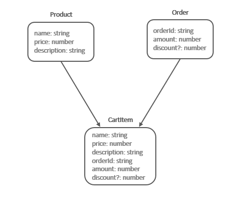
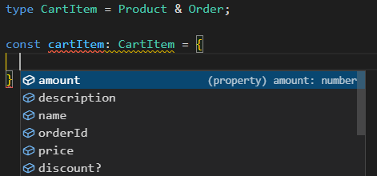

# TypeScript: Chapter 19 &mdash; Workshop: Advanced Types
> introducing *type aliases*, *type literals*, *intersection types*, *union types*, and *index types*.

## Contents
+ Introducing type aliases
+ Type literals
+ Intersection types
+ Union types
+ Index types


## Type Aliases

*Type aliases* allow you to declare references to any type &mdash; advanced or primitive. Using type aliases makes working with complex types easier as you declare your type once, and reuse it throughout your application.

The following examples illustrate the syntax for *type aliases*;

```typescript
// simple type: primitive type alias
type OnlyNumbers = number;

// complex type: object type alias
type Admin = {
  username: string,
  email: string,
  userId: string,
  allowedPages: string
}
```

Once defined, types can be used whenever you'd use a primitive type:

```typescript
class NumbersOnly {
  count: number;

  setNumber(someNumber: OnlyNumbers) {
    this.count = someNumber;
  }
}
```

Type aliases help a lot with code readability, as can be seen in the following example:

```typescript
function difficultToReadFunction(user: {
  email: string,
  username: string,
  token: string,
  lastLogin: number
}) {
  ...
}

type User = {
  email: string,
  username: string,
  token: string,
  lastLogin: number
}

function easyToReadFunction(user: User) {
  ...
}

```

## Type literals

*Type literals* allow you to create a type based on a specific string or number.

The following example illustrate how to create type literals for strings and numbers:

```typescript
type Yes = 'yes';

type One = 1;
```

| NOTE: |
| :---- |
| The use of *type literals* become more apparent on complex types such as *union types*. |

Type literals can be used whenever a type is expected:

```typescript
function doSomething(answer: Yes, count: One) {
  ...
}

doSomething('yes', 1); // -> OK
doSomething('', 2); // -> ERROR: '' not assignable to 'yes'
```

## Intersection Types

*Intersection types* allow you to combine types to form a new type with the properties of the combined types. This is useful when you have a type that by itself does not model the data you need to define, but it could do in combination with some other type.

*Intersection types* are also useful to provide capabilities similar to those found in multiple inheritances, as it will let you create types that are the combination of two or more types.

The following diagram illustrates what does an intersection type looks like:



That is, when creating the intersection type of Product and Order you will end up with a type that contains all of the properties of the types that are used for the intersection.

The image above corresponds to the following code:

```typescript
type Product = {
  name: string,
  price: number,
  description: string
}

type Order = {
  orderId: string,
  amount: number,
  discount?: number
}

type CartItem = Product & Order;
```

A `CartItem` instance will have all the merged properties from `Product` and `Order`:




| NOTE: |
| :---- |
| You can have more than two parents in an intersection. |

An intersection type will merge types with common properties. That is, if you have a property `name: string` in your parent types of an intersection, you'll end up with an intersection type that only features a `name: string` property.

| NOTE: |
| :---- |
| If you have two parent types with a property having the same name but different types the intersection will not occur and the TypeScript compiler will report an error. |


Intersection types can also be constructed inline, without using a type alias:

```typescript
const headphonesCartItem: Product & Order {
  ...
};
```

## Union Types

*Union types* are a combination type similar to intersection type but instead of merging two or more types provide a kind of *or* functionality.

The following snippet declares an `Age` type that is either a number or a string:

```typescript
type Age = number | string;
```

Once defined, a union type can be used anywhere a primitive type can be used:

```typescript
function myAge(age: Age): Age {
  if (typeof age === 'number') {
    return `age is a number: ${ age }`;
  } else if (typeof age === 'string') {
    return `age is a string: ${ age }`;
  } else {
    return `unexpected type received as argument: ${ typeof(age) }`;
  }
}
```


## Index Types

Index types allow you to create objects that have flexibility as regards the name and number of properties they may hold.

In practice, you will be giving the shape of your type using an interface in a way that will allow your type to have a flexible number of properties.

Consider the snippet below, which defines such an interface representing the shape of an object that will be a collection of error messages. Obviously, this use case qualifies as an index types, as you will be adding more messages as you build your application, but all of them will have the same shape:

```typescript
interface ErrorMessage {
  [errCode: number]: string;  // index type: can only be string | number | symbol
  apiId: number;
}
```

The first part specifies the indexing property, in this case a `number`, which we will use to map to error descriptions (`string`). The index type can only be a `string`, a `number`, or a `symbol`.

Note that you can add more properties to the interface, but those have to match the return type. That is, the following index type definition will not compile:

```typescript
type PackageStatus = {
  [status: string]: boolean,
  age: number // age (number) not assignable to string index type boolean
}
```

Once defined, you can create an object with that shape, and use it in you application using the syntax `obj[index]`:

```typescript
const errorMessage: ErrorMessage = {
  0: 'system error',
  1: 'overload',
  apiId: 12345
};

console.log(errorMessage); // -> { '0': 'system error', '1': 'overload', apiId: 12345 }

console.log(errorMessage[1]); // -> overload
```

| NOTE: |
| :---- |
| The TypeScript compiler will convert numeric strings to numbers and vice versa if needed, so that you can add a `'2': 'device locked'` error message. |

| EXAMPLE: |
| :------- |
| See [05: Advanced Types &mdash; Hello, index types!](05-hello-index-types) for a runnable program illustrating the concept of this section. |

Note that index types dictate the shape of objects, not their content. In other words, *index types* are not literal types, and they can hold new values dynamically (as opposed to literal types which only feature a static set of values).

For example, consider the following example in which we have a `PackageStatus` initialized as follows:

```typescript
type PackageStatus = {
  [status: string]: boolean
}

const initialPackageStatus: PackageStatus = {
  'shipped': false,
  'packed': false,
  'delivered': false
};

const myPackage: Package = {
  status: initialPackageStatus
  //...other properties...
};
```

No one can prevent us from dynamically doing:

```typescript
myPackage.status['returned'] = true;
```

As the sentence above will comply with the `PackageStatus` definition.

## You know you've mastered this chapter when...
+ You're comfortable defining types (*type aliases*), and using them whenever a primitive type, class or interface is expected.

+ You're familiar with the concept of *type literals*, to restrict the values a type can have.

+ You're comfortable defining intersection types, and understand they can be used to *merge* two or more other types.

+ You're comfortable using union types, and understand they can be used to *OR* two or more other types.

+ You're comfortable using index types which dictate what is the shape of the type rather than their actual properties, and know how to populate them and access their properties once defined.

## Exercises, code examples, and mini-projects

### [01: Implementing a type alias](01-implementing-type-alias)
Introducing type aliases for primitive types and objects.

### [02: Type literals](02-hello-type-literals)
Introducing type literals.

### [03: Creating Intersection Types](03-hello-intersection-types)
Introducing intersection types.

### [04: Advanced Types &mdash; Updating the products inventory using an API](04-hello-union-types)
Introducing union types.

### [05: Advanced Types &mdash; Hello, index types!](05-hello-index-types)
Introducing index types by modeling a type that holds a collection of error messages.

### [06: Advanced Types &mdash; Displaying Error Messages](06-index-types-error-messages)
Using index types to process error messages

### [e01: Advanced Types &mdash; Intersection type](e01-intersection-types)
Illustrating intersection types

### [e02: Advanced Types &mdash; Union Types](e02-union-types)
Illustrating union types.

### [e03: Advanced Types &mdash; Index types](e03-index-types)
Illustrating index types.

## ToDo

