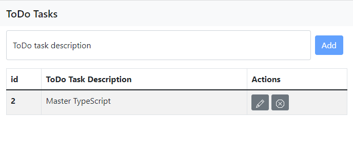
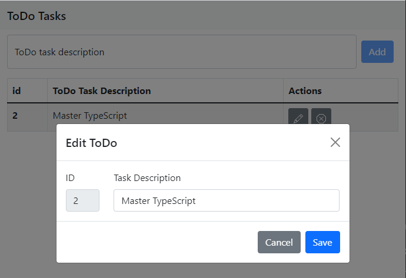
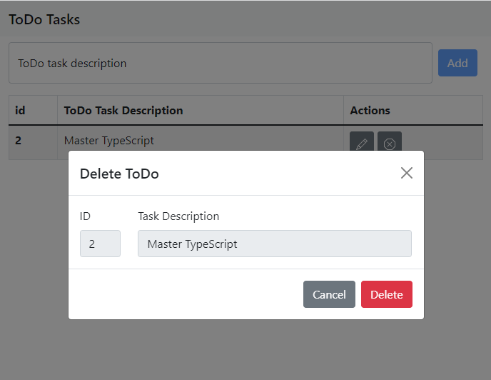
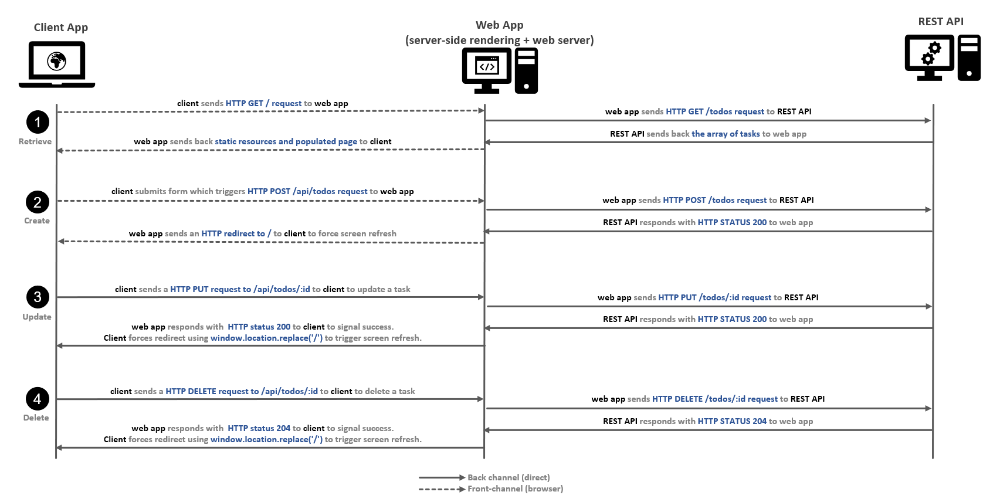

# e01: Using promises in TypeScript &mdash; Server-side rendered UI for REST API
> Reimplementing [12: Vanilla TypeScript UI for a REST API](12-vanilla-ts-ui-for-rest-api) with a mix of server-side rendered UI and client TypeScript.

## Description

This project is a rewrite of [12: Vanilla TypeScript UI for a REST API](../12-vanilla-ts-ui-for-rest-api) but using *EJS* to enable server-side rendering capabilities. Note that not all the functionality has been done on the server side, so the project is actually a mix of pure front-end TypeScript and server-side rendering with Express.

Also, the REST API implemented in [11: Building a RESTful API server](../11-restful-api-server) is also used, so the API in this project is mostly a gateway between the browser application and the REST API.

The project implements a very simple ToDo task application that lets you create, update and delete tasks. The existing tasks are displayed on an HTML table on the screen. The update and delete operations are handled on the client side using modal windows (as seen below):

*main screen*

*Editing a task*

*Deleting a task*

To run the application:
+ start this application using `npm start`
+ start the REST API server [11: Building a RESTful API server](../11-restful-api-server) using `npm start`
+ point your browser to http://localhost:8080

## A few application details

Several things from [12: Vanilla TypeScript UI for a REST API](../12-vanilla-ts-ui-for-rest-api) were changed to accomodate the solution to a partial server-side rendering solution. Also, several lessons when learned as the partial approach required the use of front-channel vs. back channel communications.

Note that maybe the front-channel vs. back channel concept is not strictly correct here, but what I want to illustrate is that there are two different ways in which the client application running in the browser communicates with the web app:
+ **front-channel** requests &mdash; when the browser itself is the one sending requests to the web app (this network requests are visible on the Network Tab of the DevTools)
+ **back channel** requests &mdash; when the JavaScript application running in the browser is the one sending HTTP requests directly to the web app.

When using the *front-channel*, the web application (Express) can use methods such as `res.render()` or `res.redirect()` to instruct the browser to show/do something. By contrast, when using *back-channel*, the web application is communicating with the JavaScript running in the browser and such methods have absolutely no effect.

The following diagram illustrates the different communications between the 3 parties involved in the application:

*Communication diagram: operations and the front-channel vs. back channel comms*

Let's drill-down on the different operations and how they are implemented

### Retrieving tasks
Task retrieval is performed using front-channel communications. The user points their browser to http://localhost:8080/ and the web app, when receiving the request, will trigger a request to the REST API.

The REST API will send back an array with the existing tasks, and the web app will use `res.render()` to compose an HTML with the `pages/index` template and those tasks.

The template will make use of iteration and scriptlets capabilities to easily integrate the array of tasks received into a fancy HTML page without having to use the DOM (as was done in [12: Vanilla TypeScript UI for a REST API](../12-vanilla-ts-ui-for-rest-api)).

As a result, the browser will show an HTML page that contains the retrieved tasks.

### Creating a task
Task creation is also performed using front-channel communication. As opposed to what was done in [12: Vanilla TypeScript UI for a REST API](../12-vanilla-ts-ui-for-rest-api), in this case we wrap the input field and button into a form, that when submitted will trigger a POST request to `/api/todos`.

Then, web app declares an API route that handles this type of request and triggers a subsequent call to the REST API to persist the task in the database. When the task is persisted, the web app also takes benefit of this front-channel communication and uses `res.redirect('/')` to force the screen refresh after the POST.

### Updating a task
Updating a task requires back channel communications. This action is controlled by a Bootstrap modal, so the interactivity is more conducive to using pure frontend techniques.

When the modal is presented and the user confirms the task updates, the client-side TypeScript will trigger a `fetch()` to `/api/todos/{task-id}`. The browser will be completely unaware of this operation. In turn, the web app, when receiving the request, will relay the request to the REST API. Upon successful completion of the update operation the web app will simply respond with an HTTP status code, as neither `res.render()` nor `res.redirect()` will have an effect on the browser.

Therefore, when the client-side TypeScript receives the request, it will using `window.location.replace('/')` to force a redirection on the browser, thus causing the refresh of the table with the latest changes.

### Deleting a task
Deleting a task follows the same principles as the update.
