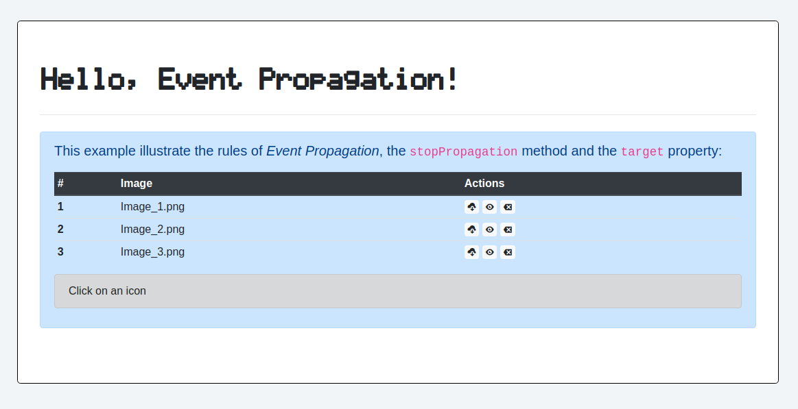
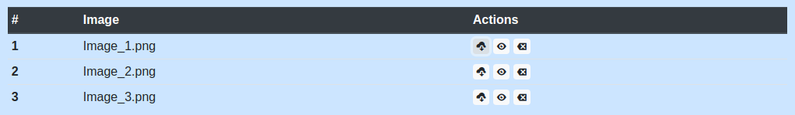

# 08 &mdash; Hello, Event Propagation!
> A simple Vanilla JavaScript project that illustrates how *event propagation* (also known as *event bubbling*) works.

## Event propagation concepts

### Rules of event propagation
For most event types, handlers registered on nodes with children will also received events that happen in the children. That is, the events propagate outwards from the node where it happened, to the parent's node, and from that one to the parent's node until it gets to the root of the document.

For example, if a `<button>` within a `<p>` is clicked, event handlers on the `<p>` will also see the `'click`' event. If both the `<button>` and the `<p>` have event handlers, the *button handler* will trigger first, and then *p handler*.

### The `<event>.stopPropagation(...)` method
At any point, an event handler can call `stopPropagation(...)` method on the *event object* to prevent the event from being propagated further up.

### The `<event>.target` property

Most *event objects* have a `target` property that refers to the node on which the event originated.

This `target` property becomes especially useful when you have a long list of buttons, as you can register a single `'click'` handler on a *container element* and then use the `target` property to figure out which of the buttons was actually clicked on.

## The example



In the example we create a table the following table that lists some items in rows and some actions associated to each row:



Instead of registering an event handler for each of the actions (which would be cumbersome and challenging for non-static pages), we register an event handler for the table and rely on the *event propagation rules* (also known as *event bubbling*).

Therefore, independently of what link is clicked on, we receive the `'click'` event for the parent table, and from there, we use the `event.target` property to ascertain the specific element in which the `'click'` event was originated:

```javascript
table.addEventListener('click', (evt) => {
  const itemClicked = evt.target;
  /* process the information for evt.target */
});
```

Additionally, to obtain the details about what action should be performed, we make use of the `data-*` attributes in HTML:

```html
<td>
  <a href="#"><span class="oi oi-cloud-download" title="Download Image_1.png" data-action="download" data-filename="Image_1.png"></span></a>
  <a href="#" class="badge badge-light"><span class="oi oi-eye" title="Preview Image_1.png" data-action="view" data-filename="Image_1.png"></span></a>
  <a href="#" class="badge badge-light"><span class="oi oi-delete" title="Delete Image_1.png" data-action="delete" data-filename="Image_1.png"></span></a>
</td>
```

And then we read that from JavaScript using the `elem.dataset` property:

```javascript
const action = elemWithActionInfo.dataset.action;
const filename = elemWithActionInfo.dataset.filename;
```
