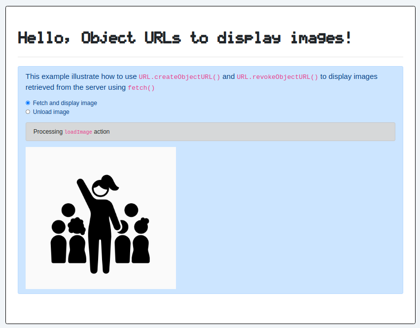

# 09 &mdash; Hello, Object URL!
> A simple Vanilla JavaScript project that illustrates how to use object URLs to display images


## Object URLs

| NOTE: |
| :---- |
| For detailed information please visit [MDN: Using object URLs](https://developer.mozilla.org/en-US/docs/Web/API/File/Using_files_from_web_applications#using_object_urls) and [MDN: `URL.createObjectURL()](https://developer.mozilla.org/en-US/docs/Web/API/URL/createObjectURL). |

The DOM methods `URL.createObjectURL()` and `URL.revokeObjectURL()` let you create simple URL strings that can be used to reference any data that can be referred to using a DOM `File` object.

That is, when you have a `File` that you'd like to reference by URL from HTML, you can create an *object URL* doing:

```javascript
const objectURL = URL.createObjectURL(fileObj);
```

Each time you call `URL.createObjectURL()` a unique object URL is created for you (even if another object URL already existed for that file). Because of that, even when the browser will release the memory associated to those object URLs automatically, it is recommended that you release them explicitly by calling `URL.revokeObjectURL()`.


## About the example

In the example, the following screen is presented to the user



When the user activates the *Fetch and display image* option, a `fetch()` request to the server is triggered from the client-side JavaScript application. The server responds with a *blob* that is converted to an object URL that is used to display the image:

```javascript
const response = await fetch('/download/images?filename=hi.png');
const responseBlob = await response.blob();
const objectUrl = URL.createObjectURL(responseBlob);
imgPlaceHolder.src = objectUrl;
imgPlaceHolder.onload = () => URL.revokeObjectURL(objectUrl);
```

Note how the `` element is configured with a call to `URL.revokeObjectURL(...)` as soon as the image is loaded.

The management of the server side request is also quite simple:
+ A new route for `download/images` is defined
+ In the route controller, we use `res.sendFile(...)` Express function to send a local file to the caller.

```javascript
export async function download(req, res, next) {
  function sendFile(filename) {
    return new Promise((resolve, reject) => {
      res.sendFile(filename, err => {
        if (!err) {
          return resolve();
        }
        return reject(err);
      });
    });
  }

  const filename = req.query.filename;

  try {
    validateParameter(filename);
  } catch (err) {
    return next(createError.BadRequest(`"filename" query parameter is required`));
  }

  try {
    const imagePath = join(__dirname, '..', '..', process.env.PATH_TO_PUBLIC_STATIC_RESOURCES, 'images', filename);
    await sendFile(imagePath);
  } catch (err) {
    next(createError.InternalServerError(err.message));
  }
}
```

Note that instead of using `res.sendFile()` it is also possible to use plain-old Node.js streams, as seen in the code below:

```javascript
import { buildLogger } from '../../lib/logger.js';
import Joi from 'joi';
import createError from 'http-errors';
import fs, { promises as fsPromises } from 'fs';
import { dirname, join } from 'path';
import { fileURLToPath } from 'url';

/*
  ESM trick to reconstruct CommonJS `__dirname` value

  In ESM, you can get a reference to the current file URL
  using the special object `import.meta`.
  Specifically, `import.meta.url` will return a reference
  to the current module path in the format
  `file:///path/to/current_module.js`
  which can be used to reconstruct `__filename` and
  `__dirname`.
*/
const __dirname = dirname(fileURLToPath(import.meta.url));

const logger = buildLogger('routes:download');


export async function download(req, res, next) {
  const filename = req.query.filename;

  try {
    validateParameter(filename);
  } catch (err) {
    logger.error(`Failed to validate query parameter "filename"=${ filename }: ${ err.message }`);
    return next(createError.BadRequest(`"filename" query parameter is required`));
  }

  try {
    const imagePath = join(__dirname, '..', '..', process.env.PATH_TO_PUBLIC_STATIC_RESOURCES, 'images', filename);
    const { size: imageSize } = await fsPromises.stat(imagePath);
    const readableStream = fs.createReadStream(imagePath);

    res
      .set('Content-Length', imageSize)
      .set('Content-Type', 'application/octet-stream; charset=utf-8');

    readableStream.pipe(res);


    readableStream.on('close', () => {
      logger.debug(`Successfully streamed ${ filename }; size=${ imageSize } bytes`);
      res.end();
    });

    readableStream.on('error', (err) => {
      if (err.code === 'NoSuchKey') {
        return next(createError.NotFound('Specified file does not exist'));
      }

      logger.error(`Could not serve image: ${ err.message }`);
      return next(createError.InternalServerError('Could not serve image'));
    });

  } catch (err) {
    logger.error(`Could not process download image request for filename=${ filename } query parameter: ${ err.message }`);
    next(createError.InternalServerError(err.message));
  }
}


function validateParameter(filename) {
  logger.debug(`Validating request query parameter 'filename': ${ filename }`);
  const schema = Joi.object().keys({
    filename: Joi.string().max(255).required()
  }).required();
  const { error } = schema.validate({ filename });
  if (error) {
    logger.error(`Validation failed for 'filename' request parameter: ${ error }`);
    throw error;
  }
}
```

## About CSP configuration

This example, requires configuring CSP headers on the server side to allow using blobs on client-side JavaScript. This configuration is performed on [get-custom-csp-directives.js](app/src/lib/get-custom-csp-directives.js):

```javascript
import helmet from 'helmet';

export function getCustomCspDirectives() {
  const defaultDirectives = helmet.contentSecurityPolicy.getDefaultDirectives();
  delete defaultDirectives['upgrade-insecure-requests'];

  const finalDirectives = {
    ...defaultDirectives,
    'img-src': `'self' blob:`
  };

  return finalDirectives;
}
```

The result of this function is then injected on the *Helmet middleware* confiration:

```javascript
/* 3rd party middleware */
app.use(express.json());

/* ... */

app.use(helmet());
app.use(helmet.contentSecurityPolicy({
  directives: getCustomCspDirectives()
}));

/* ... */
```
