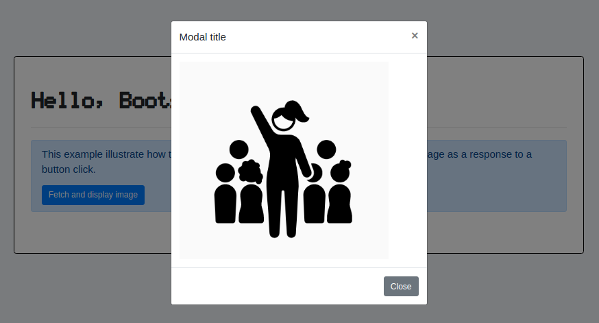

# 10 &mdash; Hello, Boostrap pop-up modal!
> A simple Vanilla JavaScript project that display an image into a Bootstrap v4 pop-up modal dialog

## About the example

In the example we display a centered modal dialog with an image as seen below:



All the wiring to display the pop-up is done via attributes in the `index.html` file as seen below:

```html
...
          <button type="button" class="btn btn-primary" data-toggle="modal" data-target="#imgModal">Fetch and display image</button>
        </div> <!-- alert -->
      </div>
    </div>
  </div>
</div>

<!-- Modal dialog on which the image is displayed -->
<div class="modal fade" id="imgModal" tabindex="-1">
  <div class="modal-dialog modal-dialog-centered">
...
```

However, it is required that you add the Bootstrap JavaScript and jQuery bundles also to your `index.html`:

```html
...
  <!-- JavaScript -->

  <!-- Bootstrap v4: jQuery and bootstrap bundles -->
  <script src="https://code.jquery.com/jquery-3.5.1.slim.min.js" integrity="sha384-DfXdz2htPH0lsSSs5nCTpuj/zy4C+OGpamoFVy38MVBnE+IbbVYUew+OrCXaRkfj" crossorigin="anonymous"></script>
  <script src="https://cdn.jsdelivr.net/npm/bootstrap@4.6.0/dist/js/bootstrap.bundle.min.js" integrity="sha384-Piv4xVNRyMGpqkS2by6br4gNJ7DXjqk09RmUpJ8jgGtD7zP9yug3goQfGII0yAns" crossorigin="anonymous"></script>

  <!-- Custom JavaScript -->
  <script src="javascript/app.js" type="module"></script>
</body>
...
```

## Controlling the modal using JavaScript

It is also possible to control the modal using JavaScript with jQuery. For example, to show the modal in your client JavaScript code, you'd have to do:

```javascript
$('#imgModal').modal({ show: true });
```

## Additional CSP directives

In order to allow using the Bootstrap and jQuery JavaScript bundles, it is necessary to add an additional directive to your CSP. This is done in [get-custom-csp-directives.js](app/src/lib/get-custom-csp-directives.js):

```javascript
import helmet from 'helmet';

export function getCustomCspDirectives() {
  const defaultDirectives = helmet.contentSecurityPolicy.getDefaultDirectives();
  delete defaultDirectives['upgrade-insecure-requests'];

  const finalDirectives = {
    ...defaultDirectives,
    'img-src': `'self' blob:`,
    'script-src-elem': `'self' https://code.jquery.com/jquery-3.5.1.slim.min.js https://cdn.jsdelivr.net/npm/bootstrap@4.6.0/dist/js/bootstrap.bundle.min.js`,
  };

  return finalDirectives;
}
```