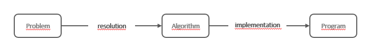
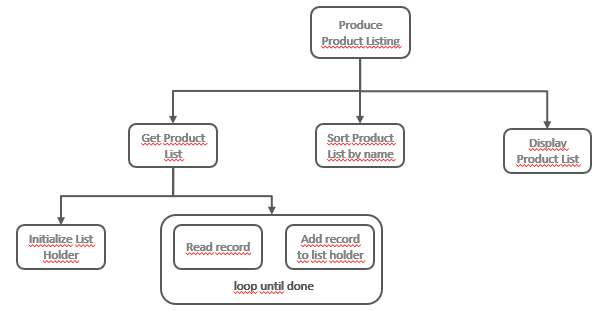

# Chapter 26 &mdash; Functional Programming
## [Part 0: Fundamentals](part00-fundamentals/)
### [Section 1: Intro to Abstract Data Types and Algorithms](part01-intro-to-adt-and-algorithms)

### Contents

### Programming

*Programming* is part of the development of an application that solves a problem at hand.

We can think of application creation as a two-step process:
1. Problem definition &mdash; where you describe what the application has to do
2. Program development &mdash; where you create a program that solves the problem at hand

We can think of programming as the process of creation of a *program*.

The following diagram depicts the process:

+ The resolution phase is the important one. In this phase we get the problem definition and get to an algorithm that details how the problem can be resolved.
+ The implementation phase consists in a *mere* translation of the algorithm in a series of statements that the computer can process.

> An **algorithm** is a set of statements, each one with a clear meaning and that gets executed in a finite time. An algorithm always finishes after executing the a finite number of statements.

There are several ways to express an algorithm:
+ flow diagrams
+ pseudocode

### The resolution phase

During the resolution phase, the problem is analyzed, and a solution to solve it is designed. Finally, the solution gets detailed as an algorithm.

One of the techniques to deal with the resolution phase is known as *top-down design*. This technique, a variant of *divide and conquer* consists in carrying out an incremental process until you get to the final solution.

When using this technique, the problem gets subdivided in smaller problems that are easier to address. Then each of the smaller problems gets subdivided until those are very easy to solve.

#### An example of the resolution phase

Let's see how to apply the *top-down design* to solve a warehouse use case. Let's pretend that you get the requirement to build the list of products available in a warehouse, and categorized by `name`, `price` and `sku`. The list has to be displayed sorted by name, and displayed on the screen.

Thus, problem at hand is *Produce product listing*, and following the *top-down design*, the first thing that we have to do is subdivide it in subproblems:
+ Produce product listing
  + Get the product list
  + Sort the product list by name
  + Display the list on the screen

Now we can subdivide further down:

+ Get the product list
  + Initialize list holder
  + while remaining products to fetch
    + read product record
    + add product record to the list

This can be carried out indefinitely until we get to a set of statements that are easy to address. At that point, we can say we have finished the *resolution phase*.

Note also, that the net result of this process is a *tree-like* structure that will hint at the *modular* structure of the program:

### The process of abstraction

Abstraction is what we use when we apply the *top-down design* process with iterative refining steps on which we drill-down on the details of a problem. In particular, this type of abstraction is known *procedural abstraction* to differentiate it from *data abstraction*.

Note that in the process, we pay special attention to the *what* without minding about *how* (for now 😉).

| NOTE: |
| :---- |
| The name of *procedural abstraction* comes from the old times of computer science, where a *procedure* was a part of a program that encapsulated all the statements that had to do with the same aspect of a program and that generalized the notion of an operator. A more appropriate name could be now *modular abstraction*. |

Another type of abstractions have to do with the data. In the same way that we can do a *top-down design* for the operational part of a program, we can can do *top-down design* for the data concerns.

*Data abstraction* also provides generalization and encapsulation. Data abstraction allows us to generalize data types, so that the same principles that apply to simple types such as numbers and strings can be applied to lists or trees.

At the end:
> A program = algorithm + data

### Abstract Data Types

The encapsulation of a data structure along with the set of operations that are allowed on the data structure is known as an *abstract data type* (or ADT for short).

In short, an *abstract data type* is a lot like a class, but not necessarily a class. It is a more generic concept.

Also, *ADTs* are implementation independent. *ADTs* are design phase artifacts that do not make assumptions on the language or runtime requirements.

#### Data Abstraction and data hierarchy

High-level languages provide data types. Generally, a data type is a set of allowed values and a set of operations defined on those values. For example, strings can be used to represent a sequence of individual characters, they can be concatenated, split, transformed into uppercase, etc.

On top of the data types, programming languages allow you to define classes and other data structures &mdash; those are used to group pieces of data that have to go together.

On top of these artifacts is where we would define our *ADTs* &mdash; Math models with a set of operations defined on them, and a set of properties they satisfy. The *ADTs* are implementation independent in nature, although ultimately, to be useful in computer science, they will have to be implemented on a particular programming language.

| NOTE: |
| :---- |
| Some examples of *ADTs* are lists, trees, graphs. |

Note that typically, programming languages do not provide direct support for *ADTs*, and instead provide the basic tooling so that you can define them on elements that sit lower in the data hierarchy.

You can see in the diagram above that in the data hierarchy, each of the levels of the data hierarchy is supported by the lower levels. Note also that nothing prevents *ADTs* to get implemented on top of other *ADTs*.

#### An example of an abstract data type: Stack

*Stacks* are very well known data structures in computer science. Those are also known as *LIFO* lists, as they follow a *last-in, first-out* approach when dealing with the elements they hold.

*Stacks* also make very good *ADTs*, as can be defined as a set of elements along with a set of operations defined on them.

Informally, the operations on the *stack* are.
+ createStack &mdash; creates an empty stack.
+ push &mdash; adds an element to the top of the stack.
+ pop &mdash; returns and removes the element in the top of the stack. (precondition: the stack must not be empty)
+ peek &mdash; returns the element in the top of the stack, without removing it (precondition: the stack must not be empty, postcondition: the stack remains the same)
+ isEmpty &mdash; returns a value indicating whether the stack is empty or not

| NOTE: |
| :---- |
| Although this is an implementation concern, *ADTs* should always follow the principle of encapsulation and information hiding, to provide a strong guarantee to the consumers of the *ADT*. |

#### Advantages of abstract data types

*ADTs* are like patterns for data &mdash; solving problems with *ADTs* ensure that the solution is not tightly coupled to a particular implementation. Also, when solving a problem with an *ADT* we can reimplement it without affecting the clients of the *ADT*, as they depend on the *ADT* operations, and not on the internal details of it.

#### Analysis level of abstract data types

*ADTs* can be analyzed at different levels:

+ *logical level* &mdash; *ADT* definition in terms of data organization and operations
+ *implementation detail* &mdash; different possible implementations of a given *ADT*
+ *application detail* &mdash; examples of *ADT* that solve application problems

#### Formal specification of abstract data types

*ADT* is a Math model, and as such there are many Math tooling we can use to define an *ADT* in the strictests of terms:
 + algebraic representation
 + formal lenguage specification

Both are out of the scope of this section.

### Objects

Objects are closely related to *ADTs*.

> an *object* is an *instance* of a *class*. A *class* specifies the behavior of the objects that will be created using the class as a template.

The behavior of an *object* is done specifying what are the messages the objects understand, that is, the set of operations defined on the objects.

*Objects* operations are known as *methods*, and its state is defined with *properties*.

### Complexity of algorithms