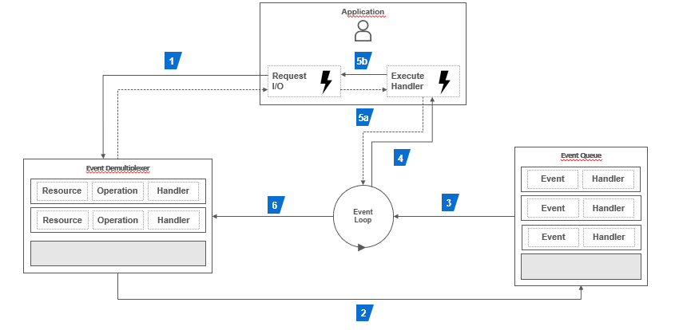
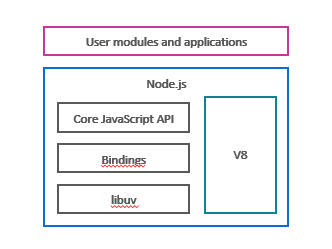

# Part 4: Node.js avanced patterns and techniques
## Chapter 27 &mdash; Deep dive into the Node.js platform 
> a brief introduction to the Node.js platform and its capabilities

### Contents
+ Introduce the Node.js philosophy
+ Non-blocking I/O and the **reactor** pattern
+ Node.js Component Architecture


### Intro
The Node.js philosophy can be summarized as:
+ Small core &mdash; provide only the fundamental set of functionalities
+ Small modules &mdash; use small modules that do one thing well to structure a larger app, thus increasing reusability.
+ Small surface area &mdash; favor exposing a single *closed* functionality intended to be used, rather than extended. This migh sound inflexible but it actually has proven to be a way to facilitate usability and maintainability.
+ Simplicity and pragmatism &mdash; favor potentially inccomplete or inaccurate implementations to allow for faster shipping and maintainability.


| NOTE: |
| :---- |
| Node.js, helps to solve the *dependency hell* by making sure that two or more packages depending on different versions of the same package will use their own installations of cush a package, thus avoiding conflicts. |

### How Node.js works
At the heart of the asynchronous nature of Node.js is the **reactor** pattern.

In traditional blocking I/O programming, the function call corresponding to an I/O request will block the execution of the thread until the operation completes. Obviously, a single threaded web server using blocking I/O would not be able to process multiple connections. In blocking I/O, this is typically solved using multiple threads or processes to be able to handle multiple requests, but creating and managing threads is expensive. Also, each of those threads will have a huge amount of idle time in which the thread will be just waiting for the I/O to complete.

In modern non-blocking I/O, an OS system call involving I/O will always return immediately without waiting for the data to be read or written. If no results are available at the time of the call, the function will return a predefined constant indicating that there is no data available to return.

The most basic pattern to deal with this type of non-blocking I/O is to actively poll the resource within a loop until some data is effectively returned &mdash; this is called *busy-waiting*.

The following pseudocode illustrates how using *busy-waiting* with non-blocking I/O allows a program to work with three different resources with a single thread:

```javascript
resources = [socketA, socketB, fileA]
while (!resources.isEmpty()) {
  for (resource of resources) {
    // try to read (won't block)
    data = resource.read()
    if (data == NO_DATA_AVAILABLE) {
      // no data available at the moment
      continue
    }
    if (data == RESOURCE_CLOSED) {
      // we're done with the resource, no longer poll
      resources.remove(i)
    } else {
      // process data from the resource
      consumeData(data)
    }
  }
}
```

Note that even when you're dealing with data from three different sources with a single thread the solution is far from ideal, as you'll be constantly iterating and wasting CPU cycles just waiting for data to be ready.

The solution to *busy-waiting* is a mechanism most modern OS provide called *synchronous event demultiplexer* or the *event notification interface*.

| NOTE: |
| :---- |
| In eletronics and telecommunications multiplexing is the method by which multiple signals are combined into one so that they can be easily transmitted over a medium with limited capacity. Demultiplexing refers to the opposite operation on which a multiplexed signal is split into its original components. |

The synchronous event demultiplexer is capable of watching over multiple resources and return an event (or set of events) when a read or write operation is completed. As this mechanism is *synchronous*, the interaction with the demultiplexer will block until there are new events to process.

```javascript
watchedList.add(socketA, FOR_READ)
watchedList.add(fileA, FOR_READ)
// demultiplexer.watch blocks until any of the watch resources have data
while (events = demultiplexer.watch(watchedList)) {
  for (event of events) {
    // this will always return data
    data = event.resource.read();
    if (data == RESOURCE_CLOSED) {
      // we're done with the resource, no longer poll
      demultiplexer.unwatch(event.resource)
    } else {
      // process data from the resource
      consumeData(data)
    }
  }
}
```

With this approach we're able to handle several I/O operations inside a single thread without using the *busy-waiting* technique. Also, this technique minimizes the total idle time of the thread.

#### The *reactor* pattern
The **reactor** pattern is a specialization of the algorithms presented in this section.

The main idea behind the **reactor** pattern is to have a handler associated with each I/O operation, or in Node.js terms a `callback` (or `cb` for short) function.
The handler will be invoked as soon as an event is produced and processed by the event loop.

The following diagram illustrates the structure of the **reactor** pattern.



1. The application generates a new I/O operation by submitting a request to the `Event Demultiplexer`. The application also specifies a `handler`, which will be invoked when the operation completes. Submitting a new request to the `Event Demultiplexer` is a non-blocking operation and it will immediately return control to the application.
2. When a set of I/O operations completes, the `Event Demultiplexer` pushes a set of corresponding events into the `Event Queue`.
3. At this point, the `Event Loop` iterates over the items of the `Event Queue`.
4. For each event in the `Event Queue`, the associated handler is invoked.
5. The `handler`, which is part of the application code, will give back control to the `Event Loop` when its execution completes (*5a*). While the `handler` executes, it can request new asynchronous operations (*5b*), causing new items to be added to the `Event Demultiplexer` (*1*).
6. When all the items in the `Event Queue` are processed, the `Event Loop` blocks again on the `Event Demultiplexer`, which then triggers another cycle when a new event is available.

| TL;DR |
| :---- |
| The application expresses interest in accessing a resource by interacting with the `Event Demultiplexer` providing a `handler` which will be invoked when the resource is ready to provide data. |

We can now define the reactor pattern which constitutes the heart of Node.js:
> The **reactor** pattern handles I/O by blocking until new events are available from a set of observed resources, and then reacts by dispatching each event to a previously registered associated handler.

#### Libuv, the I/O engine of Node.js
Each operating system has its own interface for dealing with event demultiplexing. Even some operating systems might not support non-blocking operations for some type of I/O resources. All these inconsistencies across and within operating systems make creating an *event demultiplexer* really challenging.

Because of that, the Node.js core team created a library called *libuv* that normalizes all the non-blocking behavior. *Libuv* represents the low-level I/O engine of Node.js and is probably the most important component Node.js is built on.

Besides abstracting the underlying system calls, *libuv* also implements the **reactor** pattern, providing an API for creating event loops, managing the event queue, running async I/O operations, and queueing other types of tasks.

#### Node.js architecture blueprint

The following diagram depicts Node.js architecture components:



+ `libuv` &mdash; the I/O engine of Node.js which normalizes non-blocking operations across and within OS and implements the **reactor* pattern.
+ `bindings` &mdash; the *middleware* that responsible for making *libuv* capabilities available to JavaScript.
+ `Core JavaScript API` &mdash; the JavaScript library that implements the high-level Node.js API.
+ `V8` &mdash; the JavaScript engine originally developed by Google for the Chrome browser. *V8* is acclaimed for its revolutionary design, its speed, and its efficient memory management.

### JavaScript in Node.js

There are some differences in the JavaScript you find in the browser with respect to the one that you find in Node.js.
These can be summarized into:
+ You don't have a *DOM* or access to a `window` or `document` object.
+ In Node.js you can access all of the services exposed by the underlying OS.

Also, in Node.js you don't have to deal with the challenges that you run into when you use JavaScript in the browser with regards to different devices, JavaScript runtimes across different browsers and browser versions, etc.

Node.js ships with very recent versions of V8, which ensures that you can use most of the latest *ECMAScript* specification.

| NOTE: |
| :---- |
| As a library developer, you have to take into account that third parties might not use the exact same Node.js runtime you're using. As a general pattern as a library developer, you should target the oldest long-term support (LTS) release, and explicitly specify the `engines` section of the `package.json`, so that the package manager can warn the user if it tries to use your library with a different runtime. |

#### A short note on the module system
Node.js shipped with a module system before JavaScript had no official support for any form of it. The original Node.js module system is called *CommonJS* and relies on the `require(...)` keyword to import functions, variables and classes exported by built-in or custom modules.

Today, JavaScript features the *ES modules* syntax, which is based in the `import` keyword. Node.js supports that syntax, but the underlying implementation is completedly different from the one you would find in the browser.

#### A short note on running native code
In Node.js you can create modules that *bind to native code*. This means you can write or use components written in C/C++. This support is provided by the *N-API* interface.

This lets Node.js access low-level features such as communicating with hardware drivers/ports and it is one of the reason Node.js has become popular in the world of *IoT* and robotics.

### You know you've mastered this chapter when...
+ You are aware of the *Node.js* philosophy: small core library; easy to create small, focused modules; small surface area that favors reusability rather than extensibility; simplicity and pragmatism over completeness.
+ You are familiar with the concepts of *blocking and non-blocking I/O* and what it means from the programming perspective
+ You are comfortable explaining the **reactor** pattern, understand its components and flow.
+ You understand the Node.js components: *V8*, *libuv*, the *bindings* that expose *libuv* capabilities to JavaScript, and the core JavaScript library.
+ You understand the differences between JavaScript in the browser and JavaScript on Node.js: mainly, that you don't have any *DOM* related support in the core library, and that you have access to the OS services and capabilities.
+ You are familiar with the Node.js module system, and its differences with the *ES modules*.
+ You are aware that you can bind C/C++ code in Node.js through the *N-API* interface.


### Code and Exercises
n/a