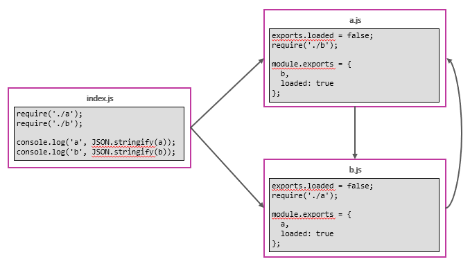
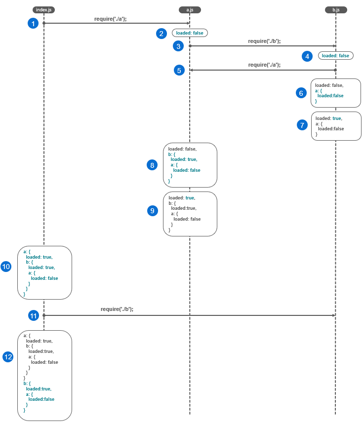
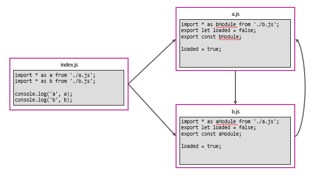
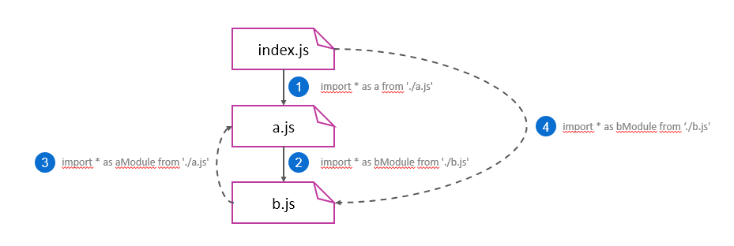
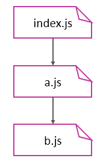
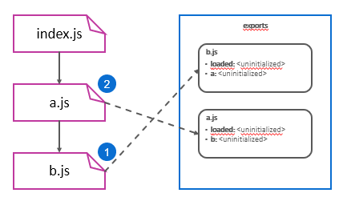
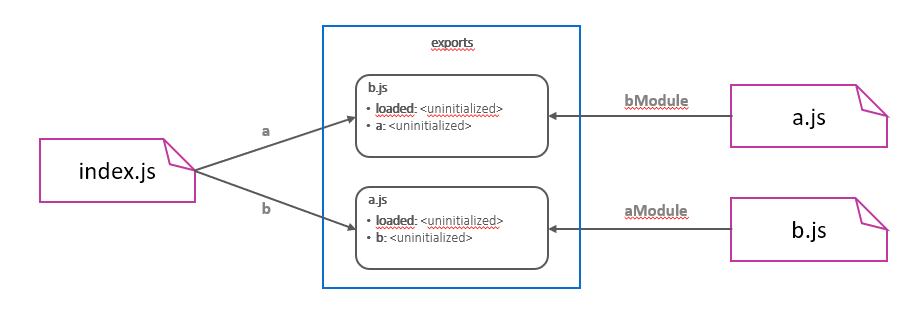
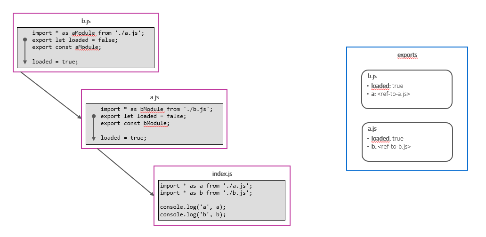

# Part 4: Node.js avanced patterns and techniques
## Chapter 28 &mdash; Node.js' module system in depth 
> Understanding *CommonJS* and *ES modules* in depth

### Contents
+ Why modules are necessary and the different module system available in Node.js
+ CommonJS internals and module patterns
+ ES Modules (ESM) in Node.js
+ Differences and interoperability between CommonJS and ESM

### Intro
Modules are one of the pillars of the Node.js philosophy and programming experience.

In generic terms, modules are the bricks for structuring non-trivial applications, as they allow you to divide the codebase into small units that can be developed and tested independently. Modules also enforce information hiding by keeping private all the details (classes, functions and variables) that are not explicitly marked to be exported.

Node.js comes with two different module systems: CommonJS (CJS) and ECMAScript modules (ESM or ES Modules).


### The need for modules
Modules are important to address the following fundamental concerns of software engineering:
+ Being able to split the codebase into multiple files &mdash; to help with application structure and testing the individual pieces.
+ Allowing code reuse across different projects.
+ Encapsulation (or information hiding) &mdash; keeping the private part of the code hidden while exposing a public interface.
+ Managing dependencies &mdash; facilitating module developers to build on top of existing ones with functionalities like importing the chain of dependencies.

The module system also plays an important role in building modules, as it defines the system and tooling that will facilitate the development and consumption.

### Module systems in JavaScript and Node.js
When Node.js was created, it was conceived as a server runtime for JavaScript with direct access to the underlying filesystem, which represented a unique oportunity to introduce a different way to manage modules that would not rely on the `<script>` tag.

For its module system, Node.js came up with an implementation of the *CommonJS* specification (CJS). This has been the dominant module system in Node.js, and it became also quite prominent in the browser environments thanks to module bundlers like Browserify and webpack.

In 2015, ECMAScript 6 (ES 2015) released a proposal for a standard module system coinde *ESM* or *ECMAScript modules*.

It took several years for Node.js to come up with a solid implementation of the specification, but Node.js ships with stable support for ESM starting from version 13.2.

The general consensus is that *ESM* will become the de facto standard to manage JavaScript modules in both the browser and the server. The reality though is that the majority of the projects in Node.js still rely on *CJS*.

As a Node.js developer you should feel comfortable with both systems, and the recommendation is to leverage *ESM* as much as possible.

### The module system and its patterns
Let's recall once again why we need the modules:
> modules are the bricks for structuring non-trivial applications, and the main mechanism to enforce information hiding by keeping private all the classes, functions and variables not explicitly marked to be exported.

Let's introduce a generic pattern that helps with information hiding and that we will use for building a simple module system: the **revealing module** pattern.

#### The revealing module pattern
JavaScript does not have the concept of *namespacing*. Because of that, every script runs in the *global scope* which means that every piece of code pollutes this global scope exposing their own pieces of functionality and potentially clashing with existing features that have the same name.

However, we know that JavaScript functions define a scope that makes the variables created within a function inaccesible from the outside.

This can be used to solve the problem of global scope in what is called the **revealing module** pattern.

```javascript
const myModule = (() => {
  const privateFunction = () => {};
  const privateVariable = []

  const exported = {
    publicFunction: () => {},
    publicVariable: []
  }

  return exported;
})();

console.log(myModule); // { publicFunction: [Function: publicFunction], publicVar: [] }
undefined undefined
console.log(myModule.privateFunction, myModule.privateVariable); // undefined undefines
```

This the base for the *CJS* module system.

| SAMPLE: |
| :---- |
| The code sample can be found in [01 &mdash; The revealing module pattern](../01-revealing-module-pattern/). |

### CommonJS modules
*CommonJS* is the first module system originally built into Node.js. The main concepts behind this module system are:
+ `require(...)` is a function that allows you to import a module from the local filesystem.
+ `exports` and `module.exports` are special variables that can be used to export public functionality from the current module.

In order to understand the capabilities and nuances of the module system, we will refer to a homemade implementation of the module system that will feature:
+ a module loader function `loadModule(...)`
+ a `require(...)` function that is called when importing a module

We will also see how to define a module with this homemade system.

#### The module loader function

The following code creates a function that mimics the fundamental capabilities found in *CommonJS* when loading modules:

```javascript
function loadModule(filename, module, require) {
  const wrappedSrc = 
    `(function (module, exports, require) {
      ${ fs.readFileSync(filename, 'utf8') };
     })(module, module.exports, require);`;
  eval(wrappedSrc);
}
```

Essentially, we have wrapped the module source code into a function following the **revealing module** pattern. Note that the function that we use to wrap the function with is passing `module`, `exports` and `require` to the module (i.e. those arguments will be available for the module source code to use).

Note also how the `exports` object given to the module is a reference to the `module.exports` that `loadModule` receives.

Note also that `fs.readFileSync(...)` is used to read the module contents. This is deliberate decision that is used to ensure that when importing modules those are loaded in the right order.

#### The homemade `require(...)` function

With the module loader in place, we can now implement the `require(...)` function that the applications will use to load modules:

```javascript
function require(moduleName) {
  /* resolve -> is it local module?, is it core module? is it 3rd party module?, */ 
  const id = require.resolve(moduleName);

  /* if the module have been seen before, return its `exports` object right away */
  if (require.cache[id]) {
    return require.cache[id].exports;
  }

  /* new module setup */
  const module = {
    exports: {},
    id
  };

  /* new module registration in the cache */
  require.cache[id] = module;


  /* load the module */
  loadModule(i, module, require);

  return module.exports;
}

/* cache initialization */
require.cache = {};

require.resolve = (moduleName) => {
  /* ... code to resolve id from moduleName ... */
};
```

#### Homemade module system analysis

With both the `loadModule(...)` and `require(...)` functions in place we can thoroughly analyze how our homemade system works:

1. The `require(...)` function used to load modules from applications  accept a module name as input. The name of the module is mapped into an `id` via delegation through the `require.resolve(...)` function. This function will have to deal with things as discerning whether we are trying to load a local module (e.g. `require('./lib/logger')`), a core Node.js module (e.g. `require('fs')`) or a 3rd party module from `node_modules`(e.g. `require('express')`).

2. Modules are cached based on their `id`. That is, if the `id` of the module has been seen before, the objects exported from that module, which are also cached, will be returned immediately. Note that depending on how `require.resolve()` is implemented, the same source code *might* have different `id` and therefore return different objects.

3. If the module has not been seen before, we initialize the cache record with the known `id` and an empty `exports` object. The `exports` object will be given to the module so that it can expose its public API.

4. The module source code is loaded using the `loadModule(...)` function, passing it the `id`, the `module` object, and the `require(...)` function. Note that the `loadModule(...)` function will in turn make available to the actual module source code:
    + the `module` object, that includes the `id` and the empty `exports` object.
    + an `exports` variable that points to `module.exports`, that is, a named reference `exports` that points to `module.exports`.
    + the `require(...)` object reference, so that the module can import other modules and access their public API.

5. After the module has loaded, the module's public API that has been added to `module.exports` either directly (using explicitly `module.exports`) or indirectly (through the `exports` reference) is returned, so that the caller can use the *require'd* module public API.

#### Defining a module
Once all the complexity of the module loading system has been addressed, the module developer has an easy task consuming and creating modules:

```javascript
// require(...) is made available through module loader
const dependency = require('./lib/myModule');

/* private function */
function log() {
  console.log(`Hello, ${ dependency.username }`);
}

/* module.exports made available through module loader */
// setting the module's public API using `module.exports`
module.exports.run = () => {
  log();
}
```

The fundamental concept the module developer must remember is:
> everything inside a module is private, unless it is assigned to the `module.exports` property.

Also, the developer must be aware that:
> the content of `module.exports` is cached when the module is read for the first time using `require(...)`. Subsequent invocations will not re-read the file and instead, will return the public API of the module from `require`'s internal cache.

##### `module.exports` vs. `exports`

A common source of confusion in Node.js is the difference between `module.exports` and `exports`: when to use each, and caveats you might find when not using it appropriately.

Our homemade implementation of the module loader system can help solve this confusion once and for all:

+ each module is given an `exports` object that is meant to keep the module's public API
```javascript
module = {
  exports: {},
  id
};
``` 

+  When loading the module, the following arguments are *injected* into the module source code:
  + the `module` object (defined above)
  + a direct reference to `module.exports` named `exports`
  + the `require` object

```javascript
/* ... */
loadModule(i, module, require);

/* ... */
function loadModule(filename, module, require) {
  const wrappedSrc = 
    `(function (module, exports, require) {
      ${ fs.readFileSync(filename, 'utf8') };
     })(module, module.exports, require);`;
  eval(wrappedSrc);
}
/* ... */
```

###### Using `exports` to attach properties to the module's public API
Therefore, `exports` points to `module.exports` and cannot be reassigned in the module's source code, or it will no longer point to `module.exports` and therefore, will fail to expose the public API correctly.

Thus, we can use `exports` to attach new properties to the public API of the module:

```javascript
exports.username = 'Jason Isaacs';
exports.hello = () => { console.log('Hello'); }
```

As `exports` is a reference to `module.exports`, the previous line will have the following effect:

```javascript
module.exports.username = 'Jason Isaacs';
module.exports.hello = () => 
```

###### Reassigning `exports` have unintended consequences

Reassigning `exports` variable will have no effect on `module.exports`.

If you do:

 ```javascript
 /* DON'T */
 exports = () => {
   console.log('Hello to Jason Isaacs');
 }
 ```

will change the object exports is pointing to from `module.exports` to the function written above. As a consequence, that function will not be exposed in the module's public API.

If what we want to do is to export a certain *somethings* (variable, function, class...) what we can do is reassign the `module.exports` instead:

```javascript
module.exports = () => {
  console.log('Hello to Jason Isaacs');
}
```

###### Exercise 28.1

We need to create a module `currency` that converts between two given currencies (Euros and Dollars). The module will then to export two functions:

```javascript
fromEurosToDollars(eurosAmount) { /* ... */ }
fromDollarToEuros(dollarsAmount) { /* ... */ }
```

How can we export those functions in the modules public API?

As stated before, the module receive `module.exports` and an `exports` variable that points to `module.exports`.

Therefore, we can either do:

```javascript
module.exports.fromEurosToDollars = fromEurosToDollars;
module.exports.fromDollarsToEuros = fromDollarsToEuros;
```

or:

```javascript
exports.fromEurosToDollars = fromEurosToDollars;
exports.fromDollarsToEuros = fromDollarsToEuros;
```

Both will have the same effect.

###### Exercise 28.2

A module `currency.js` is created to convert from Euros to Rupees and vice versa. Instead of exposing the conversion functions as done before, the cnversion has been redesigned as a class `CurrencyConverter`with functions to convert from one currency to the other.

How can we export that class in the module's public API?

In this case we will not be adding properties to the `module.exports` object, so it'll be better to simply reassign the `module.exports` received to our `CurrencyConverter` class.

```javascript
class CurrencyConverter { /* ... */ }

module.exports = CurrencyConverter;
```

Note that in this case, using `exports = CurrencyConverter` will just reassign the object `exports` is pointing to, and will not have the desired effect.

##### The `require(...)` function is synchronous
The `require(...)` function returns the public API of a module using a simple style with no callbacks involved.

As a consequence, any assingment to `module.exports` must be synchronous as well. For example, this will cause trouble:

```javascript
setTimeout(() => {
  module.exports = function () { /*... */ }
});
```

Another consequence is that only synchronous code should be used during the definition of a module. If some asynchronous initialization is needed, what we have to do is to export an *uninitialized* module, and then initialize it asynchronously at a later time.

#### The resolving algorithm
Node.js loads different versions of a module depending on where the module is loaded from. The merits for solving this *dependency hell* is shared between Node.js package managers and the implementation of the `require(...)` function.

As stated before, the `resolve(...)` function is used as follows by `require(...)`:

```javascript
const id = require.resolve(moduleName);
```

That is, `resolve(...)` receives the argument passed to `require(...)` and just by looking at it, it returns a unique `id` for the module that would let us fetch it from the cache if it has been seen before, or load it from the filesystem if it's the first time we see it.

The resolving algorithm then depends on `moduleName`, which is a path, and it has three major branches:
+ File modules: if `moduleName` starts with `/` it is considered an absolute path to the module, and it's returned as is. If it starts with `./` it is considered a relative path, and the path is calculated from the directory of the *requiring* module.
+ Core modules: if `moduleName` is not prefixed by `/` or `./` the algorithm will first try to search within the core Node.js modules.
+ Package modules: if no core module is found matching `moduleName`, then the search continues by looking for a matching module in the first `node_modules` directory that is found navigating up in the directory structure, starting from the requiring module. The algorithm continues to search for a match until it reaches the root of the filesystem.

Regarding the actual names for the modules, the resolving algorithm will try to match the following when passing `moduleName`:
+ `<moduleName>.js`
+ `<moduleName>/index.js`
+ the *directory/file* specified in the `main` property of the `<moduleName>/package.json`

The `node_modules` directory is where the package managers install the dependencies for each package. In order to correctly handle the transitive dependencies, each package can have its own private dependencies (i.e. their own `node_modules` within `node_modules`).

##### Exercise 28.3

Consider the following directory structure:

```
myApp
├── foo.js
└── node_modules
    ├── depA
    │   └── index.js        #1
    ├── depB
    │   ├── bar.js
    │   └── node_modules
    │       └── depA
    │           └── index.js #2
    └── depC
    │   ├── foobar.js
    │   └── node_modules
    │       └── depA
    │           └── index.js  #3
    └── depD
        └── d.js
```

1. Is this structure correct? What is the explanation?
2. Explain what will happen when calling `require('depA')` from `/myApp/foo.js`
3. Explain what will happen when calling `require('depA')` from `/myApp/node_modules/depB/barj.js`
4. Explain what will happen when calling `require('depA')` from `/myApp/node_modules/depC/foobar.js`
5. Explain what will happen when calling `require('depA')` from `/myApp/node_modules/depD/d.js`

1. Yes, it is correct. The fact that we find multiple private instances of `node_modules` indicate that there are three different versions of `depA` in the project, one required from `foo.js`, one required by `bar.js` and another one required by `foobar.js`.
2. According to the resolving algorithm, as `depA` is not an absolute or relative path, and neither a core module, Node.js will try to match `depA` in `node_modules` from the location of the requiring module. Therefore, it will match #1.
3. For the same reason, when invoked from `/myApp/node_modules/depB/barj.js` #2 will be loaded.
4. In this case, #3 will be loaded.
5. As `depD` does not have a private `node_modules`, the resolving algorithm will go up from `/depD` to `myApp/node_module` and load #1-

| NOTE: |
| :---- |
| Although the resolving algorithm is transparently invoked when using `require(moduleName)` it can be invoked separately using `require.resolve(moduleName)`. This will be pretty handy when trying to find inconsistencies in application behavior. For example, when creating async namespaces and different portions of the application see different async contexts because they load different versions of a given module. |

#### The module cache
Each module is only loaded and evaluated the first time it is required &mdash; any subsequent calls will return the cached version.

Caching has the following consequences:
+ It makes it possible to have cycles within module dependencies
+ It guarantees, to some extent, that the same instance is always returned when requiring the same module from within a given package.
+ It ensures a good performance while loading modules

| NOTE: |
| :---- |
| The module cache is exposed via the `require.cache` variable, so it is possible to directly access it if needed. A common use case is to delete the relative key of a given module in the `require.cache` variable for testing. Any other use cases are highly discouraged. |

#### Circular dependencies
Circular dependencies is something that happens quite frequently in real projects, especially when using a multitude of small modules, so it is important to understand how they are addressed by Node.js *CommonJS* system.

Let's supppose we have the following scenario:


+ the main program requires both modules *a* and *b*.
+ module *a* requires and exports *b*, along with a local variable initialized within the module in two different points: before loading *a* as `false` and afterwards as `true`
+ module *b* requires and exports *a*, along with a local variable initialized within the module in two different points: before loading *b* as `false` and afterwards as `true`.

If we inspect the contents of `a` and `b` when running the main file we get:

```javascript
a ->  {
  "b": {
    "a": {
      "loaded": false
    },
    "loaded": true
  },
  "loaded": true
}
b -> {
  "a": {
    "loaded": false
  },
  "loaded": true
}
```

The result reveals the caveats of circular dependencies with CommonJS: different parts of our application will have a different view of what is exported by the modules *a* and *b*, that depends on how those modules are being loaded.

In particular, while both modules are completely initialized as soon as they're required by the main program, *a* will be incomplete when it is required from *b*.

In order to understand what happens, let's do a deep dive on how the different modules are interpreted and how their local scope changes along the way.



1. `index.js` require `a.js`. It is the first time that Node.js sees this module, so it interprets it.
2. While `a.js` is being *interpreted*, the variable `loaded` is set to `false`.
3. Also in `a.js`, the module requires `b.js`. It is the first time that Node.js sees this module, so it interprets it.
4. While `b.js` is being *interpreted*, the variable `loaded` is set to `false`.
5. Also in `b.js`, the module requires `a.js`. This module has been seen before, but it has not been completely loaded. A *cycle* is found.
6. While in `b.js`, the current state of `a.js` is obtained: `a.loaded: false`.
7. Finally in `b.js`, the `loaded` property is set to true.
8. Now `a.js` can continue processing: it copies the current state of the exported values of `b.js`:
```javascript
b.loaded: true
b.a.loaded: false
```
9. Finally, `a.js` has completed its execution and sets the `loaded` property to true.
10. Back in `index.js`, the require of `a.js` has completed and has the following state:
```javascript
a: {
  loaded: true,       // set in 9
  b: {                // set in 8
    loaded: true,
    a: {
      loaded: false
    }
  }
}
```
11. Also in `index.js`, `b.js` is required. This module has been seen before, so the state is returned without interpreting it again. 
12. The state that is given to `index.js` is the following:
```javascript
b: {
  loaded: true,
  a: {
    loaded: false
  }
}
```

As a result, `index.js` ends up with the following data:

```javascript
a: {
  loaded: true,
  b: {
    a: {
      loaded: false
    },
    loaded: true
  }  
}
b: {
  loaded: true,
  a: {
    loaded: false
  }
}
```

See the inconsistencies caused by the cycle:
> `a.loaded == true`, while `b.a.loaded == false`. Also `a.b.a.loaded == false`.

The issue comes with the fact that `b.js` has a partial view of `a.js` when exporting it, and this partial view gets propagated when `b.js` is required by the main program. This also sparks the intuition that if we change the order in which the modules are required in the main program, it is `a.js` the one that will receive an incomplete version of `b.js` and propagate it:
> `b.loaded == true`, while `a.b.loaded == false`. Also `b.b.loaded == false`.

```javascript
a: {
  loaded: true
  a: {
    b: {
      loaded: false
    },
    loaded: true
  }

}
b: {
  loaded: true
  b: {
    loaded: false
  },
}
```

See [02 &mdash; Circular Dependencies with *CommonJS*](./02-circular-dependencies-scenario/).

As a takeaway, we see how difficult it is to really understand what is the information that gets exported when a cycle is found, which can be quite likely if the project is big enough, so the recommendation is to avoid cycles as much as possible.

### Module definition patterns
In this section we will analyze the some of the most popular patterns for defining modules in Node.js, such as named exports, exporting functions, classes and instances, and monkey patching.

As with any other mechanism for defining APIs, the aim is to maximize information hiding and API usability, balancing them with other software qualities such as extensibility and code reuse.

#### Named exports
The **named exports** pattern consists in assigning the values we want to make public to properties of the object referenced by `exports` (or directly to `module.exports`).

The resulting object becomes a container or namespace for a set of related functionalities:

```javascript
// file: logger.js
exports.info = (message) => {
  console.log(`info: ${ message }`);
}

exports.verbose = (message) => {
  console.log(`verbose: ${ message });
}
```

The exported functions are then available as properties of the loaded module:

```javascript
// file: index.js
const logger = require('./logger');
logger.info(`An informational message`);
logger.verbose(`A verbose message`);
```

Most of the Node.js core modules use this pattern.

#### Exporting a function
Another popular definition pattern consists in reassigning the whole `module.exports` variable to a function. The main strength of this pattern is that it allows you to expose a single functionality, which provides a clear entry point for the module, making it simpler to understand, and honors the principle of *small surface* area very well.

| NOTE: |
| :---- |
| This pattern is also known as the **substack** pattern, in honor of its most prolific adapter. |

```javascript
// file: logger.js
module.exports = (message) => {
  console.log(`info: ${ message }`);
}
```

A possible extension of this pattern consists in using the exported function as a namespaces for other public APIs. This gives us the clarity of the single entry point, along with the possibility of exposing other secondary or more advanced use cases.

```javascript
// file: logger.js
module.exports.verbose = (message) => {
  console.log(`verbose: ${ message }`);
};
```

From the consumer perspective, we would have:
```javascript
const logger = require('./logger');
logger('This is an informational message');
logger.verbose('This is a verbose message');
```

Note that the power of this pattern lies in:
+ You put the emphasis on a single functionality
+ You also export secondary or internal aspects, exported as properties of the exported function itself.

The modularity of Node.js heavily encourage the adoption of the **single-responsibility principle (SRP)**: every module should have responsibility over a single functionality and that responsibility should be entirely encapsulated by the module.


##### Functions are objects
The substack pattern leverages the concept that functions are first-class objects in JavaScript and therefore can hold properties and other functions.

const myFun = function announceYourself() {
  console.log(`Hello, I am a function`);
};

myFun();

myFun.sayHello = () => {
  console.log(`Hello to Jason`);
};

myFun.sayHello();

myFun.person = 'Jason Isaacs'; 

| EXAMPLE: |
| :------- |
| You can find an example in [e01 &mdash; Functions are objects](./e01-functions-are-objects/). |


#### Exporting a class
A module that exports a class is a specialization of a module that exports a function. The difference is that with this pattern we also allow the user to create new instances using the constructor, and we also give them the ability to extend its prototype and forge new classes.

| EXAMPLE: |
| :------- |
| You can find an example in [05 &mdash; Exporting a class](./05-exporting-a-class/). |

Note that exporting a class still provides a single entry point for the module, but compared to the **substack** pattern, it gives away much more information about the module internals. On the other hand, it allows much more power when it comes to extending its functionality.

#### Exporting an instance
We can leverage the caching mechanism of `require(...)` to easily define stateful instances created from a constructor or a factory, which can be shared across different modules.

| EXAMPLE: |
| :------- |
| You can find an example in [06 &mdash; Exporting an instance](./06-exporting-an-instance/). |

Because the module is cached, every module will retrieve the same instance of the object, thus sharing the state. However, we have already seen that the resolving algorithm allows different installations of the module in different parts of the dependency tree. This will result in multiple *different* instances of the same logical module, all running in the context of the same Node.js application.

Another interesting detail of this pattern is that it does not preclude the opportunity to create new instances, even if we're not exporting the class.

```javascript
const logger = require('./logger');

// This is a bad idea, Harry
const customLogger = new logger.constructor('CUSTOM');
customLogger.log(`logging some info`);
```

#### Modifying other modules or the global scope
Some extreme techniques that should be generally considered bad practices might come in handy for testing.

For example, a module can modify other modules or objects in the global scope, a technique known as **monkey patching**. Using this technique, runtime objects can be changed to either extend their behavior or apply temporary fixes.

Typically, the patching occurs in a module that modifies the global scope and does not export anything:

```javascript
require('./logger').customMessage = function () {
  console.log(`this is new functionality patched into an existing module`);
};
```

Then in your main program you can do:
```javascript
require('./patcher');
const logger = require('./logger');

logger.customMessage();
```

| EXAMPLE: |
| :------- |
| You can review [07 &mdash; Monkey Patching](./07-monkey-patching/) for a runnable example. |

This technique can be very dangerous to use as you will be modifying the state of entities out of the scope of the module that is performing the modifications. This might lead to unpredictable, especially when multiple modules interact with the same entities.

| REAL WORLD EXAMPLE: |
| :------------------ |
| A real-world example of **monkey patching** in the Node.js ecosystem can be found in [nock](https://github.com/nock/nock#readme). This module *monkey patches* the core `http` module so that it provides the mocked response rather than issuing a real HTTP request. This is a valid use case of **monkey patching** as it allows us to write tests that rely on 3rd party APIs. |

### ESM: ECMAScript modules
ECMAScript modules (also known as ES modules or ESM) were introduced as part of the ECMAScript 2015 specification with the goal to give JavaScript an official module system suitable for different execution environments.

The syntax for ESM is very simple and compact. There is support for cyclic dependencies and the possibility to load modules asynchronously. While the system tries to retain the good ideas from CommonJS and AMD, there are several differences. For example, ES modules are static, meaning that imports are given at the top level of every module and outside of any control flow statement.

For example, that is not allowed when using ESM:

```javascript
if (condition) {
  import module1 from 'module1'
} else {
  import module2 from 'module2'
}
```

#### Using ESM in Node.js
Node.js will consider any `.js` file as using *CommonJS*. There are several ways to tell Node.js that a given module is an ES module:
* Give the module an extension `.mjs`
* Add the nearest `package.json` a property `"type": "module"`.

#### Named exports and imports
ESM allows us to export functionality from a module through the `export` keyword. In an ES module, everything is private by default and only exported entities are publicly accessible from other modules.

The `export` keyword can be used in front of the entities that we want to make available. The following common scenarios are supported:

1. Export a function:
```javascript
/* exports a function as `log` */
export function log(message) { /*...*/ }
```

2. Export a constant:
```javascript
/* exports a constant as `DEFAULT_LEVEL` */
export const DEFAULT_LEVEL = 'info';
```

3. Export an object:
```javascript
/* exports a object as `LEVELS` */
export const LEVELS = { /* ... */ };
```

4. Export a class:
```javascript
/* exports a class as `Logger` */
export class Logger { /* ... */ };
```

You use the `import` keyword to import entities from a module. The syntax is very flexible and it allows you to import one or more entities and to rename imports. Let's see the different supported scenarios:

| NOTE: |
| :---- |
| See how *ES modules* forces you to use the whole name `'./logger.js'` when importing the module. Using only `'./logger'` won't work! |

1. *Namespace import*: import all the members of the module and group them under a local name
```javascript
import * as loggerModule from './logger.js'
```

2. Import a single entity from a module
```javascript
import { log } from './logger.js'
```

3. Import several entities from a module
```javascript
import { log, Logger } from './logger.js'
```

4. Importing entities from a module and renaming them to prevent name clashes
```javascript
import { log as loggingFn, Logger as LoggerClass } from './logger.js'
```

| EXAMPLE: |
| :------- |
| You can review [08 &mdash; ESM named exports and imports](./08-esm-named-exports-and-imports/) for a runnable example. |

| NOTE: |
| :---- |
| In order to enable using ES modules in Node.js you have to:
+ Update your `package.json` to include a top-level property `"type": "module"`
+ Update your `.eslintrc.yml` to configure the `parserOptions.sourceType: module` |

#### Default exports and imports
ESM provides the *default export* functionality that encourages module developers to follow the single-responsibility principle and expose one clear interface (this is similar to the *CommonJS* functionality in which you assign a single element to `module.exports`).

A default export makes use of the `export default` keywords:

```javascript
export default class Logger { /* ... */ }
```

When using this approach, the name `Logger` is ignored, and the exported element is registered under the name `default`.

When importing it a default export you are bringing the module functionality into the scope and renaming it in one shot:

```javascript
import MyLogger from './logger.js';

const myLogger = new MyLogger('DEFAULT');
```

| NOTE: |
| :---- |
| Technically, when doing a default export, the ESM system will create a named export under the name `default`. However, as `default` is a reserved keyword something like `import { default } from './logger.js'` won't work. |

| EXAMPLE: |
| :------- |
| You can review [09 &mdash; Default exports](./09-export-default/) for a runnable example. |

#### Mixed exports
It is possible to mix named exports and a default export within ES module, mimicking what you can do in *CommonJS* when using the **substack** pattern.

```javascript
export default function log(message) { /* ... */ }

export function info(message) { /* ... */ }
```

Then you can import the default exported function, the named one, or both:

```javascript
import myLog, { info } from './logger.js';
```

| EXAMPLE: |
| :------- |
| You can review [10 &mdash; mixed exports](./10-mixed-exports/) for a runnable example. |


Let's discuss some key details and differences between *default export* and *named exports*:

* *named exports* are explicit. That makes them eligible for advanced functionalities in IDEs such as automatic imports, refactoring, etc. Default exports, on the contrary, make these things more complicated as the same module might have different names depending on where it is being imported.
* *Default exports* are a convenient way to communicate what is the single most important functionality for the module. Also, it gives the consumer an easy way to import the functionality of the module without having to know the name of the binding.
* *Default exports* make harder to apply dead code elimination techniques (*tree shaking*). This is because if you're importing an object, most module bundlers will assume the whole object is being used when in reality, it might be that only a small portion is actually used.

As a result, it is generally considered a good practice to stick to *named exports*, especially when several functionalities are exposed from the module, and only use *default exports* if there's one clear functionality you want to export.

| NOTE: |
| :---- |
| Despite being considered a good practice to use *named exports*, Node.js core modules uses *mixed exports*. That is, Node.js core modules export default object and a number of named exports. |

#### Module identifiers
Module identifiers or module specifiers are the different types of values that can be used in our `import` statements to identify the location of the module that we want to load:

* *Relative specifiers* &mdash; like `./logger.js` or `../logger.js`.
* *Absolute specifiers* &mdash; like `file:///opt/nodejs/config.js`. Note that *ES modules* doesn't allow you to use `/opt/nodejs/config.js`.
* *Bare specifiers* &mdash; like `express` or `http`. They represent modules available in `node_modules` folder or available as *core Node.js* modules.
* *Deep import specifiers* &mdash; like `fastify/lib/logger.js` which refers to a path with the a package in `node_modules`.

| NOTE: |
| :---- |
| In browser environments, it is possible to import modules specifying the module URL such as `https://unpkg.com/lodash`. This feature is not supported by Node.js. |

#### Async imports
The `import` statement is static and therefore subject to two important limitations:
* A module identifier cannot be constructed at runtime
* Module imports are declared at the top level or every file, and cannot be nested within control flow statements.

However, ES modules also provides *async imports* (also called *dynamic imports*) which can be used to load a module only if program flow requires it. This is implemented by the special `import()` operation, which is syntactically equivalent to a function that takes a module identifiers as an argument, and returns a promise that resolves to a module object.

The module identifier can be any module identifier supported by static imports as discussed in the previous section.

| EXAMPLE: |
| :------- |
| You can find in [11 &mdash; Hello, dynamic import](./11-hello-dynamic-import/) a runnable example. |

#### Module loading in depth
This section deep dives into how JavaScript code is parsed and evaluated when using ES modules. That will give us all the necessary insights to be able to use it effectively including:
+ how ECMAScript modules are loaded
+ the concept of read-only live bindings
+ how ECMAScript modules deal with circular dependencies

##### Loading phases
The goal of the interpreter is to build a graph of all the necessary modules &mdash; a dependency graph.

| NOTE: |
| :---- |
| A dependency graph can be defined as a directed graph representing the dependencies of a group of objects. In this section, a dependency graph states the relationships between ECMAScript modules. This artifact will let us determine in the order in which all the necessary modules should be loaded in a given application. |

When the Node.js interpreter is launched, it gets passed a JavaScript file that is the **entry point** of the application. This is the starting point for the dependency resolution. From the *entry point*, the interpreter will find and follow all the `import` statements recursively in a depth-first fashion untill all the necessary code is explored and evaluated.

This process can be divided in three different phases:
1. Construction (or parsing) &mdash; where all the imports are found and the corresponding content of every module is loaded.

2. Instantiation &mdash; for every exported entity, keep a named reference in memory, but don't assign a value just yet. Also, references are created for all the import and export statements tracking the dependency relationship between them (linking). No JavaScript code has been executed at this stage.

3. Evaluation &mdash; Node.js finally executes the code so that all the previously instantiated entities can get an actual value. Now it is possible to start executing the code starting from the *entry point*, as all the blanks have been filled.

The fundamental difference between this approach and CommonJS' one is that due to its dynamic nature, CommonJS will execute the files while the dependency graph is being explored.

##### Read-only live bindings
Another, not so evident, characteristic of ES modules which is fundamental in the resolution of cyclic dependencies is the idea that imported modules are *read-only live bindings* to their exported values.

Let's consider the following module that exports a counter and a function to increment it:

```javascript
export let count = 0;
export function increment() {
  count++;
}
```

Now, let's assume that the app imports that module and perform the following operations:
```javascript
import { count, increment } from './counter.js';

console.log(count);
increment();
console.log(count);
count++; // TypeError: assignment to constant variable
```

Even if we can get ahold of the `count` variable, and even when it is declared as `let`, if we try to change its value directly we get a `TypeError`.

This demonstrates that when an entity is imported in the scope via `import`, the binding to its original value cannot be changed (read-only binding), unless the binding changes within the scope of the original module itself (*live binding*), and therefore, out of the direct control of the consumer code.

This is another essential difference from *CommonJS*, where the entire `exports` object is copied (via shallow copy) when required from a module. This means that if the value of a primitive variable like numbers or strings is changed, the requiring module won't be able to see the change.

That is, in *CommonJS* we would have:

```javascript
let { counter, increment } = require('./counter');

console.log(counter); // 0
increment();
console.log(counter); // still 0, because the requiring module is unaware of the change
counter++;  // allowed
console.log(counter); // now 1, but now it is the exporting module the one that is unaware of the change
```


| EXAMPLE: |
| :------- |
| You can find in [12 &mdash; ES modules read-only live bindings](./12-read-only-live-bindings/) and in [e02 &mdash; CommonJS does not have read-only live bindings](./e02-commonjs-no-read-only-live-bindings/) examples that demonstrates the difference in handling of exported bindings in *ES modules* and *CommonJS*. |

##### Circular dependency resolution
In this section we will reimplement the same circular dependency scenario that we explored using *CommonJS*, but this time using *ES modules*.



When we run the program we will get:

```
a -> <ref *1> [Module] {
  b: [Module] { a: [Circular *1], loaded: true },
  loaded: true
}
b -> <ref *1> [Module] {
  a: [Module] { b: [Circular *1], loaded: true },
  loaded: true
}
```

The first thing to note is that because of read-only live bindings, we can no longer do `JSON.stringify(a)` because `a` contains an actual reference to `b` and `b` to `a` so `JSON.stringify(...)` will complain about a `TypeError`.

Also, we see that both `a` and `b` have a consistent picture of each other, which didn't happen with *CommonJS*.

Finally, we can also see that if we change the order in which `a` and `b` are loaded, the final picture does not change:

```
a -> <ref *1> [Module] {
  b: [Module] { a: [Circular *1], loaded: true },
  loaded: true
}
b -> <ref *1> [Module] {
  a: [Module] { b: [Circular *1], loaded: true },
  loaded: true
}
```

Let's do a deep-dive on the three phases of module resolution for this scenario, to understand why *ES modules* is able to correctly solve the cycle in a consistent manner.

###### Phase 1: Parsing
As elaborated earlier, during the parsing phase the code is explored starting fromt he entry point `index.js`. The interpreter looks only for `import` statements to find all the necessary modules and to load the source code from the module files.

The dependency graph is explored in a *depth-first* fashion, and every module is visited only once. Thus, the interpreter will build a dependency for our scenario that looks as the following picture:



1. From `index.js`, the first import found leads us into `a.js`. As we're doing a depth-first traversing, we leave the current file and jump to explore the import.
2. In `a.js` we find an import pointing to `b.js`. Again, we leave the current module file and jump into `b.js`.
3. In `b.js` we find an import back into `a.js`. Since `a.js` has already been visited, this path is not explored again. That is why the arrow in the diagram is not drawn with a solid pattern.
4. As no further imports are found, the exploration starts to wind back: `b.js` does not have other imports, so we go back to `a.js`, which also doesn't have other imports, so we go back to `index.js`. In `index.js` we find another import pointing to `b.js`, but at this module has been explored already, the path is ignored.

All in all, only the solid arrows are kept in the dependency graph, which is a directed graph that points from `index.js` to `a.js` to `b.js`.



###### Phase 2: Instantiation
In this phase, the interpreter walks the tree view obtained from the previous phase from the bottom to the top. For every module visited, the interpreter looks for all the exported properties and builds a map of the exported names in memory.



Note that at this point, the exports map just keep track of the exported names only &mdash; their associated values are considered uninitialized for now.

Once the exports map has been created, there will be a 2nd pass of the tree to link the exported names to the modules that import them, so that we have a view of who is using what.

In our case this information will be summarized as:
1. Module `b.js` will link the exports from `a.js` through the `aModule` name
2. Module `a.js` will link to all the exports from `b.js` using the `bModule` name
3. `index.js` will link to all the exports from `a` and `b` referring them as `a` and `b`.



###### Phase 3: Evaluation
The last step is the evaluation phase. In this phase, all the code in every file is finally executed following a bottom-up fashion respecting the post-order depth-first visit of the original dependency graph. 

As a result, `b.js` will be executed first, then `a.js` and `index.js` will be the last file to be executed. Doing so ensures that all the exported values have been initialized before we start execution our main business logic directed by `index.js`.

The process is as follows:
1. `b.js` 
  1. The execution starts from the *exports*, as the *imports* have already been initialized. First of all, the `loaded` variable will be initialized to `false`.
  2. Then we get to the definition of `a` which will be evaluated as a reference to the module in the `exports` object that represents the `a.js` module.
  3. The `loaded` property is set to `true`, and the module `b` has been fully evaluated.
2. `a.js`
  1. The execution starts from the *exports*, as the *imports* have already been initialized. First of all, the `loaded` variable will be initialized to `false`.
  2. Then we get to the definition of `b` which will be evaluated as a reference to the module in the `exports` object that represents the `b.js` module.
  3. The `loaded` property is set to `true`, and the module `a` has been fully evaluated.
3. `index.js`
  1. The execution starts importing `a` which is taken as a variable definition that references the properties exported from `a.js` and that has been fully evaluated.
  2. Similarly, `b` will be defined as a reference of the properties exported from `b.js` and that has been fully evaluated.
  3. Then, we print the values for `a` and `b` which have sensible values even in the presence of circular dependencies.



#### Modifying other modules
We have demonstrated that entities imported through ES modules are *read-only live bindings* and therefore, we cannot reassign them from an external module.

However, if the default export or named export is an object, we will still be able to mutate the object itself by reassigning some of the object properties.

That technique might come in handy when we need to alter the behavior of a particular module, especially in tests, etc.

| EXAMPLE: |
| :------- |
| You can review [14 &mdash; ESM monkey patching](./14-esm-monkey-patching) for a simple runnable example. |

Let's review the caveats of the example code:
+ We have done `import fs from 'fs'` but we could have as well done `import * as fs from 'fs'` or `import { readFile } from 'fs'`.  In both cases, we would have gotten read-only live bindings, and therefore, we wouldn't have been able to mutate as we did.
+ Again, if we would have done similarly when importing the module in our `index.js` we would have ended up not using the mocked functionality.

The reason for both is our mocking module is altering only the copy of `readFile(...)` registered inside the object exported as the default export, but not the one available as a named module at the top level of the module.


| NOTE: |
| :---- |
| *Monkey patching* is trickier in the context of ESM. Some frameworks such as *Jest* provide special functionalities to mock ES modules more reliably than in the example we've seen. Another approach is to use the `module` hooks like *Mocku* does. |

###### Exercise 28.4

Demonstrate the fragility of the monkey patching approach taken in [14 &mdash; ESM monkey patching](./14-esm-monkey-patching).

You can review the exercise in [e03 &mdash; ESM monkey patching fragility](./e03-esm-monkey-patching-fragility)

It is demonstrated that:
+ It works when importing the *default* exported object from `fs`
+ It fails when importing the named export `readFile`
+ It fails when doing the namespace import of `fs`.

An alternative solution consists in using the `syncBuiltinESMExports(...)` from the `module` package. This function makes the value of the properties in the default exports object to get mapped again into the equivalent named exports, effectively allowing us to propagate any external change applied to the module even to named exports.

```javascript
import fs, { readFileSync } from 'fs';
import { syncBuiltinESMExports } from 'module';

fs.readFileSync = () => Buffer.from('Hello to Jason!');
syncBuiltinESMExports();

console.log(fs.readFileSync === readFileSync);

const data = fs.readFileSync('fake-path');
console.log(`data: `, data.toString());
```

| NOTE: |
| :---- |
| `syncBuiltinESMExports()` works only for core, built-in Node.js modules like `fs`. |

###### Exercise 28.5

Use the recently learnt technique `syncBuiltinESMExports()` to improve the robustness of [14 &mdash; ESM monkey patching](./14-esm-monkey-patching).

It is demonstrated in [e04 &mdash; ESM monkey patching with `syncBuiltinESMExports`](./e04-esm-monkey-patching-sync-builtin-esm-exports/)

### ESM and CommonJS differences and interoperability
Let's discuss and summarize the most important differences between *ES modules* and *CommonJS*.

#### File Extensions and `package.json`.
We have already mentioned that when using *ESM* you have to explicitly specify the file extension in imports, while extensions are optional in *CommonJS*. Also, you have to remember to include the `"type": "module"` property specification in your `package.json`. Additionally, you need to update your `.eslintrc` rules.

#### ESM runs in strict mode
ES modules run implicitly in strict mode. You don't have to use `'use strict';` at the beginning of every file.

#### Missing references in *ESM*
In *ESM*, some important *CommonJS* references are not defined:
+ `require`
+ `exports`
+ `module.exports`
+ `__filename`
+ `__dirname`

Especially, `__filename` and `__dirname` which represent the absolute path to the current module file and the absolute path to its parent folder are very useful but will through `ReferenceError` when using in the context of *ESM*.

In *ESM*, you can get a reference to the current file URL using the special object `import.meta`. Specifically, `import.meta.url` will return a reference to the current module path in the format `file:///path/to/current_module.js` which can be used to reconstruct `__filename` and `__dirname`.

It is also possible to recreate the `require(...)` function using which would let us import functionality coming from *CommonJS* modules in the context of ES modules.

Another difference is that in the global scope of an ES module, `this` is undefined, while in *CommonJS*  this is a reference to `exports`.

| EXAMPLE: |
| :------- |
| You can find how to reconstruct these references in [16 &mdash; ESM missing references](./16-esm-missing-references/) for a simple runnable example. |

#### Interoperability
*ES modules* allows you to import *CommonJS* modules using the standard import syntax. Note that the only available syntax style for importing *CommonJS* modules is the default exports:

```javascript
import packageMain from 'commonjs-package'; // OK
```

Importing named exports or using the import namespace syntax is not allowed:

```javascript
import { method } from 'commonjs-package'; // ERROR
import * from 'commonjs-package'; // ERROR
```

Also, *ESM* cannot import JSON files directly as modules:
```javascript
import data from './data.json'; // ERROR
```

This can be worked around using the `createRequire(...)` utility.

```javascript
import { createRequire } from 'module';
const require = createRequire(import.meta.url);
const data = require('./data.json');
console.log(data);
```

| NOTE: |
| :---- |
| There is ongoing work to support JSON module loading natively in ESM. |

You can review the following examples:
+ [17 &mdash; Interoperability with `type: module` at the top-level](./17-esm-commonjs-interoperability/)
+ [18 &mdash; Interoperability without `type: module` at the top-level](./18-esm-commonjs-interoperability-no-type-module/)

Note that while the support is the same in both examples, the changes you have to do in either your project, or the modules you import are different in each case. The second option is the most flexible one, as you don't need to change the extension of the *CommonJS* modules you import.

### You know you've mastered this chapter when...
+ You're aware of the history of modules and understand why modules are the pillars for structuring any non-trivial application.
+ You understand the **revealing module** pattern, which encapsulates functionality without polluting the *global scope*.
+ You understand thoroughly the *CommonJS* internals:
  + You understand the fundamentals pieces:
    + `require(...)`
    + `exports` and `module.exports`
    + the module loader
    + the module cache
  + You are no longer confused by `exports` and `module.exports` and understand that `exports` is a reference to `module.exports`, and that in the *CommonJS* system, the module in the cache is defined as `module = { exports: {}, id}`, with `id` being a reference to the module being loaded.
  + You know about the caveats of circular dependencies in *CommonJS*.
  + You understand the module definition patterns in *CommonJS*:
    + named exports
    + exporting a function
    + the **substack** pattern
    + exporting a class
    + exporting an instance of an object
  + You're aware of the concept of *monkey patching* (modifying other modules or the global scope from other modules).
+ You're comfortable with *ES modules*
  + You can configure and run a project using *ES modules* instead of *CommonJS*
  + You're comfortable using the different export definition patterns in *ESM*:
    + named exports `export function logger(...) { /* ... */ }`
    + default exports `export default class Logger { /* ... */ }`
    + mixing named and default exports

  + You're comfortable using the different import definition patterns in *ESM*:
    + namespace import `import * as loggerModule from './logger.js'`
    + importing a single entity `import { log } from './logger.js'`
    + importing several entities `import { log, Logger } from './logger.js'`
    + importing and renaming `import { log as loggingFn, Logger as LoggerClass } from './logger.js'`
    + importing a default export `import MyLogger from './logger.js'`
    + importing default and named exports `import myLog, { info } from './logger.js'`
  + You're aware that *named exports* are in generally recommended over *default exports*.
  + You're aware that *ES modules* are static, and that `import` statements should be found at the top of the modules. When dynamic imports are needed, you know that you have to rely on the special `import()` operation.
  + You understand in depth the *ES module* loading phases: construction (or parsing), instantiation and evaluation.
  + You understand that *ESM* provide *read-only live bindings* to the exported entities.
  + You're aware that circular-dependency resolution in *ESM* is much more robust than in *CommonJS*.
  + You understand how to do *monkey patching* in *ESM* and understand the caveats.
+ You understand the differences between the *ESM* and *CommonJS* systems and are comfortable *importing* *CommonJS* packages into *ESM* programs.

### Code and Exercises

#### [01 &mdash; *Revealing module* pattern](./01-revealing-module-pattern/)
Illustrates the **revealing module** pattern that serves as the underlying concept behind the *CommonJS* module system of Node.js.

#### [02 &mdash; Circular Dependencies with *CommonJS*](./02-circular-dependencies-scenario/)
Illustrates a circular dependencies scenario.

#### [03 &mdash; Named exports with *CommonJS*](./03-named-exports/)
Illustrates the **named exports** pattern for module definition on which you add properties to the object referenced by `exports` (or directly to `module.exports`) to expose the public API of the module.

#### [04 &mdash; The **substack pattern** in *CommonJS*](./04-substack-pattern/)
Illustrates the **substack** pattern for module definition which consists in exporting a single function from the module assigning it to `module.exports` while exporting internal or secondary functionalities as properties of the exported function.

#### [05 &mdash; Exporting a class in *CommonJS*](./05-exporting-a-class/)
Exporting a class, so that the end user can create instances and also forge new classes by extending its prototype.

#### [06 &mdash; Exporting an instancein *CommonJS*](./06-exporting-an-instance/)
Leveraging `require(...)` cache to export a stateful instance that can be shared across different modules

#### [07 &mdash; Monkey Patching in *CommonJS*](./07-monkey-patching/)
Illustrates how to do **monkey patching** in *CommonJS*, the technique used to modify objects at runtime to change or extend their behavior or apply temporary fixes.

#### [08 &mdash; ESM named exports and imports](./08-esm-named-exports-and-imports/)
Illustrates basic scenarios for *ES modules* `export` and `import`.

#### [09 &mdash; Default exports](./09-export-default/)
Illustrates how to follow the *single responsibility principle* (SRP) in ESM with default exports.

#### [10 &mdash; mixed exports](./10-mixed-exports/)
Illustrates how to mix default and named exports with ESM.

#### [11 &mdash; Hello, dynamic import](./11-hello-dynamic-import/)
Introduces async imports (also called dynamic imports).

#### [12 &mdash; ES modules read-only live bindings](./12-read-only-live-bindings/)
Illustrates the concept of *read-only live bindings* in ES modules.

#### [13 &mdash; Circular dependency scenario in *ESM*](./13-esm-circular-dependency-scenario)
Fabricated circular dependency scenario to illustrate the mechanisms that ES module uses to address circular dependencies.

#### [14 &mdash; ESM monkey patching](./14-esm-monkey-patching)
How to modify other modules when using ES modules.

#### [15 &mdash; ESM monkey patching using `syncBuiltinESMExports`](./14-esm-monkey-patching)
Illustrates how to modify other modules when using ES modules in a more reliable way using `syncBuiltinESMExports(...)`.

#### [16 &mdash; ESM missing references](./16-esm-missing-references/)
Illustrates how you can reconstruct some missing references available in *CommonJS* in the context of *ES modules*.

#### [17 &mdash; Interoperability with `type: module` at the top-level](./17-esm-commonjs-interoperability/)
Illustrates the different ways in which you can work with *CommonJS* modules in the context of *ESM*.

#### [18 &mdash; Interoperability without `type: module` at the top-level](./18-esm-commonjs-interoperability-no-type-module/)
Illustrates the different ways in which you can work with *CommonJS* modules in the context of *ESM*, in this case without setting `"type": "module"`.

#### [e01 &mdash; Functions are objects](./e01-functions-are-objects/)
Explain the underlying concept that allowss the **substack** pattern  to work &mdash; leveraging the fact that functions are objects in JavaScript and therefore can hold other functions and properties.

#### [e02 &mdash; CommonJS does not have read-only live bindings](./e02-commonjs-no-read-only-live-bindings/) 
Demonstrates that *CommonJS* does not have read-only live bindings as *ES modules* do.

#### [e03 &mdash; ESM monkey patching fragility](./e03-esm-monkey-patching-fragility)
Illustrates the fragility of the way in which we mocked the `fs.readFile(...)` function in `mock-read-file.js`

#### [e04 &mdash; ESM monkey patching with `syncBuiltinESMExports`](./e04-esm-monkey-patching-sync-builtin-esm-exports/)
Illustrates how the robustness of the monkey patching of `fs.readFile` can be improved by invoking `module.syncBuiltinESMExports` before and after enabling and disabling the mock.