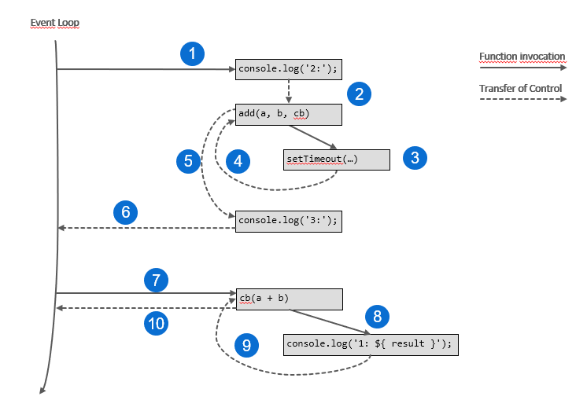
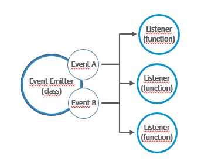

# Part 4: Node.js avanced patterns and techniques
## Chapter 29 &mdash; Callbacks and Events in depth
> first steps into asynchronous programming: *callbacks* and *events*

### Contents
+ Introduction to asynchronous code
+ Callbacks and events: use cases, conventions and patterns.
+ The **Observer** pattern in Node.js using the `EventEmitter` class.

### Intro
In synchronous programming, code can be seen as the execution of a series of consecutive computing steps that solve a specific problem. Every operation is blocking, meaning that only when an operation is completed, it is possible to advance to the next one.

By contrast, in asynchronous programming, certain operations are performed *in the background*. These operations are non-blocking, meaning that When we invoke an asynchronous operation, the instruction that follows is executed immediately after, even if the previous one hasn't finished yet.
In this scenario, we need to get notified when that background operation completes, and the most basic mechanism is the **callback** &mdash; a function that will be invoked by the runtime with the result of the asynchronous operation when it has completed.

| NOTE: |
| :---- |
| The **callback** is the mechanism on which all other async mechanisms are based: promises, async/await, events,... That is why it is so important to master it. |

Once familiarized with the **callback** pattern, we will learn about the **Observer** pattern and how to implement it with the `EventEmitter` class.

### The **Callback** pattern
*Callbacks* are the materialization of the [**Reactor** pattern](../chapter27-nodejs-platform-fundamentals#the-reactor-pattern).
> *Callbacks* are functions that are passed as arguments to other functions and invoked to propagate the result of an operation. In the asynchronous world, they replace the use of the `return` instruction.

JavaScript is the ideal programming language for *callbacks*, because functions in JavaScript are first-class citizens &mdash; they can be assigned to variables, passed as arguments to functions, returned from another function &mdash; and the language supports the concept of *closures*, so that functions created in that way can reference the environment in which they were created no matter when the callback is invoked.

#### The continuation-passing style
In functional programming, the way of propagating the result of an operation by invoking a callback that is passed as an argument to another function is known as **continuation-passing style (CPS)**.

This concept is not only associated to async operations &mdash; the style only states that the result of an operation is propagated by passing it to another function instead of directly returning the result to the caller.

##### Synchronous CPS
The following code illustrates a function that sums the arguments received using a *direct style*.

```javascript
/* direct style */
function add(a, b) {
  return a + b;
}
```

By contrast, the following one uses the *continuation-passing style*:

```javascript
function add(a, b, cb) {
  cb(a + b);
}
```

Note that there are no async operations involved, and thefore:

```javascript
console.log(`2: continuation-passing style: `, add_cps(2, 3, (result) => console.log(`1: result=`, result)));
console.log(`3: finish`);
```
will print:

```
1: result= 5
2: continuation-passing style:  undefined
3: finish
```

| EXAMPLE: |
| :------- |
| You can find a runnable example in [01 &mdash; Synchronous CPS](./01-sync-cps/). |

##### Asynchronous CPS
Let's consider an async implementation of the `add(...)` function:

```javascript
function add(a, b, cb) {
  setTimeout(() => cb(a + b), 100);
}
```

By using `setTimeout(...)` we're forcing the functionn to be asynchronous &mdash; the task passed to `setTimeout(...)` will be sent to the event queue and executed after the given amount of milliseconds.

When we execute the same piece of code:

```javascript
console.log(`2: continuation-passing style: `, add_cps(2, 3, (result) => console.log(`1: result=`, result)));
console.log(`3: finish`);
```

we get:

```
2: continuation-passing style:  undefined
3: finish
1: result= 5
```

which illustrate the behavior of async operations.

This behavior is a fundamental piece of Node.js, as it demonstrates how the orchestration of synchronous and asynchronous operations are handled in Node.js, and that is why even such a simple program requires a detailed diagram to explain what is happening behind the scenes:



1. The *event loop* invokes the `console.log(...)` at the beginning of the main program.
2. Before it can complete, it the `console.log(...)` transfers control to `add(..)`. Note that it does not transfer control to the *event loop* as there are additional sync operations to complete.
3. `add(...)` invokes `setTimeout(...)`, which is a non-blocking async operation and will return immediately.
4. `setTimeout(...)` completes and transfers the control to `add(...)`.
5. `add(...)` recovers the control and as there is nothing left to do, it transfers the control to the 2nd `console.log(...)` statement. Note that `add(...)` does not release control to the *event loop* so that it can call this 2nd `console.log(...)`.
6. As there are no instructions left, the control is then transferred to the *event loop*.
7. The event loop then checks if there are async operations pending (there are), and then check if any of the operations pending have completed (they have). With the result of the async operation, invokes the *callback*.
8. The *callback* executes and invokes the `console.log(...)` that prints the result.
9. Once printed, it transfers control back to the *callback*.
10. The *callback* has also completed, and then releases control back to the *event loop* again.

| EXAMPLE: |
| :------- |
| You can find a runnable example in [02 &mdash; Asynchronous CPS](./02-async-cps/). |

As a summary:
* synchronous functions blocks (the event loop) until it completes its operations
* an asynchronous functions returns immediately, and its result is passed to a handler known as *callback* at a later cycle of the event loop
* The *callback* is invoked by the event loop when no other synchronous operations are pending
* The event loop is responsible for maintaining the status of the sync/async operations in progress, as we saw in the [**reactor pattern**](../chapter27-nodejs-platform-fundamentals/README.md#the-reactor-pattern) section.

| NOTE: |
| :---- |
| As a simpler mental model to rationalize the behavior, you can think of the Node.js engine as a system that uses a *call stack* to manage the sync operations a *callback* or *event queue* to manage async operations and an *event loop* in charge of the status of the *event queue* and responsible for effectively executing the callbacks associated to events. All instructions (sync and async) are executed when placed into the call stack. When an async operation is completed, the result is not immediately placed into the *call stack*, but rather placed into the *event queue*. Then, it is the responsibility of the event loop to have a look at the call stack, if it is not empty (i.e. there are sync operations pending, nothing will be done), when it is empty, the even loop will be in charge of dequeueing async operations from the *event queue* and placing them into the *call stack* with the corresponding event data so that they can be executed. |

| EXAMPLE: |
| :------- |
| You can find a runnable example in [02 &mdash; Asynchronous CPS](./02-async-cps/). |

##### Non-CPS callbacks
It must be noted that the presence of a callback argument might lead us to believe that a function is using CPS when it is not. Remember that CPS means propagating the result of an operation by invoking a callback.

For example, the following code is not using CPS:

```javascript
const result = [1, 2, 3].map(element => element * 2);
```
| EXAMPLE: |
| :------- |
| You can find a runnable example in [03 &mdash; Non-CPS callbacks](./03-non-cps-callbacks/). ]

#### Synchronous or asynchronous?
We've seen in the previous section how the execution order of instructions changes dramatically depending on whether the function is synchronous or asynchronous. This might have strong repercussions on the flow of the application and might impact correctness, efficiency and performance. The following is an analysis of both paradigms and their pitfalls.

As a teaser, the most important thing we are going to see is that:
> we should avoid creating inconsistency in the APIs: functions should either be sync or async.

##### An inconsistent use-case

Consider the following piece of code that illustrates a function that behaves synchronously or asynchronously depending on the circumstances:

```javascript
import { readFile } from 'fs';

const cache = new Map();

function inconsistentRead(filename, cb) {
  /* check if we've seen this file before */
  if (cache.has(filename)) {
    // cache hit: behaves synchronously
    cb(cache.get(filename));
  } else {
    // cache miss: behaves asynchronously
    readFile(filename, 'utf8', (err, data) => {
      cache.set('filename', data);
      cb(data);
    });
  }
}
```

Note that the program includes a *global* cache, and a function `inconsistentRead(filename, cb)` is defined.
The function receives a filename and a callback that will be invoked with the contents of the file.

Note that the function behaves asynchronously for files it hasn't seen before, and synchronously otherwise.

Let's consider the following code that builds a notifier, so that multiple actions can be invoked as a result to a file read operation.

```javascript
function createFileReader(filename) {
  const listeners = [];
  inconsistentRead(filename, value => {
    listeners.forEach(listener => listener(value));
  });

  return {
    onDataReady: listener => listeners.push(listener)
  };
}
```

The function `createFileReader(filename)` accepts a filename and returns an object that exposes function that will let the caller register functions that will be invoked with the contents of the file. Note that the returned function allows you to register multiple actions and not only one.

Let's consider now the following use case scenario:

```javascript
const reader1 = createFileReader('data.txt');
reader1.onDataReady(data => {
  console.log(`First call data: ${ data }`);

  const reader2 = createFileReader('data.txt');
  reader2.onDataReady(data => {
    console.log(`Second call data: ${ data }`);
  });
});
```

In the example, we create a reader, and immediately register a listener that will print a message.

Right afterwards, we create a separate reader on the same file that will register anothr listener that will print a different message.

Intuitively, we expect to find the following output:
```
First call data: <data>
Second call data: <data>
```

But actually, we get:
```
First call data: <data>
```

And the program ends gracefully.

Let's see why:
* During the creation of `reader1`, our `inconsistentRead()` function will behave asynchronously because it will be the first time it sees the `data.txt` file. As async calls do not block, and return immediately, this means the program will execute the listener registration for the first call, before the data is available.
* However, the creation of `reader2` happens when the cache is already established, and therefore the contents of the file are made available before `reader2` have a chance to register the listener for the second call, and therefore, it will never be called.

| NOTE: |
| :---- |
| Remember that the creation of `reader2` is nested in the actions of `reader1` listener, which behaves asynchronously. That is, we're ensuring that `reader2` is created only after the file has been successfully read for the first time. Without that nesting we would be seeing the first and second calls as `reader2` would be registering the callback before the cache has been set, because the call stack would still have some synchronous operations to complete before the event queue can be inspected within the event loop. |

These bugs might be very difficult to catch as they depend on how the consumers are using the function, and the lack of feedback from the application (nothing displayed in the console for the `reader2` registered listeners).

| EXAMPLE: |
| :------- |
| You can find a runnable example in [04 &mdash; An inconsistent function](./04-sync-async-inconsistent-function/). ]

##### Solving the issue with synchronous APIs
One way to solve the issue is to make the `inconsistentRead(...)` function completely synchronous using the Node.js `fs.readFileSync()` function.

Note that apart from making the implementation synchronous, it is important to use *direct style APIs* and remove any smell of CPS that would lead the function consumer to think that our function is asynchronous:

```javascript
function consistentReadSync(filename) {

  /* check if we've seen this file before */
  if (cache.has(filename)) {
    // cache hit: behaves synchronously
    return cache.get(filename);
  } else {
    // cache miss: behaves asynchronously
    const data = readFileSync(filename, 'utf8');
    cache.set(filename, data);
    return data;
  }
}
```

| EXAMPLE: |
| :------- |
| You can find a runnable example in [05 &mdash; Solving the inconsistency with sync implementation](./05-inconsistent-function-sync/).


> Always choose a direct style for purely synchronous functions. It will eliminate any confusion regarding its async nature, and will be more efficient from the performance perspective.

Note however, that always using sychronous APIs mig have some caveats:
* A synchronous API for a specific functionality might not always be available.
* A synchronous API will *block the event loop* as sync instructions will pile up on the call stack leaving no option to execute the result of async operations that will be queued indefinitely in the event queue. This will break Node.js concurrency model and might have a dramatic effect in performance.

In the example above we're using synchronous I/O, which is strongly discouraged in most of the cases. Always evaluate the specific use case in order to choose the right alternative (e.g. loading a config file when bootstrapping your application is a good use case for a synchronous read).

> Use blocking APIs sparingly, and only when they don't affect the ability of the application to handle concurrent asynchronous operations.

##### Solving the issue with deferred execution
Another way to solve the issue is to make the `inconsistentRead(...)` function purely asynchronous.

The trick consists in making a synchronous piece of code asynchronous by instead of running it immediately, deferring it to a later cycle of the event loop.

Node.js provides the API `process.nextTick(...)`for that purpose. The function, accepts a function as an argument and will defer its execution after the currently running operation completes. The function will be scheduled to be executed in a phase that happens before any other pending I/O events. Effectively, the function will be executed as soon as the event loop takes control again, and can inspect the *event queue* to place the callback in the *call stack*.

```javascript
function inconsistentRead(filename, cb) {

  /* check if we've seen this file before */
  if (cache.has(filename)) {
    // cache hit: using process.tickt to make it behave asynchronously
    process.nextTick(() => cb(cache.get(filename)));
  } else {
    // cache miss: behaves asynchronously
    readFile(filename, 'utf8', (err, data) => {
      if (err) {
        console.error(`ERROR: ${ err.message }`);
        process.exit(1);
      }
      cache.set(filename, data);
      cb(data);
    });
  }
}
```

With this simple change, our function is guaranteed to behave asynchronously under any circumstances.

> You can guarantee that a callback is invoked asynchronously by deferring its execution to a later event loop cycle using `process.nextTick(...)`.

| EXAMPLE: |
| :------- |
| You can find a runnable example in [06 &mdash; Solving the inconsistency with an async implementation](./06-inconsistent-function-async/).

Another API for deferring execution is `setImmediate(...)`. The different with `process.nextTick(...)` is that with the `setImmediate(...)` the function will not be placed in the front of all the I/O related operations in the *event queue*. As a consequence, the code deferred with `process.nextTick(...)` will be executed faster, but might also delay the execution of I/O operations that have been completed and are waiting to be taken to execution by the *event loop* (this might lead to I/O starvation). This wouldn't happen with `setImmediate(...)` as the code to execute would be placed after all I/O events have been processed.

Using `setTimeout(cb, 0)` has a similar effect to that of `setImmediate()`, but in typical circumstances, callbacks scheduled with `setImmediate()` will happen before the ones scheduled with `setTimeout(cb, 0)`.

The reason lies in the fact that the event loop handles event callback execution in different phases:
1. Timer events scheduled with `setTimeout(...)`
2. Microtasks scheduled with `process.nextTick(...)`
3. I/O events
4. Tasks scheduled with `setImmediate(...)`
5. Closing tasks such as `socket.on('close', ...)`

Using `setImmediate()` gives you a chance to see your callback executed in the current loop cycle. By contrast, when using `setTimeout(0, cb)` most surely cb will not have a chance to be executed until the next cycle.

#### Node.js callback conventions
In Node.js, CPS APIs and callbacks follows some specific conventions that are used not only by the core modules but also by the vast majority of modules and applications.

##### The callback comes last
In Node.js, when a function accepts a callback as input, this has to be passed as the last argument:

```javascript
readFile(filename, [options], callback)
```

The reason for the callback to be received as the last argument is to ensure better readibility in case that the callback is defined *in place*.

##### Any error always comes first
In *CPS*, errors are propagated as any other type of result. This means not by *returning* the error, but rather by passing it to the callback.

In Node.js, any error produced by a CPS function is always passed as the first argument of the callback, and any actual result is passed starting from the second argument.

If the operation finishes without errors, the first argument will be `null` or `undefined`.

```javascript
// Following Node.js conventions:
// callback:
//   * passed as last arg
//   * first param is the error
//   * results after the error
readFile('foo.txt', 'utf8', (err, data) => {
  if (err) {
    handleError(err);
  } else {
    processData(data);
  }
});
```

It is best practice to always check for the presence of an error. Also, the error must be of type `Error` &mdash; using simple strings or numbers as errors is discouraged.

##### Propagating errors
While propagating errors using direct-style functions is done with the `throw` statement, async CPS requires a different approach.

In asynchronous CPS, proper error propagations is done by simply passing the error to the next callback in the chain.

The typical pattern looks as follows:
```javascript
import { readFile } from 'fs';

function readJSON(filename, callback) {
  readFile(filename, 'utf8', (err, data) => {
    let parsed;
    if (err) {
      return callback(err); // propagate the error and exit
    }

    // sync errors are handled the traditional catch/block
    try {
      parsed = JSON.parse(data);
    } catch (err) {
      return callback(err);
    }

    // everything went well, return data
    callback(null, parsed);
  });
}
```

| NOTE: |
| :---- |
| The final callback that returns the data has not been included in the try block on purpose &mdash; doing so will cause the try block to catch errors thrown by the callback execution itself, which is not what we typically want in this case. |


| EXAMPLE: |
| :------- |
| You can find a runnable example in [07 &mdash; Error handling in *CPS*](./07-cps-error-handling/).

##### Uncaught exceptions
When using CPS, if an error is thrown and not caught within the callback of an async function the error would be propagated up to the event loop causing the Node.js app to crash with a non-zero exist code.

This can be easily simulated if, for example, remove the try-catch block when parsing the JSON in the example above:

```javascript
function readJSONThrows(filename, callback) {
  readFile(filename, 'utf8', (err, data) => {
    if (err) {
      return callback(err);
    }
    callback(null, JSON.parse(data));
  });
}
```

There is no way to catch an exception coming from that function: the callback will never get called and the application will crash.

```
$ npm start --silent
...
SyntaxError: Unexpected token # in JSON at position 0
    at JSON.parse (<anonymous>)
    at file:///.../main.js:11:19
    at FSReqCallback.readFileAfterClose [as oncomplete] (node:internal/fs/read_file_context:73:3)
$
```

Note that the stack trace starts from within the `fs` module implementation, exactly from the point in which the native API has completed reading and returned its result back to `fs.readFile(...)` via the event loop.

Also, wrapping our invocation in a try-catch block won't help either:

```javascript

// useless!!!
try {
  readJSON('README.md', (err, data) => {
    if (err) {
      console.log(`ERROR: could not read: ${ err.message }`);
      process.exit(1);
    }
    console.log(`data: ${ data }`);
  });
} catch (err) {
  console.log(`ERROR: err found while executing readJSON: ${ err.message }`);
}
```

This happens because the stack in which the block operates is different from the one in which our callback is invoked &mdash; the JSON parsing error will travel up the call stack in the event loop call stack, and not in the function that triggered the asynchronous operations.

Node.js will emit a special event `'uncaughtException'` that will give us the chance to perform some cleanup. However, an uncaught exception leaves the application in an state that is not guaranteed to be consistent. Therefore, it is recommended not to leave the application running and instead the process should exit immediately after proper logging, cleanup tasks, etc.

It should be responsibility of a higher-level process to restart the application under such circumstance (as a Kubernetes controller, or Cloud Foundry would do after a crash).

The following snippet illustrates how this event can be caught.

```javascript
process.on('uncaughtException', err => {
  console.error(`FATAL: unrecoverable error in the application: ${ err.message }`);
  console.error(`...exiting...`);
  process.exit(1);
});
```

And this will the output:
```
$ npm start
FATAL: unrecoverable error in the application: Unexpected token # in JSON at position 0
...exiting...
$
```

| EXAMPLE: |
| :------- |
| You can find a runnable example in [08 &mdash; Uncaught exception in *CPS*](./08-cps-uncaught-exception/).

### The Observer pattern
The **Observer** pattern is another fundamental pattern in the asynchronous world of Node.js. It is the ideal solution for modeling the reactive pattern of Node.js and a perfect complement for callbacks.

> The **Observer** pattern defines an object (called *subject*) that can notify a set of *observers* (or *listeners*) when a change in state occurs.

While the **Callback** pattern when used in a *CPS* style propagate the result of an operation to a single *listener*; the **Observer** can actually notify multiple *observers*.

#### The `EventEmitter`
In traditional OOP, the **Observer** pattern requires interfaces, concrete classes and a hierarchy.

In Node.js everything is much simpler, as you can rely on the core class `EventEmitter` which allows us to register one or more *functions* as *listeners*, which will be invoked when a particular *event* is fired.




The following snippet shows how you can instantiate an `EventEmitter`:

```javascript
import { EventEmitter } from `events`;
const emitter = new EventEmitter();
```

And the essential methods of the `EventEmitter` class are as follows:

| EventEmitter method | Description |
| :------------------ | :---------- |
| `on(event, listener)` | allows us to register a new listener (function) for the given event type (string). |
| `once(event, listener)` | registers a new listener, that will be removed after the given event is fired for the first time. |
| `emit(event, [arg1], [arg2], ...)` | produces a new event and provides the given additional arguments that will be passed to the listeners. |
| `removeListener(event, listener)` | reomves a listener for the specified event type. |


All the preceding methods will return the `EventEmitter` instance to allow method chaining. The listeners have the signature `function([arg1], [arg2],...)`.

| NOTE: |
| :---- |
| The *listeners* registered with an `EventEmitter` differ from standard Node.js callbacks in that the first argument is not an error object. |

#### Creating and using the `EventEmitter`

The simplest way to use an `EventEmitter` is to create a new instance and use it immediately.

The following example defines a function that accepts a list of files and a regex and that notifies its subscribers when the regex is found in a file:
```javascript
import { EventEmitter } from 'events';
import { readFile } from 'fs';

function findRegex(files, regex) {
  const emitter = new EventEmitter();

  for (const file of files) {
    readFile(file, 'utf8', (err, content) => {
      if (err) {
        console.error(`ERROR: could not read file: ${ err.message }`);
        return emitter.emit('error', err);
      }
      emitter.emit('fileread', file);
      const match = content.match(regex);
      if (match) {
        match.forEach(elem => emitter.emit('found', file, elem));
      }
    });
  }
  return emitter;
}
```

The following events are produced:
* `fileread` &mdash; when a file is being read
* `found` &mdash; when a match is found
* `error` &mdash; when an error is found while the file is being read


The function can be used in a pretty straight-forward way:

```javascript
findRegex(['package.json', 'package-lock.json'], /chalk.+/g)
  .on('fileread', file => console.log(`${ file } was read`))
  .on('found', (file, match) => console.log(`Matched ${ match } in ${ file }`))
  .on('error', err => console.error(`Error emitted: ${ err.message }`));
```

The code above register a listener for each of the events fired from the `findRegex(...)` function.

| EXAMPLE: |
| :------- |
| You can find a runnable example in [09 &mdash; `EventEmitter` in action](./09-event-emitter-in-action/). |

#### Propagating errors
As with *callbacks*, when using `EventEmitter` we can't just throw an exception in case of an error.

Instead, the convention is to emit a special event called `'error'`, and pass an `Error` object as an argument:

```javascript
readFile(file, 'utf8', (err, content) => {
  if (err) {
    console.error(`ERROR: could not read file: ${ err.message }`);
    return emitter.emit('error', err);
  }
```

| NOTE: |
| :---- |
| The `EventEmitter` treats the `'error'` event in a special way &mdash; an exception will be thrown the application will terminate if there is no listener found. As a consequence, it is recommended to **always register a listener** for the 'error'` event. |

#### Making any object observable
In the real-world, it's quite uncommon to find an `EventEmitter` used on its own. Instead, you will typically create classes that extend from it, thus inheriting the capabilities of the `EventEmitter` and ultimately making the class a factory of *observable* objects.

The following snippet illustrates this approach:

```javascript
import { EventEmitter } from 'events';
...

// class inherits from `EventEmitter` to become an observable class
class FindRegex extends EventEmitter {
  constructor(regex) {
    // call super() to initialize EventEmitter internals
    super();
    ...
  }

  ...

  find() {
    for (const file of this.files) {
      readFile(file, 'utf8', (err, content) => {
        // if an error is found, fire 'error' event
        if (err) {
          console.log(`ERROR: FindRegex: couldn't read file: ${ err.message }`);
          return this.emit(err);
        }

        // fire 'fileread' to notify that file has been successfully read
        this.emit('fileread', file);

        const match = content.match(this.regex);
        if (match) {
          // fire 'found' event for each hit
          match.forEach(hit => this.emit('found', file, hit));
        }
      });
    }
    return this;
  }
}
```

The following example demonstrates how to use the *observable* class we've just defined:

```javascript
const findRegexInstance = new FindRegex(/babel.+/g);
findRegexInstance
  .addFile('./package.json')
  .addFile('./package-lock.json')
  .find()
  .on('fileread', file => console.log(`About to scan ${ file }`))
  .on('found', (file, match) => console.log(`HIT: ${ file } : ${ match }`))
  .on('error', err => console.error(`ERROR: error found while scanning: ${ err.message }`));
```

Note how by extending the `EventEmitter` class we've been able to provide event-related capabilities to our custom class. This is a pretty common pattern in Node.js ecosystem (e.g. the core `Server` object from the `http` module, or the Node.js *streams* inherit from that class).

| EXAMPLE: |
| :------- |
| You can find a runnable example in [10 &mdash; Observable objects](./10-observable-objects/). |

#### `EventEmitter` and memory leaks
When subscribing to observables with a long life span, it is very important to **unsubscribe** our listeners once they are no longer needed. This will prevent memory leaks associated with chunks of memory that are kept event when those will no longer be needed.

| NOTE: |
| :---- |
| Unreleased listeners are the main source of memory leaks in Node.js (and JavaScript in general). |

Consider the following snippet which represents a textbook definition of a memory leak:

```javascript
const thisTakesMemory = 'big string.....';
const listener = () => { console.log(thisTakesMemory); }
emitter.on('an_event', listener);
```

The listener function references `thisTakesMemory`, and therefore, will not be subject of being claimed as free memory by the garbage collector. Only if the *emitter* is garbage collected, or if we explicitly release the listener the memory will be reclaimed.

> A memory leak is a software defect whereby memory that is no longer needed is not released, cause the memory usage of an application to grow indefinitely.

As a consequence, an `EventEmitter` that remains reachable for the entire duration of the application, all its listeners, and all the memory they reference will take some precious memory.

A listener can be removed when no longer needed using:

```javascript
emitter.removeListener('the_event', listener);
```

By default, the `EventEmitter` has a simple built-in mechanism that warns the developer about possible memory leaks of this type by reporting if the amount of listeners registered for a given event exceeds a specific amount (10 by default). The value can be adjusted using `setMaxListeners(...)`.

Also, we can also use the convenience method `once(event, listener)` to automatically unregister a listener after the event is received for the first time. Note however, that if the *event* is never fired, it might create a memory leak.

#### Synchronous and asynchronous events
As with callbacks, events can also be emitted synchronously or asynchronously with respect to the moment the task that produce them are triggered.

> It is crucial that we never mix the sync and async approach in the same `EventEmitter`, and that we don't emit the same event type using a mix of synchronous and asynchronous code.

The main difference between emitting synchronous and asynchronous events lies in the way listeners can be registered.

When events are emitted asynchronously, we can register new listeners even after the task that produces the events has been invoked, up until the current stack yields to the event loop. This is because events are guaranteed not to be fired until the next cycle of the event loop.

For example, our `FindRegex` class emits its events asynchronously after the `find()` method is invoked. This is why we can register listeners after the `find()` method is invoked:

```javascript
const findRegexInstance = new FindRegex(/babel.+/g);
findRegexInstance
  .addFile(...)
  .find()
  .on('fileread', ...)
  .on('found', ...)
  .on('error', ...);
```

| NOTE: |
| :---- |
| In this case, `find(...)` emits the events asynchronously in the `readFile(...)` callback. |

On the other hand, if we emit our events synchronously after the task is launched, we need to register the listeners *before* we launch the task, or we will miss all the events.

The following example illustrates a synchronous implementation of the `find(...)` method, which will fire the events synchronously.

```javascript
find() {
    for (const file of this.files) {
      let content;
      try {
        content = readFileSync(file, 'utf8');
      } catch (err) {
        return this.emit(err);
      }

      this.emit('fileread', file);
      const match = content.match(this.regex);
      if (match) {
        match.forEach(hit => this.emit('found', file, hit));
      }
    }
    return this;
  }
```

If we use the class as below, the listeners won't get a change to get registered before `find()` completes:

```javascript
const findRegexInstance = new FindRegex(/babel.+/g);
findRegexInstance
  .addFile('./package.json')
  .addFile('./package-lock.json')
  .find()
  .on('fileread', file => console.log(`About to scan ${ file }`))
  .on('found', (file, match) => console.log(`HIT: ${ file } : ${ match }`))
  .on('error', err => console.error(`ERROR: error found while scanning: ${ err.message }`));
```

which demonstrates that they have to registered before `find()`:

```javascript
const findRegexInstance = new FindRegex(/babel.+/g);
findRegexInstance
  .addFile('./package.json')
  .addFile('./package-lock.json')
  .on('found', (file, match) => console.log(`HIT: ${ file } : ${ match }`))
  .find();
```

> As a best practice, you should always emit events in an asynchronous fashion, to prevent caveats like the one seen above. The emission of events from synchronous events can be deferred with `process.nextTick()`.

| EXAMPLE: |
| :------- |
| You can find a runnable example in [11 &mdash; Firing events synchronously](./11-firing-events-synchronously/). |

#### `EventEmitter` vs. *Callbacks*
The general differentiating rule to decide whether to use an `EventEmitter` or accepting a callback is semantic:
> Use a callback when a result must be returned in an asynchronous way, while events should be used when there is a need to communicate that something has happened to external observers.

Besides the semantics, both aproaches can be very similar as illustrated in the example below:

```javascript
import { EventEmitter } from 'events';

function helloEvents() {
  const eventEmitter = new EventEmitter();
  setTimeout(() => eventEmitter.emit('complete', 'Hello to Jason Isaacs!', 100));
  return eventEmitter;
}

function helloCallback(cb) {
  setTimeout(() => cb(null, 'Hello to Jason Isaacs!'), 100);
}

helloEvents().on('complete', message => console.log(`using events: ${ message }`));
helloCallback((err, message) => console.log(`using callbacks: ${ message }`));
```

In this example, both functions perform the same task using events and callbacks: passing a certain message to an external function after a certain time.

| EXAMPLE: |
| :------- |
| You can find a runnable example in [12 &mdash; Similarities in events and callbacks](./12-similarities-in-events-and-callbacks/). |


As a result, you can use the following criteria when deciding to implement an API using callbacks or events:

+ Use *events* when you need to communicate different types of situations (e.g. `'fileread'`, `'complete'`, '`match`'...)*Callbacks* have some limitations when it comes to supporting different types of events. For example, in the sample above we just communicate the result not the type of event. Although this can be modeled as an extra argument in the callback, it will not make an elegant API.
+ Use *events* when a situation can occur a multiple number of times, or may not occur at all. *Callbacks* are expected to be invoked exactly once, whether the operation is successful or not. If you are using callbacks for a situation that that is repetitive in nature, reconsider if an *event* based approach would be more appropriate.
+ Use *callbacks* for an API that has to communicate a given result to exactly one interested party. If a given result should be communicated to more than one parties, use *events* instead.

#### Combining *callbacks* and *events*
In some circumstances, using an `EventEmitter` in conjunction with callbacks is an extremely powerful pattern.
> Using both a callback and an `EventEmitter` allows us to pass a result asynchronously using a callback, and at the same time providing a more detailed account on the status of the asynchronous process using events.

As an example, the [`glob`](https://www.npmjs.com/package/glob) package exports the following entry point:

```javascript
const eventEmitter = glob(pattern, [options], callback);
```

The function accepts a *callback* that is invoked with the list of all files on which the provided pattern is found. At the same time, the function returns an `EventEmitter` which can be used to obtain a real-time status about how the search process is going.

```javascript
import glob from 'glob';

glob('./**/*.md', (err, files) => {
  if (err) {
    console.error(`ERROR: glob cb: could not complete globbing: ${ err.message }`);
    process.exit(1);
  }
  console.log(`The following files were found: ${ files }`);
}).on('match', match => console.log(`glob (match event): ${ match }`));

```

| EXAMPLE: |
| :------- |
| You can find a runnable example in [13 &mdash; Using callbacks and events together](./13-using-callbacks-and-events-together/). |


| NOTE: |
| :---- |
| The `EventEmitter` can also be combined with other async mechanisms such as promises. In this case, the function can just return an object containing the promise and the `EventEmitter` so that the consumer can destructure it: `{ promise, events } = foo`. |


### Exercises

#### Exercise 1: [A simple event](./e01-a-simple-event/)
Modify the asynchronous `FindRegex` class from [10 &mdash; Observable objects](./10-observable-objects/) so that it emits an event when the find process starts, passing the input files list as an argument of the event. Ellaborate why there is a chance of creating an inconsistency between synchronous and asynchronous behavior?

As the requested event is not associated with any asynchronous behavior we need to use `process.nextTick(...)` to give a chance to listeners to register for this event.

#### Exercise 2: [Ticker](./e02-ticker/)
Write a function that accepts a number and a callback as the arguments. The function will return an `EventEmitter` that emits an event called `'tick'` every 50 milliseconds until the number of milliseconds is passed from the invocation of the function. The function will also call the callback when the number of milliseconds has passed providing as the result the total count of `'tick'` events emitted. Hint: you can use `setTimeout()` to schedule another `setTimeout()` recursively.

#### Exercise 3: [A simple modification](./e03-simple-modification/)
Modify the function from [Exercise 2](./e02-ticker/) so that it emits a tick event immediately after the function is invoked.

In order to preserve the asynchronous behavior, that extra `'tick'` is emitted asynchronously using `process.nextTick(...)`.

#### Exercise 4: [Playing with errors](./e04-playing-with-errors/)
Modify the function created in [Exercise 3](./e03-simple-modification/) so that it produces an error if the timestamp at the moment of a *tick* (including the extra one at the beginning) is divisible by 5. Propagate the error using both the *callback* and the *event emitter*.

This is a bit trickier as you need to ensure the function behaves asynchronously and that no `setTimeout()` is scheduled even when you know you're going to fail in the next cycle of the event loop.

#### Exercise 5: [Identifying memory leaks](./e05-identifying-memory-leaks/)
Create a program that creates a memory leak by subscribing to an event and never unsubscribing from it.
Identify the problem and fix it by unsubscribing.

In the example, we use [`clinic`](https://www.npmjs.com/package/clinic) as a way to easily identify visually the memory leak.

### You know you've mastered this chapter when...
+ You're comfortable explaining the differences between synchronous and asynchronous code, and understand when writing asynchronous code you need a mechanism to get notified when a *background* operation has completed.
+ You know that a *callback* is a function that is passed as an argument to other function and invoke to propagate the result of an operation.
+ You're familiar with the *continuation-passing style* (CPS) and understand that it can be used both for synchronous and asynchronous code.
+ You understand that not all callbacks are used for CPS coding &mdash; for example, functional operations like `map` or `filter` receive callbacks as arguments and are not CPS use cases.
+ You understand the caveats (*Zalgo*) of writing functions that behave synchronously or asynchronously depending on the situation.
+ You know that the best practice is:
  > always choose a direct style for purely synchronous functions. It will eliminate any confusion regarding its async nature, and will be more efficient from the performance perspective.
+ You're also aware that you should be cautious of using long synchronous block of code as they *block the event loop* preventing the result of async operations from being completed and breaking Node.js concurrency model.
+ You're comfortable using the Node.js API to defer synchronous operation until the next event loop, and understand the use cases for which that is needed:
  + `process.nextTick(fn)` &mdash; defers the execution of the given function after the currently running operation completes, that is, until the *event loop* takes control again.
  + `setImmediate(fn)` &mdash; similar to `process.nextTick(...)` but the deferred task will not be placed in front of all other I/O operations.
  + `setTimeout(fn, 0)` &mdash; similar to `setImmediate(...)` but scheduled to be processed in another phase of the event loop.
+ You're aware that the event loop is divided in several phases that process the async tasks depending on their nature:
  1. Timer events scheduled with `setTimeout(...)`
  2. Microtasks scheduled with `process.nextTick(...)`
  3. I/O events
  4. Tasks scheduled with `setImmediate(...)`
  5. Closing tasks such as `socket.on('close', ...)`
+ You understand that the Node.js conventions for callbacks is to be received as the last argument to ensure better readability in case that the callback is defined *in place*, and that the callback should accept an error argument first, and then the data as in `readFile(file, [options], cb)` with `cb = (err, data) => { ... }`.
+ You're comfortable handling an propagating errors when using callbacks. You're aware that you cannot use *try-catch* blocks to capture errors when using CPS style code.
+ You known that an unhandled exception when using CPS will crash your application. Even listening to the `'uncaughtException'` event will not help as your application will be in an unstable state. However, you can register a listener for that event to bind some clean up processes before exiting from your application.
+ You understand how to leverage the **observer** pattern in Node.js through the `EventEmitter` class.
+ You're familiar with the most relevant methods of the `EventEmitter`: `on(...)`, `once(...)`, `emit(...)` and `removeListener(...)`.
+ You are aware of how errors should be propagated when using *events*.
+ You understand how powerful it is to make objects *observable* by making them inherit from `EventEmitter` and are aware of how the developer experience can be improved by returning the `EventEmitter` instance in the methods so that method calls can be chained.
+ You are aware why events are one of the major sources of memory leaks in JavaScript.
+ You understand that synchronous and asynchronous event logic should not be mixed:
  > events should always be emitted either synchronously or asynchronously. Mixing them will create inconsistent behavior.
+ You know about the criteria about when to use callbacks vs. events vs. both:
  + use a callback when you need to return a result in an async way.
  + use events when you need to communicate that something has happened to one or multiple external observers.
  + use events when you need to communicate different types of situations.
  + use events when a situation might happen multiple times.
  + use a callback when there is a single interested party.

### Code and Exercises

#### [01 &mdash; Synchronous CPS](./01-sync-cps/)
Illustrates the synchronous continuation-passing style.

#### [02 &mdash; Asynchronous CPS](./02-async-cps/)
Illustrates the asynchronous continuation-passing style.

#### [03 &mdash; Non-CPS callbacks](./03-non-cps-callbacks/)
Demonstrates that not all the functions receiving a callback as an argument follow the CPS style.

#### [04 &mdash; An inconsistent function](./04-sync-async-inconsistent-function/)
Illustrates the kind of problems that can be found when relying on functions that behaves synchronously or asynchronously depending on the circumstances.

#### [05 &mdash; Solving the inconsistency with sync implementation](./05-inconsistent-function-sync/)
Illustrates how to solve the function from [04 &mdash; An inconsistent function](./04-sync-async-inconsistent-function/) with a synchronous implementation.

#### [06 &mdash; Solving the inconsistency with an async implementation](./06-inconsistent-function-async/)
Illustrates how to solve the function from [04 &mdash; An inconsistent function](./04-sync-async-inconsistent-function/) with an asynchronous implementation.

#### [07 &mdash; Error handling in *CPS*](./07-cps-error-handling/)
Introduces a template for robust error control when using *CPS* functions.

#### [08 &mdash; Uncaught exception in *CPS*](./08-cps-uncaught-exception/)
Demonstrates that not catching errors in a CPS function lead to an unrecoverable state that will crash the application.

#### [09 &mdash; `EventEmitter` in action](./09-event-emitter-in-action/)
Illustrates the **Observer** pattern using an `EventEmitter` in a simple example.

#### [10 &mdash; Observable objects](./10-observable-objects/)
Illustrates how to make objects *observable* by creating classes that inherit from `EventEmitter`.

#### [11 &mdash; Firing events synchronously](./11-firing-events-synchronously/)
Demonstrates that when the function that fires the events are synchronous, the listeners have to be registered before that functions is called.

#### [12 &mdash; Similarities in events and callbacks](./12-similarities-in-events-and-callbacks/)
Demonstrates that using events and callbacks are very similar approaches in nature-

#### [13 &mdash; Using callbacks and events together](./13-using-callbacks-and-events-together/)
Illustrates how under some circumstances, using callbacks and events together can become a very powerful pattern.
