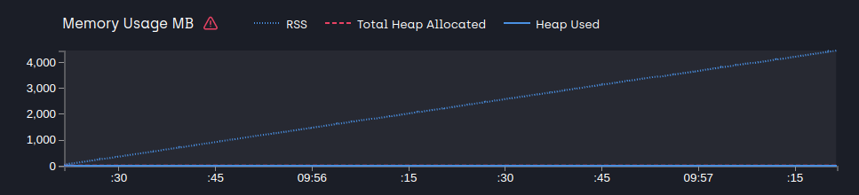
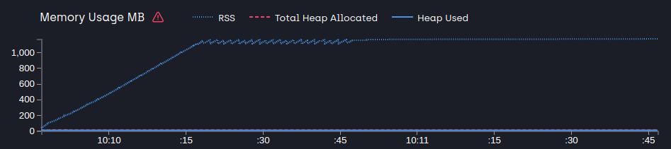

# Part 4: Node.js avanced patterns and techniques
## Chapter 29 &mdash; Callbacks and Events
### Exercise 5 &mdash; Identifying memory leaks
> Create a program that creates a memory leak by subscribing to an event and never unsubscribing from it.
Identify the problem and fix it by unsubscribing.

#### About identifying the memory leak
The application creates a memory leak by recurrently registering new listeners to an `eventEmitter`. Also, the application automatically stops after 2 mins.

The example uses [`clinic`](https://www.npmjs.com/package/clinic) to identify the memory leak visually. There is an npm script `npm run benchmark` that you can use to *profile* the application, which will show an image like the one below (steady increase of *rss* &mdash; the memory given to the process).

The example also includes a fix for the memory leak that consists in using `removeListener()` after 30 seconds into the 120 seconds test.

After applying the fix, the application uses a constant amount of memory:

