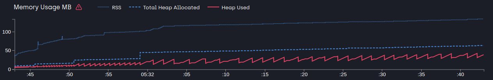
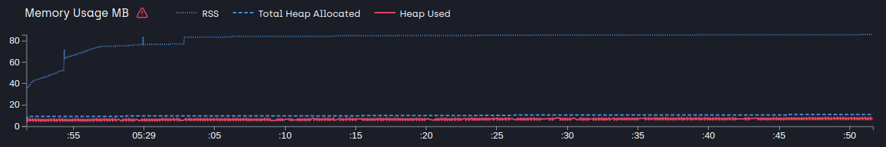

# Part 4: Node.js avanced patterns and techniques
## Chapter 31 &mdash; Asynchronous Control Flow Patterns with Promises and Async/Await
### 10 &mdash; Memory leaks with infinite promise chains
> Illustrates how an infinite, recursion based, promise chain creates a memory leak, and illustrates how you can fix it by breaking the promise chain.

In order to run the analysis run:

```bash
$ npm run profile
```

You can comment/uncomment the different solutions but the at the end of the day you will get:



And when the fix is applied:
