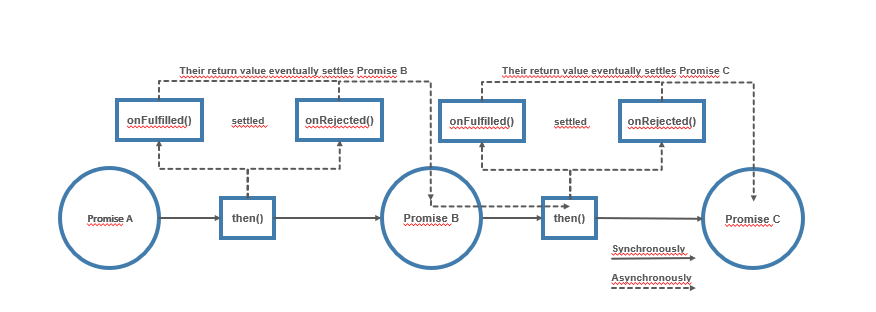
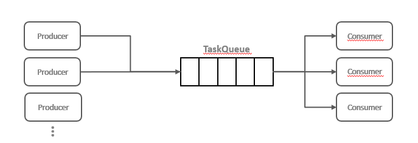

# Part 4: Node.js avanced patterns and techniques
## Chapter 31 &mdash; Asynchronous Control Flow Patterns with Promises and Async/Await
> using promises and async/await to write asychronous code that is more concise, cleaner, and easier to read and maintain.

### Contents
+ How promises work and how to use them effectively to implement the main control flow constructs.
+ The async/await syntax, which is the main tool for dealing with asynchronous code in Node.js.
+ Patterns for serial and parallel execution flow: Producers and Consumers
+ Anti-patterns: `return vs. return await`, and `await` with `Array.forEach()`

### Intro
The previous chapter demonstrated how needlessly complicated and error-prone are the code constructs used to implement even the simplest scenarios such as the serial execution flow.
Also, error managemen in callback-based code is very weak:
+ If we forget to forward an error, it will just get lost.
+ If we don't catch an exception thrown by a piece of some synchronous code, the program will crash.

In order to mitigate these weaknesses, Node.js and JavaScript have implemented native solutions. The first step toward a better developer experience (DX) when working with asynchronous code is the *promise* &mdash; an object that carries the status and the eventual result of an asynchronous operation. A promise can be easily chained to implement serial execution flows, and can be passed around like any other object. The second step, and the one that definitely creates a difference in terms of *DX* is the async/await construct, which finally makes asynchronous code look like synchronous code.

In today's Node.js programming, *async/await* is the recommended construct to deal with asynchronous code. However, async/await is built on top of promises, as much as promises are built on top of callbacks. That is why it is important to master all these concepts, no matter whether they are the current trend or not.

### Promises
*Promises* are part of the *ECMAScript 2015* standard (or ES6), and they've been available in Node.js for quite some time already (since v4). The standard settled on an implementation known as *Promises/A+*

#### What is a promise?
A `Promise` is an object that embodies the eventual result (or error) of an asynchronous operation. In promises jargon we say a `Promise` is:
+ *pending* &mdash; when the asynchronous operation is not yet complete
+ *fulfilled* &mdash; when the operation succesfully completed
+ *rejected* &mdash; when the operation terminates with an error
+ *settled* &mdash; when the promise is either fulfilled or rejected.

To receive the *fulfillment value* or the *error reason* associated with the rejection we can use the `then()` method of a `Promise` instance:

```javascript
promise.then(onFulfilled, onRejected)
```

where `onFulfilled` is a callback that will eventually receive the fulfillment value of the `Promise`, an `onRejected` is another callback that will received the reason for the rejection (if any). Both callbacks are optional.

Let's see how promises can transform our callback-based code with the following simple example involving an asynchronous operation handled with a callback.

```javascript
asyncOperation(arg, (err, result) => {
  if (err) {
    /* error handling here */
  }
  /* result processing here */
});
```

With promises, it would be written as:

```javascript
asyncOperationPromise(arg)
  .then(result => {
    /* result processing here */
  }, err => {
    /* error handling here */
  });
```

There does not seem to be much of change. However, we might have missed one crucial property of the `then()` method &mdash; it *synchronously* returns another `Promise`.

Moreover, if any of the `onFulfilled` or `onRejected` functions return a value `x`, the `Promise` returned by the `then()` will:
+ Fulfill with `x` if `x` is a value
+ Fulfill with the fulfillment value of `x` if `x` is a `Promise`
+ Reject with the eventual rejection reason of `x` if `x` is a `Promise`

That behavior allows us to build *chains of promises*, allowing easy aggregation and arrangement of asynchronous operations into several configurations. Additionally, if we don't specify an `onFulfilled` or `onRejected` handler, the fulfillment value or rejection reason will be forwarded to the next promise in the chain, which will help with error propagation.

As a result, the sequential execution of asynchronous tasks becomes a trivial operation:

```javascript
asyncOperationPromise(arg)
  .then(result1 => {
    // return another promise
    return asyncOperationPromise(arg2);
  })
  .then(result2 => {
    // return a value
    return 'done';
  })
  .then(undefined, err=> {
    /* error handling for the chain of promises here */
  });
```



The diagram above shows how the program flows when we use a chain of promises. When we invoke `then(...)` on *Promise A*, we synchronously receive *Promise B* as a result, and when we invoke `then(...)` on *Promise B* we synchronously receive *Promise C*.
That is, the whole chain of promises is *materialized synchronously* as soon as we declare it.

Eventually, when *Promise A* settles, it will either fulfill or reject, which will automatically trigger the execution of the `onFulfilled(...)` or `onRejected(...)` on *Promise B*, which in turn will trigger the execution of the corresponding handler on *Promise C* once settled.

An important property of promises is that the `onFulfilled()` and `onRejected()` callbacks are guaranteed to be invoked asynchronously, and at most once, even if we resolve the `Promise` synchronously with a value as we do in the example above with the `return 'done'`.

Not only that, the `onFulfilled()` and `onRejected()` callbacks will be invoked asynchronously even if the `Promise` object is already settled at the moment in which `then()` is called. This is a safeguard against situations where we could inadvertently mixing asynchronous and synchronous code (*Zalgo*).

Finally, if an exception is thrown in the `onFulfilled()` or `onRejected()` handlers, the `Promise` returned by the `then()` method will automatically reject with the exception that was thrown as the *rejection reason*. As a result, exceptions will propagate automatically across the chain and the `throw` statement becomes usable (as opposed to what happens with *CPS*, on which only synchronous code could throw).

| EXAMPLE: |
| :------- |
| For additional info on promise chaining, `then()` callbacks, returning values in them, etc., please review [Promise `return` basics](e19-promise-return-basics). |

#### Promises/A+ and *thenables*
Before promises were standardized, there were many incompatible implementations. The JavaScript community led the efforts to come up with the *Promises/A+* specification. This specification details the behavior of the `then()` method. Today, the majority of `Promise` implementations use this standards, including the native `Promise` object of JavaScript and Node.js but you have to be aware that if you are dealing with old code using a non-core library, you might make sure that library complies with the *Promises/A+* specification if you want to mix core and non-core promises in a chain with `then()`.

As a result of the adoption of *Promises/A+*, many `Promise` implementations, including the native JavaScript `Promise` API will consider any object with a `then()` method a *promise-like* object, also called a *thenable*.

| NOTE: |
| :---- |
| The technique of recognizing (or typing) objects based on their external behavior, rather than their actual type, is called **duck typing** (if it walks like a duck and it quacks like a duck, then it must be a duck) and is widely used in JavaScript. |

#### The Promise API
The `Promise` constructor creates a new `Promise` instance that fulfills or rejects based on the behavior of the function provided as an argument. The constructor expects a function that will receive two arguments:
+ `resolve(obj)` &mdash; a function that when invoked, with fulfill the `Promise` with the provided fulfillment value, which will be `obj` if `obj` is a value. It will be the fulfillment value of `obj` if `obj` is a *promise* or a *thenable*.
+ `reject(err)` &mdash; a function that when invoked, will reject the `Promise`the reason `err`. It is a convention for `err`to be an instance of `Error`.

```javascript
new Promise((resolve, reject) => {
  /*
    function whose logic will lead whether it is resolved/rejected.

    The function will use:
    + resolve(obj) to resolve the promise
    + reject(err) to reject the promise
  */
});
```

Apart from the constructor, the `Promise` object also features several important static methods:

+ `Promise.resolve(obj)` &mdash; creates a new `Promise` from another `Promise`, *thenable* or value. If a `Promise` is passed, then that `Promise` is returned as it is. If a *thenable* is provided, then it's converted to a `Promise`. If a value is provided, then the `Promise` will be fulfilled with that value.
+ `Promise.reject(err)` &mdash; creates a `Promise` that rejects with `err` as the reason.
+ `Promise.all(iterable)` &mdash; creates a `Promise` that fulfills with an array of fulfillment values when every item in the input iterable object (typically an array) fulfills. If any of the promises returned by `Promise.all()` rejects, then the `Promise` returned by `Promise.all()` will reject with the first rejection reason. Each item in the iterable argument can be a `Promise`, a *thenable* or a value.
+ `Promise.allSettled(iterable)` &mdash; waits for all the input promises to fulfill or reject, and then returns an array of objects containing the fulfillment value or the rejection reason for each input `Promise`. Each output object has a `status` property which can be either `'fulfilled'` or `'rejected'` and a `value` property containing the fulfillment value or error reason. The difference with `Promise.all()` is that `Promise.allSettled()` will wait for each and every promise to either fulfill or reject, instead of immediately rejecting when one of the promises rejects.
+ `Promise.race(iterable)` &mdash; This method returns a `Promise` that is equivalent to the first `Promise` in the iterable that settles.

The following instance methods of the `Promise` class are also relevant:

+ `promise.then(onFulfilled, onRejected)` &mdash; returns a *chainable promise* and will invoke the `onFulfilled()` or `onRejected` callbacks depending on how `promise` is settled.
+ `promise.catch(onRejected)` &mdash; *syntactic sugar* for `then(undefined, onRejected)`.
+ `promise.finally(onFinally)` &mdash; allows you to set up an `onFinally()` callback which will be invoked when `promise` is settled. Unlike `onFulfilled()` and `onRejected()`, the `onFinally()` callback will not receive any arguments and any value returned from it will be ignored. The `Promise` returned by `finally()` will be settled with the same fulfillment value or rejected reason as `promise`.

#### Creating a Promise

Creating a `Promise` from scratch is quite a low-level operation, and it is not typically done unless you're converting a callback-based API into promises.

Nonetheless, this is the way to create a `Promise` using its constructor:

```javascript
function delay(millis) {
  return new Promise((resolve, reject) => {
    setTimeout(() => {
      resolve(new Date())
    }, millis);
  });
}
```

Note how the entire body of the `delay(...)` function is wrapped by the `Promise` constructor: this is a frequent code pattern you will see when creating a `Promise` from scratch.

The newly created function can then be used as follows:

```javascript
console.log(`Delaying... ${ new Date().getSeconds() }`);
delay(1000)
  .then(newDate => {
    console.log(`Done: ${ new Date().getSeconds() });
  })
```

| EXAMPLE: |
| :------- |
| You can find a runnable example in [01 &mdash; Creating a `Promise` from scratch using its constructor](01-creating-a-promise-using-constructor). |

#### Promisification
When some characteristics of a callback-based function are known in advance, it's possible to create a function that transforms such function into an equivalent function returning a `Promise`. This transformation is called *promisification*.

For example, for the Node.js-style callback-based functions we know that:
+ the callback is the last argument to the function
+ the error (if any) is the first argument passed to the callback
+ any return value is passed after the error to the callback

The following code snippet is a simple implementation of this idea:

```javascript
function promisify(callbackBasedApi) {
  function promisified(...args) {
    return new Promise((resolve, reject) => {
      const newArgs = [
        ...args,
        function (err, result) {
          if (err) {
            return reject(err);
          }
          resolve(result);
        }
      ];
      callbackBasedApi(...newArgs);
    });
  }
  return promisified;
}
```

The preceding function returns another function which represents the *promisified* version of the `callbackBasedApi` function that receives as a parameter.

When the *promisified* version of the function is called, a promise is returned, and the logic that settles the promise is delegated to the callback-based function. That function is given the parameters passed to the *promisified* version, enhanced with a callback that rejects in case of error, or fulfills with the result otherwise.

You can use that function very easily:

```javascript
import { randomBytes } from 'crypto';

const randomBytesP = promisify(randomBytes);

randomBytesP(32)
  .then(buffer => {
    console.log(`Random bytes: ${ buffer.toString('hex') }`);
  });
```

| EXAMPLE: |
| :------- |
| You can find a runnable example in [02 &mdash; Promisification](02-promisification). |

It must be noted that our implementation of the `promisify()` function is quite naive and has some missing features. The `util` package of Node.js provides a more robust version of `promisify()`.

#### Sequential execution and iteration
At this point, we can start creating a promise-based version of our web crawler. To explore the patterns for sequential execution and iteration we will revert to the version which downloaded the links of a webpage in sequence.

Let's begin with our `lib/spider.js` file which is the one doing the heavy lifting of crawling and downloading the pages and links.

The first portion of the file contains all the necessary imports. Note that the main differences is that now we use the *promised-based* versions of the Node.js core module `fs`, and that we used the `util.promisify` to convert the callback-based APIs such as `mkdirp` into equivalent functions that return promises, so that we can chain them.

| NOTE: |
| :---- |
| The functions in `lib/utils.js` are synchronous, so there's no need to intervene there. Also, the newer version of `mkdirp` works with promises, so we forced using the legacy version to illustrate how to use `util.promisify()`. |

```javascript
import { promises as fsPromises } from 'fs';
import { dirname } from 'path';
import superagent from 'superagent';
import mkdirp from 'mkdirp';
import { urlToFilename, getPageLinks } from './utils.js';
import { promisify } from 'util';

const mkdirpPromises = promisify(mkdirp);
```

The first function we will rewrite is `download(...)`. Since this new version leverages promises, the implementation is more straightforward and easier to follow.

```javascript
function download(url, filename) {
  console.log(`Downloading ${ url } into '${ filename }'`);
  let content;
  return superagent.get(url)
    .then(res => {
      content = res.text;
      return mkdirpPromises(dirname(filename));
    })
    .then(() => fsPromises.writeFile(filename, content))
    .then(() => {
      console.log(`INFO: download: ${ filename } from ${ url } downloaded and saved!`);
      return content;
    });
}
```

As `superagent` is already promised-based, we can make the function return the result of invoking `superagent.get()` and chain the intermediate processing with `then()` invocations. The result of the top level promise (the `superagent.get()`) will be the result of the last `then()` of the chain. That is, the promise returned by the `download()` function will settle with the value of the `content` if everything goes according to plan, or rejected if any of the intermediate promises rejects.

The next function to tackle is `spiderLinks()`. This is the one that deals with a sequential iteration over a dynamic set of asynchronous tasks.

```javascript
function spiderLinks(currentUrl, content, nesting) {
  let promise = Promise.resolve();
  if (nesting === 0) {
    return promise;
  }
  const links = getPageLinks(currentUrl, content);
  for (const link of links) {
    promise = promise.then(() => spider(link, nesting - 1));
  }
  return promise;
}
```

Note that first we define an *empty* promise that we use as a starting point for the chain of promises. Then we loop over the links of the page and chained them by doing:

```javascript
for (... of ...) {
  promise = promise.then(...)
}
```

At the end of the loop, the `promise` variable will have the promise of the last `then()` invocation, which is what we will return to the caller.

Also, note that the execution will be sequential even when using promises because of the way in which we have chained them with the construct `promise = promise.then(iterLogic)`.

The last part for `lib/spider.js` consists in rewriting the `spider(...)` function:

```javascript
export function spider(url, nesting) {
  const filename = urlToFilename(url);
  return fsPromises.readFile(filename, 'utf8')
    .catch(err => {
      if (err.code !== 'ENOENT') {
        console.error(`ERROR: spider: could not read file ${ filename }: ${ err.message }`);
        throw err;
      }
      return download(url, filename);
    })
    .then(content => spiderLinks(url, content, nesting));
}
```

In the solution for `spider(...)` we are using `catch()` to handle any errors produced by `readFile()`. If the error has code `ENOENT`, it means the file has not been downloaded yet, and therefore we need to proceed to download it.

Note that we chain the promise returned by `download(...)` that will be settled with the content of the page (if everything goes according to plan) which we will then channeled into `spiderLinks()` whose returned promise will become the promise we return from the function.

Tha last part of the rewrite effort will consist in consuming the `spider(...)` function:

```javascript
spider(url, nesting)
  .then(() => console.log(`INFO: ${ url } successfully processed!`))
  .catch(err => console.error(`ERROR: main: ${ err.message }`));
```

The `catch()` handler at this level will intercept any error originating from the entire `spider()` process. This makes our code cleaner, as it relieves us from including any error propagation logic within the intermediate processes.


As an alternative to the iteration construct seen before, we can use the more compact `reduce()` method as an alternative:
```javascript
const promise = tasks.reduce((prev, task) => {
  return prev.then(() => {
    return task();
  });
}, Promise.resolve());
```

This is much more concise, and less prone to errors as seen below:

```javascript
const tasks = [ /* ... */]

const reducedPromise = tasks.reduce((prevPromiseResult, currentTask) => {
  return prevPromiseResult.then(() => {
    return currentTask();
  });
}, Promise.resolve());
reducedPromise.then(() => console.log(`Sequential iteration done!!!`));

/* Same with a loop */
function asyncSequentialIterationLoop() {
  let promise = Promise.resolve();
  for (const task of tasks) {
    promise = promise.then(() => task());
  }
  return promise;
}

const resultingPromise = asyncSequentialIterationLoop()
  .then(() => console.log(`Sequential iteration done with a loop`));
```


| EXAMPLE: |
| :------- |
| You can find a runnable example in [03 &mdash; Web Crawler v2 with promises](03-web-crawler-v2-promises/). |
| You can also find an example illustrating how to use `Array.reduce()` for sequential iteration in [Hello, reduce for sequential iteration](e14-hello-reduce-series). |

#### Parallel execution
The unlimited parallel execution flow becomes trivial with promises as you can use `Promise.all(iterablePromises)` to create a promise that fulfills only when all the promises received as input are fulfilled.

The logic behind those promises will be executed in parallel, provided those are independent (that is, if there is no causal relationship between them).

As a an example, let's rewrite our web crawler v3 capabilities using this approach:

```javascript
function spiderLinks(currentUrl, content, nesting) {
  if (nesting === 0) {
    return Promise.resolve();
  }

  const links = getPageLinks(currentUrl, content);
  const promises = links.map(link => spider(link, nesting - 1));

  return Promise.all(promises);
}
```

The pattern consists in starting all the `spider()` tasks at once collecting the resulting individual promises in an array (`promises`), and then using `Promise.all()` to wait for all of them to be fullfilled. Note also that the process will fail is any of the promises reject, which is exactly what we want for this particular use case.


| EXAMPLE: |
| :------- |
| You can find a runnable example in [04 &mdash; Web Crawler v3: parallel unlimite execution with promises](04-web-crawler-v3-parallel-promises). |

#### Limited Parallel execution: implementing the `TaskQueue`
In this section we will globally limit the concurrency of our web crawler download tasks by reimplementing the `TaskQueue` class we used in the previous chapter.

As a reminder, the `TaskQueue` was a class extending from `EventEmitter` that would expose two instance methods:
+ `pushTask(task)` &mdash; adds a new asynchronous task to the queue of tasks to process.
+ `next()` &mdash; triggers the execution of the next set of tasks from the queue, taking into account the concurrency limit and the current number of tasks.

Let's start by reimplementing the `next()` method, where we trigger the execution of tasks until we reach the concurrency limit.

```javascript
next() {
  while (this.running < this.concurrency && this.queue.length) {
    const task = this.queue.shift();
    task().finally(() => {
      this.running--;
      this.next();
    });
    this.running++;
  }
}
```

The change is simple: as we expect `task()` to return a promise we can use the `finally()` method to make a recursive call.

Now, we implement a new method `runTask()`, that will take the place of the former `pushTask()`. It will be responsible for queueing a special wrapper function and also returning a newly built `Promise`. Such `Promise` will just forward the result (fulfillment or rejection of the promise returned by `task()`).

```javascript
runTask(task) {
  return new Promise((resolve, reject) => {
    this.queue.push(() => {
      return task().then(resolve, reject);
    });
    process.nextTick(this.next.bind(this));
  });
}
```

This function:
+ creates a new `Promise` using the constructor.
+ wrap the receive tasks in a function and pushes the latter to the queue. This function will be executed whenever there are free concurrency slots.
+ schedules the execution of `next()` on the next iteration of the event loop.

When the pushed wrapper function is finally invoked, we execute the task received as an input, and forward its results (either fulfilment value or rejection reason) to the outer promise created in `runTask`.

##### Updating the web spider
Now, let's apply our `TaskQueue` to the web crawler project.

```javascript
unction spiderLinks(currentUrl, content, nesting, queue) {
  if (nesting === 0) {
    return Promise.resolve();
  }

  const links = getPageLinks(currentUrl, content);
  const promises = links.map(link => spiderTask(link, nesting - 1, queue));

  return Promise.all(promises);
}

const spidering = new Set();
function spiderTask(url, nesting, queue) {
  if (spidering.has(url)) {
    return Promise.resolve();
  }
  spidering.add(url);

  const filename = urlToFilename(url);

  return queue
    .runTask(() => {
      return fsPromises.readFile(filename, 'utf8')
        .catch(err => {
          if (err.code !== 'ENOENT') {
            throw err;
          }
          return download(url, filename);
        });
    })
    .then(content => spiderLinks(url, content, nesting, queue));
}

export function spider(url, nesting, concurrency) {
  const queue = new TaskQueue(concurrency);
  return spiderTask(url, nesting, queue);
}
```

Note that the task we're queueing comprises just the retrieval of the contents of the URL from either local or HTTP. The `spiderLinks()` invocation has been purposely kept outside of the queue to avoid creating a deadlock if the depth of the spidering process is higher than the concurrency limit of the queue.

| NOTE: |
| :---- |
| You should pay special attention to scenarios involving limited parallel execution and recursion. In those scenarios, you might have a recursive call that depends on a promise that might never get settled if there are no *consumers/workers* available to execute the task. This will create an unrecoverable deadlock in your code. See [`p-limit` with recursion](e23-p-limit-with-recursion/README.md) for further explanation. |

Note also that `spiderLinks()` uses `Promise.all()`. This is OK now because is the `TaskQueue` responsibility to ensure that we are not going beyond the concurrency limit of the tasks.

| EXAMPLE: |
| :------- |
| You can find a runnable example in [05 &mdash; Web Crawler v4: parallel execution with a `TaskQueue`](05-web-crawler-v4-task-queue-promises). |


#### Production packages for promise-based control flows
In production, you shouldn't rely on custom implementations of the parallel execution flows.

Instead, the following packages are recommended:
+ `p-limit` &mdash; run multiple promise-based tasks in parallel, controlling the number of concurrent executions-
+ `p-queue` &mdash; full featured promise-queue with concurrency control
+ `p-map` &mdash; `map()` function supporting promises and limited concurrency.


### Async/Await
While promises represent a *quantum leap* ahead of callbacks, they're still tricky to use. You have to invoke `then()` and create functions for each of the tasks in the promise chain.

That's why ECMAScript standard introduced the *async functions* and the *await* expression is what is commonly known as *async/await*.

This will be the recommended construct for dealing with asynchronous code both in Node.js and JavaScript. However, *async/await* does not replace all that we've learned on promises.

#### Async functions and the await expression
An async function is a special type of function in which it's possible to use the keyword `await` to *pause* the execution on a given promise until it resolves.

Let's consider the previously defined function `delay(...)` which created a promise that were resolved after the given number of milliseconds. The following code snippet illustrates the *async/await* construct:

```javascript

function delay(millis) {
  return new Promise(resolve => {
    setTimeout(() => resolve(new Date()), millis);
  });
}

async function playingWithDelays() {
  console.log(`Delaying...`, new Date());

  const dateAfterOneSecond = await delay(1000);
  console.log(dateAfterOneSecond);

  const dateAfterThreeSeconds = await delay(3000);
  console.log(dateAfterThreeSeconds);

  return 'done';
}
```

Note that the code of the *async function* looks like it contains no asynchronous operation. However, the function runs asynchronously. At each `await` expression, the execution of the function is put on hold, its state saved, and the control returned to the event loop. Once the promise awaited is settled, the control is given back to the async function, which will receive the fulfillment value of the `Promise`.

| NOTE: |
| :---- |
| The `await` expression can await a value other than a `Promise`. When that happens, the behavior is similar to awaiting a value that it is first passed to `Promise.resolve(value)`. |

Our newly defined async function can be invoked using:

```javascript
playingWithDelays()
  .then(result => console.log(`After 4 seconds: ${ result }`));
```

That is, an async function always returns a promise. In the previous case, as we were returning a value from the async function, everything behaves as if we were effectively returning `Promise.resolve('done')`.

> Invoking an *async* function is instantaneous like invoking a promise-based function is, or invoking then is.

| EXAMPLE: |
| :------- |
| You can find a runnable example in [06 &mdash; Hello, *async/await*](06-hello-async-await). |


#### Error handling with async/await
One of the biggest gains of the *async/await* construct is the ability to normalize the behavior of the *try..catch* block to make it work seamlessly with both *synchronous throws* and *asynchronous promise rejections*.

Let's consider the following example in which we define a function that rejects afer a given number of milliseconds.

```javascript
function delayError(millis) {
  return new Promise((resolve, reject) => {
    setTimeout(() => reject(new Error(`Error after ${ millis } ms`)), millis);
  });
}
```

That will become the source of an asynchronous error in our example.

Now let's consider an async function that can throw an error synchronously (when receiving true as argument), or *await* a promise that will reject.

```javascript
async function playingWithErrors(throwSyncError) {
  try {
    if (throwSyncError) {
      throw new Error('This is a synchronous error');
    }
    await delayError(1000);
  } catch (err) {
    console.error(`ERROR: ${ err.message }`);
  } finally {
    console.log(`Done!`);
  }
}
```

> The function above demonstrates that *try..catch* works for both synchronous and asynchronous *throws* inside async function.

| EXAMPLE: |
| :------- |
| You can find a runnable example in [07 &mdash; Error handling with async/await](07-error-handling-async-await). |

##### The `return` vs. `return await` trap
One common antipattern when dealing with errors with *async/await* is returning a `Promise` that rejects to the caller and expecting the error to be caught by the local *try...catch* block of the function returning the `Promise`.

The idea is better illustrated with an example:

```javascript
async function errorNotCaught() {
  try {
    return delayError(1000);
  } catch (err) {
    console.error(`ERROR: caught by the async function: ${ err.message }`);
  }
}

errorNotCaught()
  .catch(err => console.error(`ERROR: caught by the caller: ${ err.message }`));
```

When running above code, the error will be processed by the `.catch()` method because the invoked function returns before the promise is rejected.

If we intend to catch the error locally in the function, we need to include an `await` before returning the promise:

```javascript
async function errorCaught() {
  try {
    return await delayError(1000);
  } catch (err) {
    console.error(`ERROR: caught by the async function: ${ err.message }`);
  }
}

errorCaught()
  .catch(err => console.error(`ERROR: caught by the caller: ${ err.message }`));
```

That ensures that the error is not sent to the caller.

| EXAMPLE: |
| :------- |
| You can find a runnable example in [08 &mdash; The `return` vs. `return await` issue](08-return-vs-return-await-issue). |

##### Antipattern - using *async/await* with `Array.forEach`/`Array.map` for serial execution
There is a common antipattern whereby developers will try to use `Array.forEach()` or `Array.map()` to implement a sequential asynchronous iteration with *async/await* which won't work as expected.

Code snippets like the following will be affected:

```javascript
links.forEach(async function iteration(link) {
  await spider(link, nesting - 1);
});
```

In the body of `iteration(...)` we're await for the promise returned by `spider()`, but `Array.forEach()` is silently ignoring the promise returned by iteration, and therefore, the tasks **will not** be executed in series, but rather in parallel, with unlimited concurrency, in the same event loop.

#### Parallel execution
There are two ways to run a set of tasks in parallel using *async/await*:
+ using the `await` expression
+ using `Promise.all()`

The method relying on `Promise.all()` is the recommended (and optimal) one to use.

Consider the following implementation of the `spiderLinks(...)` function of our web crawler that starts all the `spider(...)` tasks at once:

```javascript
async function spiderLinks(currentUrl, content, nesting) {
  if (nesting === 0) {
    return;
  }
  const links = getPageLinks(currentUrl, content);
  const promises = links.map(link => spider(link, nesting - 1));
  for (const promise of promises) {
    await promise
  }
}
```

Typically, you'd rather do:

```javascript
async function spiderLinks(currentUrl, content, nesting) {
  if (nesting === 0) {
    return;
  }
  const links = getPageLinks(currentUrl, content);
  const promises = links.map(link => spider(link, nesting - 1));
  const results = await Promise.all(promises);
}
```

As it will let us get notified of an error as soon as one of the promises fail.

#### Limited Parallel execution
To implement a limited parallel execution pattern with *async/await* we can either reuse the `TaskQueue` class as is, or refactor it internally to use *async/await* constructs.

Both are trivial exercises that and represent very little change in our *web crawler* implementations.

| EXAMPLE: |
| :------- |
| You can find the implementation of `TaskQueue` using *async/await* syntax in [TaskQueue with *async/await*](e08-task-queue-async-await). |

In this section we will explore another pattern for limited parallel execution based on the *producer/consumer* approach using *async/await*.

The general idea is the following:
+ On one side we have an unknown set of *producers* adding tasks to a queue
+ On the other side we have a predefined set of *consumers*, responsible for extracting and executing the tasks from the queue, one at a time.



As seen in the image, the number of consumers will determine the concurrency with which the tasks will be executed. The challenge in this case will be to put the consumers to *sleep* when the queue is empty and *wake them up* again when there are new tasks to run.

Let's see how to implement this task queue, starting with the class constructor:

```javascript
export class TaskQueuePC {

  constructor (concurrency) {
    this.taskQueue = [];
    this.consumerQueue = [];

    for (let i = 0; i < concurrency; i++) {
      this.consumer();
    }
  }
...
```

Note that we now have two queues: one to hold our tasks and the other to hold our sleeping consumers. Right after that we spawn as many consumers as concurrency we need to attain.

Now, let's see what a consumer looks like:

```javascript
async consumer() {
  while (true) {
    try {
      const task = await this.getNextTask();
      await task();
    } catch (err) {
      console.error(err);
    }
  }
}
```

This is an infinite *while loop*. At each iteration, we try to retrieve a new task from the queue using `getNextTask()`. Note that this won't consume CPU cycles when there is nothing to process, because the current consumer will be put to sleep if the queue is empty. If there are tasks in the queue, the consumer will get this task and execute it. Note also that if an error is found we just log it and go ahead, as it is customary with queues.

Now let's take a look at the implementation of `getNextTask()`:

```javascript
async getNextTask() {
  return new Promise(resolve => {
    if (this.taskQueue.length !== 0) {
      return resolve(this.taskQueue.shift());
    }
    this.consumerQueue.push(resolve);
  });
}
```

This method returns a new promise that resolves with the first task in the queue if the queue is not empty. If the queue is empty, we postpone the resolution of the promise by queueing the `resolve` callback into the `consumerQeueue`. This is what will put the promise, and the consumer that is awaiting the promise to sleep.

Finally, we implement the `runTask(...)` that corresponds to the *producer* side of the algorithm:

```javascript
runTask(task) {
  return new Promise((resolve, reject) => {
    const taskWrapper = () => {
      const taskPromise = task();
      taskPromise.then(resolve, reject);
      return taskPromise;
    };

    if (this.consumerQueue.length !== 0) {
      const consumer = this.consumerQueue.shift();
      consumer(taskWrapper);
    } else {
      this.taskQueue.push(taskWrapper);
    }
  });
}
```

First, we create a `taskWrapper` function that when executed, has the responsibility for running the input task and forwarding the status of the promise returned by `task()` to the outer promise returned by `runTask()`.
Next, if the `consumerQueue` is not empty, it means that there is at least one consumer that is asleep, waiting for new tasks to run.
We then extract the first consumer from the queue and invoke it immediately by passing our `taskWrapper`. If instead, all the consumers are already busy, we push the `taskWrapper` into the `taskQueue`.

| NOTE: |
| :---- |
| The consumers from the queue are essentially the `resolve` callback of the `Promise` returned by `getNextTask()`. |

| EXAMPLE: |
| :------- |
| You can find the implementation of the `TaskQueuePC` along with the illustration of how to use it in the *web crawler* in [09 &mdash; Limited parallel execution with producers/consumers pattern](09-task-queue-producers-consumers). |


| NOTE: |
| :---- |
| You should pay special attention to scenarios involving limited parallel execution and recursion. In those scenarios, you might have a recursive call that depends on a promise that might never get settled if there are no *consumers/workers* available to execute the task. This will create an unrecoverable deadlock in your code. See [`p-limit` with recursion](e23-p-limit-with-recursion/README.md) for further explanation. |

### The problem with infinite recursive promise resolution chains
This section will deal with an advance topic about memory leaks cause by infinite `Promise` resolution chains. This bug affects the actual *Promises/A+* specification standard, and therefore, no compliant implementation is immune.

Let's consider the following code, which defines a simple infinite operation using promises:

```javascript
function leakingLoop() {
  return delay(1)
    .then(() => {
      console.log(`Tick ${ Date.now() }`);
      return leakingLoop();
    });
}
```

The promise returned by `leakingLoop()` never resolves, because it depends on the next invocation. This situation creates a chain of promises that never settle. and it will cause a memory leak.

The only solution consists in breaking the chain of `Promise` resolution:

```javascript
function nonLeakingLoop() {
  return delay(1)
    .then(() => {
      console.log(`Tick ${ Date.now() }`);
      leakingLoop();
    });
}
```

However, this solution changes the behavior of the original implementation. For example, this new function won't propagate eventual errors produced deeply within the recursion.

An alternative solution consists in wrapping the recursive function with a `Promise` constructor:

```javascript
function nonLeakingLoopWithErrors() {
  return new Promise((resolve, reject) => {
    (function internalLoop() {
      delay(1)
        .then(() => {
          console.log(`Tick ${ Date.now() }`);
          internalLoop();
        })
        .catch(err => reject(err));
    })();
  });
}
```

In this case, we don't have a link between the promises created at the various stages of the recursion, and therefore there will be no memory leak. However, the promise returned by `nonLeakingLoopWithErrors()` will reject if any asynchronous operation fails, no matter at what depth in the recursion.

Another alternative implementation to solve the memory leak would consist of changing the recursive call into a while loop:

```javascript
async function nonLeakingLoopAsync() {
  while (true) {
    await delay(1);
    console.log(`Tick ${ Date.now() }`);
  }
}
```

This function behaves as the original one, in the sense that if an error is thrown deep in the recursion, that would be propagated to the caller.

| NOTE: |
| :---- |
| The *async/await* solution will also create a leak if instead of a while loop we would have a recursive call. |

> When building an infinite promise chain based on recursion, check if there are the conditions for creating a memory leak. If that is the case, apply one of the devised solutions.

| EXAMPLE: |
| :------- |
| You can test these solutions in [10 &mdash; Memory leaks with infinite promise chains](10-promises-memory-leak). |

Note that it is quite common in Node.js programming to find these type of situations: encoding/decoding of streams of data, processing of live cryptocurrency market data, monitoring of IoT sensors, etc.

#### Top-level await
The `await` keyword may be used in the top level (outside of async functions) within ECMAScript modules.

```javascript
// five.js module: no need to wrap in async function
export const five = await Promise.resolve(5);

// main.js: main program
import { five } from './lib/five.js';

console.log(five); // => 5
```

| EXAMPLE: |
| :------- |
| You can find a runnable example in [11 &mdash; Top-level await](11-hello-top-level-await). |

### You know you've mastered this chapter when...
+ You're aware that a `Promise` is and object that wraps the eventual result (or error reason) of an asynchronous oepration, and are familiar with the different *states* of a promise: *pending*, *fulfilled*, *rejected*, and *settled*.
+ You are comfortable using `promise.then(onFulfilled, onRejected)`, and understand the basics of it:
  + `then(...)` returns another promise *synchronously*
  + If the callbacks `onFulfilled` or `onRejected` return a value, the promise returned by `then()` will:
    + fulfill with `x` if `x` is a value
    + fulfill with the fulfillment value of `x` is `x` is a promise
    + reject with the eventual rejection reason of `x` if x is a promise
+ You're comfortable creating chains of promises with `then()`.
+ You've learnt about *duck typing* and how it is used by JavaScript promise implementations to define *thenables*.
+ You're comfortable using the `Promise` API:
  + `new Promise((resolve, reject) => { ... })`
  + `Promise.resolve(obj)`
  + `Promise.reject(err)`
  + `Promise.all(iterable)`
  + `Promise.allSettled(iterable)`
  + `Promise.race(iterable)`
  + `promise.then(onFulfilled, [onRejected])`
  + `promise.catch(onRejected)`
  + `promise.finally(onFinally)`
+ You're aware of the trick of using `Promise.resolve()` to create an *empty promise* that can be used as a starting point for chaining sequence of asynchronous calls.
+ You know what *promisification* entails, and are aware of the `util.promisify` function.
+ You've learned how to use *promises* and *async/await* syntax to write asynchronous code that is more concise, cleaner and easier to read than the callback-based counterpart.
+ You know to write serial and parallel code using *promises* and *async/await* syntax.
+ You're aware that *async/await* greatly simplify and normalizes error management in JavaScript as synchronous and asynchronous errors can be caught with *try..catch* blocks.
+ You're familiar with promise chaining, promisification, and the *Producer/Consumer* pattern.
+ You're aware of the common antipattern of trying to use `await` with `Array.forEach()` or `Array.map()` to serialize asynchronous operations, and know that you have to use *for...of* instead.
+ You're aware that you need to use `return await` when you want to handle asynchronous errors locally.


### Code, Exercises and mini-projects

#### [01 &mdash; Creating a `Promise` from scratch using its constructor](01-creating-a-promise-using-constructor)
Illustrates how to create a `Promise` using its constructor.

#### [02 &mdash; Promisification](02-promisification)
Illustrates how create a generic function that converts a Node.js callback style function into an equivalent function returning a `Promise`.

#### [03 &mdash; Web Crawler v2 with promises](03-web-crawler-v2-promises/)
A promise-based implementation of the web crawler program that illustrates the patterns for sequential execution and iteration (with promises). In this example, the links from the given web page are downloaded in sequence.

#### [04 &mdash; Web Crawler v3: parallel unlimite execution with promises](04-web-crawler-v3-parallel-promises)
A revision of the v2 version, using promises, in which the links are downloaded in parallel.

#### [05 &mdash; Web Crawler v4: parallel execution with a `TaskQueue`](05-web-crawler-v4-task-queue-promises)
A revision of the v3 version, using promises, in which the links are downloaded in parallel, but limited to the degree of concurrency with which a `TaskQueue` is created.

#### [06 &mdash; Hello, *async/await*](06-hello-async-await)
Illustrates the use of the async/await construct on the simplest of examples.

#### [07 &mdash; Error handling with async/await](07-error-handling-async-await)
Illustrates how error handling works with *async/await* construct.

#### [08 &mdash; The `return` vs. `return await` issue](08-return-vs-return-await-issue)
Illustrates a common antipattern when dealing with errors in *async/await* code, in which a *try...catch* block is useless because the async function returns a `Promise` before it has been settled. As a result, the error must be caught by the caller code. If we intend to catch the error locally (and not in the caller code), `return await` should be used instead.

#### [09 &mdash; Limited parallel execution with producers/consumers pattern](09-task-queue-producers-consumers)
Illustrates how to implement limited parallel execution using a Task Queue implementation that follows the *Producers/Consumers* pattern. The *Task Queue* is then used to implement our *web crawler* with concurrency control.

#### [10 &mdash; Memory leaks with infinite promise chains](10-promises-memory-leak)
Illustrates how an infinite, recursion based, promise chain creates a memory leak, and illustrates how you can fix it by breaking the promise chain.

#### [11 &mdash; Top-level await](11-hello-top-level-await)
Illustrates how to use the *top-level await* capability, which allows you to use `await` in *ESM* outside of async functions.]

#### Example 1: [File Concatenation](./e01-file-concatenation/)
Write the implementation of `concatFiles(...)`, a promise-based function that takes two or more paths to text files in the file system and a destination file.

This function must copy the contents of every source file into the destination file, respecting the order of the files as provided by the arguments list. Also, the function must be able to handle an arbitrary number of arguments.

#### Example 2: [Returning values from promises](./e02-returning-values-from-promises/)
Write `listNestedFiles()`, a promise-based function that takes as the input the path to a directory in the local

#### Example 3: [List files recursively](./e03-list-files-recursively/)
Write `listNestedFiles()`, a promise-based function that takes as the input the path to a directory in the local filesystem, and that asynchronously iterates over all the subdirectories to eventually return a promise that is fulfilled with the list of all the files discovered.

#### Example 4: [Hello, `TaskQueue` with promises](./e04-hello-task-queue-promises)
A very simple example demonstrating the usage pattern for our `TaskQueue`, promise-based class. In the example, we use the `TaskQueue` to classify a large number of numbers into even and odd.

#### Example 5: [Recursive find with promises](./e05-recursive-find-promises/)
Write `recursiveFind()`, a promise-based function that takes a path to a directory in the local filesystem and a keyword as per the following signature:
```javascript
function recursiveFind(dir, keyword)
```

The function must find all the text files within the given directory that contain the given keyword in the file contents. The list of matching files should be returned as the *fulfillment* value of the promise when the search is completed. If no matching file is found, the fulfillment value should be an empty array.

As an example test case, if you have the files `foo.txt` and `bar.txt` and `baz.txt` in `myDir` and the keyword `batman` is contained in the files `foo.txt`, and `baz.txt` making the call:

```javascript
recursiveFind('myDir', 'batman')
  .then(console.log);
// should print ['foo.txt', 'baz.txt']
```

The final solution must make the search recursive, so that it looks for files in any subdirectory of the given directory, and in parallel using a `TaskQueue` so that the number of parallel tasks don't grow out of control.

#### Example 6: [Recursive find with promises v2](./e06-recursive-find-promises-v2/)
This is an alternative implementation of the recursive find that does not use events to synchronize the result.

#### Exercise 7: [Dissecting `Promise.all()`](e07-dissecting-promise-all)
Implement your own version of `Promise.all()` leveraging promises, *async/await* or a combination of the two. The function must be functionally equivalent to its original counterpart.

#### Exercise 8: [TaskQueue with *async/await*](e08-task-queue-async-await)
Migrate the `TaskQueue` class internals from promises to *async/await* where possible. Note that you might not be able to use that construct everywhere.

#### Exercise 9: [TaskQueuePC with promises](e09-task-queue-pc-promises)
Update the `TaskQueuePC` class internal methods so that they use just promises, removing any us of the *async/await* syntax. Hint: the infinite loop must become an asynchronous recursion, so beware of the *recursive promise resolution memory leak*.

#### Exercise 10: [An asynchronous `map()`](e10-async-map) (not done yet)
Implement a parallel asynchronous version of `Array.map()` that supports promises and a concurrency limit. The function should not directly leverage `TaskQueue` or `TaskQueuePC` classes, but it can use the underlying patterns on which those are based.

The function, which will be defined with the signature `mapAsync(iterable, callback, concurrency)` will accept the following inputs:
+ `iterable` &mdash; a generic iterable, such as an array
+ `callback` &mdash; a function that accepts as input each item of the iterable (exactly as the original `Array.map()`) and that returns a `Promise` or a simple value.
+ `concurrency` &mdash; which defines how many items in the iterable can be processed by callback in parallel at each given time

#### Example 11: [Hello, `p-limit`](e11-hello-p-limit)
Illustrates the basics of the [`p-limit`](https://www.npmjs.com/package/p-limit) package that lets you run multiple promise-based tasks with limited concurrency.

#### Example 12: [Hello, `p-throttle`](e12-hello-p-throttle)
Illustrates the basics of the [`p-throttle`](https://www.npmjs.com/package/p-throttle) package that lets you control that functions are called only under certain given rates (e.g. only twice a second).

#### Example 13: [Hello, `p-queue`](e13-hello-p-queue)
Illustrates the basics of the [`p-queue`](https://www.npmjs.com/package/p-queue) package that provides a robust implementation of a promise queue with concurrency limit features.

#### Example 14: [Hello, reduce for sequential iteration](e14-hello-reduce-series)
Illustrates the how to use `Array.reduce()` as a simpler, alternative implementation of the sequential iteration pattern.

#### Example 15: [File Concatenation with *async/await*](./e15-file-concatenation-async-await/)
Write the implementation of `concatFiles(...)`, a promise-based function that takes two or more paths to text files in the file system and a destination file using *async/await* syntax.

This function must copy the contents of every source file into the destination file, respecting the order of the files as provided by the arguments list. Also, the function must be able to handle an arbitrary number of arguments.

#### Example 16: [List files recursively with *async/await*](./e16-list-files-recursively-async-await/)
Write `listNestedFiles()`, a promise-based function that takes as the input the path to a directory in the local filesystem, and that asynchronously iterates over all the subdirectories to eventually return a promise that is fulfilled with the list of all the files discovered, using *async/await*.

#### Example 17: [Recursive find with *async/await*](./e17-recursive-find-async-await/)
Write `recursiveFind()`, a promise-based function using *async/await* syntax that takes a path to a directory in the local filesystem and a keyword as per the following signature:
```javascript
async function recursiveFind(dir, keyword)
```

The function must find all the text files within the given directory that contain the given keyword in the file contents. The list of matching files should be returned as the *fulfillment* value of the promise when the search is completed. If no matching file is found, the fulfillment value should be an empty array.

As an example test case, if you have the files `foo.txt` and `bar.txt` and `baz.txt` in `myDir` and the keyword `batman` is contained in the files `foo.txt`, and `baz.txt` making the call:

```javascript
recursiveFind('myDir', 'batman')
  .then(console.log);
// should print ['foo.txt', 'baz.txt']
```

The final solution must make the search recursive, so that it looks for files in any subdirectory of the given directory, and in parallel using a `TaskQueue` so that the number of parallel tasks don't grow out of control.

#### Example 18: [Recursive find with *async/await*, version 2](./e18-recursive-find-async-await-v2/)
A second attempt to implement `recursiveFind()` using *async/await* syntax, controlling that both the directory scan and the reading of the files don't grow out of control.

#### Example 19: [Promise `return` basics](e19-promise-return-basics)
Illustrates some basic stuff about promise chaining related to how `return` works.

#### Example 20: [Chaining promise callbacks](e20-chaining-promise-callbacks)
A workbench for grokking several related scenarios related to chaining promise callbacks. Special interest is paid to expressions like `funcReturningPromise().then(resolve, reject)`.

#### Example 21: [Sleeping tasks with promises](e21-sleeping-tasks-with-promises)
a workbench for grokking scenarios related to *pausing* execution using promises.

### Example 22: [Recursion with promises](e22-recursion-with-promises)
a workbench for grokking scenarios that involve recursion with promises.

### Example 23: [`p-limit` with recursion](e23-p-limit-with-recursion)
a workbench for grokking scenarios that involve recursion with promises, when using limited parallel execution.

