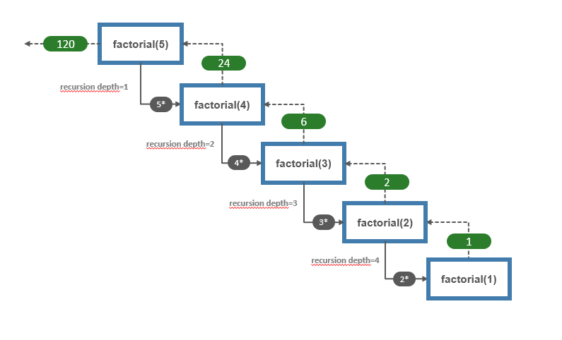

# Part 4: Node.js avanced patterns and techniques
## Chapter 31 &mdash; Asynchronous Control Flow Patterns with Promises and Async/Await
### Example 23: Recursion with promises in limited parallel scenarios
> a workbench for grokking scenarios that involve recursion with promises, when using limited parallel execution


#### Rationale
While implementing the `recursiveFind(...)` with limited parallel execution I faced what it seemed to be an implementation issue but that resulted in a problem related to recursion when controlling the degree of concurrency.

When using recursion with limited concurrency you are subject of getting into a deadlock when the depth of the recursion is greater than the concurrency limit.

The behavior of the Node.js runtime is a bit strange in this case, as you would get no feedback in the console, but rather the program ends without any information in the console.

For example, consider the following code:

```javascript
async function factorial(n) {
  if (n == 1) {
    return 1;
  }
  return n * await limit(() => factorial(n - 1));
}

const limit = pLimit(5);

factorial(5)
  .then(result => console.log(`factorial(5)=${ result }`))
  .catch(console.error)
  .finally(() => console.log(`factorial: done!`));
```

The situation is depicted in the image below:



If we limit the parallel execution to 4 or less, it will prevent the possibility of the initial promise from being fulfilled, thus creating a deadlock, and making the program to finish between any error or feedback to the user, simply `factorial(5)` will just never be settled.

| NOTE: |
| :---- |
| Traditionally the deadlocks are detected because the program stalls as if paused. However in this case the program ends gracefully with the promise that originated the recursion simply not being settled. |

Note also that this is not something affecting `p-limit`, `TaskQueuePC` is also affected by the same problem.

The solution consists in setting the boundaries of the limitation sensibly, so that it wouldn't prevent the recursion from completing no matter how small the concurrency limit is.