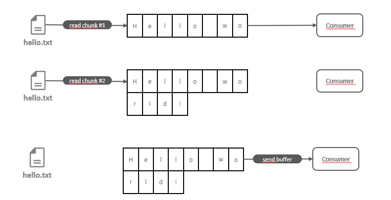
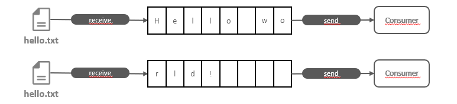
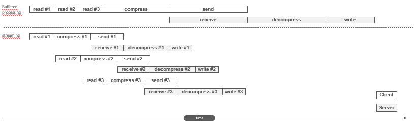
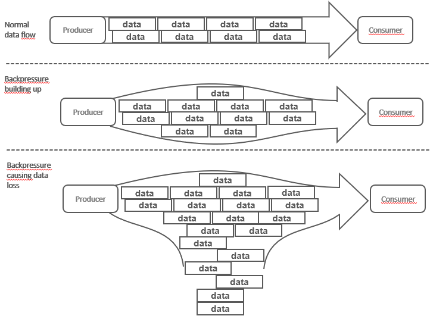
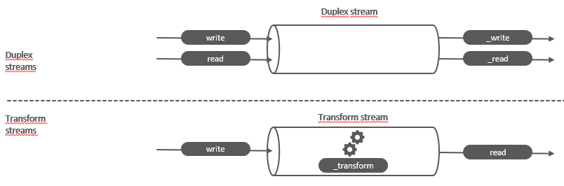
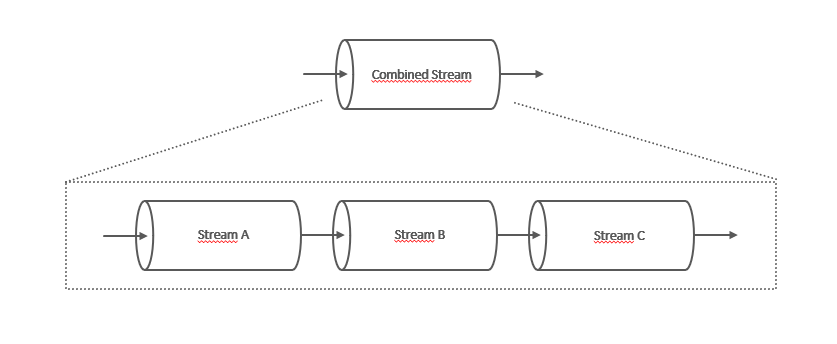
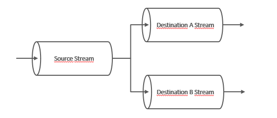
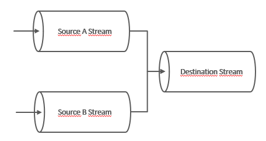
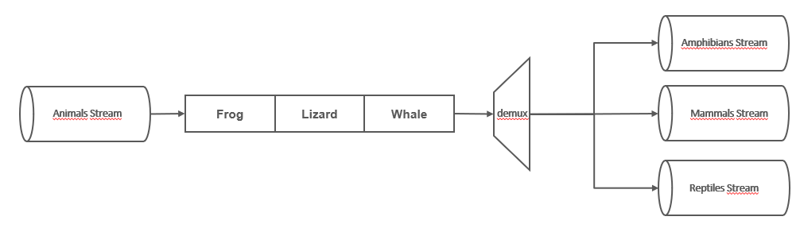

# Part 4: Node.js avanced patterns and techniques
## Chapter 32 &mdash; Coding with streams
> streams and common use cases

### Contents
+ Node.js streams basics
+ Types of streams
+ Advanced techniques: late-piping, lazy streams, managing backpressure
+ Advanced execution control flow patterns with streams
+ Piping patterns: Reusability amd interoperability using streams

### Intro
This chapter aims to provide a complete understanding of Node.js streams &mdash; one of the best and most misunderstood topic of Node.js.

We will start with an introduction to the main ideas, terminology and libraries backing the Node.js streams, and then we will cover more advanced topics including useful streaming patterns that can make your programs more elegant and effective.

### Discovering the importance of streams
Node.js is an event-based platform. As such, the most efficient way to handle is I/O in real time &mdash; consuming the available input as soon as it is available and sending the output as soon as the application produces it.

This section will give an initial introduction to Node.js and their strengths to make real-time I/O processing a reality.

#### Buffering versus streaming
The paradigm when dealing with I/O up to this point is called *buffer mode*.

In this mode, an input operation makes all the data coming from a resource to be collected into a buffer until the operation is completed. Then it is passed back to the caller as one single blob of data.



The diagram above depicts how the buffer mode works.
1. Some data is received from the resource saved into a buffer.
2. Additional chunks are received and buffered.
3. The entire buffer is made available to the consumer when the read operation is complete.

On the contrary, processing with streams is radically different &mdash; data is made available to the consumer as soon as it arrives from the resource:



As soon as a new *chunk of data* is received from the resource, it is immediately passed to the consumer, who has the chance to process it right away.

There are three main advantages of streams vs. buffering:
+ spatial efficiency &mdash; no need to materialize the whole contents of the resource before it can be processed.
+ time efficiency &mdash; information can be processed as soon as it is produced by the resource, rather than having to wait until it is materialized
+ composability


#### Spatial efficiency
Streams provide a great advantage over buffers, because they don't require the materialization of the whole set of information provided by the resource before being processed.

This becomes really important for big files, especially in a platform such as Node.js where there is limitation on the size of a memory buffer

| EXAMPLE: |
| :------- |
| Run [01 &mdash; Max size of a buffer in this platform](01-display-buffer-max-size) to obtain the maximum size of a buffer in the current platform. |


##### Gzipping using a buffered API
As an example of this limitation we might face with buffers, let's consider the following utility that gzips a given file.

```javascript
import { promises as fs } from 'fs';
import { gzip } from 'zlib';
import { promisify } from 'util';

const gzipPromise = promisify(gzip);

const filename = process.argv[2];

async function main() {
  const data = await fs.readFile(filename);
  const gzippedData = await gzipPromise(data);
  await fs.writeFile(`${ filename }.gz`, gzippedData);
}

main();
```

Everything will be fine for small files, but if we try to zip something larger than the platfom maximum buffer size we will get an error, because the approach requires the materialization of the whole contents of the file before it can be zipped.

| EXAMPLE: |
| :------- |
| See [02 &mdash; GZIP with buffers](02-gzip-with-buffers) for a runnable example. |

##### Gzipping using streams

Let's see how we can provide the same functionality using streams:

```javascript
import { createReadStream, createWriteStream } from 'fs';
import { createGzip } from 'zlib';


const filename = process.argv[2];

createReadStream(filename)
  .pipe(createGzip())
  .pipe(createWriteStream(`${ filename }.gz`))
  .on('finish', () => console.log(`INFO: ${ filename } => ${ filename }.gz`));
```

Note that not only the application will be more efficient, but also more readable thanks to the streams interface and composability.

| EXAMPLE: |
| :------- |
| See [03 &mdash; GZIP with streams](03-gzip-with-streams) for a runnable example. |


#### Time efficiency

Let's implement a more complex example involving an application with two subcomponents.

The client side of the application will compress a file, and send it to a remote HTTP server. In turn, the server side of the application will be listening for incoming requests that will assume to be gzipped files that it will decompress and save into the file system.

Obviously, this is a textbook scenario for streams, as we wouldn't want the client to materialize the file before being able to send it to the server, and we wouldn't want the server to recreate the file in memory before it can save it (imagine with multiple concurrent requests involving large file!).

Therefore:
+ on the client side we will use streams to allow compressing the information and sending data chunks as soon as they are read from the filesystem.
+ on the server side, we will use streams to decompress every chunk as soon as it is received, and straight away save it.

Let's review the server-side implementation first:

```javascript
import { createServer } from 'http';
import { createWriteStream } from 'fs';
import { createGunzip } from 'zlib';
import path from 'path';


const server = createServer((req, res) => {
  const filename = path.basename(req.headers['x-filename']);
  const destFilename = path.join('received_files', filename);
  console.log(`INFO: file request received: ${ filename }`);

  req
    .pipe(createGunzip())
    .pipe(createWriteStream(destFilename))
    .on('finish', () => {
      res.writeHead(201, { 'Content-Type': 'text/plain' });
      res.end('OK\n');
      console.log(`INFO: file saved: ${ destFilename }`);
    });
});

server.listen(5000, () => console.log(`INFO: listening on http://localhost:5000`));
```

Note that the `req` object is actually a *stream*, so we can use it to receive the chunks of data right away from the network and act upon them without having to materialize the whole file.

This processing consists in the decompression and write on a given location.

Let's now deal with the client part:

```javascript
import { request } from 'http';
import { createGzip } from 'zlib';
import { createReadStream } from 'fs';
import path from 'path';


const filename = process.argv[2];

const httpRequestOptions = {
  hostname: 'localhost',
  port: 5000,
  path: '/',
  method: 'PUT',
  headers: {
    'Content-Type': 'application/octet-stream',
    'Content-Encoding': 'gzip',
    'X-Filename': path.basename(filename)
  }
};

const req = request(httpRequestOptions, res => {
  console.log(`INFO: Server responded with: ${ res.statusCode }`);
});

createReadStream(filename)
  .pipe(createGzip())
  .pipe(req)
  .on('finish', () => console.log(`INFO: file ${ filename } successfully sent`));
```

We are again using taking advantage that the HTTP request object `req` is a stream, and therefore, we read the file, compress it and send it to the server as soon as a every chunk is available.

| EXAMPLE: |
| :------- |
| See [04 &mdash; GZIP client/server with streams](04-gzip-client-server) for a runnable example. |


The following diagram illustrates why using streams is far more efficient when compared to the buffered API.



Note how when using the *buffered mode*, the process is entirely sequential, with each of the defined stages happening after the other, first on the client side and then on the server.

However, when using streams, those processing stages are triggered as soon as a data chunk is available, without waiting for the whole file to be read. Also, as each of the individual stages are asynchronous, many different of these stages will be parallelized by Node.js. The platform will take care of the proper sequencing and ordering of the data chunks.

#### Composability
We've seen in the examples how powerful composability with streams is:

```javascript
createReadStream(filename)
  .pipe(createGzip())
  .pipe(req)
  .on('finish', () => console.log(`INFO: file ${ filename } successfully sent`));
```

This composability is orchestrated via the `pipe(...)` method, and allows us to connect the different *processing units/stages*, each one of those performing a single, focused functionality.

Streams features a uniform API that makes it possible, with the only constraint being that the next stream in the pipeline has to support the data produced by the previous stream, which can be binary data, text data or even objects.

##### Adding encryption as an example of composability
To further demonstrate the composability, let's add an encryption layer to our [04 &mdash; GZIP client/server with streams](04-gzip-client-server), starting with the client side.


You can review all the implementation details in [05 &mdash; GZIP client/server with an encryption layer](05-gzip-encryption-client-server), but in summary in, once all the crypto initialization is correctly performed do the following on the server side and client side respectively:

```javascript
req
  .pipe(createDecipheriv('aes192', secret, iv))
  .pipe(createGunzip())
  .pipe(createWriteStream(destFilename))
  .on('finish', () => {
      res.writeHead(201, { 'Content-Type': 'text/plain' });
      res.end('OK\n');
      console.log(`INFO: file saved: ${ destFilename }`);
  });
```

That is, on the server side we expect to get the binary data encrypted, and then we have to *gunzip* it.


```javascript
createReadStream(filename)
  .pipe(createGzip())
  .pipe(createCipheriv('aes192', secret, iv))
  .pipe(req)
  .on('finish', () => console.log(`INFO: file ${ filename } successfully sent`));
```

And on the client side, we first *gzip* the file and then encrypt it.

The main advantage is evident, with just a few lines of code we have been able inject new capabilities into an existing pipeline.

### Getting started with streams
Streams are virtually everywhere in Node.js: file-system management, HTTP modules, crypto, compression utilities, ...

#### Anatomy of streams
Every *stream* in Node.js is an implementation of one of the following four base abstract classes defined in the `stream` core module:
+ `Readable`
+ `Writable`
+ `Duplex`
+ `Transform`

In turn, each `stream` class inherit from `EventEmitter` and produce several types of events including:
+ `'end'` &mdash; when a `Readable` stream has finished reading
+ `'finish'` &mdash; when a `Writable` stream has finished writing
+ `'error'` &mdash; when an unexpected situation is found

Streams in Node.js support two operating modes:
+ binary mode &mdash; to stream data in form of chunks, such as buffers or strings
+ object mode &mdash; to stream data as a sequence of discrete objects

While the first mode will be mostly used for I/O, the second one will open a handful of possibilities to structure an application as processing units in a functional fashion.

#### Readable streams
A `Readable` stream represents a source of data.

Data can be received from a `Readable` stream using two approaches: *non-flowing* (or *paused*) and *flowing*.

##### Reading from a stream: *non-flowing* mode
The non-flowing or paused mode is the default pattern for reading from a `Readable` stream.

It consists in attaching a listener to the stream for the `'readable'` event, which signals the availability of new data to read. Then in a loop, we read the data continuously until the internal buffer is emptied.

This can be done using the `read()` method, which synchronously reads from the internal buffer and returns a `Buffer` object representing the chunk of data:

```javascript
readable.read([size])
```

To illustrate this approach, let's create an example that reads from the standard input and echoes everything to the standard output.

| NOTE: |
| :---- |
| `process.stdin` is a stream representing the standard input. |

```javascript
process.stdin
  .on('readable', () => {
    let chunk;
    console.log(`INFO: new data available`);
    while ((chunk = process.stdin.read()) !== null) {
      console.log(`INFO: chunk read (${ chunk.length } bytes): '${ chunk.toString() }'`);
    }
  })
  .on('end', () => console.log('INFO: end of stream'));
```

In the example, we use the `read()` method which is a synchronous operation that pulls a data chunk from the internal buffers of the `Readable` stream. The returned chunk is by default a `Buffer` object if the stream is working in binary mode (which is the default).

The `read(...)` method returns `null` when there is no more data available in the internal buffers. In such case, we have to wait for another `'readable'` event to be fired, or wait for the `'end'` event that signals the end of the stream.

The `read(...)` method allows you to specify the amount of data to be read.

In a `Readable` stream working in binary mode, you can read strings instead of buffers by calling `setEncoding(encoding)` which you can set to `'utf8'`. This is the recommended approach when streaming UTF-8 text data, as it will correctly handle multibyte characters.

You can call `setEncoding(...)` as many times as needed on a `Readable` stream. The encoding will be switched dynamically on the next available chunk.

| NOTE: |
| :---- |
| Streams are inherently binary; encoding is just a view over the binary data emitted by the stream. |

| EXAMPLE: |
| :------- |
| See [06 &mdash; Reading from stdin as a stream](06-read-stdin) for a runnable example. |

##### Reading from a stream: *flowing* mode
An alternative way to read from a stream is the *flowing* mode which consists in attaching a listener to the `'data'` event. When using this mode, the data is not pulled using `read()`, but instead, it is pushed to the data listener as soon as it arrived.

```javascript
process.stdin
  .on('data', chunk => {
    console.log(`INFO: new data available`);
    console.log(`INFO: chunk read (${ chunk.length } bytes): '${ chunk.toString() }'`);
  })
  .on('end', () => console.log('INFO: end of stream'));
```

This mode offers less flexibility to control the flow of data compared to the *non-flowing* mode.

To enable the flowing mode you can:
+ attach a listener to the `'data'` event
+ explicitly invoke the `resume()` method

You can also temporarily stop the stream from emitting `'data'` events invoking the `pause()` method on the stream. Calling `pause()` will switch the stream to the default *non-flowing* mode.

| EXAMPLE: |
| :------- |
| Please review [07 &mdash; Reading from stdin as a stream using the *flowing mode*](07-read-stdin-flowing-mode) for a runnable example. |

##### Async iterators
*Readable streams* are also async iterators. We'll explore those in greater detail on a later chapter, but for now, just consider that the previous example can be implemented as the following:

```javascript
async function main() {
  for await (const chunk of process.stdin) {
    console.log(`INFO: new data available`);
    console.log(`INFO: chunk read (${ chunk.length } bytes): '${ chunk.toString() }'`);
  }
  console.log('INFO: end of stream');
}

main()
  .then(() => console.log(`processing of readable stream completed`));
```

That is, it is possible to consume an entire *readable stream* using promises.

| EXAMPLE: |
| :------- |
| Please see [08 &mdash; Reading from stdin as *async iterators*](08-read-stdin-async-iterator) for a runnable example. |

##### Implementing Readable streams
This section deals with how to implement a new *readable stream*. To do this, it is necessary to create a new class inheriting from `Readable`. The class must provide an implementation of the `_read()` method with signature:

```javascript
readable._read(size)
```

The `Readable` base class will call the `_read(...)` method, which in turn will fill the internal buffer using `push` (`readable.push(chunk)`).

| NOTE: |
| :---- |
| `read(...)` is the method called by `Readable` consumers when retrieving data from a *readable stream. By contrast, `_read(...)` is the method invoked by the `Readable` base class to fill the *readable stream* internal buffer. Filling the buffer is a `_read(...)` responsibility and it is done invoking `push(...)`. |

Consider the following implementation of a *readable* stream, that exposes a `RandomStream` class that generate random strings.

```javascript
import { Readable } from 'stream';
import Chance from 'chance';

const chance = new Chance();

export class RandomStream extends Readable {
  constructor(options) {
    super(options);
    this.emittedBytes = 0;
  }

  _read(size) {
    const chunk = chance.string({ length: size });
    this.push(chunk, 'utf8');
    this.emittedBytes += chunk.length;
    if (chance.bool({ likelihood: 5 })) {
      this.push(null);
    }
  }
}
```

At the top of the file we load our dependencies.

| NOTE: |
| :---- |
| `chance` is an npm utility module to generate random value of different classes (number, strings, sentences....). |

Then we define our constructor, that calls `super(...)` to invoke the constructor of the parent class so that the underlying `Readable` stream is properly initialized.

The `Readable` constructor allows the following options:
+ `encoding` &mdash; used to convert buffers into strings (defaults to `null`).
+ `objectMode` &mdash; used to flag if the stream is a binary stream (default) or an object stream (`objectMode=true`).
+ `highWaterMark` &mdash; the upper limit for the amount of data (in bytes) stored in the internal buffer, after which no more reading from the source should be done (defaults to 16KB).

In the `_read()` method we do the following:
1. Invoke `chance.string(...)` to generate a string of the requested length.
2. Fill the internal buffer using `this.push()`. As we're pushing strings, we set the encoding to `'utf8'`.
3. Terminates the stream randomly, with a likelihood of 5%, by pushing a `null` into the internal buffer.

| NOTE: |
| :---- |
| The `size` parameter in `_read()` is an advisory parameter. It's good to honor it if present, as it means the caller is requesting that amount of data. However, the caller might not use it. |

| EXAMPLE: |
| :------- |
| Please see [09 &mdash; `RandomStream`: a random string generator as a stream](09-random-stream) for a runnable example of how to create a custom readable stream. |

###### Simplified construction

For simple custom streams, there is an option that doesn't require creating a custom class inheriting from `Readable`.

This simplified option only requires you to invoke `new Readable(options)` and pass a method named `read()` in the set of options, with the same semantic as the `_read(...)` method when inheriting from `Readable`.

The following snippet rewrites our `RandomStream` using the simplified construction approach:

```javascript
import { Readable } from 'stream';
import Chance from 'chance';

const chance = new Chance();
let emittedBytes = 0;

const randomStream = new Readable({
  read(size) {
    const chunk = chance.string({ length: size });
    this.push(chunk, 'utf8');
    emittedBytes += chunk.length;
    if (chance.bool({ likelihood: 5 })) {
      this.push(null);
    }
  }
});
```

This is a good option when you don't need to manage a complicated state within your stream.

| EXAMPLE: |
| :------- |
| See [10 &mdash; `RandomStream`: a random string generator as a stream, simplified construction](10-random-stream-simplified-construction) for a runnable example. |

###### Readable streams from iterables

It is possible to create `Readable` stream instances from arrays or other iterable objects (such as generators, iterators and async iterators) using the `Readable.from()` helper.

Consider the following example:

```javascript
import { Readable } from 'stream';

const mountains = [
  { name: 'Everest', height: 8848 },
  { name: 'K2', height: 8611 },
  { name: 'Kangchenjunga', height: 8586 },
  { name: 'Lhotse', height: 8516 },
  { name: 'Makalu', height: 8481 }
];

const mountainStream = Readable.from(mountains);

mountainStream
  .on('data', (mountain) => {
    console.log(`${ mountain.name.padStart(14) }\t${ mountain.height }m`);
  })
  .on('end', () => console.log(`INFO: mountainStream exhausted!`));
```

Note that we didn't have to explicitly set the stream mode to `objectMode`. By default, `Readable.from()` will set `objectMode` to true unless you explicitly disabled it.

Note that `Readable.from()` debunks a little bit the advantages of using streams, as it requires the source array to be materialized, before it can be consumed. It should be use only for small arrays for which you can lay on top of them the *stream* interface for some reason.


| NOTE: |
| :---- |
| You can pass additional options to `Readable.from()` as a second argument to the function. |

| EXAMPLE: |
| :------- |
| See [11 &mdash; Readable from iterable](11-readable-from-iterable) for a runnable example. |

#### Writable streams

A `Writable` stream represents a data destination (e.g file, database table, socket, standard output, etc.).

##### Writing to a stream

Pushing some data down a `Writable` stream comes down to use the `write(...)` method:

```javascript
writable.write(chunk, [encoding], [callback])
```

+ `encoding` &mdash; (optional) for string chunks, lets you specify the string encoding and will be ignored if the chunk is a buffer.
+ `callback` &mdash; (optional) function that will be invoked when the chunk is flushed into the underlying resource.

To signal that no more data will be written to the stream, you have to use the `end(...)` method:

```javascript
writable.end([chunk], [encoding], [callback])
```

The method allows you to provide a final `chunk` of data. The other arguments play the same role as in `write(...)`.

Consider the following example, that creates a small HTTP server than returns a random sequence of strings when contacted:

```javascript
import { createServer } from 'http';
import Chance from 'chance';

const chance = new Chance();

const server = createServer((req, res) => {
  res.writeHead(200, { 'Content-Type': 'text/plain' });
  while (chance.bool({ likelihood: 95 })) {
    res.write(`${ chance.string() }\n`);
  }
  res.end('\n\n');
  res.on('finish', () => console.log(`INFO: All data sent!`));
});

server.listen(5000, () => console.log(`INFO: listening on http://localhost:5000`));
```

Note that in the example, we're writing in to the `res` object, which is an instance of `http.ServerResponse`, which is in turn a `Writable` stream.

1. We use `writeHead(...)` to send the HTTP status code and headers. Note that this method is not a part of the `Writable` interface, but a helper method specific to the HTTP protocol.
2. We start a loop that will terminate with a likelihood of 95% (that is `chance.bool({ likelihood: 95 }))` will return true 95% of the time.
3. We write random strings into the stream using the stream interface `readable.write(...)`
4. Once the loop is done, we send a final chunk using `readable.end()`.
5. We register a listener for the `'finish'` event on the stream, that will be fired when all the data has been flushed into the underlying socket.

| EXAMPLE: |
| :------- |
| See [12 &mdash; Writable random http server](12-writable-random-http-server) for a runnable example. |

##### Backpressure

Node.js streams can suffer from bottlenecks, where data is generated faster than the stream can consume it. While this is a perfectly natural situation from the consumer perspective, it can lead to undesired effects:




The mechanism to cope with this problem involves buffering the incoming data; however, if the stream doesn't give any feedback to the writer, you may find yourself in a situation where more and more data is accumulated in the internal buffer, leading to high levels of memory usage and eventual data loss.

To prevent this from happening, `writable.write(...)` will return false when the internal buffer exceeds the `highWaterMark` limit (remember that this property sets the limit of the internal buffer size of the stream). Beyond that point, the `write(...)` method will start returning false, indicating that the application should stop writing. When the buffer is emptied, the `'drain'` event will be emitted to signal that it is safe to write again. This mechanism is called *backpressure*.

Note that *backpressure* is an advisory mechanism, and we could ignore the signal and continue writing, making the buffer grow indefinitely. That is, the stream won't be blocked when the `highWaterMark` threshold is reached, but it is highly recommended to be aware of this *backpressure protocol*.

| NOTE: |
| :---- |
| The situation described above might also affect `Readable` streams. In those, the `push(...)` method will return false when backpressure is building up. Note however, that is a responsibility of stream implementers to deal with that problem, and therefore, it is less frequent than in `Writable` streams. |

Consider the following example, in which we modify the example [12 &mdash; Writable random http server](12-writable-random-http-server) to take into account the backpressure of the `Writable` stream.

```javascript
const server = createServer((req, res) => {
  res.writeHead(200, { 'Content-Type': 'text/plain' });

  function generateMore() {
    while (chance.bool({ likelihood: 95 })) {
      const randomChunk = chance.string({ length: 16 * 1024 - 1 });
      const shouldContinue = res.write(`${ randomChunk }\n`);
      if (!shouldContinue) {
        console.log(`WARNING: backpressure building up on the stream!`);
        return res.once('drain', generateMore);
      }
    }
    res.end(`\n\n`);
  }
  generateMore();
  res.on('finish', () => console.log(`INFO: All data sent!`));
});
```

Note how we now check the result of `res.write(...)` to understand whether backpressure is building up or not. When this happens, we exit the function and schedule another cycle of writes when the `'drain'` event is triggered, as it signals that it is safe again to write in the stream.

| EXAMPLE: |
| :------- |
| See [13 &mdash; Writable random http server, with backpressure support](13-writable-backpressure-random-http-server) for a runnable example. |

##### Implementing Writable

This section deals with the implementation of a new custom *writable* stream by defining a class that inherits from `Writable`, and providing an implementation for the `_write()` method.

We will illustrate how to do it by building a *writable stream* that receives objects in the format:

```javascript
{
  path: <path to a file>,
  content: <string or buffer>
}
```

The *writable stream* will be responsible for save the `content` received at the given `path`. Note that this stream has to work in *object mode*.

```javascript
import { Writable } from 'stream';
import { promises as fs } from 'fs';
import { dirname } from 'path';
import mkdirp from 'mkdirp';


export class ToFileStream extends Writable {
  constructor(options) {
    super({ ...options, objectMode: true });
  }

  _write(chunk, encoding, cb) {
    mkdirp(dirname(chunk.path))
      .then(() => fs.writeFile(chunk.path, chunk.content))
      .then(() => cb())
      .catch(cb);
  }
}
```

First of all we invoke the parent class' constructor with all the receive options, and also making sure that `objectMode` is set to true, as this is required for this stream.

A few other notable `options` accepted by `Writable` are:
+ `highWaterMark` &mdash; which controls the backpressure limit, and it is set at 16 KB.
+ `decodeStrings` &mdash; which enables the automatic decoding of strings into binary buffers before passing them to `_write()`. This defaults to `true` and it is ignored when the stream is working in *object mode*.

Then, we create an implementation of `_write()` with the expected signature, which includes the `chunk` (which in our case will be an object), the `encoding` which makes sense only for binary streams, and the callback that should be invoked when writing has completed. Note that it is not necessary to pass the result of the operation, but we're sending the error.

The following code snippet illustrates how to *write* to this custom *writable*:

```javascript
import { join } from 'path';
import { ToFileStream } from './lib/to-file-stream.js';

const toFileStream = new ToFileStream();

toFileStream.write({ path: join('sample_files', 'file1.txt'), content: 'Hello' });
toFileStream.write({ path: join('sample_files', 'file2.txt'), content: 'to' });
toFileStream.write({ path: join('sample_files', 'dir1', 'file3.txt'), content: 'Jason Isaacs' });

// end() signals that no more data will be written to the stream
toFileStream.end(() => console.log(`INFO: All files created`));
```
| EXAMPLE: |
| :------- |
| See [14 &mdash; Writable stream custom implementation that saves files on the given location](14-writable-to-file-stream) for a runnable example. |

##### Simplified construction

`Writable` also provides a simplified construction mechanism that can be used for streams that do not require a complex state management logic.

The following snippet illustrates how the example [14 &mdash; Writable stream custom implementation that saves files on the given location](14-writable-to-file-stream) can be slightly modified to use the simplified construction approach.

```javascript
const toFileStream = new Writable({
  objectMode: true,
  write(chunk, encoding, cb) {
    mkdirp(dirname(chunk.path))
      .then(() => fs.writeFile(chunk.path, chunk.content))
      .then(() => cb())
      .catch(cb);
  }
});
```

Note that in this approach, we pass the implementation of the `_write()` method as part of the `options` object with which we instantiate the `Writable`.

| EXAMPLE: |
| :------- |
| See [15 &mdash; Writable stream custom implementation that saves files on the given location, simplified construction](15-writable-to-file-stream-simplified-construction) for a runnable example. |

#### Duplex streams

A `Duplex` stream is a stream that is both a *readable* and *writable* stream. It is useful for resources that are both a data source and a data destination, such as network sockets.

*Duplex streams* inherit the methods of both `Readable` and `Writable`.

To create a custom `Duplex` stream, you have to provide and implementation of both `_read(...)` and `_write(...)`.

In addition to the already known options discussed for *readable* and *writable* streams, there is a new `allowHalfOpen` which defaults to `true`, that if set to `false` will cause both parts of the stream to end if only one of them does.

Also, it is possible to have a `Duplex` stream working in object mode on one side and binary mode on the other using the `readableObjectMode` and `WritableObjectMode` independently.

#### Transform streams

`Transform` streams are a special kind of `Duplex` stream that are specifically designed to handle data transformations.

For example, the already used `zlib.createGzip()` and `crypto.createCipheriv()` create *transform* streams for compression and encryption respectively.

In a simple `Duplex` stream there is no relationship between the data read from the stream and the data written to it (for example, a socket which is used for bidirectional communication).

On the other hand, `Transform` streams apply transformation to each chunk of data received from their `Writable` side, and then make the transformed data available on their `Readable` side.



The interface of a `Transform` stream is exactly like that of a `Duplex` stream. However, for the `Transform` stream we need to provide the implementation of the methods `_transform(...)` and `_flush()`.

##### Implementing Transform

Let's implement a `Transform` stream that replaces all the occurrences of a given string.

```javascript
import { Transform } from 'stream';

export class ReplaceStream extends Transform {
  constructor(searchStr, replaceStr, options) {
    super(options);
    this.searchStr = searchStr;
    this.replaceStr = replaceStr;
    this.tail = '';
  }

  _transform(chunk, encoding, callback) {
    const pieces = (this.tail + chunk).split(this.searchStr);
    const lastPiece = pieces[pieces.length - 1];
    const tailLen = this.searchStr.length - 1;
    this.tail = lastPiece.slice(-tailLen);
    pieces[pieces.length - 1] = lastPiece.slice(0, -tailLen);
    this.push(pieces.join(this.replaceStr));
    callback();
  }

  _flush(callback) {
    this.push(this.tail);
    callback();
  }
}
```

We create a new class extending from `Transform` base class. We allow the consumer of the class to provide the `searchStr` for the string to match, and `replaceStr` for the string that should be used as a replacement. In the constructor we define the `tail` property which will be used later.

The `_transform()` method has the same signature as the `_write()` method, but instead of writing data into an underlying resource, it pushes it into the internal read buffer using `this.push()` as we would do in the `_read()` method of a `Readable` stream. This illustrates how the two sides of the *transform* stream are connected.

Note that actions needed for search and replace a string in a buffer are evident, but when data is received from a stream, it becomes more complex because the matches might be distributed across multiple chunks.

The algorithm to do it correctly consists in:
+ split the data in memory considering the information left from the previous chunk (`this.tail`).
+ the last item of the array generated by the operation is taken, and the last `searchString.length - 1` characters are saved into `tail`.
+ finally, all the pieces are joined together using `replaceStr` as a separator and pushed into the internal buffer.

When the stream ends, we might still have some content in the `tail` not pushed into the internal buffer. That's where `_flush()` comes into play to have one final chance to finalize the stream or push any remaining data before completely ending the stream.

The `flush()` method only takes in a callback, which we have to invoke when all operations are complete, causing the stream to be terminated.

Using that newly created stream is very easy:

```javascript
import { ReplaceStream } from './lib/replace-stream.js';

const replaceStream = new ReplaceStream('Jason Isaacs', 'Idris Elba');

replaceStream.on('data', chunk => console.log(chunk.toString()));

replaceStream.write('Hello to Jason ');
replaceStream.write('Isaacs!!!');
replaceStream.end();
```

| EXAMPLE: |
| :------- |
| See [16 &mdash; Transform stream that replaces occurrences of a given string](16-transform-replace-string) for a runnable example. |


###### Simplified construction
`Transform` streams also support simplified construction. In this approch, you just need to provide the `transform(...)` and `flush(...)` method implementations as part of the `options` object that you use to instantiate the stream using `new Transform(...)`.

The following code snippet illustrates how the previous example [16 &mdash; Transform stream that replaces occurrences of a given string](16-transform-replace-string) can be rewritten with simplified construction.

```javascript
const replaceStream = new Transform({
  defaultEncoding: 'utf8',

  transform(chunk, encoding, cb) {
    const pieces = (tail + chunk).split(searchStr);
    const lastPiece = pieces[pieces.length - 1];
    const tailLen = searchStr.length - 1;
    tail = lastPiece.slice(-tailLen);
    pieces[pieces.length - 1] = lastPiece.slice(0, -tailLen);
    this.push(pieces.join(replaceStr));
    cb();
  },

  flush(cb) {
    this.push(tail);
    cb();
  }
});
```

| EXAMPLE: |
| :------- |
| Please see [17 &mdash; Transform stream that replaces occurrences of a given string, using simplified construction](17-transform-replace-string-simplified-construction) for a runnable example. |

##### Filtering and aggregating data with `Transform` streams

`Transform` streams are the perfect building blocks for implementing data transformation pipelines. In particular, these streams are ideal to implement data filtering and aggregation scenarios.

Let's consider that we need to analyze a big file containing all the sales of a given company for the year 2020 to compute the total profit for the sales made in Spain.

The structure of the given file is as follows:

```
type,country,profit
Household,Namibia,597290.92
Baby Food,Iceland,808579.10
Meat,Russia,277305.60
Meat,Moldova,413270.00
Cereal,Malta,174965.25
```

The approach is clear:
+ Find all the records that have 'Spain' as `country`
+ In the process, accumulate the `profit` value

To relieve us from the tedious process of parsing the CSV file we will use the [csv-parse](https://www.npmjs.com/package/csv-parse) module.

The implementation is extremely simple, and consists in creating a couple of small and focused `Transform` streams that perform the filter and aggregation respectively:

Let's start with the main part that orchestrates the whole process:
```javascript
import { createReadStream } from 'fs';
import { createGunzip } from 'zlib';
import parse from 'csv-parse';
import { FilterByCountry } from './lib/filter-by-country.js';
import { SumProfit } from './lib/sum-profit.js';

const csvParser = parse({ columns: true });

createReadStream('data/data.csv.gz')        // read file in streaming mode
  .pipe(createGunzip())                     // gunzip the chunks
  .pipe(csvParser)                          // parse the chunks as csv records
  .pipe(new FilterByCountry('Italy'))       // filter records with country='Italy'
  .pipe(new SumProfit())                    // reduce profit in filtered records
  .pipe(process.stdout);                    // stream to standard output
```

Note how easy it is to understand what is being done.

Let's now see how the filtering is being done:

```javascript
import { Transform } from 'stream';

export class FilterByCountry extends Transform {
  constructor(country, options = {}) {
    options.objectMode = true;
    super(options);
    this.country = country;
  }

  _transform(record, encoding, cb) {
    if (record.country === this.country) {
      this.push(record);
    }
    cb();
  }
}
```

The only relevant part is that we use `this.push()` to *transmit* the records that we want to process.

> Invoke `this.push()` in a conditional way to allow only some data to reach the next stage of the pipeline.

The aggregation is even simpler:

```javascript
import { Transform } from 'stream';

export class SumProfit extends Transform {
  constructor(options = {}) {
    options.objectMode = true;
    super(options);
    this.total = 0;
  }

  _transform(record, encoding, cb) {
    this.total += Number.parseFloat(record.profit);
    cb();
  }

  _flush(cb) {
    this.push(this.total.toString());
    cb();
  }
}
```

We just process every record we receive from the previous stage of the pipeline and use `_flush(...)` to pass the aggregated sum to the subsequent stage.

> Use `_transform()` to process the data and accumulate the partial result, then call `this.push()` only in the `_flush()` method to emit the result when all the data has been processed.

| EXAMPLE: |
| :------- |
| See [18 &mdash; Transform filter reduce example to calculate profits](18-transform-filter-reduce-profit) for a runnable example that includes a sample data file. |

#### PassThrough streams
`PassThrough` stream is a special type of `Transform` stream that outputs every data chunk it receives without applying any transformation.

Despite seeming quite useless, these are very valuable to implement capabilities such as observability, late-piping and lazy streams.

##### Observability
You can observe how much data is flowing through one or more streams by attaching a listener to the `'data'` event in a `PassThrough` stream.

```javascript
import { PassThrough } from 'stream';

let bytesWritten = 0;
const monitor = new PassThrough();
monitor.on('data', chunk => { bytesWritten += chunk.length; } );
monitor.on('finish', () => console.log(`INFO: ${ bytesWritten } bytes written`));

monitor.write('Hello!');
monitor.end();
```

Note that we register an event listener for `'data'` and we use it to keep track of the bytes we've seen. We then use the `'finish'` event to report on the standard output how many bytes has flown through the stream.

| EXAMPLE: |
| :------- |
| See [19 &mdash; Observability via a `PassThrough` stream](19-pass-through-observability). |

Note that we could export the monitor as a module, and then use it in other examples, for example, to see how many bytes were processed in [18 &mdash; Transform filter reduce example to calculate profits](18-transform-filter-reduce-profit).

```javascript
createReadStream('data/data.csv.gz')        // read file in streaming mode
  .pipe(createGunzip())                     // gunzip the chunks
  .pipe(monitor) // -> Report on bytes seen
  .pipe(csvParser)                          // parse the chunks as csv records
  .pipe(new FilterByCountry('Italy'))       // filter records with country='Italy'
  .pipe(new SumProfit())                    // reduce profit in filtered records
  .pipe(process.stdout);                    // stream to standard output
```

Note that we didn't have to touch any of the existing code &mdash; we just added a new stage in the pipeline.

| NOTE: |
| :---- |
| A `PassThrough` stream is a `Transform` stream that pushes all the received chunks without modification or delay. |

##### Late piping
In some circumstances, we might have to use APIs that accept a stream as an input parameter. Sometimes, the data we want to provide to the stream that will be fed to the API might not be readily available or might need additional transformations or processing.

In such cases, we can use a `PassThrough` stream to solve the problem.

Let's see this with an example:

Consider that we have to use the following API to upload a file to a data storage service, like AWS S3/Azure Blob Storage:

```javascript
function upload(filename, contentStream) { /* ... */ }
```

Using that API to upload a file from the local file system is trivial:

```javascript
import { createReadStream } from 'fs';
upload('my-picture.jpg', createReadStream('/path/to/my-picture.jpg'));
```

However, what happens if we want to do some processing to the file stream, such as encrypt or compress the file before uploading. Things can even get trickier if such transformations must be done asynchronously, after the `upload(...)` function has been called.

The solution consists in providing a `PassThrough` stream to the `upload(...)` function, which will act as a placeholder. By doing so, the internal implementation of `upload()` will try to consume data from the stream immediately, but we will be in control by providing our own stream that pushes data to it as chunks become ready and close it when ready.

The following snippet demonstrates how to implement that scenario:
+ we have an existing API `upload(filename, stream)`
+ we want to send the file compressed, but we don't want to create a copy of the file &mdash; we want to compress and upload in streaming mode

In order to do that, we use `PassThrough` as a placeholder when invoking `upload(...)`. Then, we use streams to read the image file, compress it, and pipe it into the *passthrough* stream.

```javascript
import { createReadStream } from 'fs';
import { createBrotliCompress } from 'zlib';
import { PassThrough } from 'stream';
import { basename } from 'path';
import { upload } from './lib/upload.js';

const filepath = process.argv[2] || 'images_to_upload/backpressure.png';
const filename = basename(filepath);
const contentStream = new PassThrough();

upload(`${ filename }.br`, contentStream)
  .then(response => console.log(`INFO: upload: server responded with: ${ response.data }`))
  .catch(err => {
    console.error(`ERROR: upload: ${ err.message }`);
    process.exit(1);
  });

createReadStream(filepath)
  .pipe(createBrotliCompress())
  .pipe(contentStream);
```

> Use a `PassThrough` stream when you need to provide a *placeholder stream* for data that will be read or written in the future.


| EXAMPLE: |
| :------- |
| See [20 &mdash; Late piping using `PassThrough` stream to upload a file](20-pass-through-upload-late-piping). |

We can also use this pattern to transform the interface of the `upload(...)` function, so that instead of receiving a `Readable` stream, we can make it return a `Writable` which can be used to provide the data to upload:

```javascript
function createUploadStream(filename) {
  /* function that returns writable stream so that we can push data to upload */
}
```

This type of *adapter* can be built very easily with a `PassThrough`:

```javascript
function createUploadStream(filename) {
  const connector = new PassThrough();
  upload(filename, connector);
  return connector;
}
```

Then, the defined function can be used as follows:

```javascript
const upload = createUploadStream('file.txt');
upload.write(`Hello, world!`);
upload.end();
```

| EXAMPLE: |
| :------- |
| See [21 &mdash; Late piping using `PassThrough` stream to upload a file, using an adapter](21-pass-through-upload-late-piping-adapter) for a runnable example, on which the `upload()` function is adapted. Then the *adapted* function is used to push data on demand to the stream, which gives us the opportunity to send the data we want and when we want. |

#### Lazy streams
Functions like `createReadStream(...)` will open a file descriptor every time a new file is created, even if you're not reading from it. This might create a problem when you have programs that create a large number of streams at the same time.

| NOTE: |
| :---- |
| Node.js platform will notify you of such event with an `EMFILE, too many open files` error. |

In other cases, creating a stream instance may also be an expensive operation because of network resources being created, database connections opened, etc.

In those scenarios you might want to dely the expensive initialization until you actually need to consume data from the stream. It is possible to use a library like [`lazystream`](https://www.npmjs.com/package/lazystream). The library allows you to effectively create proxies for the actual stream instances, where the proxied instance is not created until some piece of code is actually starting to consume data from the proxy.

The following code snippet allows you to create a lazy readable stream for the special Unix file `/dev/urandom`:

```javascript
import lazyStream from 'lazystream';
import fs from 'fs';

const lazyURandom = new lazyStream.Readable(options => {
  return fs.createReadStream('/dev/urandom');
});
```

In the previous example, 'lazystream` is used to create a lazy `Readable` stream for `/dev/urandom`. Behind the scenes, `lazystream` is implemented using a `PassThrough` stream that only when its `_read()` method is invoked for the first time, creates the proxied instance by invoking a factory function, and pipes the generated stream into the `PassThrough` itself.

| EXAMPLE: |
| :------- |
| See [22 &mdash; Lazy stream example for `/dev/urandom`](22-lazy-stream-urandom)
An example that illustrates how to create a lazy *readable stream* for the special Unix file `/dev/urandom` using the package [`lazystream`](https://www.npmjs.com/package/lazystream). |

#### Connecting streams using pipes

The concept of Unix pipes was invented by Douglas McIlroy. Effectively, pipes enable the output of a given program to be connected to the input of the next using the `|` character, which is known as the *pipe operator* as in:

```bash
# will print Hello Jason
echo Hello World | sed s/World/Jason/g
```

In a similar way, Node.js streams can be connected using the `pipe()` method of the `Readable` stream which has the following signature:

```javascript
readable.pipe(writable, [options])
```

The `pipe(...)` method takes the data that is emitted from the *readable stream* and pumps it into the provided *writable stream*. Also, the *writable stream* is ended automatically when the *readable stream* emits and `'end'` event, unless we specifiy `{end: false}` as options. The method returns the *writable stream* passed as the first argumento, so that we can create chained invocations as we have already seen (provided that the stream is also `Readable`).

Piping two streams together will create *suction* &mdash; the data will flow automatically from the *readable* to the *writable* stream without calling `read()` or `write()`, and without having to control the backpressure.

In the following code example, we create an application that takes a

The following code sample uses our previously defined `replace-stream.js` module from [16 &mdash; Transform stream that replaces occurrences of a given string](16-transform-replace-string) to read some text as a stream from the stdin, apply a replace transformation and push the data to stdout.

```javascript
import { ReplaceStream } from './lib/replace-stream.js';

process.stdin
  .pipe(new ReplaceStream(process.argv[2], process.argv[3]))
  .pipe(process.stdout);
```

Note that the resulting application can interoperate with Unix pipes naturally:

```bash
$ echo hello, world! | npm start world 'to Jason Isaacs'
hello, to Jason Isaacs
```

This illustrates that streams are a universal interface.


| EXAMPLE: |
| :------- |
| See [23 &mdash; Connecting streams with pipes to replace text](23-pipes-replace-stream)
Illustrates how to connect streams using pipes to read some text from *stdin*, replace some text according to some rules received as arguments through the command line and then pipe it to *stdout*. |


##### Pipes and error handling
The error events are not propagated automatically through the pipeline when using `pipe()`.

For example, if we have:

```javascript
stream1
  .pipe(stream2)
  .on('error', () => { /* handle error */ });
```

The `'error'` event listener will only catch the errors coming from `stream2`. Therefore, we will need to do the followin to catch errors from both streams:

```javascript
stream1
  .on('error', () => { /* handle errors for stream1 */ })
  .pipe(stream2)
  .on('error', () => { /* handle errors for stream2 */ });
```

This debunks the simplicity and readability of stream processing. And the fact that in the event of error, the failing stream is only unpiped from the pipeline and not properly destroyed, makes the situation even worse.

A possible solution for the leak would be:

```javascript
function handleError(err) {
  console.error(`ERROR: ${ err.message }`);
  stream1.destroy();
  stream2.destroy();
}

stream1
  .on('error', handleError)
  .pipe(stream2)
  .on('error', handleError);
```

##### Better error handling with `pipeline()`

In order to avoid the ugly, and error-prone approach to error management when using streams, it is recommended to use the `pipeline()` helper function from the `streams` core package.

The signature of the function is the following:

```javascript
pipeline(stream1, stream2, stream3, ..., cb)
```

The helper function pipes every stream passed in the arguments list to the next one. Also, for each stream, it will also register a proper error and close listeners.

Thus, when using `pipeline()` all the streams will be properly destroyed when the pipeline completes successfully or when it's interruped by an error. The last argument is a callback that will be invoked when the stream finishes. If it finishes with an error, the callback will be invoked with the given error as the first argument.

In order to illustrate how this works, let's build a simple app that implements a pipeline that:
+ Reads a Gzip data stream from *stdin*
+ Decompresses the data
+ Makes all the text uppercase
+ Gzips the resulting data
+ Sends the data back to *stdout*

```javascript
import { createGzip, createGunzip } from 'zlib';
import { Transform, pipeline } from 'stream';


const uppercasify = new Transform({
  transform(chunk, encoding, cb) {
    this.push(chunk.toString().toUpperCase());
    cb();
  }
});

pipeline(
  process.stdin,
  createGunzip(),
  uppercasify,
  createGzip(),
  process.stdout,
  err => {
    if (err) {
      console.error(`ERROR: ${ err.message }`);
      process.exit(1);
    }
  }
);
```

In the example, we build a simple `Transform` stream to make the text uppercase, and then we use the `pipeline(...)` helper function to orchestrate the different actions. We pass a callback as a last parameter to the function to handle the error.

> The `pipeline()` function can be promisified using `util.promisify()`.

| EXAMPLE: |
| :------- |
| See [24 &mdash; Error handling with `pipeline()`](24-pipeline-err-handling) for a runnable example. |

### Asynchronous control flow patterns
This second part of the chapter will deal with more involved stream patterns like control flow and advanced piping patterns.

It is clear that streams can be useful not only to handle I/O, but also as an elegant programming pattern to process any kind of processing that can structured as a series of stages.

In this subsection, we'll see how streams can be used to implement flows.

#### Sequential execution
By default, streams handle the data in sequence, and chunk/object ordering is preserved.

For example, the `Transform` stream will never be invoked with the next chunk of data until the previous invocation completes by calling the `callback()` function.

This property of streams can be exploited to turn streams into an elegant alternative to the traditional control flow patterns.

As an illustration of this idea, we'll create a function that concatenates a set of files received as input, in the order in which they are received.

```javascript
import { createWriteStream, createReadStream } from 'fs';
import { Readable, Transform } from 'stream';

export function concatFiles(dest, files) {
  return new Promise((resolve, reject) => {
    const destStream = createWriteStream(dest);
    Readable.from(files)
      .pipe(new Transform({
        objectMode: true,
        transform(filename, encoding, done) {
          const src = createReadStream(filename);
          src.pipe(destStream, { end: false });
          src.on('error', done);
          src.on('end', done);
        }
      }))
      .on('error', reject)
      .on('finish', () => {
        destStream.end();
        resolve();
      });
  });
}
```

The preceding code implements a sequential iteration over the `files` array by transfoming it into a stream.
The details are as follows:
1. First, we create a *writable stream* where we will send all the concatenated chunks. Then, we use `Readable.from()` to create a `Readable` from the files array we receive as arguments. When a readable stream is created that way it is set in object mode and will emit filenames &mdash; every chunk will correspond to a filename, with the order being honored.
2. Next we create a custom `Transform` stream to handle each file in the sequence. The stream is created in object mode, and the logic consists in creating a *readable stream* for each file we receive. Then we will pipe each chunk stream from that file into the `destStream`. Note that we make sure not to close `destStream` when the input stream is finished by using `{ end: false }`.
3. When the contents of a source file have been piped into `destStream`, we invoke the `done` callback to communicate the completion of the current file. This will trigger the arrival of the next chunk, and therefore, the processing of the subsequent file.
4. When all files have been processed, the `'finish'` event is triggered. We register a listener that will finalize the `destStream` (using `.end()`), and we invoke the `resolve()` callback of the promise, which will then signal the completion of the concatenation.

The consumer of this module will be completely unaware that the logic has been implemented with streams:

```javascript
import { concatFiles } from './lib/concat-files.js';

async function main() {
  try {
    await concatFiles(process.argv[2], process.argv.slice(3));
  } catch (err) {
    console.error(`ERROR: ${ err.message }`);
    process.exit(1);
  }

  console.log(`INFO: successfully concatenated files!`);
}


main()
  .then(() => console.log(`INFO: done!`));
```

| EXAMPLE: |
| :------- |
| See [25 &mdash; Sequential execution flow with streams: concat files](25-streams-sequential-flow-concat-files) for a runnable example. |

This is a very efficient solution that will let us concatenate files without materializing the contents. But the interesting part of the example is that we have been been able to orchestrate a sequential processing of tasks using only streams.

> Use a stream, or combination of streams, to easily iterate over a set of asynchronous tasks in sequence.

#### Unordered parallel execution
In some scenarios, processing each data chunk in sequence can be a bottleneck, provided that there is no relationship between each chunk of data (which frequently happens for object streams, but rarely for binary streams).

##### Implementing an unordered parallel stream
Let's create a module that defines a generic `Transform` stream that executes a given transformation function in parallel.

```javascript
import { Transform } from 'stream';

export class ParallelStream extends Transform {
  constructor(userTransform, options) {
    super({ objectMode: true, ...options });
    this.userTransform = userTransform;
    this.running = 0;
    this.terminateCb = null;
  }

  _transform(chunk, encoding, done) {
    this.running++;
    this.userTransform(chunk, encoding, this.push.bind(this), this._onComplete.bind(this));
    done();
  }

  _flush(done) {
    if (this.running > 0) {
      this.terminateCb = done;
    } else {
      done();
    }
  }

  _onComplete(err) {
    this.running--;
    if (err) {
      return this.emit('error', err);
    }
    if (this.running === 0) {
      this.terminateCb && this.terminateCb();
    }
  }
}
```

+ The constructor accepts a `userTransform` argument &mdash; this must be a function provided by the user with the custom transformation. We then invoked the underlying constructor making the `objectMode: true` the default.

+ In the `_transform()` method we execute the `userTransform()` function and then increment the count of running tasks. The `userTransform()` is given the `chunk`, the `enconding`, the underlying `push` function, and the underlying `_onComplete()` function (we'll see how to use them later on). Finally, we notify the `Transform` stream that the current transformation step is complete by invoking `done()`. Note that we're enabling the parallel processing by not waiting on the user transformation to complete. By contrast, we'll get notified about when it has been effectively completed by passing the user transformation the custom `_onComplete` method.

+ The `_flush()` method is invoked just before the stream terminates. As we have to make sure that all the parallel tasks have completed before completing the global operation, we put the triggering of the `'finish'` event on hold by not calling `done()` immediately. Instead, we will delegate this action to `on_complete()` by assigning a reference to this `done()` function to the instance variable `terminateCb`.

+ The `_onComplete()` method will be called by the user transform every time that an async task completes. In the logic of the method, we check whether there are any task running, and if there are none, invoke `this.terminateCb()` which will ultimately call `done()`, which will cause the stream to end and will release `'finish'` that was put on hold in the `_flush()` method.

As an example of how to use the `ParallelStream` module, let's build a URL status monitoring application that will take a newline separated list of URLs and will make sure that all those properly respond.

```javascript
import { pipeline } from 'stream';
import { createReadStream, createWriteStream } from 'fs';
import split from 'split';
import superagent from 'superagent';
import { ParallelStream } from './lib/parallel-stream.js';

pipeline(
  createReadStream(process.argv[2]),
  split(),
  new ParallelStream(
    async (url, encoding, push, done) => {
      if (!url) {
        return done;
      }
      try {
        await superagent.head(url, { timeout: 5 * 1000 })
        push(`${ url } is up\n`);
      } catch (err) {
        push(`${ url } is down\n`);
      }
      done();
    }
  ),
  createWriteStream('results.txt'),
  (err) => {
    if (err) {
      console.error(`ERROR: ${ err.message }`);
      process.exit(1);
    }
    console.log(`INFO: All URLs have been checked!`);
  }
);
```

As we can see, the code looks very neat and concise &mdash; all the processing logic is contained within a single pipeline that leverages the recently created `ParallelStream` module.

A few relevant notes from the implementation:

+ The contents of the input file containing the URLs to check are piped with the `split` module that ensures that each line is emitted in a different chunk.

+ The `userTransform()` function is specified in the constructor of the `ParallelStream`. Note that the function receives the `chunk` (the URL to check), the `encoding`, the `push()` function that must be used to downstream information to the subsequent stream, and the `done()` callback we have to use once the individual chunk has been processed. Recall that `done()`is mapped to the `_onComplete()` method from the `ParallelStream`.

+ The results a are piped to a fs backed, writable stream `results.txt`.

+ We specify the pipeline callback to report if an error has been found.

| EXAMPLE: |
| :------- |
| See [26 &mdash; Unordered parallel execution with streams](26-unordered-parallel-stream) for a runnable example. |

#### Unordered limited parallel execution
As we know, unlimited parallel execution is typically a bad idea as the degree of concurrency might get out of control affecting the stability of the application.

We can refactor our previous `ParallelStream` so that we can control the degree of concurrency:

```javascript
import { Transform } from 'stream';

export class ParallelStream extends Transform {
  constructor(concurrency, userTransform, options) {
    super({ objectMode: true, ...options });
    this.concurrency = concurrency;
    this.userTransform = userTransform;
    this.running = 0;
    this.continueCb = null;
    this.terminateCb = null;
  }

  _transform(chunk, encoding, done) {
    this.running++;
    this.userTransform(chunk, encoding, this.push.bind(this), this._onComplete.bind(this));
    if (this.running < this.concurrency) {
      done();
    } else {
      this.continueCb = done;
    }
  }

  _flush(done) {
    if (this.running > 0) {
      this.terminateCb = done;
    } else {
      done();
    }
  }

  _onComplete(err) {
    this.running--;
    if (err) {
      return this.emit('error', err);
    }
    const tmpCb = this.continueCb;
    this.continueCb = null;
    tmpCb && tmpCb();
    if (this.running === 0) {
      this.terminateCb && this.terminateCb();
    }
  }
}
```

The relevant changes are:

+ In the `constructor()`, we accept an extra `concurrency` parameter that will be used to control how many execution slots are available. Also, we create a couple of instance variables to keep track of any pending `_transform()` methods that could not be executed because there were no execution slots available, and another one for the callback of the `_flush()` method, which we call `terminateCb`.

+ In the `_transform()` method, we check whether the number of *active tasks* controlled by `this.running` are over the limit established by `concurrency`. If they are, we will postpone the signal to process the next chunk in `this.continueCb`. Otherwise, we will process the next chunk right away.

+ In the `_onComplete()` method (which will be called by the `userTransform` function once a chunk has been processed) we invoke any pending chunks that were put on hold because there were no free execution slots.

In the consumer side, the only thing we need to do is pass the desired concurrency level:

```javascript
...
pipeline(
  createReadStream(process.argv[2]),
  split(),
  new ParallelStream(2, /* up to 2 parallel async operations */
...
```

> To conditionally invoke a function use the construct `this.fn && this.fn()`

| EXAMPLE: |
| :------- |
| See [27 &mdash; Limited unordered parallel execution with streams](27-limited-unordered-parallel-stream). |

#### Ordered parallel execution
We've seen that the `ParallelStream` and `LimitedParallelStream` implementation may shuffle the order of the results with respect to the order on which the chunks are emitted from the input readable stream.

If we want to preserve the order, while running the transformations in parallel, we will need to create a buffer on which we could reorder the results while they are being emitted to give the impression they have been executed in sequence.

The NPM module [parallel-transform](https://www.npmjs.com/package/parallel-transform).

```javascript
import { pipeline } from 'stream';
import { createReadStream, createWriteStream } from 'fs';
import split from 'split';
import superagent from 'superagent';
import parallelTransform from 'parallel-transform';

pipeline(
  createReadStream(process.argv[2]),
  split(),
  parallelTransform(2,
    async function (url, done) {
      if (!url) {
        return done;
      }
      console.log(`INFO: processing ${ url }`);
      try {
        await superagent.head(url, { timeout: 5 * 1000 });
        this.push(`${ url } is up\n`);
      } catch (err) {
        this.push(`${ url } is down\n`);
      }
      done();
    }
  ),
  createWriteStream('results.txt'),
  (err) => {
    if (err) {
      console.error(`ERROR: ${ err.message }`);
      process.exit(1);
    }
    console.log(`INFO: All URLs have been checked!`);
  }
);
```

| EXAMPLE: |
| :------- |
| See [28 &mdash; Limited ordered parallel execution with streams](28-ordered-parallel-stream) for a runnable example. Note however that the resulting code **does not preserve** the ordering! |

### Piping patterns

At this point, it should be evident that streams make a great tool to structure applications in a clean and reusable way.

In this section we will bring this idea eveb further by introducing several patterns that let us modularize and reuse entire pipelines.

#### Combining streams

Consider the following diagram:



This is what we want to achieve:
+ when we write into the combined stream, we want to write into the first stream of the pipeline
+ when we read from the combined stream, we are actually reading from the last stream of the pipeline
+ it has to capture and propagate all the errors that are emitted from any stream of the underlying pipeline. We already saw that the error management can be mitigated with `pipeline()`. But that function will not help much with the construction of the *combined stream* because of the fact that `pipeline()` will return only the last stream of the pipeline, so that we would only get the last `Readable` component and not the first `Writable` component. That happens with `pipe()` too.

| EXAMPLE: |
| :------- |
| See [29 &mdash; `pipe()` and `pipeline()` return test](29-pipe-pipeline-return-test) for an example illustrating that `pipe()` and `pipeline()` only return the last component of the pipeline. |


A combined stream is usually a `Duplex` stream, which is built by connecting the first stream to its `Writable` side and the last stream to its `Readable` side.

| NOTE: |
| :---- |
| Consider the modules [`duplexer2`](https://www.npmjs.com/package/duplexer2) and [`duplexify`](https://www.npmjs.com/package/duplexify) to create a `Duplex` stream out of two different streams. |

A combined stream will have the current advantages:
+ We can redistribute it as a blackbox that hides its internal pipeline.
+ We will provide simplified error managemement, as we won't have to attach an error listener to the individual streams but just to the combined stream.

Note that combining streams is quite a common scenario, so if we don't have any particular need, we might want to reuse an existing library such as [`pumpify`](https://www.npmjs.com/package/pumpify).

Using this library, creating a combined stream will be as simple as:

```javascript
const combinedStream = pumpify(streamA, streamB, streamC);
```

##### Implementing a combined stream
This section will illustrate how to implement a *custom* combined stream.

We will create:
+ one combined stream the compresses and encrypts data
+ one combined stream that decrypts and decompresses data

Using [`pumpify`](https://www.npmjs.com/package/pumpify) it is extremely easy:

```javascript
import { createGzip, createGunzip } from 'zlib';
import { createCipheriv, createDecipheriv, scryptSync } from 'crypto';
import pumpify from 'pumpify';

function createKey(password) {
  return scryptSync(password, 'salt', 24);
}

export function createCompressAndEncrypt(password, iv) {
  const key = createKey(password);
  const combinedStream = pumpify(createGzip(), createCipheriv('aes192', key, iv));
  combinedStream.iv = iv;

  return combinedStream;
}

export function createDecryptAndDecompress(password, iv) {
  const key = createKey(password);
  return pumpify(createDecipheriv('aes192', key, iv), createGunzip());
}
```

Then we can use them as if they were single streams within our pipeline, for example to archive:

```javascript
import { createReadStream, createWriteStream } from 'fs';
import { pipeline } from 'stream';
import { randomBytes } from 'crypto';
import { createCompressAndEncrypt } from './lib/combined-streams.js';

const [ ,, password, source ] = process.argv;
const iv = randomBytes(16);
const destination = `${ source }.gz.enc`;

pipeline(
  createReadStream(source),
  createCompressAndEncrypt(password, iv),
  createWriteStream(destination),
  (err) => {
    if (err) {
      console.error(`ERROR: ${ err.message }`);
      process.exit(1);
    }
    console.log(`INFO: archive: ${ destination } created; iv='${ iv.toString('hex') }`);
  }
);
```

And to *unarchive*:

```javascript
import { createReadStream, createWriteStream } from 'fs';
import { pipeline } from 'stream';
import { createDecryptAndDecompress } from './lib/combined-streams.js';


const [ ,, password, source, ivHex ] = process.argv;
const destination = `${ source }.unenc`;

const iv = Buffer.from(ivHex, 'hex');

pipeline(
  createReadStream(source),
  createDecryptAndDecompress(password, iv),
  createWriteStream(destination),
  (err) => {
    if (err) {
      console.error(`ERROR: ${ err.message }`);
      process.exit(1);
    }
    console.log(`INFO: unarchive: ${ destination } created; iv='${ iv.toString('hex') }`);
  }
);
```

> The relevant part is how the consumer part is not longer aware of the complexities of the *combined streams* we have created. They have just been included in custom pipelines as if they were regular streams.


| EXAMPLE: |
| :------- |
| See [30 &mdash; Combining streams](30-combining-streams) for a runnable application. |

#### Forking streams
Forking streams consist in piping a single `Readable` stream into multiple `Writable` streams as seen on the diagram below.



This is useful in the following scenarios:
+ when you want to *fan-out* the same information to different destinations
+ when you want to split the data based on same criteria
+ when you want to apply different transformations to the same data


##### Implementing forked streams

Let's create a small application that outputs the *sha1* and *md5* of a given file.

```javascript
import { createReadStream, createWriteStream } from 'fs';
import { createHash } from 'crypto';

const filename = process.argv[2] ?? 'package.json';
const sha1Stream = createHash('sha1').setEncoding('hex');
const md5Stream = createHash('md5').setEncoding('hex');
const inputStream = createReadStream(filename);

inputStream
  .pipe(sha1Stream)
  .pipe(createWriteStream(`sample_files/${ filename }.sha1`));

inputStream
  .pipe(md5Stream)
  .pipe(createWriteStream(`sample_files/${ filename }.md5`));
```

As seen above, the `inputStream` is piped into both `sha1Stream` and `md5Stream`, so that both will receive the same data chunks.

| EXAMPLE: |
| :------- |
| See [31 &mdash; Forking streams](31-forking-streams) for a runnable example. |

Note that:
+ Boths streams will be ended automatically when `inputStream` ends, unless we specify `{ end: false }` when invoking `pipe()`.
+ We must be careful when performing side-effect operations on the input data, as that would affect every stream we're sending data to.
+ Backpressure will work out of the box &mdash; the flow coming from `inputStream` will go as fast as the slowest branch of the fork. As a consequence, if a destination *pauses* the source stream for some reason, all the other destinations will also wait. If a destination stops indefinitely because of a problem, the entire pipeline will be blocked.
+ If we pipe to an additional stream after we've started consuming the data at the source (what's known as async piping), the new stream will only receive new chunks of data. In those cases, we cas use a `PassThrough` stream as a placeholder to collect all the data from the moment we start consuming the stream. Then, the `PassThrough` can be read at any future time without the risk of losing any data. Consider however that this approach might generate backpressure that will affect the whole pipeline as discussed above.

#### Merging streams
Merging is the opposite of forking &mdash; it involves piping a set of `Readable` streams into a single `Writable` stream:



Merging multiple streams into one is a simple operation that just require us to pay attento to the way we handle the `'end'` event, as by default, the destination stream will be finishes ad soon as one the source streams end, which is not typically what we want. Thus, in most of the case we will need to use `{end: false}` when creating the pipeline.

##### Implementing merged streams

As a simple example of how to merge streams, consider the following example that takes an arbitrary number of files and merges the lines of every file into the destination.

```javascript
import { createReadStream, createWriteStream } from 'fs';
import split from 'split';

const dest = process.argv[2];
const sources = process.argv.slice(3);

const destStream = createWriteStream(dest);

let endCount = 0;
for (const source of sources) {
  const sourceStream = createReadStream(source, { highWaterMark: 16 });
  sourceStream.on('end', () => {
    if (++endCount === sources.length) {
      destStream.end();
      console.log(`INFO: ${ dest } successfully created`);
    }
  });
  sourceStream
    .pipe(split((line) => line + '\n'))
    .pipe(destStream, { end: false });
}
```

In the code above, we created a `Readable` stream for every source file. Then for each source stream we attach a listener for the `'end'` event which will terminate the destination stream when all the files have been read completely.

As the watermark has been set extremely low on purpose, you will find lines randomly intermingled from all the source files, which might or might not be desirable in all scenarios.

| EXAMPLE: |
| :------- |
| See [32 &mdash; Merging streams](32-merging-streams) for a runnable example. |

There is a variation of the pattern that allows us to merge streams in order. The npm package [`multistream`](https://www.npmjs.com/package/multistream) will help in that use case.


#### Multiplexing and demultiplexing
There is a particular variation of the merge stream pattern in which what we want to do is use a shared channel to deliver the data of a set of streams.

The situation can be better understood in the following diagram:


The operation of combining multiple streams (sometimes called channels) to allow transmission over a single stream is called **multiplexing**. The opposite operation, that is, reconstructing the original streams from the data received from a shared stream, is called **demultiplexing**.

We will illustrate how you can use a shared stream to transmit multiple, logically separated streams, that can be separated again at the other end of the shared stream.

##### Implementing multiplexing and demultiplexing

In order to illustrate how you can use a shared stream to transmit multiple, logically separated streams, that can be separated again at the other end of the shared stream, we will build a remote logger application.

We will create a small program that starts a *child process* that redirects both its *stdout* and *stderr* to a remote server, which in turn, will save those two streams in two separate files.

Thus, the shared stream will be a TCP connection, while the two streams that are multiplexed and demultiplexed on the other end will be the *stdout* and *stderr*.

The strategy we will use to multiplex the stream information into the shared channel will be a simple *packet switching* technique, consisting in wrapping the chunks of data into packets that contain some extra information we can then leverage for *demuxing*.

The following figure depicts the minimalist approach we will take, simple enough for this scenario:


Those extra 5 bytes per chunk will allow us to differentiate the data of each stream and help with the demuxing and processing of chunks.

Let's start building the client side of the application.

```javascript
import { fork } from 'child_process';
import { connect } from 'net';

function multiplexChannels(sources, destination) {
  let openChannels = sources.length;
  for (let i = 0; i < sources.length; i++) {
    sources[i]
      .on('readable', () => {
        let chunk;
        while ((chunk = this.read()) !== null) {
          const outBuff = Buffer.alloc(1 + 4 + chunk.length);
          outBuff.writeUInt8(i, 0);
          outBuff.writeUInt32BE(chunk.length, 1);
          chunk.copy(outBuff, 5);
          console.log(`INFO: multiplexChannels: sending packet to channel: ${ i }`);
          destination.write(outBuff);
        }
      })
      .on('end', () => {
        if (--openChannels === 0) {
          destination.end();
        }
      });
  }
}

const socket = connect(5000, () => {
  const child = fork(process.argv[2], process.argv.slice(3), { silent: true });
  multiplexChannels([child.stdout, child.stderr], socket);
});
```

The `multiplexChannels()` function take is the source streams to be multiplexed, and the destination channel, and performs the following logic:
1. For each source stream, it registers a listener for the `'readable'` event, to read the data in non-flowing mode.
2. We wrap each chunk according to our *packet switching strategy*. We write the channel id as a bye (`UInt8`) and the length as a `UInt32BE` and then append the actual data.
3. When the packet is reay, we write it into the `destination` stream.
4. We register a listener for the `'end'` event, so that we can properly terminate the destination stream when all the source streams have ended.

Then, the main logic consists in:
1. Create a new TCP client connection to the address `localhost:5000`.
2. Start the child process using the first argument as the path, and the rest of the arguments for the child process. We use `{ silent: true }` to make the process do not inherit *stdout* and *stderr*.
3. We multiplex the *stdout* and *stderr* from the child process into the recently created connection.

The server side is also quite simple:

```javascript
import { createWriteStream } from 'fs';
import { createServer } from 'net';

function demultiplexChannel(source, destinations) {
  let currentChannel = null;
  let currentLength = null;

  source
    .on('readable', () => {
      let chunk;
      if (currentChannel === null) {
        chunk = source.read(1);
        currentChannel = chunk?.readUInt8(0);
      }
      if (currentLength === null) {
        chunk = source.read(4);
        currentLength = chunk?.readUInt32BE(0);
        if (currentLength === null) {
          return null;
        }
      }

      chunk = source.read(currentLength);
      if (chunk === null) {
        return null;
      }

      console.log(`INFO: demultiplexChannel: received packet from ${ currentChannel }`);
      destinations[currentChannel].write(chunk);
      currentChannel = null;
      currentLength = null;
    })
    .on('end', () => {
      destinations.forEach(destination => destination.end());
      console.log(`INFO: demultiplexChannel: source channel closed`);
    });
}

const server = createServer(socket => {
  const stdoutStream = createWriteStream('sample_files/stdout.log');
  const stderrStream = createWriteStream('sample_files/stderr.log');
  demultiplexChannel(socket, [stdoutStream, stderrStream]);
});

server.listen(5000, () => console.log(`INFO: server: server started on localhost:5000`));
```
The first thing is to demultiplex the chunks read from the stream:
1. We read from the stream in non-flowing mode
2. If we have not read yet the channelID, we read it by having a look at the first bute from the stream, and then we transform it into a number.
3. We do the same thing for the subsequent 4 bytes that give us the length of the chunk. If we don't have enough information to read the length from the internal buffer, `this.read()` will return `null`. In that case, we interrupt the parsing and retry at the next readable event.
4. Then we extract the data from the chunk. Again, if the first read returns null meaning there is not enough data in the internal buffer we will return null and retry at the next `'readable'` event.
5. Finally, we register a listener for the '`end`' event to properly terminate the buffer when the source channel ends.

Then, we just start the TCP server, and create a couple of *writable* streams to collect in file the information demultiplexed.

The last piece of the puzzle consists in creating an application that generates some information to be streamed.

```javascript
console.log(`out1`);
console.log(`out2`);
console.log(`err1`);
console.log(`out3`);
console.log(`err2`);
```

When running the client part, we will create a child process that will invoke that program and generate those *stdout* and *stderr* lines that will end up being collected by the server and written to the file system.

| EXAMPLE: |
| :------- |
| See [33 &mdash; Multiplexing and demultiplexing streams](33-multiplexing-and-demultiplexing-streams) for a runnable example. |

##### Multiplexing and demultiplexing object streams

The same rules applied to the previous section will work for object streams. In reality, it will be simpler as the packet switching will just consists in setting the channel ID property, without the need to keep track of the length of each multiplexed record.

Another pattern involving only demultiplexing is routing the data coming from source depending on a given condition. That would be implemented with an *if...else* statement for streams.




| NOTE: |
| :---- |
| You can review [`ternary-stream`](https://www.npmjs.com/package/ternary-stream) for a package which allows us to do so. |


### You know you've mastered this chapter when...

+ You understand the motivations and importance of streaming in terms of time and spatial efficiency, when compared to buffering.

+ You're aware of how powerful composibility with stream is, as you can connect the different processing stages of a big process into manageable and focused pieces and orchestrate them into a pipeline.

+ You're familiar with the four base types of streams:
  + `Readable` &mdash; represents a source of data
  + `Writable` &mdash; represents a data destination
  + `Duplex` &mdash; a stream that is both *readable* and *writable*, and therefore represents both a data source and a destination.
    + `Transform` &mdash; a special kind `Duplex` stream specifically designed to address data transformations.
    + `PassThrough` &mdash; a special type of `Transform` stream that outputs very data chunk it receives without applying any transformation.

+ You're familiar with the different events emitted by streams:
| Event   | Applies to... | Description |
| :----   | :------------ | :---------- |
| `'end'` | `Readable`    | signal that a `Readable` stream has finished reading. |
| `'readable'` | `Readable` | when using *non-flowing* mode, indicates the availability of data to be read. |
| `'data'` | `Readable` | when using *flowing* mode, indicates a chunk of data has been pushed to the custom listener to be processed. |
| `'finish'` | `Writable` | indicates a stream has finished writing. |
| `'drain'` | `Writable` | indicates that it is safe to write again to the stream after a bottleneck situation. |
| `'error'` | ALL | an error condition was found during processing. |


+ You understand that streams support two operating modes:
  + *binary mode* &mdash; data is streamed in forms of binary chunks (buffers or strings)
  + *object mode* &mdash; data is streamed object by object

+ You're comfortable using and implementing `Readable` streams:
  + You understand that a `Readable` stream can be read in *non-flowing* (or *paused*) mode in which you *pull* data from the stream in an imperative way (typically using a loop),
  + You're comfortable using the `readable.read([size])` method to read a chunk of data when using the *non-flowing* mode.
  + You're aware that the `read()` method will return `null` where there is no more data available to read.
  + You understand that you can read strings from a binary `Readable` stream using `setEncoding()`.
  + You are also familiar with the *flowing* mode for `Readable` streams, which consists in attaching a listener to the `'data'` event, in which data is pushed from the stream to your logic.

  + You know how to implement `Readable` streams, by extending the `Readable` class and providing an implementation for `_read(size)`.
  + You're familiar with the different options that you can initialize a `Readable` stream with: `encoding`, `objectMode`, `highWaterMark`.
  + You're also familiar with the simplified construction of `Readable` streams, and how to create a `Readable` stream from an iterable using `Readable.from(...)`.

+ You're comfortable using and implementing `Writable` streams:
  + you're familiar with the `writable.end([chunk], [encoding], [callback])` method to write chunks of data to the `Writable` streams.
  + You know how to implement custom `Writable` streams by creating classes that inherit from `Writable` and provide an implementation for the `_write()` method.

+ You're familiar with backpressure management in Node.js, and the mechanisms to handle it:
  + `writable.write(...)` returns false when the internal buffer exceeds the `highWaterMark` limit to indicate it should stop writing data. You also know how to create a custom stream using the simplified construction method.

+ You're comfortable using and implementing `Duplex` streams:
  + You understand that when implementing `Duplex` streams you need to provide the methods for `_read(...)` and `_write(...)`.
  + You're comfortable using `Transform` streams to address data transformations, and are aware that you need to implement the `_transform(chunk, encoding, cb)` method, which receives a chunk of data from the *readable* side, and lets you use `push()` to send data to the *writable* side and invoke the callback `cb` when the processing of a chunk has been completed, and `_flush()` method to have a final chance to use `push()` to send some additional data to the *writable* part before terminating.
  + You are aware that `Transform` streams are also very useful for implementing data filtering and aggregation scenarios.
  + You're comfortable using `PassThrough` streams to enable advanced techniques such as observability, late-piping and lazy streams.
    + Observability &mdash; creating a `PassThrough` stream and attach some listeners to receive signals when data chunks are being processed or the process has been completed.
    + late-piping &mdash; using a `PassThrough` as a placeholder for APIs that require a stream to be written, but the information is not readily available yet.
    + lazy-streams &mdash; use `PassThrough` stream as technique to delay the creation of expensive resources when using streams.

+ You're aware of the importance of the stream interface and how it is interoperable with Unix pipes.

+ You understand the challenges associated to error handling when using `pipe()` because errors are not propagated automatically, and how `pipeline()` mitigates that problem.

+ You're familiar with the different techniques you can use to implement the following asynchronous control flow patterns using streams:
  + sequential execution
  + unordered parallel execution
  + unordered limited parallel execution
  + ordered parallel execution

+ You're familiar with advanced piping patterns such as:
  + combining several streams, so they appear to be a single stream from the outside and can be reused and orchestrated in different pipelines
  + forking streams, so that a data chunk from a data source can be sent to different destinations
  + merging streams, so that several data sources can be sent to a single destination stream
  + multiplexing and demultiplexing streams, where several data sources can be merged into one and then separated again in the destination


### Code, Exercises and mini-projects

#### [01 &mdash; Max size of a buffer in this platform](01-display-buffer-max-size)
Displays the maximum size of a buffer in this platform.

#### [02 &mdash; GZIP with buffers](02-gzip-with-buffers)
Gzips an existing file using buffer mode APIs.

#### [03 &mdash; GZIP with streams](03-gzip-with-streams)
Gzips an existing file using streams.

#### [04 &mdash; GZIP client/server with streams](04-gzip-client-server)
An application consisting of a client and server components, on which the client *streams* a file in gzipped form to a remote server, who in turns decompresses and saves it in another location.

#### [05 &mdash; GZIP client/server with an encryption layer](05-gzip-encryption-client-server)
an enhancement on [04 &mdash; GZIP client/server with streams](../04-gzip-client-server) which adds an extra layer of encryption to demonstrate the power of streams composability.

#### [06 &mdash; Reading from stdin as a stream](06-read-stdin)
Illustrates how to read from a `Readable` stream using the default non-flowing mode that consists in attaching a listener to the `'readable'` event.

#### [07 &mdash; Reading from stdin as a stream using the *flowing mode*](07-read-stdin-flowing-mode)
Illustrates how to read from a `Readable` stream using the flowing mode (as opposed to the default *non-flowing* mode seen on [06 &mdash; Reading from stdin as a stream](../06-read-stdin)) that consists in attaching a listener to the `'data'` event.

#### [08 &mdash; Reading from stdin as *async iterators*](08-read-stdin-async-iterator)
Illustrates how to read from a `Readable` stream using the async iterator pattern. This lets you consume an entire *readable stream* using promises.

#### [09 &mdash; `RandomStream`: a random string generator as a stream](09-random-stream)
Illustrates how to implement a custom *readable* stream by inheriting from `Readable`. The example creates a stream `RandomStream` that produces random strings, and then we consume from `RandomStream` using the *non-flowing* and *flowing* mode.

#### [10 &mdash; `RandomStream`: a random string generator as a stream, simplified construction](10-random-stream-simplified-construction)
Illustrates how to implement a custom *readable* stream by using the fimplified construction approach. The example creates a stream `RandomStream` that produces random strings, and then we consume from `RandomStream` using the *non-flowing* and *flowing* mode.

#### [11 &mdash; Readable from iterable](11-readable-from-iterable)
Illustrates how to create a `Readable` from an iterable using `Readable.from()` and how the resulting stream behaves as if we would have implemented the *readable stream* ourselves.

#### [12 &mdash; Writable random http server](12-writable-random-http-server)
Illustrates how to work with a `Writable` stream by creating a small HTTP server that outputs a random sequence of strings when contacted.

#### [13 &mdash; Writable random http server, with backpressure support](13-writable-backpressure-random-http-server)
An enhancement over [12 &mdash; Writable random http server](12-writable-random-http-server) to illustrate how to deal with backpressure in a `Writable` stream.

#### [14 &mdash; Writable stream custom implementation that saves files on the given location](14-writable-to-file-stream)
Illustrates how to create a custom *writable* stream by inheriting from `Writable` and implementing the `_write(...)` method. In the example, the created custom stream is responsible for creating files with the provided contents and location.

#### [15 &mdash; Writable stream custom implementation that saves files on the given location, simplified construction](15-writable-to-file-stream-simplified-construction)
Illustrates how use the simplified construction approach to create a custom *writable* stream. In the example, the created custom stream is responsible for creating files with the provided contents and location.

#### [16 &mdash; Transform stream that replaces occurrences of a given string](16-transform-replace-string)
Illustrates how to implement a `Transform` stream that replaces the ocurrences of a given string for other. Note that the algorithm to do so is not as evident as the one needed to replace a string in a buffer, as the string may come in different chunks when data is being streamed.

#### [17 &mdash; Transform stream that replaces occurrences of a given string, using simplified construction](17-transform-replace-string-simplified-construction)
Illustrates how to implement a `Transform` stream that replaces the ocurrences of a given string for other. Note that the algorithm to do so is not as evident as the one needed to replace a string in a buffer, as the string may come in different chunks when data is being streamed. The instantiation of the stream is done through simplified construction.

#### [18 &mdash; Transform filter reduce example to calculate profits](18-transform-filter-reduce-profit)
Illustrates how to implement a `Transform` stream that performs filter and reduce to calculate the profits associated to a given country.

#### [19 &mdash; Observability via a `PassThrough` stream](19-pass-through-observability)
Illustrates how to implement observability on the data flowing through a stream by attaching an event listener for the `'data'` event on a `PassThrough` stream.

#### [20 &mdash; Late piping using `PassThrough` stream to upload a file](20-pass-through-upload-late-piping)
Illustrates how to implement late piping with a `PassThrough` stream to solve scenarios on which we need to provide a stream to an API, but we need to operate on the stream before handing out the chunks to that API.

#### [21 &mdash; Late piping using `PassThrough` stream to upload a file, using an adapter](21-pass-through-upload-late-piping-adapter)
An alternative implementation for [20 &mdash; Late piping using `PassThrough` stream to upload a file](20-pass-through-upload-late-piping) on which we create a function that returns a writable stream and use it to push data to the existing `upload()` API.

#### [22 &mdash; Lazy stream example for `/dev/urandom`](22-lazy-stream-urandom)
An example that illustrates how to create a lazy *readable stream* for the special Unix file `/dev/urandom` using the package [`lazystream`](https://www.npmjs.com/package/lazystream).

#### [23 &mdash; Connecting streams with pipes to replace text](23-pipes-replace-stream)
Illustrates how to connect streams using pipes to read some text from *stdin*, replace some text according to some rules received as arguments through the command line and then pipe it to *stdout*.

#### [24 &mdash; Error handling with `pipeline()`](24-pipeline-err-handling)
Illustrates how to perform error handling the `pipeline()` helper function. In the example, a simple app that reads a GZip file from *stdin*, decompresses it, makes all the text uppercase, gzips it back and send it to *stdout* is created.

#### [25 &mdash; Sequential execution flow with streams: concat files](25-streams-sequential-flow-concat-files)
Demonstrates how to use streams to implement a sequential execution flow. The example concatenates a set of files in the order they are received.

#### [26 &mdash; Unordered parallel execution with streams](26-unordered-parallel-stream)
Illustrates how to perform an unordered parallel execution with streams. In the example, we define a `ParallelStream` module and a program that uses it to check that a set of URLs found in a file are up.

#### [27 &mdash; Limited unordered parallel execution with streams](27-limited-unordered-parallel-stream)
Illustrates how to perform a limited unordered parallel execution with streams that controls that the concurrency does not get out of control. In the example, we define a `LimitedParallelStream` module and a program that uses it to check that a set of URLs found in a file are up.

### [28 &mdash; Limited ordered parallel execution with streams](28-ordered-parallel-stream)
Illustrates how to perform a limited ordered parallel execution with streams using the NPM package [parallel-transform](https://www.npmjs.com/package/parallel-transform). In the example, we leverage that module to build a program that checks that a set of URLs found in a file are up. Note that this example **does not** work as expected, as the ordering is not preserved.

#### [29 &mdash; `pipe()` and `pipeline()` return test](29-pipe-pipeline-return-test)
Illustrates that both `pipe()` and `pipeline()` return only the last stream of the pipeline.

#### [30 &mdash; Combining streams](30-combining-streams)
Illustrates how to combine streams using [`pumpify`](https://www.npmjs.com/package/pumpify) to create two combined streams: one the compresses and encrypts data, and one the decrypts and compresses data. Then, the combined streams are used as if they were a single, `Duplex` stream.

#### [31 &mdash; Forking streams](31-forking-streams)
Illustrates how to fork streams by creating a small application the outputs both the *sha1* and *md5* checksum of a given file.

#### [32 &mdash; Merging streams](32-merging-streams)
Illustrates how to merge streams by creating a small application that takes an output path and an arbitrary number of files and merges the lines of every file into the destination.

#### [33 &mdash; Multiplexing and demultiplexing streams](33-multiplexing-and-demultiplexing-streams)
Illustrates how to perform stream multiplexing and demultiplexing with a remote logger application. In the application, the client side pipes *stdout* and *stderr* into a common channel, that is then demultiplexed on the server side and piped into two different files.

#### Example 1: [Data compression efficiency](./e01-data-compression-efficiency/)
Write a command-line script that takes a file as input and compresses it using the different algorithms available in the `zlib` module (Brotli, Deflate, Gzip). As an output, write a table that compares the algorithm's compression time and efficiency on the given file. Hint: this could be a good use case for the *fork pattern*, provided that you're aware of its performance considerations.

#### Example 2: [Stream data processing](./e02-stream-data-processing/)
On [Kaggle](https://www.kaggle.com/), you can find a lot of interesting data sets, such as the [London Crime Data](https://www.kaggle.com/jboysen/london-crime/). You can download the data in CSV format and build a stream processing script that analyzes the data and tries to answer the following questions:
+ Did the number of crimes go up or down over the years?
+ What are the most dangerous areas of London?
+ What is the most common crime per area?
+ What is the least common crime?
Hint: You can use a combination of `Transform` and `PassThrough` streams to parse and observe the data as it is flowing. Then you can build *in-memory* aggregations for the data, which can help answering the preceding questions.
Also, it is not necessary to do everything in one pipeline; you could build very specialized pipelines (e.g. one per question), and then use the fork pattern to distribute the chunks across them.

#### Example 3: [File share over TCP](./e03-file-share-tcp/)
Build a client and a server to transfer files over TCP. Extra points if you add a layer of encryption on top of that and if you can transfer multiple files at once. Hint: you can use mux/demux to receive multiple files at once.

#### Example 4: [Animations with Readable streams](./e04-animations-readable-streams)
Did you know that you can create amazing terminal animations with just `Readable` streams? To understand what we are talking, run `curl parrot.live` in your terminal and see what happens. Hint: if you need some help with figuring out how to implement this, you can check out the actual source code by accessing its URL through your browser.

#### To Do

[ ] Review stream related examples in this project
[ ] Review stream related examples in other books
[ ] List files recursively as a Readable stream
[ ] Grok the internals of the simplified construction... how is the write() method seen? Is it a good option for strategies?
[ ] find in files using filter and aggregation patterns?
[ ] Grok how to structure process as pipelines (e.g. filter, aggregation, logging...)
[ ] Implement wordcount/line count with a Passthrough
[ ] Investigate `archiver` as an example for which a lazystreamer could be used.
[ ] Example 24, with promisify
[ ] Investigate what happens when merging options such as in { objectMode: true, ...options }, is it overwritten correctly?
[ ] Repeat exercise 26 with a normal Transform stream. What is the difference?
[ ] Summarize the expectations of `flush`,  `end()`, etc.
[ ] Investigate why in exercise 28 the results are not ordered (do simple examples on parallel-stream maybe). The difference with the book sample is that request-promise is used instead of request-promise...
[ ] Modify exercise 30, so that the initialization vector is emitted by the archive stream (the first 16 bytes emitted by the stream should be consumed before starting processing)
[ ] Investigate the curious case of why this.read() will only work when using named functions and not lambdas on cases such as:

```javascript
      .on('readable', function () {
        let chunk;
        while ((chunk = this.read()) !== null) {
          const outBuff = Buffer.alloc(1 + 4 + chunk.length);
          outBuff.writeUInt8(i, 0);
          outBuff.writeUInt32BE(chunk.length, 1);
          chunk.copy(outBuff, 5);
          console.log(`INFO: multiplexChannels: sending packet to channel: ${ i }`);
          destination.write(outBuff);
        }
      })
```
[ ] Optional Gunzip: create a stream that can receive a filename and creates a regular Readable if it's not gzip file or a pipeline of a readable and a gunzip if it's a zip file.

[ ] Investigate if it is possible fork streams with `pipeline()` instead of `pipe()`.