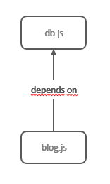
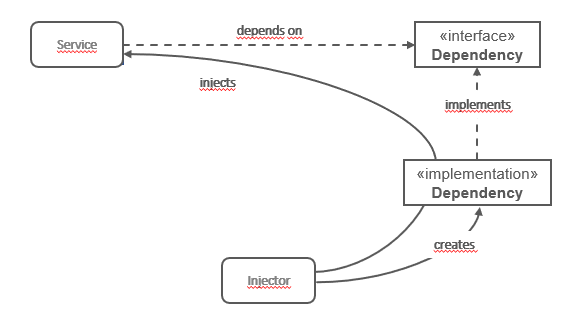

# Part 4: Node.js avanced patterns and techniques
## Chapter 33 &mdash; Creational Design Patterns
> Design patterns related to the creation of objects

### Contents
+ Introduce the set of traditional design patterns for creating objects
+ The **Factory** pattern
+ The **Builder** pattern
+ The **Revealing Constructor** pattern
+ The **Singleton** pattern: caveats
+ Wiring modules using *singleton dependencies* and **Dependency Injection**

### Intro
This chapter deals with a class of design pattern called *creational*. As the name suggests, these patterns address problems related to the creation of objects.

The term *pattern* is really broad in its definition and can span multiple domains of an application.
Traditionally, it is associated with a well-known set of object-oriented patterns that were popularized in the 90s by the book *Design Patterns: Elements of Reusable Object-Oriented Software*, by the almost legendary Gang of Four (GoF): Erich Gamma, Richard Helm, Ralph Johnson, and John Vlissides.

We can define them as:
> A design pattern is a reusable solution to a recurring problem.

JavaScript is a special language, as it has dynamic typing, and it is object-oriented prototype based, but also allows for functional programming. As a result, applying the *GoF* patterns is not as linear and formal as it would have been in classical OO languages. The versatility of JavaScript creates a lot of fragmentation about styles, conventions, techniques, and ultimately patterns.

We'll see that in some cases, the traditional implementation of the *GoF* patterns is not possible because JavaScript doesn't have *real* classes or *abstract interfaces*. However, that original scenario that the *GoF* pattern tries to solve will also be applicable to Node.js.

As a last note, the chapter will describe in detail the traditional patterns, but will also describe some *less traditional* design patterns born within JavaScript ecosystem itself.

We'll tackle:
+ **Factory** pattern &mdash; allows us to encapsulate the creation of an object within a function.
+ **Revealing Constructor** pattern &mdash; allows us to expose private object properties and methods only during the object's creation.
+ **Builder** pattern &mdash; simplifies the creation of complex objects.
+ **Singleton** pattern &mdash; which enfornces the presence of only one instance of a class and centralizes its access
+ **Dependency Injection** &mdash; helps us with the wiring of the modules of an application

### Factory
The **Factory** patterns allows you to encapsulate the creation of an object within a function.

It main advantages are:
+ It lets you decouple the creation of an object from one particular implementation &mdash; for example, it lets you create an object whose class is determined at runtime.
+ It lets you expose a surface area that is much smaller than that of a class &mdash; as the object creation is encapsulated in a function, there's no way to extend or manipulate the class and also provides a more straightforward developer experience.
+ It can be used to enforce encapsulation, by leveraging closures.


#### Decoupling object creation and implementation
In JavaScript, the functional paradigm is often preferred to a purely object-oriented design for its simplicity, usability and small surface area. This is one of the reasons why the *factory* pattern in JavaScript is so frequently used.

> A **factory** allows you to separate the creation of an object from its implementation.

Essentially, a factory wraps the creation of a new instance, giving us more flexibility and control in the way we create them. Inside the factory, we can choose to create a new instance of the class using `new`, leverage closures to dynamically build a stateful object literal, or even return a different object type based on a condition.

The consumer of the factory is totally agnostic about how the creation is carried out, which is much more flexible than using `new` or `Object.create()`, as we will not be binding our code to a particular way of creating the object.

Consider the following way of creating an `Image` object instance:

```javascript
function createImage(name) {
  return new Image(name);
}

const image = createImage(`photo.jpg`);
```

Encapsulating the creation of the image in `createImage(...)` gives us a lot of flexibility with respect to using `const image = new Image(name)`.

For example, we could do a little refactoring and create specialized classes for each type of image we support:

```javascript
function createImage(name) {
  if (name.match(/\.jpe?g$/)) {
    return new ImageJpeg(name);
  } else if (name.match(/\.gif$/)) {
    return new ImageGif(name);
  } else if (name.match(/.png$/)) {
    return new ImagePng(name);
  } else {
    throw new Error(`unsupported format`);
  }
}
```

Note that the consumer code will be totally unaffected by the change, while if we would have used `new Image(name)` we would need to update the consumer code. Also, when using the *factory*, the classes remain hidden and are not subject of being extended or modified by the consumer code. This can be easily achieved in JavaScript by exporting only the factory, while keeping the classes private.

#### A mechanism to enforce encapsulation
Thanks to closures, a *factory* can also be used as an encapsulation mechanism &mdash; access to the internal details of a component will be controlled, as component interaction will only happen through its public interface, isolating the external code from the changes in the implementation details of the component.

> *Encapsulation* is one of the fundamental principles of object-oriented design, along with *polymorphism* and *abstraction*.

Let's learn how to do that with a simple example:

```javascript
function createPerson(name) {
  const privateProperties = {};

  const person = {
    setName(name) {
      if (!name) {
        throw new Error(`A person must have a name`);
      }
      privateProperties.name = name;
    },
    getName() {
      return privateProperties.name;
    }
  }

  person.setName(name) {
    return person;
  }
}
```

The returned object `person` represents the public interface returned by the factory. The `privateProperties` are inaccesible from the outside and can be only manipulated through `person`'s interface.

| EXAMPLE: |
| :------- |
| See [01 &mdash; *Factory* pattern: Enforcing encapsulation with closures](1-factory-encapsulation-closure) for a runnable example. |


| NOTE: |
| :---- |
| There are other ways to enforce encapsulation besides using a *factory*:
+ Using private class fields (using the hashbang `#` prefix), although this is experimental.
+ Using weakmaps https://fitzgeraldnick.com/2014/01/13/hiding-implementation-details-with-e6-weakmaps.html
+ Using symbols https://2ality.com/2016/01/private-data-classes.html#using-symbols-as-keys-for-private-properties
+ Defining private variables in a constructor https://www.crockford.com/javascript/private.html (this is considered legacy, but it is also the best known approach)
+ Using conventions, like prefixing the property name with `_` to indicate it is private. |

#### Building a simple code profiler
This section illustrates the *factory* pattern by building a simple *code profiler*.

We will build a *code profiler* as an object with the following methods:
+ `start()` &mdash; triggers the start of a profiling session.
+ `end()` &mdash; finalizes the session and logs its execution time to the console.

Also, we want the *profiler* to be automatically deactivated without affecting the consumer code, so that if `NODE_ENV=production` the profiler should do nothing.

The implementation is very simple:

```javascript
class Profiler {
  constructor(label) {
    this.label = label;
    this.lastTime = null;
  }

  start() {
    this.lastTime = process.hrtime.bigint();
  }

  end() {
    const diff = process.hrtime.bigint() - this.lastTime;
    console.log(`Timer '${ this.label }' took ${ diff } nanos`);
  }
}

/* duck typing! */
const noopProfiler = {
  start() {},
  end() {}
};

export function createProfiler(label) {
  if (process.env.NODE_ENV === 'production') {
    return noopProfiler;
  }

  return new Profiler(label);
}
```

Note that instead of exporting `Profiler`, we export the *factory* `createProfiler(...)`. That let us inject logic to return a different type of object (actually, an object literal that has the exact same interface but does nothing).

That simple idea allows you to insulate the consumer code from undesired changes if you want to disable the profiler:

```javascript
import { createProfiler } from './lib/profiler.js';

function getAllFactors(intNumber) {
  const profiler = createProfiler(`getAllFactors(${ intNumber })`);

  profiler.start();
  const factors = [];
  for (let factor = 2; factor <= intNumber; factor++) {
    while ((intNumber % factor) === 0) {
      factors.push(factor);
      intNumber = intNumber / factor;
    }
  }
  profiler.end();

  return factors;
}

const myNumber = process.argv[2];
const myFactors = getAllFactors(myNumber);
console.log(`Factors of ${ myNumber } are: `, myFactors);
```

Thus, by using `createProfiler(...)`, the consumer code will get an implementation that depends on the value of `NODE_ENV` when it is executed.

| EXAMPLE: |
| :------- |
| See [02 &mdash; *Factory* pattern: Simple code profiler](02-factory-code-profiler) for a runnable example. |

#### In the wild
*Factories* are very common in Node.js. For example, the [Knex](https://www.npmjs.com/package/knex) module is a query builder that supports multiple databases. The module exports a *factory* function that returns the right implementation for the database of choice.

#### Object-oriented roots
The *factory* pattern has its roots in object oriented development. The problem it tries to solve is the coupling problem associated to the use of the `new` operator.

One of the *mantras* of object-oriented design is:
> Classes must be opened for extension, but closed for modification

The `new` operator clearly breaks that design principle, as a small change in a class hierarchy represents changes in the consumer code. The set of object-oriented *factory* patterns (*simple factory*, *factory method*, *abstract factory*) solves this problem using interfaces and inheritance.

What we have used in this section is known as the *simple factory idiom*: defining a function that encapsulates object creation, so that clients of that object will use the *factory* function instead of using `new`.


### Builder
> The **Builder** pattern is a creational pattern that simplifies the creation of complex objects by providing a fluent interface, which allows you to build the object step by step.

With a *builder*, you greatly improve the developer experience and overall readability of complex object creation.

The general motivation for a *builder* comes from a class constructor that requires a long list of arguments, many of them complex ones, that are are required to build a complete and consistent object instance.

For example, consider the following `Boat` class:

```javascript
class Boat {
  constructor(hasMotor, motorCount, motorBrand, motorModel, hasSails,
              sailsCount, sailsMaterial, sailsColor, hullColor, hasCabin) {
    /* ... */
  }
}
```

Invoking such constructor will be both hard to read and error-prone (which argument is what?).

A first step to try to fix this consists in aggregating all arguments in a single object literal:

```javascript
class Boat {
  constructor(allParameters) {
    /* ... */
  }
}

const myBoat = new Boat({
  hasMotor: true,
  motorCount: 2,
  motorBrand: 'Best Motor Co.',
  motorModel: 'OM123',
  hasSails: true,
  sailsCount: 1,
  sailsMaterial: 'fabric',
  sailsColor: 'white',
  hullColor: 'blue',
  hasCabin: false
});
```

This greatly improves the original approach, as now all the parameters are *labelled*. However, one drawback of this new approach is that the only way to to know what the actual inputs are is to look at the class documentation or class implementation, which is far from ideal. For example, there might be underlying rules such as: if you specify `hasMotor: true`, then you have to also specify `motorCount`, `motorBrand`, and `motorModel`.

The **Builder** pattern fixes these last few flaws providing a fluent interface that is simple to read, self-documenting, and that provides guidance towards the creation of a consistent object.

The following example illustrates how to create the *builder* class that implements the *builder* pattern, and how easy it is now to create the object:

```javascript
/* eslint-disable no-unused-vars */
class BoatBuilder {
  withMotors(count, brand, model) {
    this.hasMotor = true;
    this.motorCount = count;
    this.motorBrand = brand;
    this.motorModel = model;
    return this;
  }

  withSails(count, material, color) {
    this.hasSails = true;
    this.sailsCount = count;
    this.sailsMaterial = material;
    this.sailsColor = color;
    return this;
  }

  hullColor(color) {
    this.hullColor = color;
    return this;
  }

  withCabin() {
    this.hasCabin = true;
    return this;
  }

  build() {
    return new Boat({
      hasMotor: this.hasMotor,
      motorCount: this.motorCount,
      motorBrand: this.motorBrand,
      motorModel: this.motorModel,
      hasSails: this.hasSails,
      sailsCount: this.sailsCount,
      sailsMaterial: this.sailsMaterial,
      sailsColor: this.sailsColor,
      hullColor: this.hullColor,
      hasCabin: this.hasCabin
    });
  }
}

class Boat {
  constructor(allParameters) {
    this.hasMotor = allParameters.hasMotor;
    this.motorCount = allParameters.motorCount;
    this.motorBrand = allParameters.motorBrand;
    this.motorModel = allParameters.motorModel;
    this.hasSails = allParameters.hasSails;
    this.sailsCount = allParameters.sailsCount;
    this.sailsMaterial = allParameters.sailsMaterial;
    this.sailsColor = allParameters.sailsColor;
    this.hullColor = allParameters.hullColor;
    this.hasCabin = allParameters.hasCabin;
  }
}

const myBoat = new BoatBuilder()
  .withMotors(2, 'Best Motor Co.', 'OM123')
  .withSails(1, 'fabric', 'white')
  .withCabin()
  .hullColor('blue')
  .build();
```

As you see, we create a new class `BoatBuilder` whose responsibility is to collect all the parameters needed to create a `Boat` using helper methods. These method are typically defined for each parameter or set of related parameters.

| EXAMPLE: |
| :------- |
| See [03 &mdash; *Builder* pattern: Complex object creation](03-builder-complex-object-creation) for a runnable example. |

The general rules for implementing the *builder* pattern are:
+ The main objective is to break down a complex constructor into multiple, more readable, and more manageable steps.
+ Try to create builder methods that can set multiple parameters at once
+ Deduce and implicitly set parameters based on the values received as input by a setter method, and in general, try to encapsulate as much parameter setting related logic into the setter methods so that the consumer of the builder interface is free from doing so.
+ If necessary, it's possible to further manipulate the parameters (for example, type casting, normalization, or extra validation) before passing them to the constructor of the class built to simplify the work left to do by the builder class consumer even more.

| NOTE: |
| :---- |
| In JavaScript, the *Builder* pattern can also be applied to invoke functions. Technically, both approaches will be just the same, but formally, when invoking functions you would typically define an `invoke()` method that triggers the call to the complex function with the parameters collected by the *builder*. |

#### Implementing a URL object builder

This section illustrates how to use the *builder* pattern to create URL objects.

The goal is to implement a `Url` class that can hold all the components of a standard URL, validate them, and format them back into string.

Let's start by creating the `Url` class:

```javascript
export class Url {
  constructor(protocol, username, password, hostname, port, pathname, search, hash) {
    this.protocol = protocol;
    this.username = username;
    this.password = password;
    this.hostname = hostname;
    this.port = port;
    this.pathname = pathname;
    this.search = search;
    this.hash = hash;

    this.validate();
  }

  validate() {
    if (!this.protocol || !this.hostname) {
      throw new Error(`Must specify at least a protocol and a hostname`);
    }
  }

  toString() {
    let url = '';
    url += `${ this.protocol }://`;
    if (this.username && this.password) {
      url += `${ this.username }:${ this.password }@`;
    }
    url += this.hostname;
    if (this.port) {
      url += `:this.port`;
    }
    if (this.pathname) {
      url += this.pathname;
    }
    if (this.search) {
      url += `?${ this.search }`;
    }
    if (this.hash) {
      url += `#${ this.hash }`;
    }
    return url;
  }
}
```

It is evident that even with this simplistic implementation, instantiating a `Url` object is less than ideal and error prone:

```javascript
const site = new Url('https', null, null, 'example.com', null, null, null, null);
```

Now we address the *builder* implementation, which consists in creating a class that has setter methods for each parameter (or set of related parameters) and a `build()` method that returns an instance of the class it is building:

```javascript
import { Url } from './url.js';

export class UrlBuilder {
  setProtocol(protocol) {
    this.protocol = protocol;
    return this;
  }

  setAuthentication(username, password) {
    this.username = username;
    this.password = password;
    return this;
  }

  setHostname(hostname) {
    this.hostname = hostname;
    return this;
  }

  setPort(port) {
    this.port = port;
    return this;
  }

  setPathname(pathname) {
    this.pathname = pathname;
    return this;
  }

  setSearch(search) {
    this.search = search;
    return this;
  }

  setHash(hash) {
    this.hash = hash;
    return this;
  }

  build() {
    return new Url(this.protocol, this.username, this.password, this.hostname, this.port, this.pathname, this.search, this,this.hash);
  }
}
```

The benefits of using this pattern are evident:

```javascript
const site = new UrlBuilder()
  .setProtocol('https')
  .setHostname('example.com')
  .build();
console.log(`site url: `, exampleUrlUsingBuilder.toString());
```

| NOTE: |
| :---- |
| The *Builder* pattern can also be implemented directly into the target class, instead of creating a separate `UrlBuilder` class. However, this approach does not guarantee that the builder always provides instances that are consistent, because while building the instance, the object is *half-built*. By contrast, when separating the object and the builder in separate classes, we can be sure that every object returned by `UrlBuilder.build()` are guaranteed to be valid. |

| EXAMPLE: |
| :------- |
| See [04 &mdash; *Builder* pattern: `Url` object builder](04-builder-url) for a runnable example. |

#### In the wild
The *Builder* pattern is quite common in Node.js and JavaScript as it provides a very elegant solution for complex object creation of complex function invocations.

For example, creating new HTTP/HTTPS requests using the core module is a complicated task. Packages like [superagent](https://www.npmjs.com/package/superagent) addresses this problem through the *Builder* pattern:

```javascript
superagent
  .post('https://example.xom/api/person')
  .send({ name: 'John Doe', role: 'user' })
  .set('accept', 'json')
  .then(response => {
    // deal with the response
  });
```

Note however that this is a variant of the *Builder* pattern, as there is no `build()` or `invoke()` method, and that also it wasn't required to use the `new` operator with the builder. Actually, what triggers the request is the invocation of the `then()` method, which means that the superagent is not a standard promise, but rather a *thenable* in which the `then()` is enhanced to act as the trigger for the request object creation.

### Revealing Constructor
The **Revealing Constructor** pattern is one of the patterns that originated directly from the JavaScript and Node.js community, instead that from the *GoF* patterns.

It solves the following problem:
> How can I reveal some private functionality of an object only at the time of creation?

The *Revealing Constructor* pattern allows for several interesting scenarios including:
+ creating objects that can only be modified at creation time
+ creating objects whose custom behavior can be defined only at creation time
+ creating objects that can be initialized only once at creation time

> The **Revealing Constructor** pattern allows you to expose certain private functionality of an object to the consumer only at the time of creation, making them completely inaccessible once the object is created.

Let's consider the following code fragment:

```javascript
const object = new SomeClass(function executor(revealedMembers) {
  // manipulation code
});
```

The code above illustrates the main components of the *Revealing constru tor* pattern:
+ a **constructor** &mdash; `new SomeClass()` that takes a function as input
+ the **executor** &mdash; `function executor() {...}`, which is invoked at creation time
+ the **revealedMembers** &mdash; the subset of the object's internals that will be given to the *executor* as input.

| NOTE: |
| :---- |
| For the pattern to work, the revealed functionality must not be accesible by the users of the object once created. This can be achieved with any of the encapsulation techniques reviewed in the section [*Factory* pattern: A mechanism to enforce encapsulation](#a-mechanism-to-enforce-encapsulation). |

The *Revealing Constructor* pattern offers very strong guarantees, and for this reason it's mainly used in contexts where need foolproof encapsulation, especially with components that are heavily reused by external parties.

It clearly improves reliability and simplifies code sharing with other people and teams, as it makes the object safer.

#### Building an immutable buffer
An *immutable* object is an object whose data or state becomes unmodifiable once it's been created.

They have many excellent properties, as you don't need to create *defensive copies* before passing them around, as you have a strong guarantee (by definition) that they won't be modified.

The state of such an object can only be performed at initialization time, and modifications of such an object are typically done by creating a new copy from an existing object.

Another common use case of *immutable objects* is efficient change detection. Since every change requires a copy, and every copy corresponds to a modification, detecting a change is as simple as using the *strict equality* operator (`===`).

Let's create a simple immutable version of the Node.js `Buffer` component using the *Revealing Constructor* pattern.

```javascript
const MODIFIER_NAMES = [ 'swap', 'write', 'fill'];

export class ImmutableBuffer {
  constructor(size, executor) {
    const buffer = Buffer.alloc(size);
    const modifiers = {};
    for (const prop in buffer) {
      if (typeof buffer[prop] !== 'function') {
        continue;
      }

      if (MODIFIER_NAMES.some(m => prop.startsWith(m))) {
        modifiers[prop] = buffer[prop].bind(buffer);
      } else {
        this[prop] = buffer[prop].bind(buffer);
      }
    }
    executor(modifiers);
  }
}
```

Let's dissect the logic behind the constructor:
1. First, we alloacte a new Node.js buffer of the specified size.
2. Then we create an object literal `modifiers` to hold all the methods that can mutate the buffer.
3. Then we iterate over the object's properties, skipping all the ones that are not functions.
4. After that, we try to identify if the current property is a method that *mutates* the buffer or not. We have previously identify the those in an array named `MODIFIER_NAMES`. If the method mutates the object we bind it to the `buffer` instance and then we add it to the `modifiers` object.
5. If the method is not a *mutator*, we bind it directly to the `InmmutableBuffer` instance, as this one will be safe to be included in its interface.
6. We finally invoke the executor function received as input, passing it the `modifiers` object that contains all the methods that *mutate* the underlying buffer.

| NOTE: |
| :---- |
| In practice, the `ImmutableBuffer` is acting as a *proxy* betweeen its consumers and the internal `buffer` object. Some of the methods of the `buffer` instance are exposed directly (the ones that do not mutate the underlying `buffer`) and others (the ones that *mutate* the `buffer`) are only handed out to the executor at creation time. |


Let's see now how we can leverage the `ImmutableBuffer`:

```javascript
import { ImmutableBuffer } from './lib/immutable-buffer.js';

const hello = 'Hello!';
const immutable = new ImmutableBuffer(hello.length, ({ write }) => {
  write(hello);
});

console.log(String.fromCharCode(immutable.readInt8(0)));

try {
  immutable.write('Hello to Jason Isaacs!');
} catch (err) {
  console.error('ERROR: ', err.message);
}

console.log(immutable.toString('hex'));
```

See how the constructor is given an executor function that has access to the `write(...)` method so that it can be properly initialized.

See also how the *read-only* interface from the underlying `Buffer` is exposed (you can use `readInt8()` and `toString(...)`), but the object cannot be modified once created because the *mutators* (the methods that start with `write*`, `fill*` or `swap*`) had been suppressed.

| EXAMPLE: |
| :------- |
| See [05 &mdash; *Revealing Constructor* pattern: Immutable buffer](05-revealing-constructor-immutable-buffer) for a runnable example. |


#### In the wild
A popular application of the *Revealing Constructor* pattern is the JavaScript `Promise` class.

```javascript
return new Promise((resolve, reject) => {
  ...
});
```

When we create a new promise from scratch, its constructor accepts an *executor* function that will receive the `resolve()` and `reject()` functions to mutate the internal state of the `Promise`.

Once created, the `Promise` state cannot be altered anymore by any other means.

### Singleton

> The **Singleton** pattern enforces the presence of only one instance of a class and centralize access to it.

There are many use cases for using *singletons* in an application:
+ For sharing stateful information
+ For optimizing resource usage
+ To synchronize access to a resource

Let's consider a typical `Database` class:

```javascript
export class Database {
  constructor(dbName, connectionDetails) {
    ...
  }
}
```

These implementations usually keep a pool of database connections so that new ones are not created for each request. Also, the `Database` instance will store some stateful information that should be kept and maybe shared, like the list of pending transactions.

That's why it is common to use the *Singleton* pattern here and let every component of the application use that single shared Database instance.

The implementation of the *Singleton* pattern in Node.js is straightforward &mdash; you simply need to export an instance from a module:

```javascript
class Database {
  /* ... */
}

export const dbInstance = new Database(/* ... */);
```

By simply exporting a new instance, we can assume that there will only be one instance of the `dbInstance`, as it is guaranteed by the Node.js module system.

Then, the clients of the instance can get a reference by doing:

```javascript
import { dbInstance } from './lib/dbInstance.js';
```

The only caveat we should take under consideration is the path of the module: Node.js module system will cache the package using its full path as the lookup key. Therefore, if in your application there are several modules of the `dbInstance` with different versions, stored in different paths withing `node_modules`, each different path will have their own *singleton*, which might not be what we intended, and can cause unintended consequences if those *singleton* instances are used to contain stateful information.

Let's dig in a bit more on this scenarion. Let's assume that `dbInstance.js` is published as a package named `mydb`:

```json
{
  "name": "mydb",
  "version": "2.0.0",
  "type": "module",
  "main": "dbInstance.js"
}
```

Next, let's consider two packages `package-a` and `package-b`, both of which has a single file called `index.js` that imports our `dbInstance` *singleton*:

```javascript
import { dbInstance } from `mydb`;

export function getDbInstance() {
  return dbInstance;
}
```

If `package-a` depends on version `1.0.0` of the `mydb` package, while `package-b` depends on version `2.0.0`, we will end up with the following `node_modules` directory structure:

```
app/
`-- node_modules
    |-- package-a
    |   `-- node_modules
    |       `-- mydb
    |-- package-b
        `-- node_modules
            `-- mydb
```

This happens because `package-a` and `package-b` require two different incompatible versions of the `mydb` modules. In these cases, the package manager will not *hoist* the dependency to the top `node_modules` directory, and instead will install a private copy of each copy to satisfy the version incompatibility.

This will definitely break the assumption about the uniqueness of the database isntance.

```javascript
import { getDbInstance as getDbFromA } from 'package-a';
import { getDbInstance as getDbFromB } from 'package-b';

const isSame = getDbFromA() === getDbFromB();
console.log(`Is db instance in package-a the same as in package-b? ${ isSame ? 'YES' : 'NO' }`); // -> will return NO
```

| EXAMPLE: |
| :------- |
| See [06 &mdash; *Singleton* pattern: Exporting a class instance](06-singleton-exporting-class-instance) for a runnable example illustrating how to create a singleton. Note that the example does not address the caveats of having multiple *singleton* instances when consumers of the singleton require different versions. |

| NOTE: |
| :---- |
| If instead of requiring incompatible versions, `package-a` and `package-b` would have required two versions of the `dbInstance` that were compatible with each other (e.g. `^2.0.1` and `^2.0.7`), then the package manager would have installed the `dbInstance` into the *top-level* `node_modules` directory so that `package-a` and `package-b` would share the same instance. This is known and *dependency hoisting*. |

As a consequence, we can say that the *Singleton* pattern, as described in the *GoF* patterns does not exist in Node.js, unless we use a real *global variable* to store it, as in:

```javascript
global.dbInstance = new Database(/* ... */ );
```

This guaranteeds that the instance is the only one shared across the entire application, and not just the same package.

However, most of the time we don't really need a *pure* singleton and can simply export an instance as seen in the beginning of the section.

Also, it is recommended when creating packages that are going to be used by 3rd parties, to keep them stateless to avoid the issues discussed in this section.

| NOTE: |
| :---- |
| For simplicity, in Node.js we use the term *singleton* to refer to a class instance or stateful object that is exported by a module, taking into account that it might not be a real *singleton* in the strictest of terms. |


| EXAMPLE: |
| :------- |
| You can find in [The problem of multiple *singleton* instances](e04-singleton-multiple-instances-peer-dependencies), including the details about why using `peerDependencies` does not solve the issue. |

### Wiring modules
Every application is the result of the aggregation of several components and, as the application grows, the way we connect these components becomes the key factor for the maintaiability and success of the project.

When a component *A* needs component *B* to fulfill a given functionality, we say that "*A* is **dependent** on *B*", or conversely that "*B is a **dependency** of A*".

Let's assume the scenario of writing an API for a blogging system that uses a database to store its data. We can have a generic module implementing the database connection `db.js` and a blog module that exposes the main functionality to create and retrieve blog posts from the database `blog.js`.



This section explains how this dependency can be modeled using two different approaches: *Singleton dependencies* and *Dependency Injection*.

#### Singleton dependencies
This is the simplest way to wire modules together, and consists in leveraging Node.js' module system. As seen before, stateful dependencies wired in this way are *de facto singletons* as the module system will cache the module and provide the cache instace to any module that imports it.

> The **Singleton dependencies** pattern leverages the module system to provide the depencies of a module as *Singletons*, which ensures the correct wiring even for stateful dependencies.

Let's implement the simple blogging system described above, with the dependencies handled through the *singleton dependencies* approach.

We start with the `db.js` module, in which we use [SQLite](https://sqlite.org/index.html) as the backing database to store our posts. To interact with *SQLite* we use the module [`sqlite3`](https://www.npmjs.com/package/sqlite3).

```javascript
import { dirname, join } from 'path';
import { fileUrlToPath } from 'url';
import sqlite3 from 'sqlite3';

const __dirname = dirname(fileUrlToPath(import.meta.url));
export const db = new sqlite3.Database(
  join(__dirname, 'data.sqlite')
);
```

In `db.js` we export the `db` object returned from creating a new *SQLite* database, which is backed by the file `data.sqlite`.

| NOTE: |
| :---- |
| Note that we had to use a trick to reconstruct the `__dirname` value which is not present when using *ES modules*. The trick consists in getting a reference to the current file URL using the special object `import.meta`.  Specifically, `import.meta.url` will return a reference to the current module path in the format `file:///path/to/current_module.js` which can then be used to reconstruct `__filename` and `__dirname`. |

Now, we can implement the `blog.js` module, which exposes the API the create and retrieve blog posts, as well as to initialize the database.

```javascript
import { promisify } from 'util';
import { db } from './db.js';

const dbRun = promisify(db.run.bind(db));
const dbAll = promisify(db.all.bind(db));

export class Blog {
  initialize() {
    const initQuery = `
      CREATE TABLE IF NOT EXISTS posts (
        id TEXT PRIMARY KEY,
        title TEXT NOT NULL,
        content TEXT,
        created_at TIMESTAMP DEFAULT CURRENT_TIMESTAMP
      );
    `;
    return dbRun(initQuery);
  }

  createPost(id, title, content, createdAt) {
    return dbRun(`INSERT INTO posts VALUES (?, ?, ?, ?)`, id, title, content, createdAt);
  }

  getAllPosts() {
    return dbAll(`SELECT * FROM posts ORDER BY created_at DESC`);
  }
}
```

The last part will be creating the main program that tries out the functionality of the blog module:

```javascript
import { Blog } from './lib/blog.js';

async function main() {
  const blog = new Blog();
  await blog.initialize();
  const posts = await blog.getAllPosts();
  if (posts.length === 0) {
    console.log(`No posts available. Run 'npm run import-posts' to load some sample posts`);
  }

  for (const post of posts) {
    console.log(post.title);
    console.log('-'.repeat(post.title.length));
    console.log(`Published on ${ new Date(post.created_at).toISOString() }`);
    console.log(post.content);
  }
}

main()
  .catch(error => {
    console.log(`ERROR: main: ${ error.message }`);
  });
```

This preceding module program is very simple: retrieves all the posts and the loop over them and display the data for every post.

| EXAMPLE: |
| :------- |
| See [07 &mdash; Wiring modules: *Singleton dependencies* pattern](07-wiring-modules-singleton-dependencies) for a runnable example. |

Using a *singleton* is the most simple, immediate, and readable solution to pass stateful dependencies around.

These limitations of this option become apparent if we want to mock our database during our tests, or switch current database backing system for another one. Those problems can be mitigated using far from elegant solution (intercepting imports of the database, fiddling with the module system, etc.).

#### Dependency injection
While the Node.js module system and the *singleton dependencies* pattern are great tools for organizing and wiring together the components of an application, they introduce very tight *coupling* between components.

To illustrate that coupling, simply think in our previous scenario: `blog.js` cannot work without the `database.js` module, and it cannot use a different database module if necessary either. The **Dependency Injection** pattern help address that coupling.

> **Dependency Injection** is a pattern in which the dependencies of a component are *provided as inputs* by an external entity, often referred to as the **injector**.

The *injector* initializes the different components and ties their dependencies together. It can be a simple initialization script or a more sophisticated *global container* that maps all the dependencies and centralizes the wiring of all the modules of the system.

The main advantage of this approach is improved decoupling, especially for modules depending on stateful instances.

When using *DI*, each dependency, instead of being hardcoded into the module, is received from the outside. In practice, it means that the dependent module can be configured to use any compatible dependency, and therefore, the module itself can be reused in different contexts with minimal effort.



The diagram above illustrates what the *Dependency Injection* pattern provides:
+ a *Service* expects a dependency with a predetermined interface.
+ an *Injector* retrieves a creates an actual concrete instance that implements such an interface, and passes it (*injects it*) into the *Service*. That is, the *Injector* is responsible for providing an instance that fulfills the dependency fro the service.

To demonstrate this pattern, let's rework our simple blogging system using *DI* to wire its modules.

Let's start with our `blog.js` module:

```javascript
import { promisify } from 'util';

export class Blog {
  constructor(db) {
    this.db = db;
    this.dbRun = promisify(db.run.bind(db));
    this.dbAll = promisify(db.all.bind(db));
  }

  initialize() {
    const initQuery = `
      CREATE TABLE IF NOT EXISTS posts (
        id TEXT PRIMARY KEY,
        title TEXT NOT NULL,
        content TEXT,
        created_at TIMESTAMP DEFAULT CURRENT_TIMESTAMP
      );
    `;
    return this.dbRun(initQuery);
  }

  createPost(id, title, content, createdAt) {
    return this.dbRun(`INSERT INTO posts VALUES (?, ?, ?, ?)`, id, title, content, createdAt);
  }

  getAllPosts() {
    return this.dbAll(`SELECT * FROM posts ORDER BY created_at DESC`);
  }
}
```

Note that we're no longer importing the `db.js` module, but instead, receives the `db` object as input in its constructor.

In the `db` module we just need to get rid of the *Singleton dependencies* pattern to come up with an implementation that is more reusable and configurable.

```javascript
import sqlite3 from 'sqlite3';

export function createDb(dbfile) {
  return new sqlite3.Database(dbfile);
}
```

Note that the new implementation simply provides a *factory function* called `createDb()` which allows you to create new instances of the database at runtime. It also allows you to pass the path to the database file at creation time so that we can create indedependent instances that can write to different files if needed.

The last part of the *DI* pattern is the *injector*, which we will implement in the `main.js` file:

```javascript
import { dirname, join } from 'path';
import { fileURLToPath } from 'url';
import { Blog } from './lib/blog.js';
import { createDb } from './lib/db.js';

const __dirname = dirname(fileURLToPath(import.meta.url));

async function main() {
  const db = createDb(join(__dirname, 'data.sqlite'));
  const blog = new Blog(db);

  await blog.initialize();
  const posts = await blog.getAllPosts();
  if (posts.length === 0) {
    console.log(`No posts available. Run 'npm run import-posts' to load some sample posts`);
  }

  for (const post of posts) {
    console.log(post.title);
    console.log('-'.repeat(post.title.length));
    console.log(`Published on ${ new Date(post.created_at).toISOString() }`);
    console.log(post.content);
  }
}

main()
  .catch(error => {
    console.log(`ERROR: main: ${ error.message }`);
  });
```

The only change is the first two lines of the `main(...)` function that act as the *injector*:
+ We create the database dependency `db` using the factory function `createdDb()`.
+ We explicitly *inject* the database instance when we instantiate the `Blog` class.

| EXAMPLE: |
| :------- |
| See [08 &mdash; Wiring modules: *Dependency Injection* pattern](08-wiring-modules-dependency-injection) for a runnable example. |

As a result, `blog.js` is totally decoupled from the actual database implementation, making it more composable and easy to test in isolation.

| NOTE: |
| :---- |
| The example above illustrates how to inject the dependencies through the constructor arguments, which is known as **constructor injection**. Dependencies can also be passed when invoking a function or method (**function injection**) or injected explicitly by assigning the relevant properties of an object (**property injection**). |

The major disadvantage of the *Dependency Injection* pattern is that it makes the application more difficult to understand, as dependencies are not resolved at coding time. This is especially evident in large applications with a large and complex dependency graph. Another disadvantage is that we have to make sure that the dependencies are ready and available when we inject them into the dependent objects, and before we invoke any of the methods of the dependent object that uses *DI*.

Building the dependency graph of the entire application by hand, making sure that we do it in the right order might become a very complex task when the number of modules to wire becomes too high.

Another pattern related to *DI* is the **Inversion of Control** pattern.

> The **Inversion of Control** pattern allows you to shift the responsibility of wiring the modules of an application to a third party entity.

This entity can be a **service locator**, that is, a component which will serve a dependency through a method invocation (as in `serviceLocator.get('db')`) or a **dependency injection container** (a system that injects the dependencies into a component based on some metadata specified in code or a configuration file).

These techniques derail a bit from the Node.js way of doing things, but some packages such as [`inversify`](https://www.npmjs.com/package/inversify) (TypeScript) and [`awilix`](https://www.npmjs.com/package/awilix) are worth mentioning.

| NOTE: |
| :---- |
| You can find more on these components in Martin Fowler's blog: [Invesion of Control COntainers and the Dependency Injection pattern](https://martinfowler.com/articles/injection.html). |


### You know you've mastered this chapter when...
+ You can define what is a *pattern* and understand the roots of the object-oriented patterns from *GoF*.
+ You understand that the *Factory* pattern lets you encapsulate the creation of an object within a function, and are comfortable describing its advantages.

+ You are comfortable using the *Factory* method both to separate the creation of a class from its implementation and also to encapsulate private properties of an object.
+ You understand that *Factory* is a very versatile and easy to implement pattern that works very well with the hybrid (half object-oriented/half functional) nature of the JavaScript language.

+ You're aware of the differen techniques available in Javascript for enforcing encapsulation:
  + through function scopes and closures
  + using private class fields (https://github.com/tc39/proposal-class-fields#private-fields) which is yet in Stage 3. See [Queue.js](e03-tamper-free-queue/app/src/lib/Queue.js) for an example. As always *MDN* features a great article on the subject: https://developer.mozilla.org/en-US/docs/Web/JavaScript/Reference/Classes/Private_class_fields.
  + using `WeakMaps`
  + using *symbols*
  + defining private variables in a constructor
  + using conventions, such as naming the variable `_private_prop`

+ You're comfortable describing the *Builder* pattern, are aware of its benefits when creating complex objects, or invoking complex functions and know the rules to implement it.

+ You're also comfortable discussing the *Revealing Constructor* pattern, and understand why it was originated in JavaScript.
+ You're comfortable understanding the *Revealing Constructor* pattern, which provides strong guarantees in a language that is relaxed by nature.
+ You're aware of the different components involved in the *Revealing Constructor* &mdash; the *constructor*, the *executor* and the *revealed members*.
+ You are aware that the *Revealing Constructor* will let you create immutable objects in JavaScript.

+ You are comfortable describing the *Singleton* pattern, and understand that it is very easy to implement in JavaScript. You are also aware of the caveats when using modules with incompatible versions, as you might end up having multiple *singleton instances* (one per version) in your application.

+ You're aware that patterns such as *Factory* and *Singleton* have different significance in JavaScript than the one they have in the object-oriented design.
+ You understand that implementing the *Singleton* in JavaScript requires no effort, but you're aware of the caveats that might be found when using modules.

+ You understand the two main techniques to wire components together in a Node.js application: *Singleton dependencies* and *Dependency Injection*. You know that *Singleton dependencies* provide the simplest approach, but bring challenges in terms of module coupling, while *Dependency Injection* provides loose coupling and reusability but brings complexity.

### Patterns Cheat Sheet

| Type | Pattern | Definition | Example | Additional info |
|:---- | :------ | :--------- | :------ | :-------------- |
| Creational | [**Factory**](#factory) | Allows you to separate the creation of an object from its implementation | `const db = createDb(dbName)` | As it decouples the creation of the object from the implementation, lets you create an object whose class is actually determined at runtime.<br>Also, using the *Factory* pattern reduces the exposed surface area when compared to exposing the class, thus providing better encapsulation and information hiding. <br>Protects consumer code against changes on the classes it leverages. |
| Creational | [**Builder**](#builder) | Simplifies the creation (or invocation) of complex objects (or functions) by providing a fluent interface which which allows you to build (or invoke) the object (or function) step by step. | `const db = new Db().setName(dbName).build()` |Greatly simplifies *DX*, as the fluent interface is simple to read and self-documenting.<br>The implementation consists in encapsulating parameter setting related login into setter methods. |
| Creational | [**Revealing Constructor**](#revealing-constructor) | Expose certain private functionality of an object to the consumer only at the time of creation, making them completely inaccessible once the object is created. | `const db = new Database((dbConfig) => {...})` | The pattern consists in defining a constructor which accepts as argument a function that will receive the private properties that will be accessible during creation.<br>This pattern provides strong guarantees regarding encapsulation and information hiding. |
| Creational | [**Singleton**](#singleton) | Enforces the presence of only once instance of a class and centralizes access to it. | `export const db = new Database(dbName)` |This pattern are great for sharing stateful information and synchronizing access to a resources.<br>You must be aware that multiple incompatible versions of a module might end up creating multiple *singleton instances* (one per incompatible version). |
| Dependency Wiring | [**Singleton dependencies**](#singleton-dependencies) | Leverages the module system to provide the dependencies ofa  module as *Singletons*, which ensures the correct wiring even for stateful dependencies. | `import { db } from 'db.js'` | Very simple to implement, but creates tight coupling between a module and its dependencies. |
| Dependency Wiring | [**Dependency Injection**](#dependency-injection) | The dependencies of a component are *provided as inputs* by an external entity. | `const blog = new Blog(db)` | Provides loose coupling between components at the cost of more complex implementation and dependency graph management. |


### Code, Exercises and mini-projects

#### [01 &mdash; *Factory* pattern: Enforcing encapsulation with closures](01-factory-encapsulation-closure)
Illustrates how to use a *factory* and closures to enforce encapsulation and control object surface area.

#### [02 &mdash; *Factory* pattern: Simple code profiler](02-factory-code-profiler)
Illustrates how to define a *factory* and its advantages by building a simple code profiler that gets automatically deactivated when `NODE_ENV=production`.

#### [03 &mdash; *Builder* pattern: Complex object creation](03-builder-complex-object-creation)
Illustrates how to use the *builder* pattern to enable the creation of a complex object by the provision of a fluent interface that is simple to read, self-documenting, and that provides guidance toward the creation of a consistent object.

#### [04 &mdash; *Builder* pattern: `Url` object builder](04-builder-url)
Illustrates how to use the *builder* pattern to implement a `Url` class that can hold all of the components of a standard URL, validate them, and format them back into a string.

#### [05 &mdash; *Revealing Constructor* pattern: Immutable buffer](05-revealing-constructor-immutable-buffer)
Illustrates how to use the *Revealing Constructor* pattern by implementing an immutable version of the Node.js `Buffer` component.

#### [06 &mdash; *Singleton* pattern: Exporting a class instance](06-singleton-exporting-class-instance)
Illustrates how to implement the *Singleton* pattern by exporting a class instance.

#### [07 &mdash; Wiring modules: *Singleton dependencies* pattern](07-wiring-modules-singleton-dependencies)
Illustrates how to wire modules in an application using the *singleton dependencies* pattern. In the example, we create an API for a blogging system that uses a database to store its data.

#### [08 &mdash; Wiring modules: *Dependency Injection* pattern](08-wiring-modules-dependency-injection)
Illustrates how to wire modules in an application using the *Dependency Injection* pattern. In the example, we create an API for a blogging system that uses a database to store its data.

#### Exercise 1: [Color Console Factory](./e01-color-console-factory/)
Create a class called `ColorConsole` that has just one empty method called `log()`. Then, create three subclasses: `RedConsole`, `BlueConsole`, and `GreenConsole`. The `log()` method of every `ColorConsole` subclass will accept a string as input and will print that string to the console using the color that gives the name to the class.

Then create a factory function that takes color as input such as `red`, and returns the related `ColorConsole` subclass. Finally, write a small command-line script to try the new console color factory. Hint: use [this](https://stackoverflow.com/questions/9781218/how-to-change-node-jss-console-font-color/41407246#41407246) to understand how to change colors in the console.

#### Exercise 2: [Request builder](./e02-request-builder/)
Create your own *Builder* class around the built-in `http.request()` function. The builder must be able to provide at least basic facilities to specify the HTTP method, the URL, the query component of the URL, the header parameters, and the eventual body data to be sent.

To send the request, provide an `invoke()` method that returns a `Promise`for the invocation.

#### Exercise 3: [A tamper-free queue](./e03-tamper-free-queue)
Create a `Queue` class that has only one publicly accessible method called `dequeue()`. Such a method returns a `Promise` that resolves with a new element extracted from an internal `queue` data structure.

If the queue is empty, then the `Promise` will resolve when a new item is added. The `Queue` class must also have a *revealing constructor* that provides a function called `enqueue()` to the *executor* that pushes a new element to the end of the internal queue.

The `enqueue()` function can be invoked asynchronously and it must also take care of unblocking any eventual `Promise` returned by the `dequeue()` method.

To try out the `Queue` class, you could build a small HTTP server into the executor function. Such a server would received messages or tasks from a client and would push them into the queue. A loop would then consume all those messages using the `dequeue()` method.

#### Exercise 4: [*Singleton* pattern: multiple instances and `peerDependencies`](./e04-singleton-multiple-instances-peer-dependencies)
Demonstrate why despite not requiring any sophisticated technique at all, *singletons* in Node.js may end up creating multiple different instances when packages require different incompatible versions.

Then investigate different techniques to solve the problem such as using global variables, and using `peerDependencies` in the `package.json`.

#### Exercise 5: [Encapsulation techniques](e05-encapsulation-techniques)
We learnt in the concepts section that there are several techniques available in JavaScript for encapsulation (and information hiding) of private properties and methods.

This exercise provides simple examples of all these techniques:
+ using closures
+ using private class fields (using the hashbang `#` prefix).
+ Using weakmaps https://fitzgeraldnick.com/2014/01/13/hiding-implementation-details-with-e6-weakmaps.html
+ Using symbols https://2ality.com/2016/01/private-data-classes.html#using-symbols-as-keys-for-private-properties
+ Defining private variables in a constructor https://www.crockford.com/javascript/private.html (this is considered legacy, but it is also the best known approach)
+ Using conventions, like prefixing the property name with `_` to indicate it is private.
