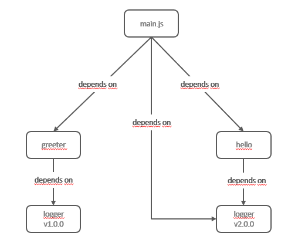
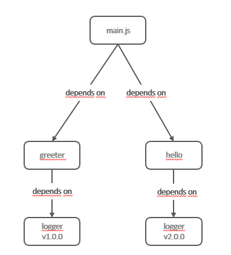

# Part 4: Node.js avanced patterns and techniques
## Chapter 33 &mdash; Creational design patterns
### Exercise 4: *Singleton* pattern: multiple instances and `peerDependencies`
Demonstrate why despite not requiring any sophisticated technique at all, *singletons* in Node.js may end up creating multiple different instances when packages require different incompatible versions.

Then investigate different techniques to solve the problem such as using global variables, and using `peerDependencies` in the `package.json`.

#### Project Structure Description

In order to illustrate all the points the following subprojects are required.

+ Two incompatible versions of a given package `logger`. The `logger` module exports a `Logger` instance with a `logger.log(...)` method that announces the internal version. This is the realization of the *Singleton* pattern in Node.js.
+ Two modules `greeter` and `hello` which depends on different versions of `logger`.
+ A main program that uses both `greeter` and `hello` as well as the `logger` module directly.

In order to set up shop you will need to do the following:

+ publish in your NPM repository of choice:
  + lib-logger-1.0.0
  + lib-logger-2.0.0
  + lib-greeter-1.0.0
  + lib-greeter-2.0.0
  + lib-hello-1.0.0
  + lib-hello-2.0.0

At the time of writing, there's a bug in *npm@7* so publishing modules requires you to use the `--registry` in your command:

```bash
$ npm publish --ver --registry <your-registry>
```


##### Illustrating the problem
In order to illustrate the problem, you can have a look at [01: Illustrating the caveat](01-illustrating-caveat).

In this project, we wire the following dependency graph:



That is, `main.js` list as dependencies `greeter`, `hello` and `logger@2.0.0`.

The caveat is that despite the `logger` being exposed as a *singleton*, we end up having two different versions of the `logger`, which makes it a *non-singleton*.

This is because the version that `greeter` and `hello` require are incompatible, and the package manager is not able to *hoist* `logger` to the root of `node_modules`.


##### Mitigating the problem with `global`
In browsers, the top-level scope is the *global* scope. This means that within the browser `var something` will define a new global variable. In Node.js this is different. The `top-level` scope is not the global scope. That effectively mean that when you do `var foo` inside a Node.js module, the definition will be local to that module.

However, there is a mechanism to make a certain variable available to all the components of your program by doing:

```javascript
global.foo = 'bar';
```

We can use this technique to ensure that a given instance is the only one used across the entire application.

| NOTE: |
| :---- |
| Polluting the global scope is typically considered an anti-pattern, and should only be used when there is no other option. |

In our application, we can use this technique to make that the `greeter` and `hello` packages get the reference to the logger through the global variable and not through import.

Note that now we have to deal with the dependency graph ourselves, pretty much as if we have had used the *Dependency Injection* pattern, only that we're using the `global` object rather that injecting the dependency with an *injector*.

##### Peer Dependencies
Peer dependencies are almost like normal dependencies, but instead of defining a strong requirement between *A* and *B*, they're meant to specify a package that your code requires, but doesn't directly depend on it.

This typically occurs when you want to express the compatibility of your package with a host tool or library, while not doing an explicit `import` or `require` of that dependency.

In our example, `main.js` depends on `greeter` and `hello` which in turn depend on two incompatible versions of `logger`:



In order to sort out the case of the incompatible versions, that will make the `logger` instance not to be a singleton, I wanted to understand if peerDependencies would help.

However this does not prevent the case of multiple singletons. Also, the behavior with `peerDependencies` is different in *npm@6* and *npm@7*. While in the latter NPM output informs you with a warning that you might find issues, *npm@7* just installs it as a regular dependency silently.

In *npm@6*
```
npm notice created a lockfile as package-lock.json. You should commit this file.
npm WARN ndps@0.1.0 requires a peer of @test/logger@2.0.0 but none is installed. You must install peer dependencies yourself.
```

The way to configure consists in adding the `peerDependencies` key in your `package.json`:
,
  "peerDependencies": {
    "@test/logger": "2.0.0"
  },
  "dependencies": {
    "@test/greeter": "1.0.0",
    "@test/hello": "1.0.0"
  }

Additionally, you could use the `peerDependenciesMeta` key to label the dependency as optional:

```
  "peerDependencies": {
    "@test/logger": "2.0.0"
  },
  "peerDependenciesMeta": {
    "@test/logger": {
      "optional": true
    }
  },
```

Again, this does not solve by itself the problem of multiple singleton instances.